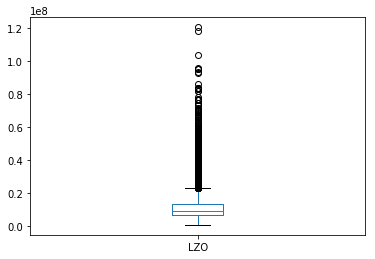

```python
import os
import pandas as pd
import numpy as np
import matplotlib.pyplot as plt

TUXML_CSV_FILENAME="./config_bdd.csv"

# sanity check CSV
with open(TUXML_CSV_FILENAME, "r") as file:
    k = file.readline()
    t = k.split(",")
    s = set(t)
    assert(len(t) == len(s)) # unique number of options/features/column names

# parsing for real with pandas 
rawtuxdata = pd.read_csv(open(TUXML_CSV_FILENAME, "r"))

basic_head = ["cid", "time", "date"] # "compile"
size_methods = ["vmlinux", "GZIP-bzImage", "GZIP-vmlinux", "GZIP", "BZIP2-bzImage", 
              "BZIP2-vmlinux", "BZIP2", "LZMA-bzImage", "LZMA-vmlinux", "LZMA", "XZ-bzImage", "XZ-vmlinux", "XZ", 
              "LZO-bzImage", "LZO-vmlinux", "LZO", "LZ4-bzImage", "LZ4-vmlinux", "LZ4"]


### basic stats about options and remove of unique values 
## could be improved 

tri_state_values = ['y', 'n', 'm']

ftuniques = []
freq_ymn_features = []
non_tristate_options = []

for col in rawtuxdata:
    ft = rawtuxdata[col]    
    # eg always "y"
    if len(ft.unique()) == 1:
        ftuniques.append(col)
    # only tri-state values (y, n, m) (possible TODO: handle numerical/string options)    
    elif all(x in tri_state_values for x in ft.unique()):     #len(ft.unique()) == 3: 
        freq = ft.value_counts(normalize=True)
        freqy = 0
        freqn = 0
        freqm = 0
        if ('y' in freq.index):
            freqy = freq['y']
        if ('n' in freq.index):
            freqn = freq['n']
        if ('m' in freq.index):
            freqm = freq['m']
        freq_ymn_features.append((col, freqy, freqm, freqn))
    else:
        if not (col in size_methods): 
            non_tristate_options.append(col)
        

### TODO: we want to keep all quantitative values!
# non_tristate_options.remove('LZO') # ('vmlinux')

# we want to keep measurements (that are not tristate ;)) 
# non_tristate_options = list(set(non_tristate_options) - set(size_methods))

#### print options with unique values
# options with only one value eg always "y"
#i = 0
#for ft in ftuniques:
#    print(ft + " (" + str(i) + ")")
#    i = i + 1

print("Original size (#configs/#options) of the dataset " + str(rawtuxdata.shape))
print ("Number of options with only one value (eg always y): " + str(pd.DataFrame(ftuniques).shape))

# maybe we can drop options with only one unique value (no interest for machine learning)
# TODO: maybe we can rely on more traditional feature reduction techniques
# TODO: need to think about *when* to apply the removal 
rawtuxdata.drop(columns=ftuniques,inplace=True) 
## non_tristate_options include basic stuff like date, time, cid but also string/numerical options
print ("Non tri-state value options (eg string or integer or hybrid values): " 
       + str(pd.DataFrame(non_tristate_options).shape) + " ") 
#      + str(pd.DataFrame(non_tristate_options)))


print ("Predictor variables: " + str(rawtuxdata.drop(columns=non_tristate_options).columns.size))
# frequency of y, m, and n values 
#plt.figure()
#pd.DataFrame(freq_ymn_features, columns=["feature", "freqy", "freqm", "freqn"]).plot(kind='hist', alpha=0.8) #plot()
#plt.show()


    


```

    /usr/lib/python3/dist-packages/IPython/core/interactiveshell.py:2718: DtypeWarning: Columns (1150,6015,6026,7676,7726,10442) have mixed types. Specify dtype option on import or set low_memory=False.
      interactivity=interactivity, compiler=compiler, result=result)


    Original size (#configs/#options) of the dataset (3213, 12798)
    Number of options with only one value (eg always y): (3410, 1)
    Non tri-state value options (eg string or integer or hybrid values): (144, 1) 
    Predictor variables: 9244


```python
'X86_64' in ftuniques, 'DEBUG_INFO' in ftuniques, 'GCOV_PROFILE_ALL' in ftuniques, 'KASAN' in ftuniques, 'UBSAN_SANITIZE_ALL' in ftuniques, 'RELOCATABLE' in ftuniques, 'XFS_DEBUG' in ftuniques, 'AIC7XXX_BUILD_FIRMWARE' in ftuniques, 'AIC79XX_BUILD_FIRMWARE' in ftuniques, 'WANXL_BUILD_FIRMWARE' in ftuniques
```


    (True, True, False, True, False, False, True, False, False, False)


```python
if 'RELOCATABLE' in rawtuxdata.columns:
    print(rawtuxdata.query("RELOCATABLE == 'y'")[['cid', 'RELOCATABLE']])
```

            cid RELOCATABLE
    5     87805           y
    22    87822           y
    44    87844           y
    49    87849           y
    60    87860           y
    61    87861           y
    62    87862           y
    66    87866           y
    97    87897           y
    118   87918           y
    123   87923           y
    137   87937           y
    154   87954           y
    161   87961           y
    165   87965           y
    167   87967           y
    174   87974           y
    185   87985           y
    202   88002           y
    206   88006           y
    208   88008           y
    218   88018           y
    225   88025           y
    234   88034           y
    238   88038           y
    239   88039           y
    280   88080           y
    316   88116           y
    329   88129           y
    330   88130           y
    ...     ...         ...
    2961  90761           y
    2970  90770           y
    2971  90771           y
    2973  90773           y
    2983  90783           y
    2990  90790           y
    2994  90794           y
    3008  90808           y
    3011  90811           y
    3033  90833           y
    3044  90844           y
    3066  90866           y
    3077  90877           y
    3081  90881           y
    3088  90888           y
    3090  90890           y
    3098  90898           y
    3115  90915           y
    3128  90928           y
    3129  90929           y
    3138  90938           y
    3139  90939           y
    3149  90949           y
    3156  90956           y
    3159  90959           y
    3175  90975           y
    3178  90978           y
    3184  90984           y
    3186  90986           y
    3190  90990           y
    
    [338 rows x 2 columns]


```python
print("Data exploration")
```

    Data exploration


```python
# BUGS EXPLORATION
def bug_exploration():
    rawtuxdata.query("AIC7XXX_BUILD_FIRMWARE == 'y'")[['cid', 'vmlinux']]
    rawtuxdata.query("AIC79XX_BUILD_FIRMWARE == 'y'")[['cid', 'vmlinux']]
    rawtuxdata.query("WANXL_BUILD_FIRMWARE == 'y'")[['cid', 'vmlinux']]
    rawtuxdata.query("GENERIC_ALLOCATOR == 'n' & DRM_VBOXVIDEO == 'y'")[['cid', 'vmlinux']]
    rawtuxdata.query("GENERIC_ALLOCATOR == 'y' & DRM_VBOXVIDEO == 'y'")[['cid', 'vmlinux']]
    rawtuxdata.query("GENERIC_ALLOCATOR == 'n' & DRM_VBOXVIDEO == 'm'")[['cid', 'vmlinux']]
    return rawtuxdata.query("DRM_VBOXVIDEO == 'y'")[['cid', 'vmlinux']]

# bug_exploration()


```


```python
#rawtuxdata[rawtuxdata['X86_64'] == 'n']
#rawtuxdata.query("X86_64 == 'n'")
```


```python
#rawtuxdata[(rawtuxdata['DEBUG_INFO'] == 'n') & (rawtuxdata['GCOV_PROFILE_ALL'] == 'n') & (rawtuxdata['KASAN'] == 'n') & (rawtuxdata['MODULES'] == 'y')]
# rawtuxdata.query("(DEBUG_INFO == 'n') & (GCOV_PROFILE_ALL == 'n') & (KASAN == 'n') & (MODULES == 'y')")
#rawtuxdata.query("(DEBUG_INFO == 'n') & (GCOV_PROFILE_ALL == 'n') & (KASAN == 'n')").shape, rawtuxdata.shape

```


```python
#rawtuxdata[rawtuxdata['vmlinux'] == 1168072][['cid', 'CC_OPTIMIZE_FOR_SIZE', 'DEBUG_INFO_DWARF4', 'KASAN', 'UBSAN_ALIGNMENT', 'X86_NEED_RELOCS', 'RANDOMIZE_BASE', 'GCOV_PROFILE_ALL', 'UBSAN_SANITIZE_ALL', 'DEBUG_INFO', 'MODULES', 'DEBUG_INFO_REDUCED', 'DEBUG_INFO_SPLIT']]
tiny_data = rawtuxdata.query("vmlinux == 1168072") #tiny config for X86_32
if (len(tiny_data) > 0):
    print(tiny_data[['cid', 'CC_OPTIMIZE_FOR_SIZE', 'DEBUG_INFO_DWARF4', 'KASAN', 'UBSAN_ALIGNMENT', 'X86_NEED_RELOCS', 'RANDOMIZE_BASE', 'GCOV_PROFILE_ALL', 'UBSAN_SANITIZE_ALL', 'DEBUG_INFO', 'MODULES', 'DEBUG_INFO_REDUCED', 'DEBUG_INFO_SPLIT']])
```


```python
#rawtuxdata[rawtuxdata['vmlinux'] == -1]
rawtuxdata.query("vmlinux == -1")
```


<div>
<style scoped>
    .dataframe tbody tr th:only-of-type {
        vertical-align: middle;
    }

    .dataframe tbody tr th {
        vertical-align: top;
    }

    .dataframe thead th {
        text-align: right;
    }
</style>
<table border="1" class="dataframe">
  <thead>
    <tr style="text-align: right;">
      <th></th>
      <th>cid</th>
      <th>date</th>
      <th>time</th>
      <th>vmlinux</th>
      <th>GZIP-bzImage</th>
      <th>GZIP-vmlinux</th>
      <th>GZIP</th>
      <th>BZIP2-bzImage</th>
      <th>BZIP2-vmlinux</th>
      <th>BZIP2</th>
      <th>...</th>
      <th>VIDEO_S3C_CAMIF</th>
      <th>SND_SOC_INTEL_SKL_NAU88L25_SSM4567_MACH</th>
      <th>APDS9960</th>
      <th>SLABINFO</th>
      <th>MICROCODE_AMD</th>
      <th>ISDN_DRV_HISAX</th>
      <th>CHARGER_BQ24190</th>
      <th>SND_SOC_NAU8825</th>
      <th>BH1750</th>
      <th>NETWORK_FILESYSTEMS</th>
    </tr>
  </thead>
  <tbody>
    <tr>
      <th>340</th>
      <td>88140</td>
      <td>2018-07-30 11:19:22</td>
      <td>474.292</td>
      <td>-1</td>
      <td>-1</td>
      <td>-1</td>
      <td>-1</td>
      <td>-1</td>
      <td>-1</td>
      <td>-1</td>
      <td>...</td>
      <td>n</td>
      <td>n</td>
      <td>n</td>
      <td>y</td>
      <td>n</td>
      <td>n</td>
      <td>y</td>
      <td>n</td>
      <td>n</td>
      <td>n</td>
    </tr>
    <tr>
      <th>352</th>
      <td>88152</td>
      <td>2018-07-30 11:22:40</td>
      <td>639.324</td>
      <td>-1</td>
      <td>-1</td>
      <td>-1</td>
      <td>-1</td>
      <td>-1</td>
      <td>-1</td>
      <td>-1</td>
      <td>...</td>
      <td>n</td>
      <td>n</td>
      <td>y</td>
      <td>y</td>
      <td>y</td>
      <td>n</td>
      <td>y</td>
      <td>n</td>
      <td>y</td>
      <td>n</td>
    </tr>
    <tr>
      <th>452</th>
      <td>88252</td>
      <td>2018-07-30 11:47:14</td>
      <td>373.653</td>
      <td>-1</td>
      <td>-1</td>
      <td>-1</td>
      <td>-1</td>
      <td>-1</td>
      <td>-1</td>
      <td>-1</td>
      <td>...</td>
      <td>n</td>
      <td>y</td>
      <td>n</td>
      <td>y</td>
      <td>n</td>
      <td>n</td>
      <td>y</td>
      <td>y</td>
      <td>n</td>
      <td>n</td>
    </tr>
    <tr>
      <th>948</th>
      <td>88748</td>
      <td>2018-07-30 13:55:54</td>
      <td>713.699</td>
      <td>-1</td>
      <td>-1</td>
      <td>-1</td>
      <td>-1</td>
      <td>-1</td>
      <td>-1</td>
      <td>-1</td>
      <td>...</td>
      <td>n</td>
      <td>n</td>
      <td>y</td>
      <td>y</td>
      <td>n</td>
      <td>n</td>
      <td>y</td>
      <td>n</td>
      <td>y</td>
      <td>n</td>
    </tr>
    <tr>
      <th>1017</th>
      <td>88817</td>
      <td>2018-07-30 14:14:02</td>
      <td>520.940</td>
      <td>-1</td>
      <td>-1</td>
      <td>-1</td>
      <td>-1</td>
      <td>-1</td>
      <td>-1</td>
      <td>-1</td>
      <td>...</td>
      <td>n</td>
      <td>n</td>
      <td>n</td>
      <td>y</td>
      <td>n</td>
      <td>y</td>
      <td>y</td>
      <td>n</td>
      <td>n</td>
      <td>n</td>
    </tr>
    <tr>
      <th>1109</th>
      <td>88909</td>
      <td>2018-07-30 14:39:02</td>
      <td>458.704</td>
      <td>-1</td>
      <td>-1</td>
      <td>-1</td>
      <td>-1</td>
      <td>-1</td>
      <td>-1</td>
      <td>-1</td>
      <td>...</td>
      <td>n</td>
      <td>n</td>
      <td>n</td>
      <td>y</td>
      <td>n</td>
      <td>y</td>
      <td>y</td>
      <td>n</td>
      <td>n</td>
      <td>n</td>
    </tr>
    <tr>
      <th>1777</th>
      <td>89577</td>
      <td>2018-07-30 18:42:28</td>
      <td>792.406</td>
      <td>-1</td>
      <td>-1</td>
      <td>-1</td>
      <td>-1</td>
      <td>-1</td>
      <td>-1</td>
      <td>-1</td>
      <td>...</td>
      <td>n</td>
      <td>n</td>
      <td>y</td>
      <td>n</td>
      <td>y</td>
      <td>n</td>
      <td>y</td>
      <td>n</td>
      <td>y</td>
      <td>n</td>
    </tr>
    <tr>
      <th>1818</th>
      <td>89618</td>
      <td>2018-07-30 18:57:54</td>
      <td>328.483</td>
      <td>-1</td>
      <td>-1</td>
      <td>-1</td>
      <td>-1</td>
      <td>-1</td>
      <td>-1</td>
      <td>-1</td>
      <td>...</td>
      <td>n</td>
      <td>n</td>
      <td>y</td>
      <td>n</td>
      <td>y</td>
      <td>n</td>
      <td>n</td>
      <td>n</td>
      <td>m</td>
      <td>n</td>
    </tr>
    <tr>
      <th>1901</th>
      <td>89701</td>
      <td>2018-07-30 19:34:46</td>
      <td>811.173</td>
      <td>-1</td>
      <td>-1</td>
      <td>-1</td>
      <td>-1</td>
      <td>-1</td>
      <td>-1</td>
      <td>-1</td>
      <td>...</td>
      <td>n</td>
      <td>n</td>
      <td>y</td>
      <td>y</td>
      <td>n</td>
      <td>n</td>
      <td>n</td>
      <td>n</td>
      <td>y</td>
      <td>n</td>
    </tr>
    <tr>
      <th>1957</th>
      <td>89757</td>
      <td>2018-07-30 19:58:09</td>
      <td>2790.040</td>
      <td>-1</td>
      <td>-1</td>
      <td>-1</td>
      <td>-1</td>
      <td>-1</td>
      <td>-1</td>
      <td>-1</td>
      <td>...</td>
      <td>n</td>
      <td>n</td>
      <td>y</td>
      <td>n</td>
      <td>n</td>
      <td>n</td>
      <td>y</td>
      <td>n</td>
      <td>n</td>
      <td>n</td>
    </tr>
    <tr>
      <th>2054</th>
      <td>89854</td>
      <td>2018-07-30 20:46:31</td>
      <td>701.857</td>
      <td>-1</td>
      <td>-1</td>
      <td>-1</td>
      <td>-1</td>
      <td>-1</td>
      <td>-1</td>
      <td>-1</td>
      <td>...</td>
      <td>n</td>
      <td>y</td>
      <td>y</td>
      <td>n</td>
      <td>n</td>
      <td>y</td>
      <td>n</td>
      <td>y</td>
      <td>y</td>
      <td>y</td>
    </tr>
    <tr>
      <th>2706</th>
      <td>90506</td>
      <td>2018-07-31 13:28:32</td>
      <td>397.998</td>
      <td>-1</td>
      <td>-1</td>
      <td>-1</td>
      <td>-1</td>
      <td>-1</td>
      <td>-1</td>
      <td>-1</td>
      <td>...</td>
      <td>n</td>
      <td>n</td>
      <td>n</td>
      <td>n</td>
      <td>n</td>
      <td>n</td>
      <td>n</td>
      <td>n</td>
      <td>n</td>
      <td>n</td>
    </tr>
    <tr>
      <th>2910</th>
      <td>90710</td>
      <td>2018-07-31 14:55:26</td>
      <td>762.980</td>
      <td>-1</td>
      <td>-1</td>
      <td>-1</td>
      <td>-1</td>
      <td>-1</td>
      <td>-1</td>
      <td>-1</td>
      <td>...</td>
      <td>n</td>
      <td>n</td>
      <td>y</td>
      <td>n</td>
      <td>n</td>
      <td>n</td>
      <td>y</td>
      <td>n</td>
      <td>y</td>
      <td>n</td>
    </tr>
    <tr>
      <th>3175</th>
      <td>90975</td>
      <td>2018-07-31 16:34:17</td>
      <td>557.827</td>
      <td>-1</td>
      <td>-1</td>
      <td>-1</td>
      <td>-1</td>
      <td>-1</td>
      <td>-1</td>
      <td>-1</td>
      <td>...</td>
      <td>n</td>
      <td>n</td>
      <td>n</td>
      <td>n</td>
      <td>n</td>
      <td>n</td>
      <td>y</td>
      <td>n</td>
      <td>n</td>
      <td>n</td>
    </tr>
  </tbody>
</table>
<p>14 rows × 9388 columns</p>
</div>


```python
#rawtuxdata[rawtuxdata['vmlinux'] == 1168072]['MODULES']
rawtuxdata.query("vmlinux == 1168072")['MODULES'] #tiny config for X86_32
```


    Series([], Name: MODULES, dtype: object)


```python
# playing a bit with the data 
rawtuxdata.dtypes
# 'DEBUG_INFOO' in list(pd.DataFrame(non_tristate_options)[0]) # 
# tuxdata['DEBUG_INFO'].unique()
#tuxdata['OUTPUT_FORMAT'].dtypes
#tuxdata['DEFAULT_HOSTNAME'].unique()

#rawtuxdata[:5]
rawtuxdata[:20]['vmlinux']
#tuxdata[:5]['CONFIG_DEBUG_INFO']
#tuxdata['ARCH_HAS_SG_CHAIN'].unique()
#tuxdata['ARCH_HAS_SG_CHAIN'].astype('category')
```


    0     39599784
    1     29648648
    2     18361576
    3     27731472
    4     45117520
    5     53348536
    6     17036248
    7     25239088
    8     35600920
    9     15884240
    10    13511400
    11    19488616
    12    32271056
    13    35913976
    14    44842584
    15    20717360
    16    36519016
    17    23613728
    18    28578584
    19    41365736
    Name: vmlinux, dtype: int64


```python
rawtuxdata.shape, rawtuxdata.query("vmlinux != -1").shape
```


    ((3213, 9388), (3199, 9388))


```python
print("some configurations may have X86_32 (coz we have tested/tried some options and there are in the database)")
# we only keep X86_64 configurations
#rawtuxdata = rawtuxdata[rawtuxdata['X86_64'] == 'y'] ### TODO: I've impression it's not the most effective way (wrt memory) to filter 
if 'X86_64' in rawtuxdata.columns:
    print(rawtuxdata['X86_64'].describe())
    rawtuxdata.query("X86_64 == 'y'", inplace=True)
rawtuxdata.info(memory_usage='deep')
```

    some configurations may have X86_32 (coz we have tested/tried some options and there are in the database)
    <class 'pandas.core.frame.DataFrame'>
    RangeIndex: 3213 entries, 0 to 3212
    Columns: 9388 entries, cid to NETWORK_FILESYSTEMS
    dtypes: float64(1), int64(133), object(9254)
    memory usage: 1.8 GB


```python
from sklearn.preprocessing import *
from sklearn.metrics import mean_squared_error, r2_score, mean_absolute_error
from sklearn.model_selection import train_test_split
from sklearn.ensemble import ExtraTreesRegressor, RandomForestRegressor, GradientBoostingClassifier
from sklearn.feature_selection import SelectFromModel
from sklearn.linear_model import LassoCV
from sklearn.pipeline import Pipeline
from sklearn import linear_model
from sklearn import svm
from sklearn.metrics import accuracy_score, f1_score, precision_score, recall_score
from sklearn import tree
import graphviz 


LEARN_COMPILATION_SUCCESS = False # costly in time and space 
compilation_status_column_name = 'compile_success'

def encode_data_compilation(rawtuxdata):
    lae = LabelEncoder()
    # we save quantitative values we want (here vmlinux, TODO: generalize)
    # the key idea is that the labelling encoder should not be applied to this kind of values (only to predictor variables!)
    # vml = rawtuxdata['LZO'] # rawtuxdata['vmlinux'] 
    o_sizes = rawtuxdata[size_methods]

    # we remove non tri state options, but TODO there are perhaps some interesting options (numerical or string) here
    #tuxdata = rawtuxdata.drop(columns=non_tristate_options).drop(columns=['vmlinux']).apply(le.fit_transform)
    tuxdata_for_compilation = rawtuxdata.drop(columns=non_tristate_options).drop(columns=size_methods).apply(lae.fit_transform)

    #tuxdata['vmlinux'] = vml 
    tuxdata_for_compilation[size_methods] = o_sizes
    # we can ue vmlinux since it has been restored thanks to previous line
    tuxdata_for_compilation[compilation_status_column_name] = tuxdata_for_compilation['vmlinux'] != -1
    return tuxdata_for_compilation

def learn_compilation_success(tuxdata_for_compilation):
    TESTING_SIZE=0.3 
    X_train, X_test, y_train, y_test = train_test_split(tuxdata_for_compilation.drop(columns=size_methods).drop(columns=compilation_status_column_name), tuxdata_for_compilation[compilation_status_column_name], test_size=TESTING_SIZE, random_state=0)  
    clf = tree.DecisionTreeClassifier() #GradientBoostingClassifier(n_estimators=100) #RandomForestRegressor(n_estimators=100) #   #GradientBoostingRegressor(n_estimators=100)  
    clf.fit(X_train, y_train)
    y_pred = clf.predict(X_test)
    importances = clf.feature_importances_
    indices = np.argsort(importances)[::-1]    

    TOP_FT_IMPORTANCE=20
    print("Feature ranking: " + "top (" + str(TOP_FT_IMPORTANCE) + ")")
    for f in range(TOP_FT_IMPORTANCE): # len(indices)
        print("%d. feature %s %d (%f)" % (f + 1, tuxdata_for_compilation.columns[indices[f]], indices[f], importances[indices[f]]))
   
    
    dot_data = tree.export_graphviz(clf, out_file=None, 
                         feature_names=tuxdata_for_compilation.drop(columns=size_methods).drop(columns=compilation_status_column_name).columns,  
                         filled=True, rounded=True,
                         special_characters=True)  
    graph = graphviz.Source(dot_data)  
    graph.render("TUXML compilation sucess")
    
    acc = accuracy_score (y_test, y_pred)
    prec = precision_score (y_test, y_pred)
    reca = recall_score (y_test, y_pred)
    f1 = f1_score (y_test, y_pred)
    print("Accuracy score: %.2f" % (acc))
    print("Precision score: %.2f" % (prec))
    print("Recall score: %.2f" % (reca))
    print("F1 score: %.2f" % (f1))

if (LEARN_COMPILATION_SUCCESS):
    tuxdata_for_compilation = encode_data_compilation(rawtuxdata)
    tuxdata_for_compilation [compilation_status_column_name].describe()
    learn_compilation_success(tuxdata_for_compilation)
```


```python
#rawtuxdata.query("vmlinux == -1")[['cid', 'AIC7XXX_BUILD_FIRMWARE', 'AIC79XX_BUILD_FIRMWARE', 'IPVTAP', 'WANXL_BUILD_FIRMWARE', 'TCIC']]
```


```python
# aka MAPE
def mean_relative_error(y_true, y_pred): 
    return np.mean(np.abs((y_true - y_pred) / y_true)) * 100

```


```python
# remove entries with same configurations
print(str(len(rawtuxdata)) + " before the removal of some entries (those with same configurations)")
# tuxdata.drop_duplicates(subset=tuxdata.columns.difference(['vmlinux']), inplace=True)
rawtuxdata.drop_duplicates(subset=rawtuxdata.columns.difference(size_methods).difference(basic_head), inplace=True)
print(str(len(rawtuxdata)) + " after the removal of some entries (those with same configurations)")

#n_failures = len(tuxdata[~np.isnan(tuxdata['vmlinux'])])
#n_failures = len(rawtuxdata.query("vmlinux != -1")) #len(tuxdata[np.isnan(tuxdata['vmlinux'])])
#print(str(n_failures) + " non-failures out of " + str(len(rawtuxdata)))

#tuxdata = tuxdata[~np.isnan(tuxdata['vmlinux'])]
#rawtuxdata = rawtuxdata[rawtuxdata['vmlinux'] != -1] #tuxdata[~np.isnan(tuxdata['vmlinux'])]
rawtuxdata.query("(vmlinux != -1) & (vmlinux != 0)", inplace=True)
print(str(len(rawtuxdata)) + " after the removal of configurations that do NOT compile")

```

    3213 before the removal of some entries (those with same configurations)
    3210 after the removal of some entries (those with same configurations)
    3197 after the removal of configurations that do NOT compile


```python
rawtuxdata.query("vmlinux == 1168072") # tinyconfig with X86_32
```


<div>
<style scoped>
    .dataframe tbody tr th:only-of-type {
        vertical-align: middle;
    }

    .dataframe tbody tr th {
        vertical-align: top;
    }

    .dataframe thead th {
        text-align: right;
    }
</style>
<table border="1" class="dataframe">
  <thead>
    <tr style="text-align: right;">
      <th></th>
      <th>cid</th>
      <th>date</th>
      <th>time</th>
      <th>vmlinux</th>
      <th>GZIP-bzImage</th>
      <th>GZIP-vmlinux</th>
      <th>GZIP</th>
      <th>BZIP2-bzImage</th>
      <th>BZIP2-vmlinux</th>
      <th>BZIP2</th>
      <th>...</th>
      <th>VIDEO_S3C_CAMIF</th>
      <th>SND_SOC_INTEL_SKL_NAU88L25_SSM4567_MACH</th>
      <th>APDS9960</th>
      <th>SLABINFO</th>
      <th>MICROCODE_AMD</th>
      <th>ISDN_DRV_HISAX</th>
      <th>CHARGER_BQ24190</th>
      <th>SND_SOC_NAU8825</th>
      <th>BH1750</th>
      <th>NETWORK_FILESYSTEMS</th>
    </tr>
  </thead>
  <tbody>
  </tbody>
</table>
<p>0 rows × 9388 columns</p>
</div>


```python
rawtuxdata.query("vmlinux == 7317008") # tiny config for X86_64
```


<div>
<style scoped>
    .dataframe tbody tr th:only-of-type {
        vertical-align: middle;
    }

    .dataframe tbody tr th {
        vertical-align: top;
    }

    .dataframe thead th {
        text-align: right;
    }
</style>
<table border="1" class="dataframe">
  <thead>
    <tr style="text-align: right;">
      <th></th>
      <th>cid</th>
      <th>date</th>
      <th>time</th>
      <th>vmlinux</th>
      <th>GZIP-bzImage</th>
      <th>GZIP-vmlinux</th>
      <th>GZIP</th>
      <th>BZIP2-bzImage</th>
      <th>BZIP2-vmlinux</th>
      <th>BZIP2</th>
      <th>...</th>
      <th>VIDEO_S3C_CAMIF</th>
      <th>SND_SOC_INTEL_SKL_NAU88L25_SSM4567_MACH</th>
      <th>APDS9960</th>
      <th>SLABINFO</th>
      <th>MICROCODE_AMD</th>
      <th>ISDN_DRV_HISAX</th>
      <th>CHARGER_BQ24190</th>
      <th>SND_SOC_NAU8825</th>
      <th>BH1750</th>
      <th>NETWORK_FILESYSTEMS</th>
    </tr>
  </thead>
  <tbody>
    <tr>
      <th>235</th>
      <td>88035</td>
      <td>2018-07-30 10:24:57</td>
      <td>29.6678</td>
      <td>7317008</td>
      <td>646608</td>
      <td>2733176</td>
      <td>501235</td>
      <td>4718032</td>
      <td>6804048</td>
      <td>458475</td>
      <td>...</td>
      <td>n</td>
      <td>n</td>
      <td>n</td>
      <td>n</td>
      <td>n</td>
      <td>n</td>
      <td>n</td>
      <td>n</td>
      <td>n</td>
      <td>n</td>
    </tr>
  </tbody>
</table>
<p>1 rows × 9388 columns</p>
</div>


```python


```


```python
plt.figure()
pd.DataFrame(rawtuxdata['vmlinux']).plot.box()
plt.show(block=False)

plt.figure()
pd.DataFrame(rawtuxdata['LZO']).plot.box()
plt.show(block=False)

plt.figure()
pd.DataFrame(rawtuxdata['BZIP2']).plot.box()
plt.show(block=False)


rawtuxdata['vmlinux'].describe()

```


    <Figure size 432x288 with 0 Axes>


    <Figure size 432x288 with 0 Axes>





    <Figure size 432x288 with 0 Axes>


    count    3.197000e+03
    mean     3.013389e+07
    std      1.215165e+07
    min      7.317008e+06
    25%      2.170670e+07
    50%      2.735206e+07
    75%      3.586759e+07
    max      1.485737e+08
    Name: vmlinux, dtype: float64


```python
rawtuxdata.query("vmlinux == 1168072") # tiny config for X86_32
```


<div>
<style scoped>
    .dataframe tbody tr th:only-of-type {
        vertical-align: middle;
    }

    .dataframe tbody tr th {
        vertical-align: top;
    }

    .dataframe thead th {
        text-align: right;
    }
</style>
<table border="1" class="dataframe">
  <thead>
    <tr style="text-align: right;">
      <th></th>
      <th>cid</th>
      <th>date</th>
      <th>time</th>
      <th>vmlinux</th>
      <th>GZIP-bzImage</th>
      <th>GZIP-vmlinux</th>
      <th>GZIP</th>
      <th>BZIP2-bzImage</th>
      <th>BZIP2-vmlinux</th>
      <th>BZIP2</th>
      <th>...</th>
      <th>VIDEO_S3C_CAMIF</th>
      <th>SND_SOC_INTEL_SKL_NAU88L25_SSM4567_MACH</th>
      <th>APDS9960</th>
      <th>SLABINFO</th>
      <th>MICROCODE_AMD</th>
      <th>ISDN_DRV_HISAX</th>
      <th>CHARGER_BQ24190</th>
      <th>SND_SOC_NAU8825</th>
      <th>BH1750</th>
      <th>NETWORK_FILESYSTEMS</th>
    </tr>
  </thead>
  <tbody>
  </tbody>
</table>
<p>0 rows × 9388 columns</p>
</div>


```python
import scipy.stats
import seaborn as sns


def color_negative_positive(val, pcolor="green", ncolor="red"):
    """
    Takes a scalar and returns a string with
    the css property `'color: red'` for negative
    strings, black otherwise.
    """
    color = pcolor if val > 0 else ncolor 
    if val == 0:
        color = 'black' 
    return 'color: %s' % color

compress_methods = ["GZIP", "BZIP2", "LZMA", "XZ", "LZO", "LZ4"]
def compareCompress(size_measure_of_interest): #"" # "-vmlinux" #"-bzImage" # prefix
    rCompressDiff = pd.DataFrame(index=list(map(lambda c: c + "o", compress_methods)) , columns=compress_methods) 
    for compress_method in compress_methods:
        for compress_method2 in compress_methods:
            rCompressDiff.loc[compress_method + "o"][compress_method2] = (np.mean(rawtuxdata[compress_method + size_measure_of_interest] / rawtuxdata[compress_method2 + size_measure_of_interest]) * 100) - 100
    return rCompressDiff

#cmy = sns.light_palette("red", as_cmap=True)
compareCompress("").style.set_caption('Difference (average in percentage) per compression methods').applymap(color_negative_positive)
```


<style  type="text/css" >
    #T_1c8ebf64_9557_11e8_a30a_525400123456row0_col0 {
            color:  black;
        }    #T_1c8ebf64_9557_11e8_a30a_525400123456row0_col1 {
            color:  green;
        }    #T_1c8ebf64_9557_11e8_a30a_525400123456row0_col2 {
            color:  green;
        }    #T_1c8ebf64_9557_11e8_a30a_525400123456row0_col3 {
            color:  green;
        }    #T_1c8ebf64_9557_11e8_a30a_525400123456row0_col4 {
            color:  red;
        }    #T_1c8ebf64_9557_11e8_a30a_525400123456row0_col5 {
            color:  red;
        }    #T_1c8ebf64_9557_11e8_a30a_525400123456row1_col0 {
            color:  red;
        }    #T_1c8ebf64_9557_11e8_a30a_525400123456row1_col1 {
            color:  black;
        }    #T_1c8ebf64_9557_11e8_a30a_525400123456row1_col2 {
            color:  green;
        }    #T_1c8ebf64_9557_11e8_a30a_525400123456row1_col3 {
            color:  green;
        }    #T_1c8ebf64_9557_11e8_a30a_525400123456row1_col4 {
            color:  red;
        }    #T_1c8ebf64_9557_11e8_a30a_525400123456row1_col5 {
            color:  red;
        }    #T_1c8ebf64_9557_11e8_a30a_525400123456row2_col0 {
            color:  red;
        }    #T_1c8ebf64_9557_11e8_a30a_525400123456row2_col1 {
            color:  red;
        }    #T_1c8ebf64_9557_11e8_a30a_525400123456row2_col2 {
            color:  black;
        }    #T_1c8ebf64_9557_11e8_a30a_525400123456row2_col3 {
            color:  green;
        }    #T_1c8ebf64_9557_11e8_a30a_525400123456row2_col4 {
            color:  red;
        }    #T_1c8ebf64_9557_11e8_a30a_525400123456row2_col5 {
            color:  red;
        }    #T_1c8ebf64_9557_11e8_a30a_525400123456row3_col0 {
            color:  red;
        }    #T_1c8ebf64_9557_11e8_a30a_525400123456row3_col1 {
            color:  red;
        }    #T_1c8ebf64_9557_11e8_a30a_525400123456row3_col2 {
            color:  red;
        }    #T_1c8ebf64_9557_11e8_a30a_525400123456row3_col3 {
            color:  black;
        }    #T_1c8ebf64_9557_11e8_a30a_525400123456row3_col4 {
            color:  red;
        }    #T_1c8ebf64_9557_11e8_a30a_525400123456row3_col5 {
            color:  red;
        }    #T_1c8ebf64_9557_11e8_a30a_525400123456row4_col0 {
            color:  green;
        }    #T_1c8ebf64_9557_11e8_a30a_525400123456row4_col1 {
            color:  green;
        }    #T_1c8ebf64_9557_11e8_a30a_525400123456row4_col2 {
            color:  green;
        }    #T_1c8ebf64_9557_11e8_a30a_525400123456row4_col3 {
            color:  green;
        }    #T_1c8ebf64_9557_11e8_a30a_525400123456row4_col4 {
            color:  black;
        }    #T_1c8ebf64_9557_11e8_a30a_525400123456row4_col5 {
            color:  red;
        }    #T_1c8ebf64_9557_11e8_a30a_525400123456row5_col0 {
            color:  green;
        }    #T_1c8ebf64_9557_11e8_a30a_525400123456row5_col1 {
            color:  green;
        }    #T_1c8ebf64_9557_11e8_a30a_525400123456row5_col2 {
            color:  green;
        }    #T_1c8ebf64_9557_11e8_a30a_525400123456row5_col3 {
            color:  green;
        }    #T_1c8ebf64_9557_11e8_a30a_525400123456row5_col4 {
            color:  green;
        }    #T_1c8ebf64_9557_11e8_a30a_525400123456row5_col5 {
            color:  black;
        }</style>  
<table id="T_1c8ebf64_9557_11e8_a30a_525400123456" ><caption>Difference (average in percentage) per compression methods</caption> 
<thead>    <tr> 
        <th class="blank level0" ></th> 
        <th class="col_heading level0 col0" >GZIP</th> 
        <th class="col_heading level0 col1" >BZIP2</th> 
        <th class="col_heading level0 col2" >LZMA</th> 
        <th class="col_heading level0 col3" >XZ</th> 
        <th class="col_heading level0 col4" >LZO</th> 
        <th class="col_heading level0 col5" >LZ4</th> 
    </tr></thead> 
<tbody>    <tr> 
        <th id="T_1c8ebf64_9557_11e8_a30a_525400123456level0_row0" class="row_heading level0 row0" >GZIPo</th> 
        <td id="T_1c8ebf64_9557_11e8_a30a_525400123456row0_col0" class="data row0 col0" >0</td> 
        <td id="T_1c8ebf64_9557_11e8_a30a_525400123456row0_col1" class="data row0 col1" >3.16317</td> 
        <td id="T_1c8ebf64_9557_11e8_a30a_525400123456row0_col2" class="data row0 col2" >22.5852</td> 
        <td id="T_1c8ebf64_9557_11e8_a30a_525400123456row0_col3" class="data row0 col3" >35.0954</td> 
        <td id="T_1c8ebf64_9557_11e8_a30a_525400123456row0_col4" class="data row0 col4" >-9.13994</td> 
        <td id="T_1c8ebf64_9557_11e8_a30a_525400123456row0_col5" class="data row0 col5" >-343656</td> 
    </tr>    <tr> 
        <th id="T_1c8ebf64_9557_11e8_a30a_525400123456level0_row1" class="row_heading level0 row1" >BZIP2o</th> 
        <td id="T_1c8ebf64_9557_11e8_a30a_525400123456row1_col0" class="data row1 col0" >-3.05173</td> 
        <td id="T_1c8ebf64_9557_11e8_a30a_525400123456row1_col1" class="data row1 col1" >0</td> 
        <td id="T_1c8ebf64_9557_11e8_a30a_525400123456row1_col2" class="data row1 col2" >18.8459</td> 
        <td id="T_1c8ebf64_9557_11e8_a30a_525400123456row1_col3" class="data row1 col3" >30.9858</td> 
        <td id="T_1c8ebf64_9557_11e8_a30a_525400123456row1_col4" class="data row1 col4" >-11.92</td> 
        <td id="T_1c8ebf64_9557_11e8_a30a_525400123456row1_col5" class="data row1 col5" >-330422</td> 
    </tr>    <tr> 
        <th id="T_1c8ebf64_9557_11e8_a30a_525400123456level0_row2" class="row_heading level0 row2" >LZMAo</th> 
        <td id="T_1c8ebf64_9557_11e8_a30a_525400123456row2_col0" class="data row2 col0" >-18.414</td> 
        <td id="T_1c8ebf64_9557_11e8_a30a_525400123456row2_col1" class="data row2 col1" >-15.8322</td> 
        <td id="T_1c8ebf64_9557_11e8_a30a_525400123456row2_col2" class="data row2 col2" >0</td> 
        <td id="T_1c8ebf64_9557_11e8_a30a_525400123456row2_col3" class="data row2 col3" >10.2129</td> 
        <td id="T_1c8ebf64_9557_11e8_a30a_525400123456row2_col4" class="data row2 col4" >-25.8672</td> 
        <td id="T_1c8ebf64_9557_11e8_a30a_525400123456row2_col5" class="data row2 col5" >-269992</td> 
    </tr>    <tr> 
        <th id="T_1c8ebf64_9557_11e8_a30a_525400123456level0_row3" class="row_heading level0 row3" >XZo</th> 
        <td id="T_1c8ebf64_9557_11e8_a30a_525400123456row3_col0" class="data row3 col0" >-25.7237</td> 
        <td id="T_1c8ebf64_9557_11e8_a30a_525400123456row3_col1" class="data row3 col1" >-23.3669</td> 
        <td id="T_1c8ebf64_9557_11e8_a30a_525400123456row3_col2" class="data row3 col2" >-8.95403</td> 
        <td id="T_1c8ebf64_9557_11e8_a30a_525400123456row3_col3" class="data row3 col3" >0</td> 
        <td id="T_1c8ebf64_9557_11e8_a30a_525400123456row3_col4" class="data row3 col4" >-32.5154</td> 
        <td id="T_1c8ebf64_9557_11e8_a30a_525400123456row3_col5" class="data row3 col5" >-250169</td> 
    </tr>    <tr> 
        <th id="T_1c8ebf64_9557_11e8_a30a_525400123456level0_row4" class="row_heading level0 row4" >LZOo</th> 
        <td id="T_1c8ebf64_9557_11e8_a30a_525400123456row4_col0" class="data row4 col0" >10.0693</td> 
        <td id="T_1c8ebf64_9557_11e8_a30a_525400123456row4_col1" class="data row4 col1" >13.5417</td> 
        <td id="T_1c8ebf64_9557_11e8_a30a_525400123456row4_col2" class="data row4 col2" >34.9356</td> 
        <td id="T_1c8ebf64_9557_11e8_a30a_525400123456row4_col3" class="data row4 col3" >48.6911</td> 
        <td id="T_1c8ebf64_9557_11e8_a30a_525400123456row4_col4" class="data row4 col4" >0</td> 
        <td id="T_1c8ebf64_9557_11e8_a30a_525400123456row4_col5" class="data row4 col5" >-381963</td> 
    </tr>    <tr> 
        <th id="T_1c8ebf64_9557_11e8_a30a_525400123456level0_row5" class="row_heading level0 row5" >LZ4o</th> 
        <td id="T_1c8ebf64_9557_11e8_a30a_525400123456row5_col0" class="data row5 col0" >17.241</td> 
        <td id="T_1c8ebf64_9557_11e8_a30a_525400123456row5_col1" class="data row5 col1" >20.9334</td> 
        <td id="T_1c8ebf64_9557_11e8_a30a_525400123456row5_col2" class="data row5 col2" >43.7294</td> 
        <td id="T_1c8ebf64_9557_11e8_a30a_525400123456row5_col3" class="data row5 col3" >58.3916</td> 
        <td id="T_1c8ebf64_9557_11e8_a30a_525400123456row5_col4" class="data row5 col4" >6.51167</td> 
        <td id="T_1c8ebf64_9557_11e8_a30a_525400123456row5_col5" class="data row5 col5" >0</td> 
    </tr></tbody> 
</table> 


```python
compareCompress("-bzImage").style.set_caption('Difference (average in percentage) per compression methods, bzImage').applymap(color_negative_positive)

```


<style  type="text/css" >
    #T_1c8ebf65_9557_11e8_a30a_525400123456row0_col0 {
            color:  black;
        }    #T_1c8ebf65_9557_11e8_a30a_525400123456row0_col1 {
            color:  red;
        }    #T_1c8ebf65_9557_11e8_a30a_525400123456row0_col2 {
            color:  green;
        }    #T_1c8ebf65_9557_11e8_a30a_525400123456row0_col3 {
            color:  green;
        }    #T_1c8ebf65_9557_11e8_a30a_525400123456row0_col4 {
            color:  red;
        }    #T_1c8ebf65_9557_11e8_a30a_525400123456row0_col5 {
            color:  red;
        }    #T_1c8ebf65_9557_11e8_a30a_525400123456row1_col0 {
            color:  green;
        }    #T_1c8ebf65_9557_11e8_a30a_525400123456row1_col1 {
            color:  black;
        }    #T_1c8ebf65_9557_11e8_a30a_525400123456row1_col2 {
            color:  green;
        }    #T_1c8ebf65_9557_11e8_a30a_525400123456row1_col3 {
            color:  green;
        }    #T_1c8ebf65_9557_11e8_a30a_525400123456row1_col4 {
            color:  green;
        }    #T_1c8ebf65_9557_11e8_a30a_525400123456row1_col5 {
            color:  green;
        }    #T_1c8ebf65_9557_11e8_a30a_525400123456row2_col0 {
            color:  red;
        }    #T_1c8ebf65_9557_11e8_a30a_525400123456row2_col1 {
            color:  red;
        }    #T_1c8ebf65_9557_11e8_a30a_525400123456row2_col2 {
            color:  black;
        }    #T_1c8ebf65_9557_11e8_a30a_525400123456row2_col3 {
            color:  green;
        }    #T_1c8ebf65_9557_11e8_a30a_525400123456row2_col4 {
            color:  red;
        }    #T_1c8ebf65_9557_11e8_a30a_525400123456row2_col5 {
            color:  red;
        }    #T_1c8ebf65_9557_11e8_a30a_525400123456row3_col0 {
            color:  red;
        }    #T_1c8ebf65_9557_11e8_a30a_525400123456row3_col1 {
            color:  red;
        }    #T_1c8ebf65_9557_11e8_a30a_525400123456row3_col2 {
            color:  red;
        }    #T_1c8ebf65_9557_11e8_a30a_525400123456row3_col3 {
            color:  black;
        }    #T_1c8ebf65_9557_11e8_a30a_525400123456row3_col4 {
            color:  red;
        }    #T_1c8ebf65_9557_11e8_a30a_525400123456row3_col5 {
            color:  red;
        }    #T_1c8ebf65_9557_11e8_a30a_525400123456row4_col0 {
            color:  green;
        }    #T_1c8ebf65_9557_11e8_a30a_525400123456row4_col1 {
            color:  red;
        }    #T_1c8ebf65_9557_11e8_a30a_525400123456row4_col2 {
            color:  green;
        }    #T_1c8ebf65_9557_11e8_a30a_525400123456row4_col3 {
            color:  green;
        }    #T_1c8ebf65_9557_11e8_a30a_525400123456row4_col4 {
            color:  black;
        }    #T_1c8ebf65_9557_11e8_a30a_525400123456row4_col5 {
            color:  red;
        }    #T_1c8ebf65_9557_11e8_a30a_525400123456row5_col0 {
            color:  green;
        }    #T_1c8ebf65_9557_11e8_a30a_525400123456row5_col1 {
            color:  red;
        }    #T_1c8ebf65_9557_11e8_a30a_525400123456row5_col2 {
            color:  green;
        }    #T_1c8ebf65_9557_11e8_a30a_525400123456row5_col3 {
            color:  green;
        }    #T_1c8ebf65_9557_11e8_a30a_525400123456row5_col4 {
            color:  green;
        }    #T_1c8ebf65_9557_11e8_a30a_525400123456row5_col5 {
            color:  black;
        }</style>  
<table id="T_1c8ebf65_9557_11e8_a30a_525400123456" ><caption>Difference (average in percentage) per compression methods, bzImage</caption> 
<thead>    <tr> 
        <th class="blank level0" ></th> 
        <th class="col_heading level0 col0" >GZIP</th> 
        <th class="col_heading level0 col1" >BZIP2</th> 
        <th class="col_heading level0 col2" >LZMA</th> 
        <th class="col_heading level0 col3" >XZ</th> 
        <th class="col_heading level0 col4" >LZO</th> 
        <th class="col_heading level0 col5" >LZ4</th> 
    </tr></thead> 
<tbody>    <tr> 
        <th id="T_1c8ebf65_9557_11e8_a30a_525400123456level0_row0" class="row_heading level0 row0" >GZIPo</th> 
        <td id="T_1c8ebf65_9557_11e8_a30a_525400123456row0_col0" class="data row0 col0" >0</td> 
        <td id="T_1c8ebf65_9557_11e8_a30a_525400123456row0_col1" class="data row0 col1" >-35.3832</td> 
        <td id="T_1c8ebf65_9557_11e8_a30a_525400123456row0_col2" class="data row0 col2" >22.2036</td> 
        <td id="T_1c8ebf65_9557_11e8_a30a_525400123456row0_col3" class="data row0 col3" >34.0913</td> 
        <td id="T_1c8ebf65_9557_11e8_a30a_525400123456row0_col4" class="data row0 col4" >-8.79124</td> 
        <td id="T_1c8ebf65_9557_11e8_a30a_525400123456row0_col5" class="data row0 col5" >-14.4227</td> 
    </tr>    <tr> 
        <th id="T_1c8ebf65_9557_11e8_a30a_525400123456level0_row1" class="row_heading level0 row1" >BZIP2o</th> 
        <td id="T_1c8ebf65_9557_11e8_a30a_525400123456row1_col0" class="data row1 col0" >59.0465</td> 
        <td id="T_1c8ebf65_9557_11e8_a30a_525400123456row1_col1" class="data row1 col1" >0</td> 
        <td id="T_1c8ebf65_9557_11e8_a30a_525400123456row1_col2" class="data row1 col2" >94.1393</td> 
        <td id="T_1c8ebf65_9557_11e8_a30a_525400123456row1_col3" class="data row1 col3" >112.526</td> 
        <td id="T_1c8ebf65_9557_11e8_a30a_525400123456row1_col4" class="data row1 col4" >45.0666</td> 
        <td id="T_1c8ebf65_9557_11e8_a30a_525400123456row1_col5" class="data row1 col5" >36.1049</td> 
    </tr>    <tr> 
        <th id="T_1c8ebf65_9557_11e8_a30a_525400123456level0_row2" class="row_heading level0 row2" >LZMAo</th> 
        <td id="T_1c8ebf65_9557_11e8_a30a_525400123456row2_col0" class="data row2 col0" >-18.1587</td> 
        <td id="T_1c8ebf65_9557_11e8_a30a_525400123456row2_col1" class="data row2 col1" >-47.1725</td> 
        <td id="T_1c8ebf65_9557_11e8_a30a_525400123456row2_col2" class="data row2 col2" >0</td> 
        <td id="T_1c8ebf65_9557_11e8_a30a_525400123456row2_col3" class="data row2 col3" >9.7319</td> 
        <td id="T_1c8ebf65_9557_11e8_a30a_525400123456row2_col4" class="data row2 col4" >-25.3496</td> 
        <td id="T_1c8ebf65_9557_11e8_a30a_525400123456row2_col5" class="data row2 col5" >-29.9573</td> 
    </tr>    <tr> 
        <th id="T_1c8ebf65_9557_11e8_a30a_525400123456level0_row3" class="row_heading level0 row3" >XZo</th> 
        <td id="T_1c8ebf65_9557_11e8_a30a_525400123456row3_col0" class="data row3 col0" >-25.1731</td> 
        <td id="T_1c8ebf65_9557_11e8_a30a_525400123456row3_col1" class="data row3 col1" >-51.7957</td> 
        <td id="T_1c8ebf65_9557_11e8_a30a_525400123456row3_col2" class="data row3 col2" >-8.56805</td> 
        <td id="T_1c8ebf65_9557_11e8_a30a_525400123456row3_col3" class="data row3 col3" >0</td> 
        <td id="T_1c8ebf65_9557_11e8_a30a_525400123456row3_col4" class="data row3 col4" >-31.7525</td> 
        <td id="T_1c8ebf65_9557_11e8_a30a_525400123456row3_col5" class="data row3 col5" >-35.9617</td> 
    </tr>    <tr> 
        <th id="T_1c8ebf65_9557_11e8_a30a_525400123456level0_row4" class="row_heading level0 row4" >LZOo</th> 
        <td id="T_1c8ebf65_9557_11e8_a30a_525400123456row4_col0" class="data row4 col0" >9.64756</td> 
        <td id="T_1c8ebf65_9557_11e8_a30a_525400123456row4_col1" class="data row4 col1" >-29.1504</td> 
        <td id="T_1c8ebf65_9557_11e8_a30a_525400123456row4_col2" class="data row4 col2" >34.0005</td> 
        <td id="T_1c8ebf65_9557_11e8_a30a_525400123456row4_col3" class="data row4 col3" >47.0244</td> 
        <td id="T_1c8ebf65_9557_11e8_a30a_525400123456row4_col4" class="data row4 col4" >0</td> 
        <td id="T_1c8ebf65_9557_11e8_a30a_525400123456row4_col5" class="data row4 col5" >-6.1775</td> 
    </tr>    <tr> 
        <th id="T_1c8ebf65_9557_11e8_a30a_525400123456level0_row5" class="row_heading level0 row5" >LZ4o</th> 
        <td id="T_1c8ebf65_9557_11e8_a30a_525400123456row5_col0" class="data row5 col0" >16.8742</td> 
        <td id="T_1c8ebf65_9557_11e8_a30a_525400123456row5_col1" class="data row5 col1" >-24.4845</td> 
        <td id="T_1c8ebf65_9557_11e8_a30a_525400123456row5_col2" class="data row5 col2" >42.8351</td> 
        <td id="T_1c8ebf65_9557_11e8_a30a_525400123456row5_col3" class="data row5 col3" >56.726</td> 
        <td id="T_1c8ebf65_9557_11e8_a30a_525400123456row5_col4" class="data row5 col4" >6.58697</td> 
        <td id="T_1c8ebf65_9557_11e8_a30a_525400123456row5_col5" class="data row5 col5" >0</td> 
    </tr></tbody> 
</table> 


```python
compareCompress("-vmlinux").style.set_caption('Difference (average in percentage) per compression methods, vmlinux').applymap(color_negative_positive)

```


<style  type="text/css" >
    #T_1c8ebf66_9557_11e8_a30a_525400123456row0_col0 {
            color:  black;
        }    #T_1c8ebf66_9557_11e8_a30a_525400123456row0_col1 {
            color:  red;
        }    #T_1c8ebf66_9557_11e8_a30a_525400123456row0_col2 {
            color:  green;
        }    #T_1c8ebf66_9557_11e8_a30a_525400123456row0_col3 {
            color:  green;
        }    #T_1c8ebf66_9557_11e8_a30a_525400123456row0_col4 {
            color:  red;
        }    #T_1c8ebf66_9557_11e8_a30a_525400123456row0_col5 {
            color:  red;
        }    #T_1c8ebf66_9557_11e8_a30a_525400123456row1_col0 {
            color:  green;
        }    #T_1c8ebf66_9557_11e8_a30a_525400123456row1_col1 {
            color:  black;
        }    #T_1c8ebf66_9557_11e8_a30a_525400123456row1_col2 {
            color:  green;
        }    #T_1c8ebf66_9557_11e8_a30a_525400123456row1_col3 {
            color:  green;
        }    #T_1c8ebf66_9557_11e8_a30a_525400123456row1_col4 {
            color:  green;
        }    #T_1c8ebf66_9557_11e8_a30a_525400123456row1_col5 {
            color:  green;
        }    #T_1c8ebf66_9557_11e8_a30a_525400123456row2_col0 {
            color:  red;
        }    #T_1c8ebf66_9557_11e8_a30a_525400123456row2_col1 {
            color:  red;
        }    #T_1c8ebf66_9557_11e8_a30a_525400123456row2_col2 {
            color:  black;
        }    #T_1c8ebf66_9557_11e8_a30a_525400123456row2_col3 {
            color:  green;
        }    #T_1c8ebf66_9557_11e8_a30a_525400123456row2_col4 {
            color:  red;
        }    #T_1c8ebf66_9557_11e8_a30a_525400123456row2_col5 {
            color:  red;
        }    #T_1c8ebf66_9557_11e8_a30a_525400123456row3_col0 {
            color:  red;
        }    #T_1c8ebf66_9557_11e8_a30a_525400123456row3_col1 {
            color:  red;
        }    #T_1c8ebf66_9557_11e8_a30a_525400123456row3_col2 {
            color:  red;
        }    #T_1c8ebf66_9557_11e8_a30a_525400123456row3_col3 {
            color:  black;
        }    #T_1c8ebf66_9557_11e8_a30a_525400123456row3_col4 {
            color:  red;
        }    #T_1c8ebf66_9557_11e8_a30a_525400123456row3_col5 {
            color:  red;
        }    #T_1c8ebf66_9557_11e8_a30a_525400123456row4_col0 {
            color:  green;
        }    #T_1c8ebf66_9557_11e8_a30a_525400123456row4_col1 {
            color:  red;
        }    #T_1c8ebf66_9557_11e8_a30a_525400123456row4_col2 {
            color:  green;
        }    #T_1c8ebf66_9557_11e8_a30a_525400123456row4_col3 {
            color:  green;
        }    #T_1c8ebf66_9557_11e8_a30a_525400123456row4_col4 {
            color:  black;
        }    #T_1c8ebf66_9557_11e8_a30a_525400123456row4_col5 {
            color:  red;
        }    #T_1c8ebf66_9557_11e8_a30a_525400123456row5_col0 {
            color:  green;
        }    #T_1c8ebf66_9557_11e8_a30a_525400123456row5_col1 {
            color:  red;
        }    #T_1c8ebf66_9557_11e8_a30a_525400123456row5_col2 {
            color:  green;
        }    #T_1c8ebf66_9557_11e8_a30a_525400123456row5_col3 {
            color:  green;
        }    #T_1c8ebf66_9557_11e8_a30a_525400123456row5_col4 {
            color:  green;
        }    #T_1c8ebf66_9557_11e8_a30a_525400123456row5_col5 {
            color:  black;
        }</style>  
<table id="T_1c8ebf66_9557_11e8_a30a_525400123456" ><caption>Difference (average in percentage) per compression methods, vmlinux</caption> 
<thead>    <tr> 
        <th class="blank level0" ></th> 
        <th class="col_heading level0 col0" >GZIP</th> 
        <th class="col_heading level0 col1" >BZIP2</th> 
        <th class="col_heading level0 col2" >LZMA</th> 
        <th class="col_heading level0 col3" >XZ</th> 
        <th class="col_heading level0 col4" >LZO</th> 
        <th class="col_heading level0 col5" >LZ4</th> 
    </tr></thead> 
<tbody>    <tr> 
        <th id="T_1c8ebf66_9557_11e8_a30a_525400123456level0_row0" class="row_heading level0 row0" >GZIPo</th> 
        <td id="T_1c8ebf66_9557_11e8_a30a_525400123456row0_col0" class="data row0 col0" >0</td> 
        <td id="T_1c8ebf66_9557_11e8_a30a_525400123456row0_col1" class="data row0 col1" >-29.3473</td> 
        <td id="T_1c8ebf66_9557_11e8_a30a_525400123456row0_col2" class="data row0 col2" >16.3443</td> 
        <td id="T_1c8ebf66_9557_11e8_a30a_525400123456row0_col3" class="data row0 col3" >24.5369</td> 
        <td id="T_1c8ebf66_9557_11e8_a30a_525400123456row0_col4" class="data row0 col4" >-6.89169</td> 
        <td id="T_1c8ebf66_9557_11e8_a30a_525400123456row0_col5" class="data row0 col5" >-11.4603</td> 
    </tr>    <tr> 
        <th id="T_1c8ebf66_9557_11e8_a30a_525400123456level0_row1" class="row_heading level0 row1" >BZIP2o</th> 
        <td id="T_1c8ebf66_9557_11e8_a30a_525400123456row1_col0" class="data row1 col0" >43.1701</td> 
        <td id="T_1c8ebf66_9557_11e8_a30a_525400123456row1_col1" class="data row1 col1" >0</td> 
        <td id="T_1c8ebf66_9557_11e8_a30a_525400123456row1_col2" class="data row1 col2" >66.2108</td> 
        <td id="T_1c8ebf66_9557_11e8_a30a_525400123456row1_col3" class="data row1 col3" >77.6106</td> 
        <td id="T_1c8ebf66_9557_11e8_a30a_525400123456row1_col4" class="data row1 col4" >33.396</td> 
        <td id="T_1c8ebf66_9557_11e8_a30a_525400123456row1_col5" class="data row1 col5" >26.9068</td> 
    </tr>    <tr> 
        <th id="T_1c8ebf66_9557_11e8_a30a_525400123456level0_row2" class="row_heading level0 row2" >LZMAo</th> 
        <td id="T_1c8ebf66_9557_11e8_a30a_525400123456row2_col0" class="data row2 col0" >-14.0078</td> 
        <td id="T_1c8ebf66_9557_11e8_a30a_525400123456row2_col1" class="data row2 col1" >-39.3728</td> 
        <td id="T_1c8ebf66_9557_11e8_a30a_525400123456row2_col2" class="data row2 col2" >0</td> 
        <td id="T_1c8ebf66_9557_11e8_a30a_525400123456row2_col3" class="data row2 col3" >7.01298</td> 
        <td id="T_1c8ebf66_9557_11e8_a30a_525400123456row2_col4" class="data row2 col4" >-19.9203</td> 
        <td id="T_1c8ebf66_9557_11e8_a30a_525400123456row2_col5" class="data row2 col5" >-23.8418</td> 
    </tr>    <tr> 
        <th id="T_1c8ebf66_9557_11e8_a30a_525400123456level0_row3" class="row_heading level0 row3" >XZo</th> 
        <td id="T_1c8ebf66_9557_11e8_a30a_525400123456row3_col0" class="data row3 col0" >-19.4665</td> 
        <td id="T_1c8ebf66_9557_11e8_a30a_525400123456row3_col1" class="data row3 col1" >-43.3138</td> 
        <td id="T_1c8ebf66_9557_11e8_a30a_525400123456row3_col2" class="data row3 col2" >-6.37275</td> 
        <td id="T_1c8ebf66_9557_11e8_a30a_525400123456row3_col3" class="data row3 col3" >0</td> 
        <td id="T_1c8ebf66_9557_11e8_a30a_525400123456row3_col4" class="data row3 col4" >-24.9986</td> 
        <td id="T_1c8ebf66_9557_11e8_a30a_525400123456row3_col5" class="data row3 col5" >-28.6642</td> 
    </tr>    <tr> 
        <th id="T_1c8ebf66_9557_11e8_a30a_525400123456level0_row4" class="row_heading level0 row4" >LZOo</th> 
        <td id="T_1c8ebf66_9557_11e8_a30a_525400123456row4_col0" class="data row4 col0" >7.41252</td> 
        <td id="T_1c8ebf66_9557_11e8_a30a_525400123456row4_col1" class="data row4 col1" >-24.0595</td> 
        <td id="T_1c8ebf66_9557_11e8_a30a_525400123456row4_col2" class="data row4 col2" >24.9899</td> 
        <td id="T_1c8ebf66_9557_11e8_a30a_525400123456row4_col3" class="data row4 col3" >33.8</td> 
        <td id="T_1c8ebf66_9557_11e8_a30a_525400123456row4_col4" class="data row4 col4" >0</td> 
        <td id="T_1c8ebf66_9557_11e8_a30a_525400123456row4_col5" class="data row4 col5" >-4.91183</td> 
    </tr>    <tr> 
        <th id="T_1c8ebf66_9557_11e8_a30a_525400123456level0_row5" class="row_heading level0 row5" >LZ4o</th> 
        <td id="T_1c8ebf66_9557_11e8_a30a_525400123456row5_col0" class="data row5 col0" >12.9712</td> 
        <td id="T_1c8ebf66_9557_11e8_a30a_525400123456row5_col1" class="data row5 col1" >-20.0955</td> 
        <td id="T_1c8ebf66_9557_11e8_a30a_525400123456row5_col2" class="data row5 col2" >31.4717</td> 
        <td id="T_1c8ebf66_9557_11e8_a30a_525400123456row5_col3" class="data row5 col3" >40.7533</td> 
        <td id="T_1c8ebf66_9557_11e8_a30a_525400123456row5_col4" class="data row5 col4" >5.16937</td> 
        <td id="T_1c8ebf66_9557_11e8_a30a_525400123456row5_col5" class="data row5 col5" >0</td> 
    </tr></tbody> 
</table> 


```python
cm = sns.light_palette("green", as_cmap=True)
pd.DataFrame.corr(rawtuxdata[size_methods]).style.set_caption('Correlations between size measures').background_gradient(cmap=cm)

```


<style  type="text/css" >
    #T_1c8ebf67_9557_11e8_a30a_525400123456row0_col0 {
            background-color:  #008000;
        }    #T_1c8ebf67_9557_11e8_a30a_525400123456row0_col1 {
            background-color:  #e5ffe5;
        }    #T_1c8ebf67_9557_11e8_a30a_525400123456row0_col2 {
            background-color:  #e5ffe5;
        }    #T_1c8ebf67_9557_11e8_a30a_525400123456row0_col3 {
            background-color:  #e5ffe5;
        }    #T_1c8ebf67_9557_11e8_a30a_525400123456row0_col4 {
            background-color:  #e5ffe5;
        }    #T_1c8ebf67_9557_11e8_a30a_525400123456row0_col5 {
            background-color:  #e5ffe5;
        }    #T_1c8ebf67_9557_11e8_a30a_525400123456row0_col6 {
            background-color:  #e5ffe5;
        }    #T_1c8ebf67_9557_11e8_a30a_525400123456row0_col7 {
            background-color:  #e5ffe5;
        }    #T_1c8ebf67_9557_11e8_a30a_525400123456row0_col8 {
            background-color:  #e5ffe5;
        }    #T_1c8ebf67_9557_11e8_a30a_525400123456row0_col9 {
            background-color:  #e5ffe5;
        }    #T_1c8ebf67_9557_11e8_a30a_525400123456row0_col10 {
            background-color:  #e5ffe5;
        }    #T_1c8ebf67_9557_11e8_a30a_525400123456row0_col11 {
            background-color:  #e5ffe5;
        }    #T_1c8ebf67_9557_11e8_a30a_525400123456row0_col12 {
            background-color:  #e5ffe5;
        }    #T_1c8ebf67_9557_11e8_a30a_525400123456row0_col13 {
            background-color:  #e5ffe5;
        }    #T_1c8ebf67_9557_11e8_a30a_525400123456row0_col14 {
            background-color:  #e5ffe5;
        }    #T_1c8ebf67_9557_11e8_a30a_525400123456row0_col15 {
            background-color:  #e5ffe5;
        }    #T_1c8ebf67_9557_11e8_a30a_525400123456row0_col16 {
            background-color:  #e5ffe5;
        }    #T_1c8ebf67_9557_11e8_a30a_525400123456row0_col17 {
            background-color:  #e5ffe5;
        }    #T_1c8ebf67_9557_11e8_a30a_525400123456row0_col18 {
            background-color:  #e5ffe5;
        }    #T_1c8ebf67_9557_11e8_a30a_525400123456row1_col0 {
            background-color:  #d3f5d3;
        }    #T_1c8ebf67_9557_11e8_a30a_525400123456row1_col1 {
            background-color:  #008000;
        }    #T_1c8ebf67_9557_11e8_a30a_525400123456row1_col2 {
            background-color:  #008000;
        }    #T_1c8ebf67_9557_11e8_a30a_525400123456row1_col3 {
            background-color:  #008000;
        }    #T_1c8ebf67_9557_11e8_a30a_525400123456row1_col4 {
            background-color:  #018001;
        }    #T_1c8ebf67_9557_11e8_a30a_525400123456row1_col5 {
            background-color:  #058305;
        }    #T_1c8ebf67_9557_11e8_a30a_525400123456row1_col6 {
            background-color:  #008000;
        }    #T_1c8ebf67_9557_11e8_a30a_525400123456row1_col7 {
            background-color:  #008000;
        }    #T_1c8ebf67_9557_11e8_a30a_525400123456row1_col8 {
            background-color:  #008000;
        }    #T_1c8ebf67_9557_11e8_a30a_525400123456row1_col9 {
            background-color:  #008000;
        }    #T_1c8ebf67_9557_11e8_a30a_525400123456row1_col10 {
            background-color:  #118911;
        }    #T_1c8ebf67_9557_11e8_a30a_525400123456row1_col11 {
            background-color:  #118911;
        }    #T_1c8ebf67_9557_11e8_a30a_525400123456row1_col12 {
            background-color:  #118911;
        }    #T_1c8ebf67_9557_11e8_a30a_525400123456row1_col13 {
            background-color:  #008000;
        }    #T_1c8ebf67_9557_11e8_a30a_525400123456row1_col14 {
            background-color:  #008000;
        }    #T_1c8ebf67_9557_11e8_a30a_525400123456row1_col15 {
            background-color:  #008000;
        }    #T_1c8ebf67_9557_11e8_a30a_525400123456row1_col16 {
            background-color:  #018001;
        }    #T_1c8ebf67_9557_11e8_a30a_525400123456row1_col17 {
            background-color:  #018001;
        }    #T_1c8ebf67_9557_11e8_a30a_525400123456row1_col18 {
            background-color:  #058205;
        }    #T_1c8ebf67_9557_11e8_a30a_525400123456row2_col0 {
            background-color:  #d3f5d3;
        }    #T_1c8ebf67_9557_11e8_a30a_525400123456row2_col1 {
            background-color:  #008000;
        }    #T_1c8ebf67_9557_11e8_a30a_525400123456row2_col2 {
            background-color:  #008000;
        }    #T_1c8ebf67_9557_11e8_a30a_525400123456row2_col3 {
            background-color:  #008000;
        }    #T_1c8ebf67_9557_11e8_a30a_525400123456row2_col4 {
            background-color:  #018001;
        }    #T_1c8ebf67_9557_11e8_a30a_525400123456row2_col5 {
            background-color:  #058305;
        }    #T_1c8ebf67_9557_11e8_a30a_525400123456row2_col6 {
            background-color:  #008000;
        }    #T_1c8ebf67_9557_11e8_a30a_525400123456row2_col7 {
            background-color:  #008000;
        }    #T_1c8ebf67_9557_11e8_a30a_525400123456row2_col8 {
            background-color:  #008000;
        }    #T_1c8ebf67_9557_11e8_a30a_525400123456row2_col9 {
            background-color:  #008000;
        }    #T_1c8ebf67_9557_11e8_a30a_525400123456row2_col10 {
            background-color:  #118911;
        }    #T_1c8ebf67_9557_11e8_a30a_525400123456row2_col11 {
            background-color:  #118911;
        }    #T_1c8ebf67_9557_11e8_a30a_525400123456row2_col12 {
            background-color:  #118911;
        }    #T_1c8ebf67_9557_11e8_a30a_525400123456row2_col13 {
            background-color:  #008000;
        }    #T_1c8ebf67_9557_11e8_a30a_525400123456row2_col14 {
            background-color:  #008000;
        }    #T_1c8ebf67_9557_11e8_a30a_525400123456row2_col15 {
            background-color:  #008000;
        }    #T_1c8ebf67_9557_11e8_a30a_525400123456row2_col16 {
            background-color:  #018001;
        }    #T_1c8ebf67_9557_11e8_a30a_525400123456row2_col17 {
            background-color:  #018001;
        }    #T_1c8ebf67_9557_11e8_a30a_525400123456row2_col18 {
            background-color:  #058205;
        }    #T_1c8ebf67_9557_11e8_a30a_525400123456row3_col0 {
            background-color:  #d5f6d5;
        }    #T_1c8ebf67_9557_11e8_a30a_525400123456row3_col1 {
            background-color:  #008000;
        }    #T_1c8ebf67_9557_11e8_a30a_525400123456row3_col2 {
            background-color:  #008000;
        }    #T_1c8ebf67_9557_11e8_a30a_525400123456row3_col3 {
            background-color:  #008000;
        }    #T_1c8ebf67_9557_11e8_a30a_525400123456row3_col4 {
            background-color:  #018001;
        }    #T_1c8ebf67_9557_11e8_a30a_525400123456row3_col5 {
            background-color:  #058305;
        }    #T_1c8ebf67_9557_11e8_a30a_525400123456row3_col6 {
            background-color:  #018001;
        }    #T_1c8ebf67_9557_11e8_a30a_525400123456row3_col7 {
            background-color:  #008000;
        }    #T_1c8ebf67_9557_11e8_a30a_525400123456row3_col8 {
            background-color:  #008000;
        }    #T_1c8ebf67_9557_11e8_a30a_525400123456row3_col9 {
            background-color:  #008000;
        }    #T_1c8ebf67_9557_11e8_a30a_525400123456row3_col10 {
            background-color:  #118911;
        }    #T_1c8ebf67_9557_11e8_a30a_525400123456row3_col11 {
            background-color:  #128a12;
        }    #T_1c8ebf67_9557_11e8_a30a_525400123456row3_col12 {
            background-color:  #118911;
        }    #T_1c8ebf67_9557_11e8_a30a_525400123456row3_col13 {
            background-color:  #018001;
        }    #T_1c8ebf67_9557_11e8_a30a_525400123456row3_col14 {
            background-color:  #018001;
        }    #T_1c8ebf67_9557_11e8_a30a_525400123456row3_col15 {
            background-color:  #008000;
        }    #T_1c8ebf67_9557_11e8_a30a_525400123456row3_col16 {
            background-color:  #028102;
        }    #T_1c8ebf67_9557_11e8_a30a_525400123456row3_col17 {
            background-color:  #028102;
        }    #T_1c8ebf67_9557_11e8_a30a_525400123456row3_col18 {
            background-color:  #058205;
        }    #T_1c8ebf67_9557_11e8_a30a_525400123456row4_col0 {
            background-color:  #c5edc5;
        }    #T_1c8ebf67_9557_11e8_a30a_525400123456row4_col1 {
            background-color:  #018001;
        }    #T_1c8ebf67_9557_11e8_a30a_525400123456row4_col2 {
            background-color:  #018001;
        }    #T_1c8ebf67_9557_11e8_a30a_525400123456row4_col3 {
            background-color:  #018001;
        }    #T_1c8ebf67_9557_11e8_a30a_525400123456row4_col4 {
            background-color:  #008000;
        }    #T_1c8ebf67_9557_11e8_a30a_525400123456row4_col5 {
            background-color:  #058205;
        }    #T_1c8ebf67_9557_11e8_a30a_525400123456row4_col6 {
            background-color:  #008000;
        }    #T_1c8ebf67_9557_11e8_a30a_525400123456row4_col7 {
            background-color:  #028102;
        }    #T_1c8ebf67_9557_11e8_a30a_525400123456row4_col8 {
            background-color:  #028102;
        }    #T_1c8ebf67_9557_11e8_a30a_525400123456row4_col9 {
            background-color:  #028102;
        }    #T_1c8ebf67_9557_11e8_a30a_525400123456row4_col10 {
            background-color:  #148b14;
        }    #T_1c8ebf67_9557_11e8_a30a_525400123456row4_col11 {
            background-color:  #148b14;
        }    #T_1c8ebf67_9557_11e8_a30a_525400123456row4_col12 {
            background-color:  #148b14;
        }    #T_1c8ebf67_9557_11e8_a30a_525400123456row4_col13 {
            background-color:  #008000;
        }    #T_1c8ebf67_9557_11e8_a30a_525400123456row4_col14 {
            background-color:  #008000;
        }    #T_1c8ebf67_9557_11e8_a30a_525400123456row4_col15 {
            background-color:  #008000;
        }    #T_1c8ebf67_9557_11e8_a30a_525400123456row4_col16 {
            background-color:  #008000;
        }    #T_1c8ebf67_9557_11e8_a30a_525400123456row4_col17 {
            background-color:  #008000;
        }    #T_1c8ebf67_9557_11e8_a30a_525400123456row4_col18 {
            background-color:  #048204;
        }    #T_1c8ebf67_9557_11e8_a30a_525400123456row5_col0 {
            background-color:  #c8efc8;
        }    #T_1c8ebf67_9557_11e8_a30a_525400123456row5_col1 {
            background-color:  #058305;
        }    #T_1c8ebf67_9557_11e8_a30a_525400123456row5_col2 {
            background-color:  #058305;
        }    #T_1c8ebf67_9557_11e8_a30a_525400123456row5_col3 {
            background-color:  #058305;
        }    #T_1c8ebf67_9557_11e8_a30a_525400123456row5_col4 {
            background-color:  #058205;
        }    #T_1c8ebf67_9557_11e8_a30a_525400123456row5_col5 {
            background-color:  #008000;
        }    #T_1c8ebf67_9557_11e8_a30a_525400123456row5_col6 {
            background-color:  #058205;
        }    #T_1c8ebf67_9557_11e8_a30a_525400123456row5_col7 {
            background-color:  #068306;
        }    #T_1c8ebf67_9557_11e8_a30a_525400123456row5_col8 {
            background-color:  #068306;
        }    #T_1c8ebf67_9557_11e8_a30a_525400123456row5_col9 {
            background-color:  #068306;
        }    #T_1c8ebf67_9557_11e8_a30a_525400123456row5_col10 {
            background-color:  #188d18;
        }    #T_1c8ebf67_9557_11e8_a30a_525400123456row5_col11 {
            background-color:  #188d18;
        }    #T_1c8ebf67_9557_11e8_a30a_525400123456row5_col12 {
            background-color:  #188d18;
        }    #T_1c8ebf67_9557_11e8_a30a_525400123456row5_col13 {
            background-color:  #058305;
        }    #T_1c8ebf67_9557_11e8_a30a_525400123456row5_col14 {
            background-color:  #058305;
        }    #T_1c8ebf67_9557_11e8_a30a_525400123456row5_col15 {
            background-color:  #058305;
        }    #T_1c8ebf67_9557_11e8_a30a_525400123456row5_col16 {
            background-color:  #058305;
        }    #T_1c8ebf67_9557_11e8_a30a_525400123456row5_col17 {
            background-color:  #058305;
        }    #T_1c8ebf67_9557_11e8_a30a_525400123456row5_col18 {
            background-color:  #088408;
        }    #T_1c8ebf67_9557_11e8_a30a_525400123456row6_col0 {
            background-color:  #c8efc8;
        }    #T_1c8ebf67_9557_11e8_a30a_525400123456row6_col1 {
            background-color:  #008000;
        }    #T_1c8ebf67_9557_11e8_a30a_525400123456row6_col2 {
            background-color:  #008000;
        }    #T_1c8ebf67_9557_11e8_a30a_525400123456row6_col3 {
            background-color:  #018001;
        }    #T_1c8ebf67_9557_11e8_a30a_525400123456row6_col4 {
            background-color:  #008000;
        }    #T_1c8ebf67_9557_11e8_a30a_525400123456row6_col5 {
            background-color:  #058205;
        }    #T_1c8ebf67_9557_11e8_a30a_525400123456row6_col6 {
            background-color:  #008000;
        }    #T_1c8ebf67_9557_11e8_a30a_525400123456row6_col7 {
            background-color:  #018001;
        }    #T_1c8ebf67_9557_11e8_a30a_525400123456row6_col8 {
            background-color:  #018001;
        }    #T_1c8ebf67_9557_11e8_a30a_525400123456row6_col9 {
            background-color:  #028102;
        }    #T_1c8ebf67_9557_11e8_a30a_525400123456row6_col10 {
            background-color:  #148b14;
        }    #T_1c8ebf67_9557_11e8_a30a_525400123456row6_col11 {
            background-color:  #148b14;
        }    #T_1c8ebf67_9557_11e8_a30a_525400123456row6_col12 {
            background-color:  #148b14;
        }    #T_1c8ebf67_9557_11e8_a30a_525400123456row6_col13 {
            background-color:  #008000;
        }    #T_1c8ebf67_9557_11e8_a30a_525400123456row6_col14 {
            background-color:  #008000;
        }    #T_1c8ebf67_9557_11e8_a30a_525400123456row6_col15 {
            background-color:  #008000;
        }    #T_1c8ebf67_9557_11e8_a30a_525400123456row6_col16 {
            background-color:  #008000;
        }    #T_1c8ebf67_9557_11e8_a30a_525400123456row6_col17 {
            background-color:  #008000;
        }    #T_1c8ebf67_9557_11e8_a30a_525400123456row6_col18 {
            background-color:  #048204;
        }    #T_1c8ebf67_9557_11e8_a30a_525400123456row7_col0 {
            background-color:  #ddfbdd;
        }    #T_1c8ebf67_9557_11e8_a30a_525400123456row7_col1 {
            background-color:  #008000;
        }    #T_1c8ebf67_9557_11e8_a30a_525400123456row7_col2 {
            background-color:  #008000;
        }    #T_1c8ebf67_9557_11e8_a30a_525400123456row7_col3 {
            background-color:  #008000;
        }    #T_1c8ebf67_9557_11e8_a30a_525400123456row7_col4 {
            background-color:  #028102;
        }    #T_1c8ebf67_9557_11e8_a30a_525400123456row7_col5 {
            background-color:  #068306;
        }    #T_1c8ebf67_9557_11e8_a30a_525400123456row7_col6 {
            background-color:  #018001;
        }    #T_1c8ebf67_9557_11e8_a30a_525400123456row7_col7 {
            background-color:  #008000;
        }    #T_1c8ebf67_9557_11e8_a30a_525400123456row7_col8 {
            background-color:  #008000;
        }    #T_1c8ebf67_9557_11e8_a30a_525400123456row7_col9 {
            background-color:  #008000;
        }    #T_1c8ebf67_9557_11e8_a30a_525400123456row7_col10 {
            background-color:  #138a13;
        }    #T_1c8ebf67_9557_11e8_a30a_525400123456row7_col11 {
            background-color:  #138a13;
        }    #T_1c8ebf67_9557_11e8_a30a_525400123456row7_col12 {
            background-color:  #128a12;
        }    #T_1c8ebf67_9557_11e8_a30a_525400123456row7_col13 {
            background-color:  #028102;
        }    #T_1c8ebf67_9557_11e8_a30a_525400123456row7_col14 {
            background-color:  #028102;
        }    #T_1c8ebf67_9557_11e8_a30a_525400123456row7_col15 {
            background-color:  #028102;
        }    #T_1c8ebf67_9557_11e8_a30a_525400123456row7_col16 {
            background-color:  #048204;
        }    #T_1c8ebf67_9557_11e8_a30a_525400123456row7_col17 {
            background-color:  #048204;
        }    #T_1c8ebf67_9557_11e8_a30a_525400123456row7_col18 {
            background-color:  #068306;
        }    #T_1c8ebf67_9557_11e8_a30a_525400123456row8_col0 {
            background-color:  #ddfbdd;
        }    #T_1c8ebf67_9557_11e8_a30a_525400123456row8_col1 {
            background-color:  #008000;
        }    #T_1c8ebf67_9557_11e8_a30a_525400123456row8_col2 {
            background-color:  #008000;
        }    #T_1c8ebf67_9557_11e8_a30a_525400123456row8_col3 {
            background-color:  #008000;
        }    #T_1c8ebf67_9557_11e8_a30a_525400123456row8_col4 {
            background-color:  #028102;
        }    #T_1c8ebf67_9557_11e8_a30a_525400123456row8_col5 {
            background-color:  #068306;
        }    #T_1c8ebf67_9557_11e8_a30a_525400123456row8_col6 {
            background-color:  #018001;
        }    #T_1c8ebf67_9557_11e8_a30a_525400123456row8_col7 {
            background-color:  #008000;
        }    #T_1c8ebf67_9557_11e8_a30a_525400123456row8_col8 {
            background-color:  #008000;
        }    #T_1c8ebf67_9557_11e8_a30a_525400123456row8_col9 {
            background-color:  #008000;
        }    #T_1c8ebf67_9557_11e8_a30a_525400123456row8_col10 {
            background-color:  #138a13;
        }    #T_1c8ebf67_9557_11e8_a30a_525400123456row8_col11 {
            background-color:  #138a13;
        }    #T_1c8ebf67_9557_11e8_a30a_525400123456row8_col12 {
            background-color:  #128a12;
        }    #T_1c8ebf67_9557_11e8_a30a_525400123456row8_col13 {
            background-color:  #028102;
        }    #T_1c8ebf67_9557_11e8_a30a_525400123456row8_col14 {
            background-color:  #028102;
        }    #T_1c8ebf67_9557_11e8_a30a_525400123456row8_col15 {
            background-color:  #028102;
        }    #T_1c8ebf67_9557_11e8_a30a_525400123456row8_col16 {
            background-color:  #048204;
        }    #T_1c8ebf67_9557_11e8_a30a_525400123456row8_col17 {
            background-color:  #048204;
        }    #T_1c8ebf67_9557_11e8_a30a_525400123456row8_col18 {
            background-color:  #058305;
        }    #T_1c8ebf67_9557_11e8_a30a_525400123456row9_col0 {
            background-color:  #e1fde1;
        }    #T_1c8ebf67_9557_11e8_a30a_525400123456row9_col1 {
            background-color:  #008000;
        }    #T_1c8ebf67_9557_11e8_a30a_525400123456row9_col2 {
            background-color:  #008000;
        }    #T_1c8ebf67_9557_11e8_a30a_525400123456row9_col3 {
            background-color:  #008000;
        }    #T_1c8ebf67_9557_11e8_a30a_525400123456row9_col4 {
            background-color:  #028102;
        }    #T_1c8ebf67_9557_11e8_a30a_525400123456row9_col5 {
            background-color:  #078407;
        }    #T_1c8ebf67_9557_11e8_a30a_525400123456row9_col6 {
            background-color:  #028102;
        }    #T_1c8ebf67_9557_11e8_a30a_525400123456row9_col7 {
            background-color:  #008000;
        }    #T_1c8ebf67_9557_11e8_a30a_525400123456row9_col8 {
            background-color:  #008000;
        }    #T_1c8ebf67_9557_11e8_a30a_525400123456row9_col9 {
            background-color:  #008000;
        }    #T_1c8ebf67_9557_11e8_a30a_525400123456row9_col10 {
            background-color:  #138a13;
        }    #T_1c8ebf67_9557_11e8_a30a_525400123456row9_col11 {
            background-color:  #138a13;
        }    #T_1c8ebf67_9557_11e8_a30a_525400123456row9_col12 {
            background-color:  #128a12;
        }    #T_1c8ebf67_9557_11e8_a30a_525400123456row9_col13 {
            background-color:  #028102;
        }    #T_1c8ebf67_9557_11e8_a30a_525400123456row9_col14 {
            background-color:  #028102;
        }    #T_1c8ebf67_9557_11e8_a30a_525400123456row9_col15 {
            background-color:  #028102;
        }    #T_1c8ebf67_9557_11e8_a30a_525400123456row9_col16 {
            background-color:  #048204;
        }    #T_1c8ebf67_9557_11e8_a30a_525400123456row9_col17 {
            background-color:  #048204;
        }    #T_1c8ebf67_9557_11e8_a30a_525400123456row9_col18 {
            background-color:  #068306;
        }    #T_1c8ebf67_9557_11e8_a30a_525400123456row10_col0 {
            background-color:  #e3fee3;
        }    #T_1c8ebf67_9557_11e8_a30a_525400123456row10_col1 {
            background-color:  #138a13;
        }    #T_1c8ebf67_9557_11e8_a30a_525400123456row10_col2 {
            background-color:  #138a13;
        }    #T_1c8ebf67_9557_11e8_a30a_525400123456row10_col3 {
            background-color:  #138a13;
        }    #T_1c8ebf67_9557_11e8_a30a_525400123456row10_col4 {
            background-color:  #178d17;
        }    #T_1c8ebf67_9557_11e8_a30a_525400123456row10_col5 {
            background-color:  #1c8f1c;
        }    #T_1c8ebf67_9557_11e8_a30a_525400123456row10_col6 {
            background-color:  #178c17;
        }    #T_1c8ebf67_9557_11e8_a30a_525400123456row10_col7 {
            background-color:  #138a13;
        }    #T_1c8ebf67_9557_11e8_a30a_525400123456row10_col8 {
            background-color:  #138a13;
        }    #T_1c8ebf67_9557_11e8_a30a_525400123456row10_col9 {
            background-color:  #138a13;
        }    #T_1c8ebf67_9557_11e8_a30a_525400123456row10_col10 {
            background-color:  #008000;
        }    #T_1c8ebf67_9557_11e8_a30a_525400123456row10_col11 {
            background-color:  #008000;
        }    #T_1c8ebf67_9557_11e8_a30a_525400123456row10_col12 {
            background-color:  #008000;
        }    #T_1c8ebf67_9557_11e8_a30a_525400123456row10_col13 {
            background-color:  #158b15;
        }    #T_1c8ebf67_9557_11e8_a30a_525400123456row10_col14 {
            background-color:  #158b15;
        }    #T_1c8ebf67_9557_11e8_a30a_525400123456row10_col15 {
            background-color:  #158b15;
        }    #T_1c8ebf67_9557_11e8_a30a_525400123456row10_col16 {
            background-color:  #178d17;
        }    #T_1c8ebf67_9557_11e8_a30a_525400123456row10_col17 {
            background-color:  #178d17;
        }    #T_1c8ebf67_9557_11e8_a30a_525400123456row10_col18 {
            background-color:  #1a8e1a;
        }    #T_1c8ebf67_9557_11e8_a30a_525400123456row11_col0 {
            background-color:  #e2fde2;
        }    #T_1c8ebf67_9557_11e8_a30a_525400123456row11_col1 {
            background-color:  #138a13;
        }    #T_1c8ebf67_9557_11e8_a30a_525400123456row11_col2 {
            background-color:  #138a13;
        }    #T_1c8ebf67_9557_11e8_a30a_525400123456row11_col3 {
            background-color:  #138a13;
        }    #T_1c8ebf67_9557_11e8_a30a_525400123456row11_col4 {
            background-color:  #178d17;
        }    #T_1c8ebf67_9557_11e8_a30a_525400123456row11_col5 {
            background-color:  #1c8f1c;
        }    #T_1c8ebf67_9557_11e8_a30a_525400123456row11_col6 {
            background-color:  #178c17;
        }    #T_1c8ebf67_9557_11e8_a30a_525400123456row11_col7 {
            background-color:  #138a13;
        }    #T_1c8ebf67_9557_11e8_a30a_525400123456row11_col8 {
            background-color:  #138a13;
        }    #T_1c8ebf67_9557_11e8_a30a_525400123456row11_col9 {
            background-color:  #138a13;
        }    #T_1c8ebf67_9557_11e8_a30a_525400123456row11_col10 {
            background-color:  #008000;
        }    #T_1c8ebf67_9557_11e8_a30a_525400123456row11_col11 {
            background-color:  #008000;
        }    #T_1c8ebf67_9557_11e8_a30a_525400123456row11_col12 {
            background-color:  #008000;
        }    #T_1c8ebf67_9557_11e8_a30a_525400123456row11_col13 {
            background-color:  #158b15;
        }    #T_1c8ebf67_9557_11e8_a30a_525400123456row11_col14 {
            background-color:  #158b15;
        }    #T_1c8ebf67_9557_11e8_a30a_525400123456row11_col15 {
            background-color:  #158b15;
        }    #T_1c8ebf67_9557_11e8_a30a_525400123456row11_col16 {
            background-color:  #178d17;
        }    #T_1c8ebf67_9557_11e8_a30a_525400123456row11_col17 {
            background-color:  #178d17;
        }    #T_1c8ebf67_9557_11e8_a30a_525400123456row11_col18 {
            background-color:  #1a8e1a;
        }    #T_1c8ebf67_9557_11e8_a30a_525400123456row12_col0 {
            background-color:  #e5ffe5;
        }    #T_1c8ebf67_9557_11e8_a30a_525400123456row12_col1 {
            background-color:  #138a13;
        }    #T_1c8ebf67_9557_11e8_a30a_525400123456row12_col2 {
            background-color:  #138a13;
        }    #T_1c8ebf67_9557_11e8_a30a_525400123456row12_col3 {
            background-color:  #138a13;
        }    #T_1c8ebf67_9557_11e8_a30a_525400123456row12_col4 {
            background-color:  #178d17;
        }    #T_1c8ebf67_9557_11e8_a30a_525400123456row12_col5 {
            background-color:  #1c8f1c;
        }    #T_1c8ebf67_9557_11e8_a30a_525400123456row12_col6 {
            background-color:  #178c17;
        }    #T_1c8ebf67_9557_11e8_a30a_525400123456row12_col7 {
            background-color:  #138a13;
        }    #T_1c8ebf67_9557_11e8_a30a_525400123456row12_col8 {
            background-color:  #138a13;
        }    #T_1c8ebf67_9557_11e8_a30a_525400123456row12_col9 {
            background-color:  #138a13;
        }    #T_1c8ebf67_9557_11e8_a30a_525400123456row12_col10 {
            background-color:  #008000;
        }    #T_1c8ebf67_9557_11e8_a30a_525400123456row12_col11 {
            background-color:  #008000;
        }    #T_1c8ebf67_9557_11e8_a30a_525400123456row12_col12 {
            background-color:  #008000;
        }    #T_1c8ebf67_9557_11e8_a30a_525400123456row12_col13 {
            background-color:  #168c16;
        }    #T_1c8ebf67_9557_11e8_a30a_525400123456row12_col14 {
            background-color:  #168c16;
        }    #T_1c8ebf67_9557_11e8_a30a_525400123456row12_col15 {
            background-color:  #158b15;
        }    #T_1c8ebf67_9557_11e8_a30a_525400123456row12_col16 {
            background-color:  #188d18;
        }    #T_1c8ebf67_9557_11e8_a30a_525400123456row12_col17 {
            background-color:  #188d18;
        }    #T_1c8ebf67_9557_11e8_a30a_525400123456row12_col18 {
            background-color:  #1a8e1a;
        }    #T_1c8ebf67_9557_11e8_a30a_525400123456row13_col0 {
            background-color:  #c2ebc2;
        }    #T_1c8ebf67_9557_11e8_a30a_525400123456row13_col1 {
            background-color:  #008000;
        }    #T_1c8ebf67_9557_11e8_a30a_525400123456row13_col2 {
            background-color:  #008000;
        }    #T_1c8ebf67_9557_11e8_a30a_525400123456row13_col3 {
            background-color:  #008000;
        }    #T_1c8ebf67_9557_11e8_a30a_525400123456row13_col4 {
            background-color:  #008000;
        }    #T_1c8ebf67_9557_11e8_a30a_525400123456row13_col5 {
            background-color:  #058205;
        }    #T_1c8ebf67_9557_11e8_a30a_525400123456row13_col6 {
            background-color:  #008000;
        }    #T_1c8ebf67_9557_11e8_a30a_525400123456row13_col7 {
            background-color:  #028102;
        }    #T_1c8ebf67_9557_11e8_a30a_525400123456row13_col8 {
            background-color:  #028102;
        }    #T_1c8ebf67_9557_11e8_a30a_525400123456row13_col9 {
            background-color:  #028102;
        }    #T_1c8ebf67_9557_11e8_a30a_525400123456row13_col10 {
            background-color:  #128a12;
        }    #T_1c8ebf67_9557_11e8_a30a_525400123456row13_col11 {
            background-color:  #128a12;
        }    #T_1c8ebf67_9557_11e8_a30a_525400123456row13_col12 {
            background-color:  #128a12;
        }    #T_1c8ebf67_9557_11e8_a30a_525400123456row13_col13 {
            background-color:  #008000;
        }    #T_1c8ebf67_9557_11e8_a30a_525400123456row13_col14 {
            background-color:  #008000;
        }    #T_1c8ebf67_9557_11e8_a30a_525400123456row13_col15 {
            background-color:  #008000;
        }    #T_1c8ebf67_9557_11e8_a30a_525400123456row13_col16 {
            background-color:  #008000;
        }    #T_1c8ebf67_9557_11e8_a30a_525400123456row13_col17 {
            background-color:  #008000;
        }    #T_1c8ebf67_9557_11e8_a30a_525400123456row13_col18 {
            background-color:  #038103;
        }    #T_1c8ebf67_9557_11e8_a30a_525400123456row14_col0 {
            background-color:  #c2ebc2;
        }    #T_1c8ebf67_9557_11e8_a30a_525400123456row14_col1 {
            background-color:  #008000;
        }    #T_1c8ebf67_9557_11e8_a30a_525400123456row14_col2 {
            background-color:  #008000;
        }    #T_1c8ebf67_9557_11e8_a30a_525400123456row14_col3 {
            background-color:  #008000;
        }    #T_1c8ebf67_9557_11e8_a30a_525400123456row14_col4 {
            background-color:  #008000;
        }    #T_1c8ebf67_9557_11e8_a30a_525400123456row14_col5 {
            background-color:  #058205;
        }    #T_1c8ebf67_9557_11e8_a30a_525400123456row14_col6 {
            background-color:  #008000;
        }    #T_1c8ebf67_9557_11e8_a30a_525400123456row14_col7 {
            background-color:  #028102;
        }    #T_1c8ebf67_9557_11e8_a30a_525400123456row14_col8 {
            background-color:  #028102;
        }    #T_1c8ebf67_9557_11e8_a30a_525400123456row14_col9 {
            background-color:  #028102;
        }    #T_1c8ebf67_9557_11e8_a30a_525400123456row14_col10 {
            background-color:  #128a12;
        }    #T_1c8ebf67_9557_11e8_a30a_525400123456row14_col11 {
            background-color:  #128a12;
        }    #T_1c8ebf67_9557_11e8_a30a_525400123456row14_col12 {
            background-color:  #128a12;
        }    #T_1c8ebf67_9557_11e8_a30a_525400123456row14_col13 {
            background-color:  #008000;
        }    #T_1c8ebf67_9557_11e8_a30a_525400123456row14_col14 {
            background-color:  #008000;
        }    #T_1c8ebf67_9557_11e8_a30a_525400123456row14_col15 {
            background-color:  #008000;
        }    #T_1c8ebf67_9557_11e8_a30a_525400123456row14_col16 {
            background-color:  #008000;
        }    #T_1c8ebf67_9557_11e8_a30a_525400123456row14_col17 {
            background-color:  #008000;
        }    #T_1c8ebf67_9557_11e8_a30a_525400123456row14_col18 {
            background-color:  #038103;
        }    #T_1c8ebf67_9557_11e8_a30a_525400123456row15_col0 {
            background-color:  #c4edc4;
        }    #T_1c8ebf67_9557_11e8_a30a_525400123456row15_col1 {
            background-color:  #008000;
        }    #T_1c8ebf67_9557_11e8_a30a_525400123456row15_col2 {
            background-color:  #008000;
        }    #T_1c8ebf67_9557_11e8_a30a_525400123456row15_col3 {
            background-color:  #008000;
        }    #T_1c8ebf67_9557_11e8_a30a_525400123456row15_col4 {
            background-color:  #008000;
        }    #T_1c8ebf67_9557_11e8_a30a_525400123456row15_col5 {
            background-color:  #058305;
        }    #T_1c8ebf67_9557_11e8_a30a_525400123456row15_col6 {
            background-color:  #008000;
        }    #T_1c8ebf67_9557_11e8_a30a_525400123456row15_col7 {
            background-color:  #028102;
        }    #T_1c8ebf67_9557_11e8_a30a_525400123456row15_col8 {
            background-color:  #018001;
        }    #T_1c8ebf67_9557_11e8_a30a_525400123456row15_col9 {
            background-color:  #028102;
        }    #T_1c8ebf67_9557_11e8_a30a_525400123456row15_col10 {
            background-color:  #128a12;
        }    #T_1c8ebf67_9557_11e8_a30a_525400123456row15_col11 {
            background-color:  #128a12;
        }    #T_1c8ebf67_9557_11e8_a30a_525400123456row15_col12 {
            background-color:  #128a12;
        }    #T_1c8ebf67_9557_11e8_a30a_525400123456row15_col13 {
            background-color:  #008000;
        }    #T_1c8ebf67_9557_11e8_a30a_525400123456row15_col14 {
            background-color:  #008000;
        }    #T_1c8ebf67_9557_11e8_a30a_525400123456row15_col15 {
            background-color:  #008000;
        }    #T_1c8ebf67_9557_11e8_a30a_525400123456row15_col16 {
            background-color:  #008000;
        }    #T_1c8ebf67_9557_11e8_a30a_525400123456row15_col17 {
            background-color:  #008000;
        }    #T_1c8ebf67_9557_11e8_a30a_525400123456row15_col18 {
            background-color:  #038103;
        }    #T_1c8ebf67_9557_11e8_a30a_525400123456row16_col0 {
            background-color:  #bbe8bb;
        }    #T_1c8ebf67_9557_11e8_a30a_525400123456row16_col1 {
            background-color:  #018001;
        }    #T_1c8ebf67_9557_11e8_a30a_525400123456row16_col2 {
            background-color:  #018001;
        }    #T_1c8ebf67_9557_11e8_a30a_525400123456row16_col3 {
            background-color:  #018001;
        }    #T_1c8ebf67_9557_11e8_a30a_525400123456row16_col4 {
            background-color:  #008000;
        }    #T_1c8ebf67_9557_11e8_a30a_525400123456row16_col5 {
            background-color:  #058305;
        }    #T_1c8ebf67_9557_11e8_a30a_525400123456row16_col6 {
            background-color:  #008000;
        }    #T_1c8ebf67_9557_11e8_a30a_525400123456row16_col7 {
            background-color:  #038103;
        }    #T_1c8ebf67_9557_11e8_a30a_525400123456row16_col8 {
            background-color:  #038103;
        }    #T_1c8ebf67_9557_11e8_a30a_525400123456row16_col9 {
            background-color:  #038103;
        }    #T_1c8ebf67_9557_11e8_a30a_525400123456row16_col10 {
            background-color:  #148b14;
        }    #T_1c8ebf67_9557_11e8_a30a_525400123456row16_col11 {
            background-color:  #148b14;
        }    #T_1c8ebf67_9557_11e8_a30a_525400123456row16_col12 {
            background-color:  #148b14;
        }    #T_1c8ebf67_9557_11e8_a30a_525400123456row16_col13 {
            background-color:  #008000;
        }    #T_1c8ebf67_9557_11e8_a30a_525400123456row16_col14 {
            background-color:  #008000;
        }    #T_1c8ebf67_9557_11e8_a30a_525400123456row16_col15 {
            background-color:  #008000;
        }    #T_1c8ebf67_9557_11e8_a30a_525400123456row16_col16 {
            background-color:  #008000;
        }    #T_1c8ebf67_9557_11e8_a30a_525400123456row16_col17 {
            background-color:  #008000;
        }    #T_1c8ebf67_9557_11e8_a30a_525400123456row16_col18 {
            background-color:  #038103;
        }    #T_1c8ebf67_9557_11e8_a30a_525400123456row17_col0 {
            background-color:  #bbe8bb;
        }    #T_1c8ebf67_9557_11e8_a30a_525400123456row17_col1 {
            background-color:  #018001;
        }    #T_1c8ebf67_9557_11e8_a30a_525400123456row17_col2 {
            background-color:  #018001;
        }    #T_1c8ebf67_9557_11e8_a30a_525400123456row17_col3 {
            background-color:  #018001;
        }    #T_1c8ebf67_9557_11e8_a30a_525400123456row17_col4 {
            background-color:  #008000;
        }    #T_1c8ebf67_9557_11e8_a30a_525400123456row17_col5 {
            background-color:  #058305;
        }    #T_1c8ebf67_9557_11e8_a30a_525400123456row17_col6 {
            background-color:  #008000;
        }    #T_1c8ebf67_9557_11e8_a30a_525400123456row17_col7 {
            background-color:  #038103;
        }    #T_1c8ebf67_9557_11e8_a30a_525400123456row17_col8 {
            background-color:  #038103;
        }    #T_1c8ebf67_9557_11e8_a30a_525400123456row17_col9 {
            background-color:  #038103;
        }    #T_1c8ebf67_9557_11e8_a30a_525400123456row17_col10 {
            background-color:  #148b14;
        }    #T_1c8ebf67_9557_11e8_a30a_525400123456row17_col11 {
            background-color:  #148b14;
        }    #T_1c8ebf67_9557_11e8_a30a_525400123456row17_col12 {
            background-color:  #148b14;
        }    #T_1c8ebf67_9557_11e8_a30a_525400123456row17_col13 {
            background-color:  #008000;
        }    #T_1c8ebf67_9557_11e8_a30a_525400123456row17_col14 {
            background-color:  #008000;
        }    #T_1c8ebf67_9557_11e8_a30a_525400123456row17_col15 {
            background-color:  #008000;
        }    #T_1c8ebf67_9557_11e8_a30a_525400123456row17_col16 {
            background-color:  #008000;
        }    #T_1c8ebf67_9557_11e8_a30a_525400123456row17_col17 {
            background-color:  #008000;
        }    #T_1c8ebf67_9557_11e8_a30a_525400123456row17_col18 {
            background-color:  #038103;
        }    #T_1c8ebf67_9557_11e8_a30a_525400123456row18_col0 {
            background-color:  #c2ebc2;
        }    #T_1c8ebf67_9557_11e8_a30a_525400123456row18_col1 {
            background-color:  #048204;
        }    #T_1c8ebf67_9557_11e8_a30a_525400123456row18_col2 {
            background-color:  #048204;
        }    #T_1c8ebf67_9557_11e8_a30a_525400123456row18_col3 {
            background-color:  #048204;
        }    #T_1c8ebf67_9557_11e8_a30a_525400123456row18_col4 {
            background-color:  #048204;
        }    #T_1c8ebf67_9557_11e8_a30a_525400123456row18_col5 {
            background-color:  #088408;
        }    #T_1c8ebf67_9557_11e8_a30a_525400123456row18_col6 {
            background-color:  #048204;
        }    #T_1c8ebf67_9557_11e8_a30a_525400123456row18_col7 {
            background-color:  #058305;
        }    #T_1c8ebf67_9557_11e8_a30a_525400123456row18_col8 {
            background-color:  #058305;
        }    #T_1c8ebf67_9557_11e8_a30a_525400123456row18_col9 {
            background-color:  #058305;
        }    #T_1c8ebf67_9557_11e8_a30a_525400123456row18_col10 {
            background-color:  #178c17;
        }    #T_1c8ebf67_9557_11e8_a30a_525400123456row18_col11 {
            background-color:  #178c17;
        }    #T_1c8ebf67_9557_11e8_a30a_525400123456row18_col12 {
            background-color:  #178c17;
        }    #T_1c8ebf67_9557_11e8_a30a_525400123456row18_col13 {
            background-color:  #038103;
        }    #T_1c8ebf67_9557_11e8_a30a_525400123456row18_col14 {
            background-color:  #038103;
        }    #T_1c8ebf67_9557_11e8_a30a_525400123456row18_col15 {
            background-color:  #038103;
        }    #T_1c8ebf67_9557_11e8_a30a_525400123456row18_col16 {
            background-color:  #038103;
        }    #T_1c8ebf67_9557_11e8_a30a_525400123456row18_col17 {
            background-color:  #038103;
        }    #T_1c8ebf67_9557_11e8_a30a_525400123456row18_col18 {
            background-color:  #008000;
        }</style>  
<table id="T_1c8ebf67_9557_11e8_a30a_525400123456" ><caption>Correlations between size measures</caption> 
<thead>    <tr> 
        <th class="blank level0" ></th> 
        <th class="col_heading level0 col0" >vmlinux</th> 
        <th class="col_heading level0 col1" >GZIP-bzImage</th> 
        <th class="col_heading level0 col2" >GZIP-vmlinux</th> 
        <th class="col_heading level0 col3" >GZIP</th> 
        <th class="col_heading level0 col4" >BZIP2-bzImage</th> 
        <th class="col_heading level0 col5" >BZIP2-vmlinux</th> 
        <th class="col_heading level0 col6" >BZIP2</th> 
        <th class="col_heading level0 col7" >LZMA-bzImage</th> 
        <th class="col_heading level0 col8" >LZMA-vmlinux</th> 
        <th class="col_heading level0 col9" >LZMA</th> 
        <th class="col_heading level0 col10" >XZ-bzImage</th> 
        <th class="col_heading level0 col11" >XZ-vmlinux</th> 
        <th class="col_heading level0 col12" >XZ</th> 
        <th class="col_heading level0 col13" >LZO-bzImage</th> 
        <th class="col_heading level0 col14" >LZO-vmlinux</th> 
        <th class="col_heading level0 col15" >LZO</th> 
        <th class="col_heading level0 col16" >LZ4-bzImage</th> 
        <th class="col_heading level0 col17" >LZ4-vmlinux</th> 
        <th class="col_heading level0 col18" >LZ4</th> 
    </tr></thead> 
<tbody>    <tr> 
        <th id="T_1c8ebf67_9557_11e8_a30a_525400123456level0_row0" class="row_heading level0 row0" >vmlinux</th> 
        <td id="T_1c8ebf67_9557_11e8_a30a_525400123456row0_col0" class="data row0 col0" >1</td> 
        <td id="T_1c8ebf67_9557_11e8_a30a_525400123456row0_col1" class="data row0 col1" >0.892005</td> 
        <td id="T_1c8ebf67_9557_11e8_a30a_525400123456row0_col2" class="data row0 col2" >0.89206</td> 
        <td id="T_1c8ebf67_9557_11e8_a30a_525400123456row0_col3" class="data row0 col3" >0.890718</td> 
        <td id="T_1c8ebf67_9557_11e8_a30a_525400123456row0_col4" class="data row0 col4" >0.898982</td> 
        <td id="T_1c8ebf67_9557_11e8_a30a_525400123456row0_col5" class="data row0 col5" >0.897687</td> 
        <td id="T_1c8ebf67_9557_11e8_a30a_525400123456row0_col6" class="data row0 col6" >0.897742</td> 
        <td id="T_1c8ebf67_9557_11e8_a30a_525400123456row0_col7" class="data row0 col7" >0.886402</td> 
        <td id="T_1c8ebf67_9557_11e8_a30a_525400123456row0_col8" class="data row0 col8" >0.886471</td> 
        <td id="T_1c8ebf67_9557_11e8_a30a_525400123456row0_col9" class="data row0 col9" >0.88476</td> 
        <td id="T_1c8ebf67_9557_11e8_a30a_525400123456row0_col10" class="data row0 col10" >0.884037</td> 
        <td id="T_1c8ebf67_9557_11e8_a30a_525400123456row0_col11" class="data row0 col11" >0.88411</td> 
        <td id="T_1c8ebf67_9557_11e8_a30a_525400123456row0_col12" class="data row0 col12" >0.882256</td> 
        <td id="T_1c8ebf67_9557_11e8_a30a_525400123456row0_col13" class="data row0 col13" >0.90078</td> 
        <td id="T_1c8ebf67_9557_11e8_a30a_525400123456row0_col14" class="data row0 col14" >0.900827</td> 
        <td id="T_1c8ebf67_9557_11e8_a30a_525400123456row0_col15" class="data row0 col15" >0.899689</td> 
        <td id="T_1c8ebf67_9557_11e8_a30a_525400123456row0_col16" class="data row0 col16" >0.903925</td> 
        <td id="T_1c8ebf67_9557_11e8_a30a_525400123456row0_col17" class="data row0 col17" >0.903967</td> 
        <td id="T_1c8ebf67_9557_11e8_a30a_525400123456row0_col18" class="data row0 col18" >0.900917</td> 
    </tr>    <tr> 
        <th id="T_1c8ebf67_9557_11e8_a30a_525400123456level0_row1" class="row_heading level0 row1" >GZIP-bzImage</th> 
        <td id="T_1c8ebf67_9557_11e8_a30a_525400123456row1_col0" class="data row1 col0" >0.892005</td> 
        <td id="T_1c8ebf67_9557_11e8_a30a_525400123456row1_col1" class="data row1 col1" >1</td> 
        <td id="T_1c8ebf67_9557_11e8_a30a_525400123456row1_col2" class="data row1 col2" >1</td> 
        <td id="T_1c8ebf67_9557_11e8_a30a_525400123456row1_col3" class="data row1 col3" >0.999988</td> 
        <td id="T_1c8ebf67_9557_11e8_a30a_525400123456row1_col4" class="data row1 col4" >0.999553</td> 
        <td id="T_1c8ebf67_9557_11e8_a30a_525400123456row1_col5" class="data row1 col5" >0.997329</td> 
        <td id="T_1c8ebf67_9557_11e8_a30a_525400123456row1_col6" class="data row1 col6" >0.999645</td> 
        <td id="T_1c8ebf67_9557_11e8_a30a_525400123456row1_col7" class="data row1 col7" >0.999721</td> 
        <td id="T_1c8ebf67_9557_11e8_a30a_525400123456row1_col8" class="data row1 col8" >0.999722</td> 
        <td id="T_1c8ebf67_9557_11e8_a30a_525400123456row1_col9" class="data row1 col9" >0.999671</td> 
        <td id="T_1c8ebf67_9557_11e8_a30a_525400123456row1_col10" class="data row1 col10" >0.990984</td> 
        <td id="T_1c8ebf67_9557_11e8_a30a_525400123456row1_col11" class="data row1 col11" >0.990982</td> 
        <td id="T_1c8ebf67_9557_11e8_a30a_525400123456row1_col12" class="data row1 col12" >0.990979</td> 
        <td id="T_1c8ebf67_9557_11e8_a30a_525400123456row1_col13" class="data row1 col13" >0.999682</td> 
        <td id="T_1c8ebf67_9557_11e8_a30a_525400123456row1_col14" class="data row1 col14" >0.999679</td> 
        <td id="T_1c8ebf67_9557_11e8_a30a_525400123456row1_col15" class="data row1 col15" >0.999751</td> 
        <td id="T_1c8ebf67_9557_11e8_a30a_525400123456row1_col16" class="data row1 col16" >0.999298</td> 
        <td id="T_1c8ebf67_9557_11e8_a30a_525400123456row1_col17" class="data row1 col17" >0.999293</td> 
        <td id="T_1c8ebf67_9557_11e8_a30a_525400123456row1_col18" class="data row1 col18" >0.997996</td> 
    </tr>    <tr> 
        <th id="T_1c8ebf67_9557_11e8_a30a_525400123456level0_row2" class="row_heading level0 row2" >GZIP-vmlinux</th> 
        <td id="T_1c8ebf67_9557_11e8_a30a_525400123456row2_col0" class="data row2 col0" >0.89206</td> 
        <td id="T_1c8ebf67_9557_11e8_a30a_525400123456row2_col1" class="data row2 col1" >1</td> 
        <td id="T_1c8ebf67_9557_11e8_a30a_525400123456row2_col2" class="data row2 col2" >1</td> 
        <td id="T_1c8ebf67_9557_11e8_a30a_525400123456row2_col3" class="data row2 col3" >0.999987</td> 
        <td id="T_1c8ebf67_9557_11e8_a30a_525400123456row2_col4" class="data row2 col4" >0.999557</td> 
        <td id="T_1c8ebf67_9557_11e8_a30a_525400123456row2_col5" class="data row2 col5" >0.997334</td> 
        <td id="T_1c8ebf67_9557_11e8_a30a_525400123456row2_col6" class="data row2 col6" >0.999648</td> 
        <td id="T_1c8ebf67_9557_11e8_a30a_525400123456row2_col7" class="data row2 col7" >0.99972</td> 
        <td id="T_1c8ebf67_9557_11e8_a30a_525400123456row2_col8" class="data row2 col8" >0.999721</td> 
        <td id="T_1c8ebf67_9557_11e8_a30a_525400123456row2_col9" class="data row2 col9" >0.999669</td> 
        <td id="T_1c8ebf67_9557_11e8_a30a_525400123456row2_col10" class="data row2 col10" >0.990986</td> 
        <td id="T_1c8ebf67_9557_11e8_a30a_525400123456row2_col11" class="data row2 col11" >0.990984</td> 
        <td id="T_1c8ebf67_9557_11e8_a30a_525400123456row2_col12" class="data row2 col12" >0.990979</td> 
        <td id="T_1c8ebf67_9557_11e8_a30a_525400123456row2_col13" class="data row2 col13" >0.999685</td> 
        <td id="T_1c8ebf67_9557_11e8_a30a_525400123456row2_col14" class="data row2 col14" >0.999682</td> 
        <td id="T_1c8ebf67_9557_11e8_a30a_525400123456row2_col15" class="data row2 col15" >0.999753</td> 
        <td id="T_1c8ebf67_9557_11e8_a30a_525400123456row2_col16" class="data row2 col16" >0.999303</td> 
        <td id="T_1c8ebf67_9557_11e8_a30a_525400123456row2_col17" class="data row2 col17" >0.999298</td> 
        <td id="T_1c8ebf67_9557_11e8_a30a_525400123456row2_col18" class="data row2 col18" >0.998001</td> 
    </tr>    <tr> 
        <th id="T_1c8ebf67_9557_11e8_a30a_525400123456level0_row3" class="row_heading level0 row3" >GZIP</th> 
        <td id="T_1c8ebf67_9557_11e8_a30a_525400123456row3_col0" class="data row3 col0" >0.890718</td> 
        <td id="T_1c8ebf67_9557_11e8_a30a_525400123456row3_col1" class="data row3 col1" >0.999988</td> 
        <td id="T_1c8ebf67_9557_11e8_a30a_525400123456row3_col2" class="data row3 col2" >0.999987</td> 
        <td id="T_1c8ebf67_9557_11e8_a30a_525400123456row3_col3" class="data row3 col3" >1</td> 
        <td id="T_1c8ebf67_9557_11e8_a30a_525400123456row3_col4" class="data row3 col4" >0.99944</td> 
        <td id="T_1c8ebf67_9557_11e8_a30a_525400123456row3_col5" class="data row3 col5" >0.99721</td> 
        <td id="T_1c8ebf67_9557_11e8_a30a_525400123456row3_col6" class="data row3 col6" >0.999556</td> 
        <td id="T_1c8ebf67_9557_11e8_a30a_525400123456row3_col7" class="data row3 col7" >0.999734</td> 
        <td id="T_1c8ebf67_9557_11e8_a30a_525400123456row3_col8" class="data row3 col8" >0.999734</td> 
        <td id="T_1c8ebf67_9557_11e8_a30a_525400123456row3_col9" class="data row3 col9" >0.999713</td> 
        <td id="T_1c8ebf67_9557_11e8_a30a_525400123456row3_col10" class="data row3 col10" >0.990949</td> 
        <td id="T_1c8ebf67_9557_11e8_a30a_525400123456row3_col11" class="data row3 col11" >0.990946</td> 
        <td id="T_1c8ebf67_9557_11e8_a30a_525400123456row3_col12" class="data row3 col12" >0.990977</td> 
        <td id="T_1c8ebf67_9557_11e8_a30a_525400123456row3_col13" class="data row3 col13" >0.999584</td> 
        <td id="T_1c8ebf67_9557_11e8_a30a_525400123456row3_col14" class="data row3 col14" >0.99958</td> 
        <td id="T_1c8ebf67_9557_11e8_a30a_525400123456row3_col15" class="data row3 col15" >0.999674</td> 
        <td id="T_1c8ebf67_9557_11e8_a30a_525400123456row3_col16" class="data row3 col16" >0.999158</td> 
        <td id="T_1c8ebf67_9557_11e8_a30a_525400123456row3_col17" class="data row3 col17" >0.999152</td> 
        <td id="T_1c8ebf67_9557_11e8_a30a_525400123456row3_col18" class="data row3 col18" >0.997874</td> 
    </tr>    <tr> 
        <th id="T_1c8ebf67_9557_11e8_a30a_525400123456level0_row4" class="row_heading level0 row4" >BZIP2-bzImage</th> 
        <td id="T_1c8ebf67_9557_11e8_a30a_525400123456row4_col0" class="data row4 col0" >0.898982</td> 
        <td id="T_1c8ebf67_9557_11e8_a30a_525400123456row4_col1" class="data row4 col1" >0.999553</td> 
        <td id="T_1c8ebf67_9557_11e8_a30a_525400123456row4_col2" class="data row4 col2" >0.999557</td> 
        <td id="T_1c8ebf67_9557_11e8_a30a_525400123456row4_col3" class="data row4 col3" >0.99944</td> 
        <td id="T_1c8ebf67_9557_11e8_a30a_525400123456row4_col4" class="data row4 col4" >1</td> 
        <td id="T_1c8ebf67_9557_11e8_a30a_525400123456row4_col5" class="data row4 col5" >0.997809</td> 
        <td id="T_1c8ebf67_9557_11e8_a30a_525400123456row4_col6" class="data row4 col6" >0.999987</td> 
        <td id="T_1c8ebf67_9557_11e8_a30a_525400123456row4_col7" class="data row4 col7" >0.999094</td> 
        <td id="T_1c8ebf67_9557_11e8_a30a_525400123456row4_col8" class="data row4 col8" >0.9991</td> 
        <td id="T_1c8ebf67_9557_11e8_a30a_525400123456row4_col9" class="data row4 col9" >0.998918</td> 
        <td id="T_1c8ebf67_9557_11e8_a30a_525400123456row4_col10" class="data row4 col10" >0.989726</td> 
        <td id="T_1c8ebf67_9557_11e8_a30a_525400123456row4_col11" class="data row4 col11" >0.989729</td> 
        <td id="T_1c8ebf67_9557_11e8_a30a_525400123456row4_col12" class="data row4 col12" >0.989579</td> 
        <td id="T_1c8ebf67_9557_11e8_a30a_525400123456row4_col13" class="data row4 col13" >0.999806</td> 
        <td id="T_1c8ebf67_9557_11e8_a30a_525400123456row4_col14" class="data row4 col14" >0.999806</td> 
        <td id="T_1c8ebf67_9557_11e8_a30a_525400123456row4_col15" class="data row4 col15" >0.999782</td> 
        <td id="T_1c8ebf67_9557_11e8_a30a_525400123456row4_col16" class="data row4 col16" >0.999756</td> 
        <td id="T_1c8ebf67_9557_11e8_a30a_525400123456row4_col17" class="data row4 col17" >0.999755</td> 
        <td id="T_1c8ebf67_9557_11e8_a30a_525400123456row4_col18" class="data row4 col18" >0.998385</td> 
    </tr>    <tr> 
        <th id="T_1c8ebf67_9557_11e8_a30a_525400123456level0_row5" class="row_heading level0 row5" >BZIP2-vmlinux</th> 
        <td id="T_1c8ebf67_9557_11e8_a30a_525400123456row5_col0" class="data row5 col0" >0.897687</td> 
        <td id="T_1c8ebf67_9557_11e8_a30a_525400123456row5_col1" class="data row5 col1" >0.997329</td> 
        <td id="T_1c8ebf67_9557_11e8_a30a_525400123456row5_col2" class="data row5 col2" >0.997334</td> 
        <td id="T_1c8ebf67_9557_11e8_a30a_525400123456row5_col3" class="data row5 col3" >0.99721</td> 
        <td id="T_1c8ebf67_9557_11e8_a30a_525400123456row5_col4" class="data row5 col4" >0.997809</td> 
        <td id="T_1c8ebf67_9557_11e8_a30a_525400123456row5_col5" class="data row5 col5" >1</td> 
        <td id="T_1c8ebf67_9557_11e8_a30a_525400123456row5_col6" class="data row5 col6" >0.99779</td> 
        <td id="T_1c8ebf67_9557_11e8_a30a_525400123456row5_col7" class="data row5 col7" >0.996861</td> 
        <td id="T_1c8ebf67_9557_11e8_a30a_525400123456row5_col8" class="data row5 col8" >0.996868</td> 
        <td id="T_1c8ebf67_9557_11e8_a30a_525400123456row5_col9" class="data row5 col9" >0.996676</td> 
        <td id="T_1c8ebf67_9557_11e8_a30a_525400123456row5_col10" class="data row5 col10" >0.987524</td> 
        <td id="T_1c8ebf67_9557_11e8_a30a_525400123456row5_col11" class="data row5 col11" >0.987529</td> 
        <td id="T_1c8ebf67_9557_11e8_a30a_525400123456row5_col12" class="data row5 col12" >0.987368</td> 
        <td id="T_1c8ebf67_9557_11e8_a30a_525400123456row5_col13" class="data row5 col13" >0.997611</td> 
        <td id="T_1c8ebf67_9557_11e8_a30a_525400123456row5_col14" class="data row5 col14" >0.997612</td> 
        <td id="T_1c8ebf67_9557_11e8_a30a_525400123456row5_col15" class="data row5 col15" >0.997581</td> 
        <td id="T_1c8ebf67_9557_11e8_a30a_525400123456row5_col16" class="data row5 col16" >0.997567</td> 
        <td id="T_1c8ebf67_9557_11e8_a30a_525400123456row5_col17" class="data row5 col17" >0.997567</td> 
        <td id="T_1c8ebf67_9557_11e8_a30a_525400123456row5_col18" class="data row5 col18" >0.996191</td> 
    </tr>    <tr> 
        <th id="T_1c8ebf67_9557_11e8_a30a_525400123456level0_row6" class="row_heading level0 row6" >BZIP2</th> 
        <td id="T_1c8ebf67_9557_11e8_a30a_525400123456row6_col0" class="data row6 col0" >0.897742</td> 
        <td id="T_1c8ebf67_9557_11e8_a30a_525400123456row6_col1" class="data row6 col1" >0.999645</td> 
        <td id="T_1c8ebf67_9557_11e8_a30a_525400123456row6_col2" class="data row6 col2" >0.999648</td> 
        <td id="T_1c8ebf67_9557_11e8_a30a_525400123456row6_col3" class="data row6 col3" >0.999556</td> 
        <td id="T_1c8ebf67_9557_11e8_a30a_525400123456row6_col4" class="data row6 col4" >0.999987</td> 
        <td id="T_1c8ebf67_9557_11e8_a30a_525400123456row6_col5" class="data row6 col5" >0.99779</td> 
        <td id="T_1c8ebf67_9557_11e8_a30a_525400123456row6_col6" class="data row6 col6" >1</td> 
        <td id="T_1c8ebf67_9557_11e8_a30a_525400123456row6_col7" class="data row6 col7" >0.999212</td> 
        <td id="T_1c8ebf67_9557_11e8_a30a_525400123456row6_col8" class="data row6 col8" >0.999217</td> 
        <td id="T_1c8ebf67_9557_11e8_a30a_525400123456row6_col9" class="data row6 col9" >0.999066</td> 
        <td id="T_1c8ebf67_9557_11e8_a30a_525400123456row6_col10" class="data row6 col10" >0.989794</td> 
        <td id="T_1c8ebf67_9557_11e8_a30a_525400123456row6_col11" class="data row6 col11" >0.989796</td> 
        <td id="T_1c8ebf67_9557_11e8_a30a_525400123456row6_col12" class="data row6 col12" >0.98968</td> 
        <td id="T_1c8ebf67_9557_11e8_a30a_525400123456row6_col13" class="data row6 col13" >0.999809</td> 
        <td id="T_1c8ebf67_9557_11e8_a30a_525400123456row6_col14" class="data row6 col14" >0.999808</td> 
        <td id="T_1c8ebf67_9557_11e8_a30a_525400123456row6_col15" class="data row6 col15" >0.999807</td> 
        <td id="T_1c8ebf67_9557_11e8_a30a_525400123456row6_col16" class="data row6 col16" >0.999716</td> 
        <td id="T_1c8ebf67_9557_11e8_a30a_525400123456row6_col17" class="data row6 col17" >0.999714</td> 
        <td id="T_1c8ebf67_9557_11e8_a30a_525400123456row6_col18" class="data row6 col18" >0.998362</td> 
    </tr>    <tr> 
        <th id="T_1c8ebf67_9557_11e8_a30a_525400123456level0_row7" class="row_heading level0 row7" >LZMA-bzImage</th> 
        <td id="T_1c8ebf67_9557_11e8_a30a_525400123456row7_col0" class="data row7 col0" >0.886402</td> 
        <td id="T_1c8ebf67_9557_11e8_a30a_525400123456row7_col1" class="data row7 col1" >0.999721</td> 
        <td id="T_1c8ebf67_9557_11e8_a30a_525400123456row7_col2" class="data row7 col2" >0.99972</td> 
        <td id="T_1c8ebf67_9557_11e8_a30a_525400123456row7_col3" class="data row7 col3" >0.999734</td> 
        <td id="T_1c8ebf67_9557_11e8_a30a_525400123456row7_col4" class="data row7 col4" >0.999094</td> 
        <td id="T_1c8ebf67_9557_11e8_a30a_525400123456row7_col5" class="data row7 col5" >0.996861</td> 
        <td id="T_1c8ebf67_9557_11e8_a30a_525400123456row7_col6" class="data row7 col6" >0.999212</td> 
        <td id="T_1c8ebf67_9557_11e8_a30a_525400123456row7_col7" class="data row7 col7" >1</td> 
        <td id="T_1c8ebf67_9557_11e8_a30a_525400123456row7_col8" class="data row7 col8" >1</td> 
        <td id="T_1c8ebf67_9557_11e8_a30a_525400123456row7_col9" class="data row7 col9" >0.999982</td> 
        <td id="T_1c8ebf67_9557_11e8_a30a_525400123456row7_col10" class="data row7 col10" >0.990408</td> 
        <td id="T_1c8ebf67_9557_11e8_a30a_525400123456row7_col11" class="data row7 col11" >0.990405</td> 
        <td id="T_1c8ebf67_9557_11e8_a30a_525400123456row7_col12" class="data row7 col12" >0.990437</td> 
        <td id="T_1c8ebf67_9557_11e8_a30a_525400123456row7_col13" class="data row7 col13" >0.999018</td> 
        <td id="T_1c8ebf67_9557_11e8_a30a_525400123456row7_col14" class="data row7 col14" >0.999014</td> 
        <td id="T_1c8ebf67_9557_11e8_a30a_525400123456row7_col15" class="data row7 col15" >0.999109</td> 
        <td id="T_1c8ebf67_9557_11e8_a30a_525400123456row7_col16" class="data row7 col16" >0.998485</td> 
        <td id="T_1c8ebf67_9557_11e8_a30a_525400123456row7_col17" class="data row7 col17" >0.99848</td> 
        <td id="T_1c8ebf67_9557_11e8_a30a_525400123456row7_col18" class="data row7 col18" >0.997288</td> 
    </tr>    <tr> 
        <th id="T_1c8ebf67_9557_11e8_a30a_525400123456level0_row8" class="row_heading level0 row8" >LZMA-vmlinux</th> 
        <td id="T_1c8ebf67_9557_11e8_a30a_525400123456row8_col0" class="data row8 col0" >0.886471</td> 
        <td id="T_1c8ebf67_9557_11e8_a30a_525400123456row8_col1" class="data row8 col1" >0.999722</td> 
        <td id="T_1c8ebf67_9557_11e8_a30a_525400123456row8_col2" class="data row8 col2" >0.999721</td> 
        <td id="T_1c8ebf67_9557_11e8_a30a_525400123456row8_col3" class="data row8 col3" >0.999734</td> 
        <td id="T_1c8ebf67_9557_11e8_a30a_525400123456row8_col4" class="data row8 col4" >0.9991</td> 
        <td id="T_1c8ebf67_9557_11e8_a30a_525400123456row8_col5" class="data row8 col5" >0.996868</td> 
        <td id="T_1c8ebf67_9557_11e8_a30a_525400123456row8_col6" class="data row8 col6" >0.999217</td> 
        <td id="T_1c8ebf67_9557_11e8_a30a_525400123456row8_col7" class="data row8 col7" >1</td> 
        <td id="T_1c8ebf67_9557_11e8_a30a_525400123456row8_col8" class="data row8 col8" >1</td> 
        <td id="T_1c8ebf67_9557_11e8_a30a_525400123456row8_col9" class="data row8 col9" >0.99998</td> 
        <td id="T_1c8ebf67_9557_11e8_a30a_525400123456row8_col10" class="data row8 col10" >0.990412</td> 
        <td id="T_1c8ebf67_9557_11e8_a30a_525400123456row8_col11" class="data row8 col11" >0.990409</td> 
        <td id="T_1c8ebf67_9557_11e8_a30a_525400123456row8_col12" class="data row8 col12" >0.990439</td> 
        <td id="T_1c8ebf67_9557_11e8_a30a_525400123456row8_col13" class="data row8 col13" >0.999024</td> 
        <td id="T_1c8ebf67_9557_11e8_a30a_525400123456row8_col14" class="data row8 col14" >0.99902</td> 
        <td id="T_1c8ebf67_9557_11e8_a30a_525400123456row8_col15" class="data row8 col15" >0.999113</td> 
        <td id="T_1c8ebf67_9557_11e8_a30a_525400123456row8_col16" class="data row8 col16" >0.998493</td> 
        <td id="T_1c8ebf67_9557_11e8_a30a_525400123456row8_col17" class="data row8 col17" >0.998488</td> 
        <td id="T_1c8ebf67_9557_11e8_a30a_525400123456row8_col18" class="data row8 col18" >0.997294</td> 
    </tr>    <tr> 
        <th id="T_1c8ebf67_9557_11e8_a30a_525400123456level0_row9" class="row_heading level0 row9" >LZMA</th> 
        <td id="T_1c8ebf67_9557_11e8_a30a_525400123456row9_col0" class="data row9 col0" >0.88476</td> 
        <td id="T_1c8ebf67_9557_11e8_a30a_525400123456row9_col1" class="data row9 col1" >0.999671</td> 
        <td id="T_1c8ebf67_9557_11e8_a30a_525400123456row9_col2" class="data row9 col2" >0.999669</td> 
        <td id="T_1c8ebf67_9557_11e8_a30a_525400123456row9_col3" class="data row9 col3" >0.999713</td> 
        <td id="T_1c8ebf67_9557_11e8_a30a_525400123456row9_col4" class="data row9 col4" >0.998918</td> 
        <td id="T_1c8ebf67_9557_11e8_a30a_525400123456row9_col5" class="data row9 col5" >0.996676</td> 
        <td id="T_1c8ebf67_9557_11e8_a30a_525400123456row9_col6" class="data row9 col6" >0.999066</td> 
        <td id="T_1c8ebf67_9557_11e8_a30a_525400123456row9_col7" class="data row9 col7" >0.999982</td> 
        <td id="T_1c8ebf67_9557_11e8_a30a_525400123456row9_col8" class="data row9 col8" >0.99998</td> 
        <td id="T_1c8ebf67_9557_11e8_a30a_525400123456row9_col9" class="data row9 col9" >1</td> 
        <td id="T_1c8ebf67_9557_11e8_a30a_525400123456row9_col10" class="data row9 col10" >0.990331</td> 
        <td id="T_1c8ebf67_9557_11e8_a30a_525400123456row9_col11" class="data row9 col11" >0.990325</td> 
        <td id="T_1c8ebf67_9557_11e8_a30a_525400123456row9_col12" class="data row9 col12" >0.9904</td> 
        <td id="T_1c8ebf67_9557_11e8_a30a_525400123456row9_col13" class="data row9 col13" >0.998861</td> 
        <td id="T_1c8ebf67_9557_11e8_a30a_525400123456row9_col14" class="data row9 col14" >0.998855</td> 
        <td id="T_1c8ebf67_9557_11e8_a30a_525400123456row9_col15" class="data row9 col15" >0.998978</td> 
        <td id="T_1c8ebf67_9557_11e8_a30a_525400123456row9_col16" class="data row9 col16" >0.998275</td> 
        <td id="T_1c8ebf67_9557_11e8_a30a_525400123456row9_col17" class="data row9 col17" >0.998269</td> 
        <td id="T_1c8ebf67_9557_11e8_a30a_525400123456row9_col18" class="data row9 col18" >0.9971</td> 
    </tr>    <tr> 
        <th id="T_1c8ebf67_9557_11e8_a30a_525400123456level0_row10" class="row_heading level0 row10" >XZ-bzImage</th> 
        <td id="T_1c8ebf67_9557_11e8_a30a_525400123456row10_col0" class="data row10 col0" >0.884037</td> 
        <td id="T_1c8ebf67_9557_11e8_a30a_525400123456row10_col1" class="data row10 col1" >0.990984</td> 
        <td id="T_1c8ebf67_9557_11e8_a30a_525400123456row10_col2" class="data row10 col2" >0.990986</td> 
        <td id="T_1c8ebf67_9557_11e8_a30a_525400123456row10_col3" class="data row10 col3" >0.990949</td> 
        <td id="T_1c8ebf67_9557_11e8_a30a_525400123456row10_col4" class="data row10 col4" >0.989726</td> 
        <td id="T_1c8ebf67_9557_11e8_a30a_525400123456row10_col5" class="data row10 col5" >0.987524</td> 
        <td id="T_1c8ebf67_9557_11e8_a30a_525400123456row10_col6" class="data row10 col6" >0.989794</td> 
        <td id="T_1c8ebf67_9557_11e8_a30a_525400123456row10_col7" class="data row10 col7" >0.990408</td> 
        <td id="T_1c8ebf67_9557_11e8_a30a_525400123456row10_col8" class="data row10 col8" >0.990412</td> 
        <td id="T_1c8ebf67_9557_11e8_a30a_525400123456row10_col9" class="data row10 col9" >0.990331</td> 
        <td id="T_1c8ebf67_9557_11e8_a30a_525400123456row10_col10" class="data row10 col10" >1</td> 
        <td id="T_1c8ebf67_9557_11e8_a30a_525400123456row10_col11" class="data row10 col11" >1</td> 
        <td id="T_1c8ebf67_9557_11e8_a30a_525400123456row10_col12" class="data row10 col12" >0.999977</td> 
        <td id="T_1c8ebf67_9557_11e8_a30a_525400123456row10_col13" class="data row10 col13" >0.99081</td> 
        <td id="T_1c8ebf67_9557_11e8_a30a_525400123456row10_col14" class="data row10 col14" >0.990808</td> 
        <td id="T_1c8ebf67_9557_11e8_a30a_525400123456row10_col15" class="data row10 col15" >0.990858</td> 
        <td id="T_1c8ebf67_9557_11e8_a30a_525400123456row10_col16" class="data row10 col16" >0.989947</td> 
        <td id="T_1c8ebf67_9557_11e8_a30a_525400123456row10_col17" class="data row10 col17" >0.989945</td> 
        <td id="T_1c8ebf67_9557_11e8_a30a_525400123456row10_col18" class="data row10 col18" >0.98865</td> 
    </tr>    <tr> 
        <th id="T_1c8ebf67_9557_11e8_a30a_525400123456level0_row11" class="row_heading level0 row11" >XZ-vmlinux</th> 
        <td id="T_1c8ebf67_9557_11e8_a30a_525400123456row11_col0" class="data row11 col0" >0.88411</td> 
        <td id="T_1c8ebf67_9557_11e8_a30a_525400123456row11_col1" class="data row11 col1" >0.990982</td> 
        <td id="T_1c8ebf67_9557_11e8_a30a_525400123456row11_col2" class="data row11 col2" >0.990984</td> 
        <td id="T_1c8ebf67_9557_11e8_a30a_525400123456row11_col3" class="data row11 col3" >0.990946</td> 
        <td id="T_1c8ebf67_9557_11e8_a30a_525400123456row11_col4" class="data row11 col4" >0.989729</td> 
        <td id="T_1c8ebf67_9557_11e8_a30a_525400123456row11_col5" class="data row11 col5" >0.987529</td> 
        <td id="T_1c8ebf67_9557_11e8_a30a_525400123456row11_col6" class="data row11 col6" >0.989796</td> 
        <td id="T_1c8ebf67_9557_11e8_a30a_525400123456row11_col7" class="data row11 col7" >0.990405</td> 
        <td id="T_1c8ebf67_9557_11e8_a30a_525400123456row11_col8" class="data row11 col8" >0.990409</td> 
        <td id="T_1c8ebf67_9557_11e8_a30a_525400123456row11_col9" class="data row11 col9" >0.990325</td> 
        <td id="T_1c8ebf67_9557_11e8_a30a_525400123456row11_col10" class="data row11 col10" >1</td> 
        <td id="T_1c8ebf67_9557_11e8_a30a_525400123456row11_col11" class="data row11 col11" >1</td> 
        <td id="T_1c8ebf67_9557_11e8_a30a_525400123456row11_col12" class="data row11 col12" >0.999975</td> 
        <td id="T_1c8ebf67_9557_11e8_a30a_525400123456row11_col13" class="data row11 col13" >0.990813</td> 
        <td id="T_1c8ebf67_9557_11e8_a30a_525400123456row11_col14" class="data row11 col14" >0.990811</td> 
        <td id="T_1c8ebf67_9557_11e8_a30a_525400123456row11_col15" class="data row11 col15" >0.990859</td> 
        <td id="T_1c8ebf67_9557_11e8_a30a_525400123456row11_col16" class="data row11 col16" >0.989953</td> 
        <td id="T_1c8ebf67_9557_11e8_a30a_525400123456row11_col17" class="data row11 col17" >0.98995</td> 
        <td id="T_1c8ebf67_9557_11e8_a30a_525400123456row11_col18" class="data row11 col18" >0.988654</td> 
    </tr>    <tr> 
        <th id="T_1c8ebf67_9557_11e8_a30a_525400123456level0_row12" class="row_heading level0 row12" >XZ</th> 
        <td id="T_1c8ebf67_9557_11e8_a30a_525400123456row12_col0" class="data row12 col0" >0.882256</td> 
        <td id="T_1c8ebf67_9557_11e8_a30a_525400123456row12_col1" class="data row12 col1" >0.990979</td> 
        <td id="T_1c8ebf67_9557_11e8_a30a_525400123456row12_col2" class="data row12 col2" >0.990979</td> 
        <td id="T_1c8ebf67_9557_11e8_a30a_525400123456row12_col3" class="data row12 col3" >0.990977</td> 
        <td id="T_1c8ebf67_9557_11e8_a30a_525400123456row12_col4" class="data row12 col4" >0.989579</td> 
        <td id="T_1c8ebf67_9557_11e8_a30a_525400123456row12_col5" class="data row12 col5" >0.987368</td> 
        <td id="T_1c8ebf67_9557_11e8_a30a_525400123456row12_col6" class="data row12 col6" >0.98968</td> 
        <td id="T_1c8ebf67_9557_11e8_a30a_525400123456row12_col7" class="data row12 col7" >0.990437</td> 
        <td id="T_1c8ebf67_9557_11e8_a30a_525400123456row12_col8" class="data row12 col8" >0.990439</td> 
        <td id="T_1c8ebf67_9557_11e8_a30a_525400123456row12_col9" class="data row12 col9" >0.9904</td> 
        <td id="T_1c8ebf67_9557_11e8_a30a_525400123456row12_col10" class="data row12 col10" >0.999977</td> 
        <td id="T_1c8ebf67_9557_11e8_a30a_525400123456row12_col11" class="data row12 col11" >0.999975</td> 
        <td id="T_1c8ebf67_9557_11e8_a30a_525400123456row12_col12" class="data row12 col12" >1</td> 
        <td id="T_1c8ebf67_9557_11e8_a30a_525400123456row12_col13" class="data row12 col13" >0.990685</td> 
        <td id="T_1c8ebf67_9557_11e8_a30a_525400123456row12_col14" class="data row12 col14" >0.990682</td> 
        <td id="T_1c8ebf67_9557_11e8_a30a_525400123456row12_col15" class="data row12 col15" >0.990762</td> 
        <td id="T_1c8ebf67_9557_11e8_a30a_525400123456row12_col16" class="data row12 col16" >0.989764</td> 
        <td id="T_1c8ebf67_9557_11e8_a30a_525400123456row12_col17" class="data row12 col17" >0.989759</td> 
        <td id="T_1c8ebf67_9557_11e8_a30a_525400123456row12_col18" class="data row12 col18" >0.98849</td> 
    </tr>    <tr> 
        <th id="T_1c8ebf67_9557_11e8_a30a_525400123456level0_row13" class="row_heading level0 row13" >LZO-bzImage</th> 
        <td id="T_1c8ebf67_9557_11e8_a30a_525400123456row13_col0" class="data row13 col0" >0.90078</td> 
        <td id="T_1c8ebf67_9557_11e8_a30a_525400123456row13_col1" class="data row13 col1" >0.999682</td> 
        <td id="T_1c8ebf67_9557_11e8_a30a_525400123456row13_col2" class="data row13 col2" >0.999685</td> 
        <td id="T_1c8ebf67_9557_11e8_a30a_525400123456row13_col3" class="data row13 col3" >0.999584</td> 
        <td id="T_1c8ebf67_9557_11e8_a30a_525400123456row13_col4" class="data row13 col4" >0.999806</td> 
        <td id="T_1c8ebf67_9557_11e8_a30a_525400123456row13_col5" class="data row13 col5" >0.997611</td> 
        <td id="T_1c8ebf67_9557_11e8_a30a_525400123456row13_col6" class="data row13 col6" >0.999809</td> 
        <td id="T_1c8ebf67_9557_11e8_a30a_525400123456row13_col7" class="data row13 col7" >0.999018</td> 
        <td id="T_1c8ebf67_9557_11e8_a30a_525400123456row13_col8" class="data row13 col8" >0.999024</td> 
        <td id="T_1c8ebf67_9557_11e8_a30a_525400123456row13_col9" class="data row13 col9" >0.998861</td> 
        <td id="T_1c8ebf67_9557_11e8_a30a_525400123456row13_col10" class="data row13 col10" >0.99081</td> 
        <td id="T_1c8ebf67_9557_11e8_a30a_525400123456row13_col11" class="data row13 col11" >0.990813</td> 
        <td id="T_1c8ebf67_9557_11e8_a30a_525400123456row13_col12" class="data row13 col12" >0.990685</td> 
        <td id="T_1c8ebf67_9557_11e8_a30a_525400123456row13_col13" class="data row13 col13" >1</td> 
        <td id="T_1c8ebf67_9557_11e8_a30a_525400123456row13_col14" class="data row13 col14" >1</td> 
        <td id="T_1c8ebf67_9557_11e8_a30a_525400123456row13_col15" class="data row13 col15" >0.99999</td> 
        <td id="T_1c8ebf67_9557_11e8_a30a_525400123456row13_col16" class="data row13 col16" >0.999905</td> 
        <td id="T_1c8ebf67_9557_11e8_a30a_525400123456row13_col17" class="data row13 col17" >0.999903</td> 
        <td id="T_1c8ebf67_9557_11e8_a30a_525400123456row13_col18" class="data row13 col18" >0.998501</td> 
    </tr>    <tr> 
        <th id="T_1c8ebf67_9557_11e8_a30a_525400123456level0_row14" class="row_heading level0 row14" >LZO-vmlinux</th> 
        <td id="T_1c8ebf67_9557_11e8_a30a_525400123456row14_col0" class="data row14 col0" >0.900827</td> 
        <td id="T_1c8ebf67_9557_11e8_a30a_525400123456row14_col1" class="data row14 col1" >0.999679</td> 
        <td id="T_1c8ebf67_9557_11e8_a30a_525400123456row14_col2" class="data row14 col2" >0.999682</td> 
        <td id="T_1c8ebf67_9557_11e8_a30a_525400123456row14_col3" class="data row14 col3" >0.99958</td> 
        <td id="T_1c8ebf67_9557_11e8_a30a_525400123456row14_col4" class="data row14 col4" >0.999806</td> 
        <td id="T_1c8ebf67_9557_11e8_a30a_525400123456row14_col5" class="data row14 col5" >0.997612</td> 
        <td id="T_1c8ebf67_9557_11e8_a30a_525400123456row14_col6" class="data row14 col6" >0.999808</td> 
        <td id="T_1c8ebf67_9557_11e8_a30a_525400123456row14_col7" class="data row14 col7" >0.999014</td> 
        <td id="T_1c8ebf67_9557_11e8_a30a_525400123456row14_col8" class="data row14 col8" >0.99902</td> 
        <td id="T_1c8ebf67_9557_11e8_a30a_525400123456row14_col9" class="data row14 col9" >0.998855</td> 
        <td id="T_1c8ebf67_9557_11e8_a30a_525400123456row14_col10" class="data row14 col10" >0.990808</td> 
        <td id="T_1c8ebf67_9557_11e8_a30a_525400123456row14_col11" class="data row14 col11" >0.990811</td> 
        <td id="T_1c8ebf67_9557_11e8_a30a_525400123456row14_col12" class="data row14 col12" >0.990682</td> 
        <td id="T_1c8ebf67_9557_11e8_a30a_525400123456row14_col13" class="data row14 col13" >1</td> 
        <td id="T_1c8ebf67_9557_11e8_a30a_525400123456row14_col14" class="data row14 col14" >1</td> 
        <td id="T_1c8ebf67_9557_11e8_a30a_525400123456row14_col15" class="data row14 col15" >0.999989</td> 
        <td id="T_1c8ebf67_9557_11e8_a30a_525400123456row14_col16" class="data row14 col16" >0.999906</td> 
        <td id="T_1c8ebf67_9557_11e8_a30a_525400123456row14_col17" class="data row14 col17" >0.999905</td> 
        <td id="T_1c8ebf67_9557_11e8_a30a_525400123456row14_col18" class="data row14 col18" >0.998502</td> 
    </tr>    <tr> 
        <th id="T_1c8ebf67_9557_11e8_a30a_525400123456level0_row15" class="row_heading level0 row15" >LZO</th> 
        <td id="T_1c8ebf67_9557_11e8_a30a_525400123456row15_col0" class="data row15 col0" >0.899689</td> 
        <td id="T_1c8ebf67_9557_11e8_a30a_525400123456row15_col1" class="data row15 col1" >0.999751</td> 
        <td id="T_1c8ebf67_9557_11e8_a30a_525400123456row15_col2" class="data row15 col2" >0.999753</td> 
        <td id="T_1c8ebf67_9557_11e8_a30a_525400123456row15_col3" class="data row15 col3" >0.999674</td> 
        <td id="T_1c8ebf67_9557_11e8_a30a_525400123456row15_col4" class="data row15 col4" >0.999782</td> 
        <td id="T_1c8ebf67_9557_11e8_a30a_525400123456row15_col5" class="data row15 col5" >0.997581</td> 
        <td id="T_1c8ebf67_9557_11e8_a30a_525400123456row15_col6" class="data row15 col6" >0.999807</td> 
        <td id="T_1c8ebf67_9557_11e8_a30a_525400123456row15_col7" class="data row15 col7" >0.999109</td> 
        <td id="T_1c8ebf67_9557_11e8_a30a_525400123456row15_col8" class="data row15 col8" >0.999113</td> 
        <td id="T_1c8ebf67_9557_11e8_a30a_525400123456row15_col9" class="data row15 col9" >0.998978</td> 
        <td id="T_1c8ebf67_9557_11e8_a30a_525400123456row15_col10" class="data row15 col10" >0.990858</td> 
        <td id="T_1c8ebf67_9557_11e8_a30a_525400123456row15_col11" class="data row15 col11" >0.990859</td> 
        <td id="T_1c8ebf67_9557_11e8_a30a_525400123456row15_col12" class="data row15 col12" >0.990762</td> 
        <td id="T_1c8ebf67_9557_11e8_a30a_525400123456row15_col13" class="data row15 col13" >0.99999</td> 
        <td id="T_1c8ebf67_9557_11e8_a30a_525400123456row15_col14" class="data row15 col14" >0.999989</td> 
        <td id="T_1c8ebf67_9557_11e8_a30a_525400123456row15_col15" class="data row15 col15" >1</td> 
        <td id="T_1c8ebf67_9557_11e8_a30a_525400123456row15_col16" class="data row15 col16" >0.999857</td> 
        <td id="T_1c8ebf67_9557_11e8_a30a_525400123456row15_col17" class="data row15 col17" >0.999855</td> 
        <td id="T_1c8ebf67_9557_11e8_a30a_525400123456row15_col18" class="data row15 col18" >0.998469</td> 
    </tr>    <tr> 
        <th id="T_1c8ebf67_9557_11e8_a30a_525400123456level0_row16" class="row_heading level0 row16" >LZ4-bzImage</th> 
        <td id="T_1c8ebf67_9557_11e8_a30a_525400123456row16_col0" class="data row16 col0" >0.903925</td> 
        <td id="T_1c8ebf67_9557_11e8_a30a_525400123456row16_col1" class="data row16 col1" >0.999298</td> 
        <td id="T_1c8ebf67_9557_11e8_a30a_525400123456row16_col2" class="data row16 col2" >0.999303</td> 
        <td id="T_1c8ebf67_9557_11e8_a30a_525400123456row16_col3" class="data row16 col3" >0.999158</td> 
        <td id="T_1c8ebf67_9557_11e8_a30a_525400123456row16_col4" class="data row16 col4" >0.999756</td> 
        <td id="T_1c8ebf67_9557_11e8_a30a_525400123456row16_col5" class="data row16 col5" >0.997567</td> 
        <td id="T_1c8ebf67_9557_11e8_a30a_525400123456row16_col6" class="data row16 col6" >0.999716</td> 
        <td id="T_1c8ebf67_9557_11e8_a30a_525400123456row16_col7" class="data row16 col7" >0.998485</td> 
        <td id="T_1c8ebf67_9557_11e8_a30a_525400123456row16_col8" class="data row16 col8" >0.998493</td> 
        <td id="T_1c8ebf67_9557_11e8_a30a_525400123456row16_col9" class="data row16 col9" >0.998275</td> 
        <td id="T_1c8ebf67_9557_11e8_a30a_525400123456row16_col10" class="data row16 col10" >0.989947</td> 
        <td id="T_1c8ebf67_9557_11e8_a30a_525400123456row16_col11" class="data row16 col11" >0.989953</td> 
        <td id="T_1c8ebf67_9557_11e8_a30a_525400123456row16_col12" class="data row16 col12" >0.989764</td> 
        <td id="T_1c8ebf67_9557_11e8_a30a_525400123456row16_col13" class="data row16 col13" >0.999905</td> 
        <td id="T_1c8ebf67_9557_11e8_a30a_525400123456row16_col14" class="data row16 col14" >0.999906</td> 
        <td id="T_1c8ebf67_9557_11e8_a30a_525400123456row16_col15" class="data row16 col15" >0.999857</td> 
        <td id="T_1c8ebf67_9557_11e8_a30a_525400123456row16_col16" class="data row16 col16" >1</td> 
        <td id="T_1c8ebf67_9557_11e8_a30a_525400123456row16_col17" class="data row16 col17" >1</td> 
        <td id="T_1c8ebf67_9557_11e8_a30a_525400123456row16_col18" class="data row16 col18" >0.99873</td> 
    </tr>    <tr> 
        <th id="T_1c8ebf67_9557_11e8_a30a_525400123456level0_row17" class="row_heading level0 row17" >LZ4-vmlinux</th> 
        <td id="T_1c8ebf67_9557_11e8_a30a_525400123456row17_col0" class="data row17 col0" >0.903967</td> 
        <td id="T_1c8ebf67_9557_11e8_a30a_525400123456row17_col1" class="data row17 col1" >0.999293</td> 
        <td id="T_1c8ebf67_9557_11e8_a30a_525400123456row17_col2" class="data row17 col2" >0.999298</td> 
        <td id="T_1c8ebf67_9557_11e8_a30a_525400123456row17_col3" class="data row17 col3" >0.999152</td> 
        <td id="T_1c8ebf67_9557_11e8_a30a_525400123456row17_col4" class="data row17 col4" >0.999755</td> 
        <td id="T_1c8ebf67_9557_11e8_a30a_525400123456row17_col5" class="data row17 col5" >0.997567</td> 
        <td id="T_1c8ebf67_9557_11e8_a30a_525400123456row17_col6" class="data row17 col6" >0.999714</td> 
        <td id="T_1c8ebf67_9557_11e8_a30a_525400123456row17_col7" class="data row17 col7" >0.99848</td> 
        <td id="T_1c8ebf67_9557_11e8_a30a_525400123456row17_col8" class="data row17 col8" >0.998488</td> 
        <td id="T_1c8ebf67_9557_11e8_a30a_525400123456row17_col9" class="data row17 col9" >0.998269</td> 
        <td id="T_1c8ebf67_9557_11e8_a30a_525400123456row17_col10" class="data row17 col10" >0.989945</td> 
        <td id="T_1c8ebf67_9557_11e8_a30a_525400123456row17_col11" class="data row17 col11" >0.98995</td> 
        <td id="T_1c8ebf67_9557_11e8_a30a_525400123456row17_col12" class="data row17 col12" >0.989759</td> 
        <td id="T_1c8ebf67_9557_11e8_a30a_525400123456row17_col13" class="data row17 col13" >0.999903</td> 
        <td id="T_1c8ebf67_9557_11e8_a30a_525400123456row17_col14" class="data row17 col14" >0.999905</td> 
        <td id="T_1c8ebf67_9557_11e8_a30a_525400123456row17_col15" class="data row17 col15" >0.999855</td> 
        <td id="T_1c8ebf67_9557_11e8_a30a_525400123456row17_col16" class="data row17 col16" >1</td> 
        <td id="T_1c8ebf67_9557_11e8_a30a_525400123456row17_col17" class="data row17 col17" >1</td> 
        <td id="T_1c8ebf67_9557_11e8_a30a_525400123456row17_col18" class="data row17 col18" >0.998729</td> 
    </tr>    <tr> 
        <th id="T_1c8ebf67_9557_11e8_a30a_525400123456level0_row18" class="row_heading level0 row18" >LZ4</th> 
        <td id="T_1c8ebf67_9557_11e8_a30a_525400123456row18_col0" class="data row18 col0" >0.900917</td> 
        <td id="T_1c8ebf67_9557_11e8_a30a_525400123456row18_col1" class="data row18 col1" >0.997996</td> 
        <td id="T_1c8ebf67_9557_11e8_a30a_525400123456row18_col2" class="data row18 col2" >0.998001</td> 
        <td id="T_1c8ebf67_9557_11e8_a30a_525400123456row18_col3" class="data row18 col3" >0.997874</td> 
        <td id="T_1c8ebf67_9557_11e8_a30a_525400123456row18_col4" class="data row18 col4" >0.998385</td> 
        <td id="T_1c8ebf67_9557_11e8_a30a_525400123456row18_col5" class="data row18 col5" >0.996191</td> 
        <td id="T_1c8ebf67_9557_11e8_a30a_525400123456row18_col6" class="data row18 col6" >0.998362</td> 
        <td id="T_1c8ebf67_9557_11e8_a30a_525400123456row18_col7" class="data row18 col7" >0.997288</td> 
        <td id="T_1c8ebf67_9557_11e8_a30a_525400123456row18_col8" class="data row18 col8" >0.997294</td> 
        <td id="T_1c8ebf67_9557_11e8_a30a_525400123456row18_col9" class="data row18 col9" >0.9971</td> 
        <td id="T_1c8ebf67_9557_11e8_a30a_525400123456row18_col10" class="data row18 col10" >0.98865</td> 
        <td id="T_1c8ebf67_9557_11e8_a30a_525400123456row18_col11" class="data row18 col11" >0.988654</td> 
        <td id="T_1c8ebf67_9557_11e8_a30a_525400123456row18_col12" class="data row18 col12" >0.98849</td> 
        <td id="T_1c8ebf67_9557_11e8_a30a_525400123456row18_col13" class="data row18 col13" >0.998501</td> 
        <td id="T_1c8ebf67_9557_11e8_a30a_525400123456row18_col14" class="data row18 col14" >0.998502</td> 
        <td id="T_1c8ebf67_9557_11e8_a30a_525400123456row18_col15" class="data row18 col15" >0.998469</td> 
        <td id="T_1c8ebf67_9557_11e8_a30a_525400123456row18_col16" class="data row18 col16" >0.99873</td> 
        <td id="T_1c8ebf67_9557_11e8_a30a_525400123456row18_col17" class="data row18 col17" >0.998729</td> 
        <td id="T_1c8ebf67_9557_11e8_a30a_525400123456row18_col18" class="data row18 col18" >1</td> 
    </tr></tbody> 
</table> 


```python
#from category_encoders import *
from sklearn.preprocessing import *

## class to integer encoding (y, n, m)

## note: we also remove non-tristate-options
# "in place" is to avoid memory burden (having two dfs in memory)

# encode labels with value between 0 and n_classes-1.
le = LabelEncoder()
# 2/3. FIT AND TRANSFORM
vml = rawtuxdata[size_methods]

# we remove non tri state options, but TODO there are perhaps some interesting options (numerical or string) here
#tuxdata = rawtuxdata.drop(columns=non_tristate_options).drop(columns=['vmlinux']).apply(le.fit_transform)
rawtuxdata = rawtuxdata.drop(columns=non_tristate_options).drop(columns=size_methods).apply(le.fit_transform)

#tuxdata['vmlinux'] = vml 
rawtuxdata[size_methods] = vml
 
rawtuxdata.shape, rawtuxdata.info(memory_usage='deep')
```

    <class 'pandas.core.frame.DataFrame'>
    Int64Index: 3197 entries, 0 to 3212
    Columns: 9244 entries, OPENVSWITCH to LZ4
    dtypes: int64(9244)
    memory usage: 225.5 MB


    ((3197, 9244), None)


```python
#### takes a while
# One-Hot-Encoding 
#from sklearn.preprocessing import *

#enc = OneHotEncoder()
#o_sizes = rawtuxdata[size_methods]
#oh_tuxdata = enc.fit_transform(rawtuxdata)
#oh_tuxdata.shape, o_sizes.shape
# rawtuxdata.drop(columns=non_tristate_options).drop(columns=size_methods).apply(enc.fit_transform)
#oh_tuxdata[size_methods] = o_sizes
```


```python
# DUMMY (with Pandas)

#o_sizes = tuxdata[size_methods]
#tuxdata_dummy = pd.get_dummies(rawtuxdata.drop(columns=size_methods), columns=rawtuxdata.drop(columns=size_methods).columns)
#tuxdata_dummy[size_methods] = o_sizes
#tuxdata_dummy.shape
```


```python
# Data exploration (again)
#print(rawtuxdata['UBSAN_SANITIZE_ALL'].value_counts(), rawtuxdata['COMPILE_TEST'].value_counts(), rawtuxdata['NOHIGHMEM'].value_counts(), rawtuxdata['OPTIMIZE_INLINING'].value_counts(), rawtuxdata['SLOB'].value_counts(), rawtuxdata['CC_OPTIMIZE_FOR_SIZE'].value_counts(), sep='\n')
```


```python
from enum import Enum
class LearningStrategy(Enum):
    LINEAR = 1
    AUTOML = 2
    ML = 3
```


```python
from sklearn.pipeline import Pipeline

# https://ramhiser.com/post/2018-03-25-feature-selection-with-scikit-learn-pipeline/
class PipelineRFE(Pipeline):

    def fit(self, X, y=None, **fit_params):
        super(PipelineRFE, self).fit(X, y, **fit_params)
        self.feature_importances_ = self.steps[-1][-1].feature_importances_
        return self
```


```python
from sklearn.metrics import mean_squared_error, r2_score, mean_absolute_error
from sklearn.model_selection import train_test_split
from sklearn.ensemble import ExtraTreesRegressor, RandomForestRegressor, GradientBoostingRegressor
from sklearn.feature_selection import SelectFromModel
from sklearn.linear_model import LassoCV, RidgeCV
from sklearn.pipeline import Pipeline
from sklearn import linear_model
from sklearn import svm
from sklearn.decomposition import PCA
from tpot import TPOTRegressor
from sklearn.linear_model import LassoLarsCV
from sklearn.neighbors import KNeighborsRegressor
from sklearn.pipeline import make_pipeline, make_union
from tpot.builtins import StackingEstimator
from sklearn.neural_network import MLPRegressor


# drop(columns=["date", "time", "vmlinux", "cid"])
# tuxdata.drop(columns=non_tristate_options)

NO_ENCODED_VALUE = le.transform(['n'])[0] 

def mkNoOption(option_name):
    return "(" + option_name + " == " + str(NO_ENCODED_VALUE) + ")"

def prefilter_data(tuxdata):    
    return rawtuxdata
    #return rawtuxdata.query(mkNoOption("DEBUG_INFO"))
    #return rawtuxdata.query(mkNoOption("DEBUG_INFO") + " & " + mkNoOption("GCOV_PROFILE_ALL") + " & " + mkNoOption("KASAN") + " & " + mkNoOption("UBSAN_SANITIZE_ALL") + " & " + mkNoOption("RELOCATABLE") + " & " + mkNoOption("XFS_DEBUG"))
                

def regLearning(tuxdata, kindOfLearning=LearningStrategy.ML):
 
    TESTING_SIZE=0.2 # 0.9 means 10% for training, 90% for testing
    size_of_interest = "vmlinux" # could be LZO, BZIP, etc. 
    PRINT_FEATURE_IMPORTANCES = True
   
       
    #X_train, X_test, y_train, y_test = train_test_split(tuxdata[(tuxdata['DEBUG_INFO'] == le.transform(['n'])[0])].drop(columns=size_methods), tuxdata[(tuxdata['DEBUG_INFO'] == le.transform(['n'])[0])][size_of_interest], test_size=TESTING_SIZE, random_state=0)  
    print ("Warning: prefiltering on DEBUG_INFO=n GCOV_PROFILE_ALL=n KASAN=n ....")   
    X_train, X_test, y_train, y_test = train_test_split(prefilter_data(tuxdata).drop(columns=size_methods), prefilter_data(tuxdata)[size_of_interest], test_size=TESTING_SIZE, random_state=0)  
  
    # multi output
    #X_train, X_test, y_train, y_test = train_test_split(tuxdata.drop(columns=size_methods), tuxdata[size_methods], test_size=TESTING_SIZE, random_state=0)  

    # train_test_split(tuxdata.drop(columns=['vmlinux']), tuxdata['vmlinux'], test_size=TESTING_SIZE, random_state=0)  

    #clf = RandomForestRegressor(n_estimators=100) 

    if kindOfLearning == LearningStrategy.LINEAR:
        regr =  linear_model.Lasso() # svm.SVC(kernel='linear') # linear_model.Ridge(alpha=.1) #  # linear_model.Lasso() # linear_model.SGDRegressor() #LinearRegression() # SGDRegressor or linear_model.Lasso()
        regr.fit(X_train, y_train)
        y_pred = regr.predict(X_test)

    elif kindOfLearning == LearningStrategy.AUTOML:


        tpot_config = {

            'sklearn.linear_model.ElasticNetCV': {
                'l1_ratio': np.arange(0.0, 1.01, 0.05),
                'tol': [1e-5, 1e-4, 1e-3, 1e-2, 1e-1]
            },

            'sklearn.ensemble.ExtraTreesRegressor': {
                'n_estimators': [100],
                'max_features': np.arange(0.05, 1.01, 0.05),
                'min_samples_split': range(2, 21),
                'min_samples_leaf': range(1, 21),
                'bootstrap': [True, False]
            },

            'sklearn.ensemble.GradientBoostingRegressor': {
                'n_estimators': [100],
                'loss': ["ls", "lad", "huber", "quantile"],
                'learning_rate': [1e-3, 1e-2, 1e-1, 0.5, 1.],
                'max_depth': range(1, 11),
                'min_samples_split': range(2, 21),
                'min_samples_leaf': range(1, 21),
                'subsample': np.arange(0.05, 1.01, 0.05),
                'max_features': np.arange(0.05, 1.01, 0.05),
                'alpha': [0.75, 0.8, 0.85, 0.9, 0.95, 0.99]
            },

            'sklearn.ensemble.AdaBoostRegressor': {
                'n_estimators': [100],
                'learning_rate': [1e-3, 1e-2, 1e-1, 0.5, 1.],
                'loss': ["linear", "square", "exponential"],
                'max_depth': range(1, 11)
            },

            'sklearn.tree.DecisionTreeRegressor': {
                'max_depth': range(1, 11),
                'min_samples_split': range(2, 21),
                'min_samples_leaf': range(1, 21)
            },

            'sklearn.neighbors.KNeighborsRegressor': {
                'n_neighbors': range(1, 101),
                'weights': ["uniform", "distance"],
                'p': [1, 2]
            },

            'sklearn.linear_model.LassoLarsCV': {
                'normalize': [True, False]
            },

            'sklearn.svm.LinearSVR': {
                'loss': ["epsilon_insensitive", "squared_epsilon_insensitive"],
                'dual': [True, False],
                'tol': [1e-5, 1e-4, 1e-3, 1e-2, 1e-1],
                'C': [1e-4, 1e-3, 1e-2, 1e-1, 0.5, 1., 5., 10., 15., 20., 25.],
                'epsilon': [1e-4, 1e-3, 1e-2, 1e-1, 1.]
            },

            'sklearn.ensemble.RandomForestRegressor': {
                'n_estimators': [100],
                'max_features': np.arange(0.05, 1.01, 0.05),
                'min_samples_split': range(2, 21),
                'min_samples_leaf': range(1, 21),
                'bootstrap': [True, False]
            },

            'sklearn.linear_model.RidgeCV': {
            },

            'xgboost.XGBRegressor': {
                'n_estimators': [100],
                'max_depth': range(1, 11),
                'learning_rate': [1e-3, 1e-2, 1e-1, 0.5, 1.],
                'subsample': np.arange(0.05, 1.01, 0.05),
                'min_child_weight': range(1, 21),
                'nthread': [1]
            }     
        }

        tpot = TPOTRegressor(generations=5, population_size=50, verbosity=3, config_dict=tpot_config, scoring='neg_mean_absolute_error')
        tpot.fit(X_train, y_train)
        y_pred = tpot.predict(X_test)
        print(tpot.score(X_test, y_test))
        print(tpot.evaluated_individuals_)
        tpot.export('tpot_boston_pipeline.py')

    else:
        assert (kindOfLearning == LearningStrategy.ML)
        clf = GradientBoostingRegressor(n_estimators=100) #RandomForestRegressor(n_estimators=100) #GradientBoostingRegressor(n_estimators=100) # KNeighborsRegressor() #RandomForestRegressor(n_estimators=100) # linear_model.SGDRegressor(alpha=0.15, max_iter=200)
        # #LassoLarsCV() # MLPRegressor() # GradientBoostingRegressor(n_estimators=100) # ExtraTreesRegressor(n_estimators=100) #RandomForestRegressor(n_estimators=100) # ExtraTreesRegressor(n_estimators=100) #  #   GradientBoostingRegressor(n_estimators=100) # 
        # 
        #estimator = RandomForestRegressor(n_estimators=100) # RidgeCV(alphas=[1000.0]) # LassoCV(tol = 0.001) #   #  # RandomForestRegressor(n_estimators=100) #LassoCV() #RidgeCV(alphas=[2000.0]) # LassoCV()
        #clf = PipelineRFE([ # Pipeline([
        #  ('feature_selection', SelectFromModel(estimator)), # tol = 0.001
        #  ('regression', GradientBoostingRegressor(n_estimators=100))
        #])
        #clf = PipelineRFE([
          #('reduce_dim', PCA()),
        #  ('feature_selection', SelectFromModel(estimator)), # tol = 0.001
        #  ('regression', GradientBoostingRegressor(n_estimators=100))
        #])
        #clf = make_pipeline(
        #    StackingEstimator(estimator=LassoLarsCV(normalize=False)),
        #    StackingEstimator(estimator=RandomForestRegressor(bootstrap=True, max_features=0.6500000000000001, min_samples_leaf=10, min_samples_split=2, n_estimators=100)),
        #    KNeighborsRegressor(n_neighbors=82, p=2, weights="distance")
        #)


        clf.fit(X_train, y_train)
        y_pred = clf.predict(X_test)
        if PRINT_FEATURE_IMPORTANCES:
            importances = clf.feature_importances_
            indices = np.argsort(importances)[::-1]    

            TOP_FT_IMPORTANCE=100
            print("Feature ranking: " + "top (" + str(TOP_FT_IMPORTANCE) + ")")
            for f in range(TOP_FT_IMPORTANCE): # len(indices)
                print("%d. feature %s %d (%f)" % (f + 1, tuxdata.columns[indices[f]], indices[f], importances[indices[f]]))

    # Plot the feature importances of the forest
    #plt.figure()
    #plt.title("Feature importances for size of vmlinux")
    #plt.bar(range(tuxdata.shape[1]), importances[indices], color="r", align="center")
    #plt.xticks(range(tuxdata.shape[1]), indices)
    #plt.xlim([-1, tuxdata.shape[1]])
    #plt.show()
    mae = mean_absolute_error (y_test, y_pred)# , multioutput='raw_values')
    mse = mean_squared_error (y_test, y_pred) #, multioutput='raw_values') 
    r2 = r2_score (y_test, y_pred) #, multioutput='raw_values') 
    mre = mean_relative_error (y_test, y_pred)

    ONE_MEGABYTE = 1048576

    print("Prediction score (MAE): %.2f" % (mae / ONE_MEGABYTE))
    print("Prediction score (MSE): %.2f" % (mse / ONE_MEGABYTE))
    print("Prediction score (R2): %.2f" % (r2))
    print("Prediction score (MRE): %.2f" % (mre))
    return y_pred, y_test
    
pr, re = regLearning(rawtuxdata, LearningStrategy.ML)
#regLearning(tuxdata_dummy)

```

    Warning: prefiltering on DEBUG_INFO=n GCOV_PROFILE_ALL=n KASAN=n ....
    Feature ranking: top (100)
    1. feature KCOV_INSTRUMENT_ALL 6371 (0.045145)
    2. feature MAXSMP 8269 (0.037949)
    3. feature MODULES 5207 (0.036872)
    4. feature LOCK_STAT 7395 (0.034094)
    5. feature X86_VSMP 4545 (0.032550)
    6. feature X86_NEED_RELOCS 4311 (0.031947)
    7. feature RANDOMIZE_BASE 4306 (0.028657)
    8. feature GENERIC_TRACER 8521 (0.025090)
    9. feature KALLSYMS_ABSOLUTE_PERCPU 6107 (0.022047)
    10. feature DYNAMIC_DEBUG 5258 (0.014847)
    11. feature USB 3132 (0.014800)
    12. feature PRINTK_NMI 6130 (0.013150)
    13. feature BLK_MQ_PCI 2369 (0.012406)
    14. feature SCSI_ISCSI_ATTRS 222 (0.011913)
    15. feature ACPI_VIDEO 6467 (0.010797)
    16. feature DRM_I915 3570 (0.010398)
    17. feature CFG80211 8817 (0.009508)
    18. feature XFS_FS 4066 (0.009132)
    19. feature DRM_AMDGPU 2789 (0.008326)
    20. feature INET 537 (0.007874)
    21. feature SND_SOC_WM5100 3493 (0.007618)
    22. feature SG_POOL 3984 (0.007452)
    23. feature V4L2_FWNODE 4112 (0.007370)
    24. feature FUNCTION_TRACER 1148 (0.007336)
    25. feature SND_SOC_MAX98090 8742 (0.007075)
    26. feature I2C 4598 (0.007028)
    27. feature MDIO 7180 (0.006692)
    28. feature DST_CACHE 1261 (0.006645)
    29. feature OCFS2_FS 4395 (0.006353)
    30. feature DVB_NXT6000 574 (0.005959)
    31. feature DRM_NOUVEAU 2410 (0.005864)
    32. feature IP_SCTP 9010 (0.005797)
    33. feature DRM_TTM 2382 (0.005673)
    34. feature I2C_TINY_USB 8636 (0.005668)
    35. feature PROVE_LOCKING 6850 (0.005614)
    36. feature QLCNIC_HWMON 8981 (0.005463)
    37. feature SCSI_MPT3SAS 2333 (0.005454)
    38. feature MMU_NOTIFIER 1778 (0.005307)
    39. feature GENERIC_NET_UTILS 146 (0.005205)
    40. feature DRM_RADEON 2766 (0.004972)
    41. feature PRINTK 3359 (0.004874)
    42. feature SDIO_UART 1071 (0.004771)
    43. feature SND_SOC_ADAU1761_I2C 3887 (0.004756)
    44. feature FB_SVGALIB 198 (0.004720)
    45. feature SND_SOC_WM5110 3481 (0.004556)
    46. feature DRM_MIPI_DSI 1946 (0.004521)
    47. feature MODVERSIONS 8441 (0.004453)
    48. feature PM_OPP 5584 (0.004393)
    49. feature HDMI 4604 (0.004381)
    50. feature XOR_BLOCKS 4451 (0.004352)
    51. feature LOCKDEP 6843 (0.004330)
    52. feature PM_GENERIC_DOMAINS_OF 5614 (0.004269)
    53. feature IIO_ADIS_LIB 8840 (0.004125)
    54. feature XPS 551 (0.004117)
    55. feature FB_DDC 185 (0.004103)
    56. feature JBD2 3587 (0.003914)
    57. feature HID 5203 (0.003867)
    58. feature HID_CORSAIR 3795 (0.003637)
    59. feature DVB_TDA10086 937 (0.003582)
    60. feature MXM_WMI 2832 (0.003564)
    61. feature BINARY_PRINTF 8517 (0.003490)
    62. feature RAID6_PQ 975 (0.003435)
    63. feature SERIAL_MCTRL_GPIO 4001 (0.003413)
    64. feature DEBUG_LOCK_ALLOC 6836 (0.003398)
    65. feature INET_DCCP_DIAG 4157 (0.003329)
    66. feature USB_SERIAL 2905 (0.003328)
    67. feature SND_SOC_DA7219 8723 (0.003247)
    68. feature BLK_SCSI_REQUEST 806 (0.003220)
    69. feature SCSI_LOWLEVEL 253 (0.003132)
    70. feature SCSI_SAS_ATTRS 9087 (0.003009)
    71. feature SND_SOC_WM8978 3954 (0.002999)
    72. feature RAID_ATTRS 9032 (0.002878)
    73. feature MII 3816 (0.002846)
    74. feature USB_STORAGE_ONETOUCH 634 (0.002800)
    75. feature BTRFS_FS 4446 (0.002767)
    76. feature WEXT_CORE 164 (0.002756)
    77. feature PCI_LABEL 4208 (0.002702)
    78. feature REGMAP_I2C 1617 (0.002560)
    79. feature CPUMASK_OFFSTACK 8270 (0.002521)
    80. feature MAC80211 7555 (0.002477)
    81. feature VIDEOBUF2_MEMOPS 4092 (0.002469)
    82. feature OF_PCI_IRQ 952 (0.002452)
    83. feature DVB_TDA8083 2915 (0.002370)
    84. feature FIREWIRE_NET 2914 (0.002329)
    85. feature SND_SOC_HDMI_CODEC 2432 (0.002269)
    86. feature BLK_DEV_DRBD 2655 (0.002264)
    87. feature MAY_USE_DEVLINK 5107 (0.002237)
    88. feature APDS9300 9202 (0.002233)
    89. feature INFINIBAND 905 (0.002227)
    90. feature EXPERT 1343 (0.002224)
    91. feature VIDEO_TUNER 4099 (0.002218)
    92. feature IIO_ADIS_LIB_BUFFER 8845 (0.002216)
    93. feature HOTPLUG_CPU 4797 (0.002194)
    94. feature INFINIBAND_RDMAVT 6688 (0.002132)
    95. feature MDIO_THUNDER 1262 (0.002090)
    96. feature CHELSIO_T3 758 (0.002081)
    97. feature DRM_LVDS_ENCODER 7471 (0.002030)
    98. feature PINCTRL_CYGNUS_MUX 5284 (0.002014)
    99. feature OF_PCI 6053 (0.002011)
    100. feature SND_SOC_NAU8825 9222 (0.001992)
    Prediction score (MAE): 2.19
    Prediction score (MSE): 11151839.13
    Prediction score (R2): 0.93
    Prediction score (MRE): 7.42


```python
#re[56589]

```


```python
#from sklearn.ensemble import ExtraTreesClassifier
#from sklearn.feature_selection import SelectFromModel

#model = SelectFromModel(clf, prefit=True)
#tuxdata_reduced = model.transform(tuxdata.drop(columns=size_methods))
#tuxdata_reduced.shape, tuxdata.shape

```


```python
from sklearn.linear_model import LassoCV, RidgeCV
from sklearn.svm import LinearSVR
from sklearn.model_selection import StratifiedKFold
from sklearn.feature_selection import RFECV, RFE


#alphas=[0.1, 1.0, 10.0, 100.0, 500.0, 750.0, 1000.0, 2000.0, 2500.0, 3000.0, 5000.0, 10000.0]
#selector = RidgeCV(alphas=[0.1, 1.0, 10.0, 100.0, 500.0, 750.0, 1000.0, 2000.0, 2500.0, 3000.0, 5000.0, 10000.0]) # LassoCV(tol = 0.001) # RidgeCV(alphas=[2000.0])  # 
#lass = selector #SelectFromModel(selector) #  RFECV(estimator=selector, step=1, scoring='neg_mean_squared_error') # 
#lass = RFE(estimator=selector, step=1)
#lass.fit(X_train, y_train)
#tuxdata_reduced_lass = lass.transform(tuxdata.drop(columns=size_methods))
#tuxdata_reduced_lass.shape, tuxdata.shape  
#lass.alpha_ 


```


```python
#from sklearn.decomposition import PCA

#pca = PCA(n_components=100)
#pca.fit(X_train, y_train)

#tuxdata_reduced_pca = pca.transform(tuxdata.drop(columns=size_methods))
#tuxdata_reduced_pca.shape, tuxdata.shape  

#pca.components_.shape

#plt.matshow(pca.components_, cmap='viridis')
#plt.yticks([0, 1], ["First component", "Second component"])
#plt.colorbar()
#plt.xticks(range(len(X_train.columns)),
#           X_train.columns, rotation=60, ha='left')
#plt.xlabel("Feature")
#plt.ylabel("Principal components")
```


```python
ft_vals = ['y', 'n'] 
tri_state_values = ['y', 'n', 'm']
all(x in tri_state_values for x in ft_vals)
```


    True


```python
#for tux1 in tuxdata:
#    ft1 = tuxdata[tux1]
#    for tux2 in tuxdata:
#        if (tux1 != tux2):
#            if (ft1.all() == tuxdata[tux2].all()):
#                print ("feature " + str(tux1) + " always have the same values than " + str(tux2))
            
    
```


```python
#provisoire = pd.read_csv(open('provisoire.csv', "r"))
```


```python
#provisoire[['cid','CC_OPTIMIZE_FOR_SIZE']]
```


```python
#rawtuxdata.columns[6015] #Columns (1150,6015,6026,7676,7726)
```


```python
#size_methods = ["vmlinux", "GZIP-bzImage", "GZIP-vmlinux", "GZIP", "BZIP2-bzImage", 
#              "BZIP2-vmlinux", "BZIP2", "LZMA-bzImage", "LZMA-vmlinux", "LZMA", "XZ-bzImage", "XZ-vmlinux", "XZ", 
#              "LZO-bzImage", "LZO-vmlinux", "LZO", "LZ4-bzImage", "LZ4-vmlinux", "LZ4"]
#size_methods_without_soi
```


```python
#import h2o
#from h2o.automl import H2OAutoML
#h2o.init()
#df = h2o.import_file(TUXML_CSV_FILENAME)
```


```python
#df.describe()
```


```python
#splits = df.split_frame(ratios = [0.8], seed = 1)
#train = splits[0]
#test = splits[1]
```


```python
#y = size_of_interest
#aml = H2OAutoML(max_runtime_secs = 36000, seed = 1, project_name = "tuxlearning")
#aml.train(y = y, training_frame = train, leaderboard_frame = test)
```


```python
#aml.leaderboard.head()
```


```python
#pred = aml.predict(test)
#pred.head()
```


```python
#perf = aml.leader.model_performance(test)
#perf
```


```python
#h2o.shutdown()
```


```python
#import category_encoders as ce

#colmatters = list(tuxdata.columns)
#for s in size_methods:
#    colmatters.remove(s)
    
# colmatters.remove(size_methods)
#encoder = ce.OneHotEncoder(cols=colmatters) #cols=tuxdata.drop(columns=size_methods).columns

#o_sizes = tuxdata[size_methods]
#encoder.fit(tuxdata.drop(columns=size_methods))
#tuxdata_dummy2 = encoder.transform(tuxdata.drop(columns=size_methods))
#tuxdata_dummy2[size_methods] = o_sizes
```


```python
#rawtuxdata[rawtuxdata['vmlinux'] == 1168072]#['MODULES']
```


```python
#tuxdata_dummy2.shape, tuxdata.shape
```


```python
#rawtuxdata[(rawtuxdata['MODULES'] == 'y')]['vmlinux'].describe(), rawtuxdata[(rawtuxdata['MODULES'] == 'n')]['vmlinux'].describe()
#rawtuxdata[(rawtuxdata['UBSAN_SANITIZE_ALL'] == 'y')]
# [['cid', 'CC_OPTIMIZE_FOR_SIZE', 'DEBUG_INFO_DWARF4', 'KASAN', 'UBSAN_ALIGNMENT', 'X86_NEED_RELOCS', 'RANDOMIZE_BASE', 'GCOV_PROFILE_ALL', 'UBSAN_SANITIZE_ALL', 'DEBUG_INFO', 'MODULES', 'DEBUG_INFO_REDUCED', 'DEBUG_INFO_SPLIT']]
```


```python
rawtuxdata.info(memory_usage='deep')
```

    <class 'pandas.core.frame.DataFrame'>
    Int64Index: 3197 entries, 0 to 3212
    Columns: 9244 entries, OPENVSWITCH to LZ4
    dtypes: int64(9244)
    memory usage: 225.5 MB


```python
rawtuxdata['vmlinux'].sort_values()
```


    235       7317008
    236      10865408
    2998     10889536
    477      11035128
    1453     11105984
    2978     11116560
    685      11148984
    1153     11295064
    2101     11317488
    420      11319536
    2017     11395976
    1735     11398144
    1899     11463608
    2590     11534824
    3135     11614640
    946      11638904
    1462     11643304
    2178     11670912
    2686     11702648
    2917     11738880
    104      11818008
    2007     11829224
    892      11867456
    2723     11924688
    1659     11956504
    463      11985880
    500      12000072
    494      12162136
    390      12223792
    2132     12471600
              ...    
    1767     71003064
    1878     71347240
    1232     71532920
    1983     72083736
    708      72282968
    149      73465288
    2381     73555192
    2227     74917072
    1602     74928592
    497      75186344
    1894     76004680
    1387     76242360
    1547     79344592
    1247     82267336
    757      83944848
    1404     84185240
    1707     84627800
    2788     88796896
    2325     89971128
    154      94166096
    2497     95478144
    741      99236680
    3139    101323320
    1489    105527560
    2573    107293136
    580     107552944
    1424    108359616
    959     109415568
    208     117212200
    2177    148573672
    Name: vmlinux, Length: 3197, dtype: int64


