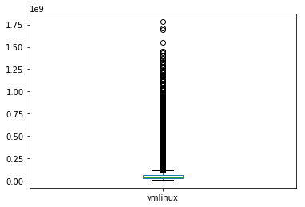

```python
import os
import pandas as pd
import numpy as np
import matplotlib.pyplot as plt

TUXML_CSV_FILENAME="./config_bdd.csv"

# sanity check CSV
with open(TUXML_CSV_FILENAME, "r") as file:
    k = file.readline()
    t = k.split(",")
    s = set(t)
    assert(len(t) == len(s)) # unique number of options/features/column names

# parsing for real with pandas 
rawtuxdata = pd.read_csv(open(TUXML_CSV_FILENAME, "r"))

basic_head = ["cid", "time", "date"] # "compile"
size_methods = ["vmlinux", "GZIP-bzImage", "GZIP-vmlinux", "GZIP", "BZIP2-bzImage", 
              "BZIP2-vmlinux", "BZIP2", "LZMA-bzImage", "LZMA-vmlinux", "LZMA", "XZ-bzImage", "XZ-vmlinux", "XZ", 
              "LZO-bzImage", "LZO-vmlinux", "LZO", "LZ4-bzImage", "LZ4-vmlinux", "LZ4"]


### basic stats about options and remove of unique values 
## could be improved 

tri_state_values = ['y', 'n', 'm']

ftuniques = []
freq_ymn_features = []
non_tristate_options = []

for col in rawtuxdata:
    ft = rawtuxdata[col]    
    # eg always "y"
    if len(ft.unique()) == 1:
        ftuniques.append(col)
    # only tri-state values (y, n, m) (possible TODO: handle numerical/string options)    
    elif all(x in tri_state_values for x in ft.unique()):     #len(ft.unique()) == 3: 
        freq = ft.value_counts(normalize=True)
        freqy = 0
        freqn = 0
        freqm = 0
        if ('y' in freq.index):
            freqy = freq['y']
        if ('n' in freq.index):
            freqn = freq['n']
        if ('m' in freq.index):
            freqm = freq['m']
        freq_ymn_features.append((col, freqy, freqm, freqn))
    else:
        if not (col in size_methods): 
            non_tristate_options.append(col)
        

### TODO: we want to keep all quantitative values!
# non_tristate_options.remove('LZO') # ('vmlinux')

# we want to keep measurements (that are not tristate ;)) 
# non_tristate_options = list(set(non_tristate_options) - set(size_methods))

#### print options with unique values
# options with only one value eg always "y"
#i = 0
#for ft in ftuniques:
#    print(ft + " (" + str(i) + ")")
#    i = i + 1

print("Original size (#configs/#options) of the dataset " + str(rawtuxdata.shape))
print ("Number of options with only one value (eg always y): " + str(pd.DataFrame(ftuniques).shape))

# maybe we can drop options with only one unique value (no interest for machine learning)
# TODO: maybe we can rely on more traditional feature reduction techniques
# TODO: need to think about *when* to apply the removal 
rawtuxdata.drop(columns=ftuniques,inplace=True) 
## non_tristate_options include basic stuff like date, time, cid but also string/numerical options
print ("Non tri-state value options (eg string or integer or hybrid values): " 
       + str(pd.DataFrame(non_tristate_options).shape) + " ") 
#      + str(pd.DataFrame(non_tristate_options)))


print ("Predictor variables: " + str(rawtuxdata.drop(columns=non_tristate_options).columns.size))
# frequency of y, m, and n values 
#plt.figure()
#pd.DataFrame(freq_ymn_features, columns=["feature", "freqy", "freqm", "freqn"]).plot(kind='hist', alpha=0.8) #plot()
#plt.show()


    


```

    /usr/lib/python3/dist-packages/IPython/core/interactiveshell.py:2718: DtypeWarning: Columns (1150,6015,6026,7726) have mixed types. Specify dtype option on import or set low_memory=False.
      interactivity=interactivity, compiler=compiler, result=result)


    Original size (#configs/#options) of the dataset (800, 12798)
    Number of options with only one value (eg always y): (3443, 1)
    Non tri-state value options (eg string or integer or hybrid values): (143, 1) 
    Predictor variables: 9212


```python
'X86_64' in ftuniques, 'DEBUG_INFO' in ftuniques, 'GCOV_PROFILE_ALL' in ftuniques, 'KASAN' in ftuniques, 'UBSAN_SANITIZE_ALL' in ftuniques, 'RELOCATABLE' in ftuniques, 'XFS_DEBUG' in ftuniques, 'AIC7XXX_BUILD_FIRMWARE' in ftuniques, 'AIC79XX_BUILD_FIRMWARE' in ftuniques, 'WANXL_BUILD_FIRMWARE' in ftuniques
```


    (True, True, True, True, True, False, True, True, True, True)


```python
if 'RELOCATABLE' in rawtuxdata.columns:
    print(rawtuxdata.query("RELOCATABLE == 'y'")[['cid', 'RELOCATABLE']])
```

           cid RELOCATABLE
    13   92013           y
    51   92051           y
    56   92056           y
    58   92058           y
    66   92066           y
    67   92067           y
    68   92068           y
    69   92069           y
    94   92094           y
    98   92098           y
    99   92099           y
    116  92116           y
    123  92123           y
    150  92150           y
    162  92162           y
    176  92176           y
    188  92188           y
    190  92190           y
    195  92195           y
    203  92203           y
    208  92208           y
    219  92219           y
    228  92228           y
    229  92229           y
    237  92237           y
    241  92241           y
    251  92251           y
    253  92253           y
    255  92255           y
    276  92276           y
    ..     ...         ...
    518  92518           y
    529  92529           y
    534  92534           y
    545  92545           y
    563  92563           y
    565  92565           y
    581  92581           y
    586  92586           y
    611  92611           y
    613  92613           y
    614  92614           y
    622  92622           y
    633  92633           y
    643  92643           y
    648  92648           y
    667  92667           y
    669  92669           y
    683  92683           y
    715  92715           y
    719  92719           y
    721  92721           y
    722  92722           y
    723  92723           y
    746  92746           y
    763  92763           y
    768  92768           y
    777  92777           y
    787  92787           y
    790  92790           y
    798  92798           y
    
    [85 rows x 2 columns]


```python
print("Data exploration")
```

    Data exploration


```python
# BUGS EXPLORATION
def bug_exploration():
    rawtuxdata.query("AIC7XXX_BUILD_FIRMWARE == 'y'")[['cid', 'vmlinux']]
    rawtuxdata.query("AIC79XX_BUILD_FIRMWARE == 'y'")[['cid', 'vmlinux']]
    rawtuxdata.query("WANXL_BUILD_FIRMWARE == 'y'")[['cid', 'vmlinux']]
    rawtuxdata.query("GENERIC_ALLOCATOR == 'n' & DRM_VBOXVIDEO == 'y'")[['cid', 'vmlinux']]
    rawtuxdata.query("GENERIC_ALLOCATOR == 'y' & DRM_VBOXVIDEO == 'y'")[['cid', 'vmlinux']]
    rawtuxdata.query("GENERIC_ALLOCATOR == 'n' & DRM_VBOXVIDEO == 'm'")[['cid', 'vmlinux']]
    return rawtuxdata.query("DRM_VBOXVIDEO == 'y'")[['cid', 'vmlinux']]

# bug_exploration()


```


```python
#rawtuxdata[rawtuxdata['X86_64'] == 'n']
#rawtuxdata.query("X86_64 == 'n'")
```


```python
#rawtuxdata[(rawtuxdata['DEBUG_INFO'] == 'n') & (rawtuxdata['GCOV_PROFILE_ALL'] == 'n') & (rawtuxdata['KASAN'] == 'n') & (rawtuxdata['MODULES'] == 'y')]
# rawtuxdata.query("(DEBUG_INFO == 'n') & (GCOV_PROFILE_ALL == 'n') & (KASAN == 'n') & (MODULES == 'y')")
#rawtuxdata.query("(DEBUG_INFO == 'n') & (GCOV_PROFILE_ALL == 'n') & (KASAN == 'n')").shape, rawtuxdata.shape

```


```python
#rawtuxdata[rawtuxdata['vmlinux'] == 1168072][['cid', 'CC_OPTIMIZE_FOR_SIZE', 'DEBUG_INFO_DWARF4', 'KASAN', 'UBSAN_ALIGNMENT', 'X86_NEED_RELOCS', 'RANDOMIZE_BASE', 'GCOV_PROFILE_ALL', 'UBSAN_SANITIZE_ALL', 'DEBUG_INFO', 'MODULES', 'DEBUG_INFO_REDUCED', 'DEBUG_INFO_SPLIT']]
tiny_data = rawtuxdata.query("vmlinux == 1168072") #tiny config for X86_32
#if (len(tiny_data) > 0):
#    print(tiny_data[['cid', 'CC_OPTIMIZE_FOR_SIZE', 'DEBUG_INFO_DWARF4', 'KASAN', 'UBSAN_ALIGNMENT', 'X86_NEED_RELOCS', 'RANDOMIZE_BASE', 'GCOV_PROFILE_ALL', 'UBSAN_SANITIZE_ALL', 'DEBUG_INFO', 'MODULES', 'DEBUG_INFO_REDUCED', 'DEBUG_INFO_SPLIT']])
```


```python
#rawtuxdata[rawtuxdata['vmlinux'] == -1]
rawtuxdata.query("vmlinux == -1")
```


<div>
<style scoped>
    .dataframe tbody tr th:only-of-type {
        vertical-align: middle;
    }

    .dataframe tbody tr th {
        vertical-align: top;
    }

    .dataframe thead th {
        text-align: right;
    }
</style>
<table border="1" class="dataframe">
  <thead>
    <tr style="text-align: right;">
      <th></th>
      <th>cid</th>
      <th>date</th>
      <th>time</th>
      <th>vmlinux</th>
      <th>GZIP-bzImage</th>
      <th>GZIP-vmlinux</th>
      <th>GZIP</th>
      <th>BZIP2-bzImage</th>
      <th>BZIP2-vmlinux</th>
      <th>BZIP2</th>
      <th>...</th>
      <th>VIDEO_S3C_CAMIF</th>
      <th>SND_SOC_INTEL_SKL_NAU88L25_SSM4567_MACH</th>
      <th>APDS9960</th>
      <th>SLABINFO</th>
      <th>MICROCODE_AMD</th>
      <th>ISDN_DRV_HISAX</th>
      <th>CHARGER_BQ24190</th>
      <th>SND_SOC_NAU8825</th>
      <th>BH1750</th>
      <th>NETWORK_FILESYSTEMS</th>
    </tr>
  </thead>
  <tbody>
    <tr>
      <th>72</th>
      <td>92072</td>
      <td>2018-07-31 21:22:43</td>
      <td>673.648</td>
      <td>-1</td>
      <td>-1</td>
      <td>-1</td>
      <td>-1</td>
      <td>-1</td>
      <td>-1</td>
      <td>-1</td>
      <td>...</td>
      <td>n</td>
      <td>n</td>
      <td>n</td>
      <td>y</td>
      <td>n</td>
      <td>n</td>
      <td>n</td>
      <td>n</td>
      <td>n</td>
      <td>n</td>
    </tr>
    <tr>
      <th>120</th>
      <td>92120</td>
      <td>2018-07-31 21:37:08</td>
      <td>701.833</td>
      <td>-1</td>
      <td>-1</td>
      <td>-1</td>
      <td>-1</td>
      <td>-1</td>
      <td>-1</td>
      <td>-1</td>
      <td>...</td>
      <td>n</td>
      <td>n</td>
      <td>n</td>
      <td>y</td>
      <td>n</td>
      <td>n</td>
      <td>y</td>
      <td>n</td>
      <td>n</td>
      <td>n</td>
    </tr>
  </tbody>
</table>
<p>2 rows × 9355 columns</p>
</div>


```python
#rawtuxdata[rawtuxdata['vmlinux'] == 1168072]['MODULES']
rawtuxdata.query("vmlinux == 1168072")['MODULES'] #tiny config for X86_32
```


    Series([], Name: MODULES, dtype: object)


```python
# playing a bit with the data 
rawtuxdata.dtypes
# 'DEBUG_INFOO' in list(pd.DataFrame(non_tristate_options)[0]) # 
# tuxdata['DEBUG_INFO'].unique()
#tuxdata['OUTPUT_FORMAT'].dtypes
#tuxdata['DEFAULT_HOSTNAME'].unique()

#rawtuxdata[:5]
rawtuxdata[:20]['vmlinux']
#tuxdata[:5]['CONFIG_DEBUG_INFO']
#tuxdata['ARCH_HAS_SG_CHAIN'].unique()
#tuxdata['ARCH_HAS_SG_CHAIN'].astype('category')
```


    0     18958784
    1     14020304
    2     18864856
    3     36473592
    4     41781760
    5     27830312
    6     25922512
    7     54560488
    8     41066208
    9     29413160
    10    56241632
    11    23782696
    12    18674696
    13    36511960
    14    12373376
    15    21035336
    16    42141216
    17    22889760
    18    24473760
    19    19251632
    Name: vmlinux, dtype: int64


```python
rawtuxdata.shape, rawtuxdata.query("vmlinux != -1").shape
```


    ((800, 9355), (798, 9355))


```python
print("some configurations may have X86_32 (coz we have tested/tried some options and there are in the database)")
# we only keep X86_64 configurations
#rawtuxdata = rawtuxdata[rawtuxdata['X86_64'] == 'y'] ### TODO: I've impression it's not the most effective way (wrt memory) to filter 
if 'X86_64' in rawtuxdata.columns:
    print(rawtuxdata['X86_64'].describe())
    rawtuxdata.query("X86_64 == 'y'", inplace=True)
rawtuxdata.info(memory_usage='deep')
```

    some configurations may have X86_32 (coz we have tested/tried some options and there are in the database)
    <class 'pandas.core.frame.DataFrame'>
    RangeIndex: 800 entries, 0 to 799
    Columns: 9355 entries, cid to NETWORK_FILESYSTEMS
    dtypes: float64(1), int64(133), object(9221)
    memory usage: 464.7 MB


```python
from sklearn.preprocessing import *
from sklearn.metrics import mean_squared_error, r2_score, mean_absolute_error
from sklearn.model_selection import train_test_split
from sklearn.ensemble import ExtraTreesRegressor, RandomForestRegressor, GradientBoostingClassifier
from sklearn.feature_selection import SelectFromModel
from sklearn.linear_model import LassoCV
from sklearn.pipeline import Pipeline
from sklearn import linear_model
from sklearn import svm
from sklearn.metrics import accuracy_score, f1_score, precision_score, recall_score
from sklearn import tree
import graphviz 


LEARN_COMPILATION_SUCCESS = False # costly in time and space 
compilation_status_column_name = 'compile_success'

def encode_data_compilation(rawtuxdata):
    lae = LabelEncoder()
    # we save quantitative values we want (here vmlinux, TODO: generalize)
    # the key idea is that the labelling encoder should not be applied to this kind of values (only to predictor variables!)
    # vml = rawtuxdata['LZO'] # rawtuxdata['vmlinux'] 
    o_sizes = rawtuxdata[size_methods]

    # we remove non tri state options, but TODO there are perhaps some interesting options (numerical or string) here
    #tuxdata = rawtuxdata.drop(columns=non_tristate_options).drop(columns=['vmlinux']).apply(le.fit_transform)
    tuxdata_for_compilation = rawtuxdata.drop(columns=non_tristate_options).drop(columns=size_methods).apply(lae.fit_transform)

    #tuxdata['vmlinux'] = vml 
    tuxdata_for_compilation[size_methods] = o_sizes
    # we can ue vmlinux since it has been restored thanks to previous line
    tuxdata_for_compilation[compilation_status_column_name] = tuxdata_for_compilation['vmlinux'] != -1
    return tuxdata_for_compilation

def learn_compilation_success(tuxdata_for_compilation):
    TESTING_SIZE=0.3 
    X_train, X_test, y_train, y_test = train_test_split(tuxdata_for_compilation.drop(columns=size_methods).drop(columns=compilation_status_column_name), tuxdata_for_compilation[compilation_status_column_name], test_size=TESTING_SIZE, random_state=0)  
    clf = tree.DecisionTreeClassifier() #GradientBoostingClassifier(n_estimators=100) #RandomForestRegressor(n_estimators=100) #   #GradientBoostingRegressor(n_estimators=100)  
    clf.fit(X_train, y_train)
    y_pred = clf.predict(X_test)
    importances = clf.feature_importances_
    indices = np.argsort(importances)[::-1]    

    TOP_FT_IMPORTANCE=20
    print("Feature ranking: " + "top (" + str(TOP_FT_IMPORTANCE) + ")")
    for f in range(TOP_FT_IMPORTANCE): # len(indices)
        print("%d. feature %s %d (%f)" % (f + 1, tuxdata_for_compilation.columns[indices[f]], indices[f], importances[indices[f]]))
   
    
    dot_data = tree.export_graphviz(clf, out_file=None, 
                         feature_names=tuxdata_for_compilation.drop(columns=size_methods).drop(columns=compilation_status_column_name).columns,  
                         filled=True, rounded=True,
                         special_characters=True)  
    graph = graphviz.Source(dot_data)  
    graph.render("TUXML compilation sucess")
    
    acc = accuracy_score (y_test, y_pred)
    prec = precision_score (y_test, y_pred)
    reca = recall_score (y_test, y_pred)
    f1 = f1_score (y_test, y_pred)
    print("Accuracy score: %.2f" % (acc))
    print("Precision score: %.2f" % (prec))
    print("Recall score: %.2f" % (reca))
    print("F1 score: %.2f" % (f1))

if (LEARN_COMPILATION_SUCCESS):
    tuxdata_for_compilation = encode_data_compilation(rawtuxdata)
    tuxdata_for_compilation [compilation_status_column_name].describe()
    learn_compilation_success(tuxdata_for_compilation)
```


```python
#rawtuxdata.query("vmlinux == -1")[['cid', 'AIC7XXX_BUILD_FIRMWARE', 'AIC79XX_BUILD_FIRMWARE', 'IPVTAP', 'WANXL_BUILD_FIRMWARE', 'TCIC']]
```


```python
# aka MAPE
def mean_relative_error(y_true, y_pred): 
    return np.mean(np.abs((y_true - y_pred) / y_true)) * 100

```


```python
# remove entries with same configurations
print(str(len(rawtuxdata)) + " before the removal of some entries (those with same configurations)")
# tuxdata.drop_duplicates(subset=tuxdata.columns.difference(['vmlinux']), inplace=True)
rawtuxdata.drop_duplicates(subset=rawtuxdata.columns.difference(size_methods).difference(basic_head), inplace=True)
print(str(len(rawtuxdata)) + " after the removal of some entries (those with same configurations)")

#n_failures = len(tuxdata[~np.isnan(tuxdata['vmlinux'])])
#n_failures = len(rawtuxdata.query("vmlinux != -1")) #len(tuxdata[np.isnan(tuxdata['vmlinux'])])
#print(str(n_failures) + " non-failures out of " + str(len(rawtuxdata)))

#tuxdata = tuxdata[~np.isnan(tuxdata['vmlinux'])]
#rawtuxdata = rawtuxdata[rawtuxdata['vmlinux'] != -1] #tuxdata[~np.isnan(tuxdata['vmlinux'])]
rawtuxdata.query("(vmlinux != -1) & (vmlinux != 0)", inplace=True)
print(str(len(rawtuxdata)) + " after the removal of configurations that do NOT compile")

```

    800 before the removal of some entries (those with same configurations)
    800 after the removal of some entries (those with same configurations)
    798 after the removal of configurations that do NOT compile


```python
rawtuxdata.query("vmlinux == 1168072") # tinyconfig with X86_32
```


<div>
<style scoped>
    .dataframe tbody tr th:only-of-type {
        vertical-align: middle;
    }

    .dataframe tbody tr th {
        vertical-align: top;
    }

    .dataframe thead th {
        text-align: right;
    }
</style>
<table border="1" class="dataframe">
  <thead>
    <tr style="text-align: right;">
      <th></th>
      <th>cid</th>
      <th>date</th>
      <th>time</th>
      <th>vmlinux</th>
      <th>GZIP-bzImage</th>
      <th>GZIP-vmlinux</th>
      <th>GZIP</th>
      <th>BZIP2-bzImage</th>
      <th>BZIP2-vmlinux</th>
      <th>BZIP2</th>
      <th>...</th>
      <th>VIDEO_S3C_CAMIF</th>
      <th>SND_SOC_INTEL_SKL_NAU88L25_SSM4567_MACH</th>
      <th>APDS9960</th>
      <th>SLABINFO</th>
      <th>MICROCODE_AMD</th>
      <th>ISDN_DRV_HISAX</th>
      <th>CHARGER_BQ24190</th>
      <th>SND_SOC_NAU8825</th>
      <th>BH1750</th>
      <th>NETWORK_FILESYSTEMS</th>
    </tr>
  </thead>
  <tbody>
  </tbody>
</table>
<p>0 rows × 9355 columns</p>
</div>


```python
rawtuxdata.query("vmlinux == 7317008") # tiny config for X86_64
```


<div>
<style scoped>
    .dataframe tbody tr th:only-of-type {
        vertical-align: middle;
    }

    .dataframe tbody tr th {
        vertical-align: top;
    }

    .dataframe thead th {
        text-align: right;
    }
</style>
<table border="1" class="dataframe">
  <thead>
    <tr style="text-align: right;">
      <th></th>
      <th>cid</th>
      <th>date</th>
      <th>time</th>
      <th>vmlinux</th>
      <th>GZIP-bzImage</th>
      <th>GZIP-vmlinux</th>
      <th>GZIP</th>
      <th>BZIP2-bzImage</th>
      <th>BZIP2-vmlinux</th>
      <th>BZIP2</th>
      <th>...</th>
      <th>VIDEO_S3C_CAMIF</th>
      <th>SND_SOC_INTEL_SKL_NAU88L25_SSM4567_MACH</th>
      <th>APDS9960</th>
      <th>SLABINFO</th>
      <th>MICROCODE_AMD</th>
      <th>ISDN_DRV_HISAX</th>
      <th>CHARGER_BQ24190</th>
      <th>SND_SOC_NAU8825</th>
      <th>BH1750</th>
      <th>NETWORK_FILESYSTEMS</th>
    </tr>
  </thead>
  <tbody>
  </tbody>
</table>
<p>0 rows × 9355 columns</p>
</div>


```python


```


```python
plt.figure()
pd.DataFrame(rawtuxdata['vmlinux']).plot.box()
plt.show(block=False)

plt.figure()
pd.DataFrame(rawtuxdata['LZO']).plot.box()
plt.show(block=False)

plt.figure()
pd.DataFrame(rawtuxdata['BZIP2']).plot.box()
plt.show(block=False)


rawtuxdata['vmlinux'].describe()

```


    <Figure size 432x288 with 0 Axes>





    <Figure size 432x288 with 0 Axes>


    <Figure size 432x288 with 0 Axes>


    count    7.980000e+02
    mean     3.127635e+07
    std      1.319053e+07
    min      1.089261e+07
    25%      2.194921e+07
    50%      2.832439e+07
    75%      3.728345e+07
    max      1.298963e+08
    Name: vmlinux, dtype: float64


```python
rawtuxdata.query("vmlinux == 1168072") # tiny config for X86_32
```


<div>
<style scoped>
    .dataframe tbody tr th:only-of-type {
        vertical-align: middle;
    }

    .dataframe tbody tr th {
        vertical-align: top;
    }

    .dataframe thead th {
        text-align: right;
    }
</style>
<table border="1" class="dataframe">
  <thead>
    <tr style="text-align: right;">
      <th></th>
      <th>cid</th>
      <th>date</th>
      <th>time</th>
      <th>vmlinux</th>
      <th>GZIP-bzImage</th>
      <th>GZIP-vmlinux</th>
      <th>GZIP</th>
      <th>BZIP2-bzImage</th>
      <th>BZIP2-vmlinux</th>
      <th>BZIP2</th>
      <th>...</th>
      <th>VIDEO_S3C_CAMIF</th>
      <th>SND_SOC_INTEL_SKL_NAU88L25_SSM4567_MACH</th>
      <th>APDS9960</th>
      <th>SLABINFO</th>
      <th>MICROCODE_AMD</th>
      <th>ISDN_DRV_HISAX</th>
      <th>CHARGER_BQ24190</th>
      <th>SND_SOC_NAU8825</th>
      <th>BH1750</th>
      <th>NETWORK_FILESYSTEMS</th>
    </tr>
  </thead>
  <tbody>
  </tbody>
</table>
<p>0 rows × 9355 columns</p>
</div>


```python
import scipy.stats
import seaborn as sns


def color_negative_positive(val, pcolor="green", ncolor="red"):
    """
    Takes a scalar and returns a string with
    the css property `'color: red'` for negative
    strings, black otherwise.
    """
    color = pcolor if val > 0 else ncolor 
    if val == 0:
        color = 'black' 
    return 'color: %s' % color

compress_methods = ["GZIP", "BZIP2", "LZMA", "XZ", "LZO", "LZ4"]
def compareCompress(size_measure_of_interest): #"" # "-vmlinux" #"-bzImage" # prefix
    rCompressDiff = pd.DataFrame(index=list(map(lambda c: c + "o", compress_methods)) , columns=compress_methods) 
    for compress_method in compress_methods:
        for compress_method2 in compress_methods:
            rCompressDiff.loc[compress_method + "o"][compress_method2] = (np.mean(rawtuxdata[compress_method + size_measure_of_interest] / rawtuxdata[compress_method2 + size_measure_of_interest]) * 100) - 100
    return rCompressDiff

#cmy = sns.light_palette("red", as_cmap=True)
compareCompress("").style.set_caption('Difference (average in percentage) per compression methods').applymap(color_negative_positive)
```


<style  type="text/css" >
    #T_8e8fdc5a_956c_11e8_8d61_525400123456row0_col0 {
            color:  black;
        }    #T_8e8fdc5a_956c_11e8_8d61_525400123456row0_col1 {
            color:  green;
        }    #T_8e8fdc5a_956c_11e8_8d61_525400123456row0_col2 {
            color:  green;
        }    #T_8e8fdc5a_956c_11e8_8d61_525400123456row0_col3 {
            color:  green;
        }    #T_8e8fdc5a_956c_11e8_8d61_525400123456row0_col4 {
            color:  red;
        }    #T_8e8fdc5a_956c_11e8_8d61_525400123456row0_col5 {
            color:  red;
        }    #T_8e8fdc5a_956c_11e8_8d61_525400123456row1_col0 {
            color:  red;
        }    #T_8e8fdc5a_956c_11e8_8d61_525400123456row1_col1 {
            color:  black;
        }    #T_8e8fdc5a_956c_11e8_8d61_525400123456row1_col2 {
            color:  green;
        }    #T_8e8fdc5a_956c_11e8_8d61_525400123456row1_col3 {
            color:  green;
        }    #T_8e8fdc5a_956c_11e8_8d61_525400123456row1_col4 {
            color:  red;
        }    #T_8e8fdc5a_956c_11e8_8d61_525400123456row1_col5 {
            color:  red;
        }    #T_8e8fdc5a_956c_11e8_8d61_525400123456row2_col0 {
            color:  red;
        }    #T_8e8fdc5a_956c_11e8_8d61_525400123456row2_col1 {
            color:  red;
        }    #T_8e8fdc5a_956c_11e8_8d61_525400123456row2_col2 {
            color:  black;
        }    #T_8e8fdc5a_956c_11e8_8d61_525400123456row2_col3 {
            color:  green;
        }    #T_8e8fdc5a_956c_11e8_8d61_525400123456row2_col4 {
            color:  red;
        }    #T_8e8fdc5a_956c_11e8_8d61_525400123456row2_col5 {
            color:  red;
        }    #T_8e8fdc5a_956c_11e8_8d61_525400123456row3_col0 {
            color:  red;
        }    #T_8e8fdc5a_956c_11e8_8d61_525400123456row3_col1 {
            color:  red;
        }    #T_8e8fdc5a_956c_11e8_8d61_525400123456row3_col2 {
            color:  red;
        }    #T_8e8fdc5a_956c_11e8_8d61_525400123456row3_col3 {
            color:  black;
        }    #T_8e8fdc5a_956c_11e8_8d61_525400123456row3_col4 {
            color:  red;
        }    #T_8e8fdc5a_956c_11e8_8d61_525400123456row3_col5 {
            color:  red;
        }    #T_8e8fdc5a_956c_11e8_8d61_525400123456row4_col0 {
            color:  green;
        }    #T_8e8fdc5a_956c_11e8_8d61_525400123456row4_col1 {
            color:  green;
        }    #T_8e8fdc5a_956c_11e8_8d61_525400123456row4_col2 {
            color:  green;
        }    #T_8e8fdc5a_956c_11e8_8d61_525400123456row4_col3 {
            color:  green;
        }    #T_8e8fdc5a_956c_11e8_8d61_525400123456row4_col4 {
            color:  black;
        }    #T_8e8fdc5a_956c_11e8_8d61_525400123456row4_col5 {
            color:  red;
        }    #T_8e8fdc5a_956c_11e8_8d61_525400123456row5_col0 {
            color:  green;
        }    #T_8e8fdc5a_956c_11e8_8d61_525400123456row5_col1 {
            color:  green;
        }    #T_8e8fdc5a_956c_11e8_8d61_525400123456row5_col2 {
            color:  green;
        }    #T_8e8fdc5a_956c_11e8_8d61_525400123456row5_col3 {
            color:  green;
        }    #T_8e8fdc5a_956c_11e8_8d61_525400123456row5_col4 {
            color:  green;
        }    #T_8e8fdc5a_956c_11e8_8d61_525400123456row5_col5 {
            color:  black;
        }</style>  
<table id="T_8e8fdc5a_956c_11e8_8d61_525400123456" ><caption>Difference (average in percentage) per compression methods</caption> 
<thead>    <tr> 
        <th class="blank level0" ></th> 
        <th class="col_heading level0 col0" >GZIP</th> 
        <th class="col_heading level0 col1" >BZIP2</th> 
        <th class="col_heading level0 col2" >LZMA</th> 
        <th class="col_heading level0 col3" >XZ</th> 
        <th class="col_heading level0 col4" >LZO</th> 
        <th class="col_heading level0 col5" >LZ4</th> 
    </tr></thead> 
<tbody>    <tr> 
        <th id="T_8e8fdc5a_956c_11e8_8d61_525400123456level0_row0" class="row_heading level0 row0" >GZIPo</th> 
        <td id="T_8e8fdc5a_956c_11e8_8d61_525400123456row0_col0" class="data row0 col0" >0</td> 
        <td id="T_8e8fdc5a_956c_11e8_8d61_525400123456row0_col1" class="data row0 col1" >3.16415</td> 
        <td id="T_8e8fdc5a_956c_11e8_8d61_525400123456row0_col2" class="data row0 col2" >22.6523</td> 
        <td id="T_8e8fdc5a_956c_11e8_8d61_525400123456row0_col3" class="data row0 col3" >35.1747</td> 
        <td id="T_8e8fdc5a_956c_11e8_8d61_525400123456row0_col4" class="data row0 col4" >-9.13448</td> 
        <td id="T_8e8fdc5a_956c_11e8_8d61_525400123456row0_col5" class="data row0 col5" >-14.7024</td> 
    </tr>    <tr> 
        <th id="T_8e8fdc5a_956c_11e8_8d61_525400123456level0_row1" class="row_heading level0 row1" >BZIP2o</th> 
        <td id="T_8e8fdc5a_956c_11e8_8d61_525400123456row1_col0" class="data row1 col0" >-3.05381</td> 
        <td id="T_8e8fdc5a_956c_11e8_8d61_525400123456row1_col1" class="data row1 col1" >0</td> 
        <td id="T_8e8fdc5a_956c_11e8_8d61_525400123456row1_col2" class="data row1 col2" >18.909</td> 
        <td id="T_8e8fdc5a_956c_11e8_8d61_525400123456row1_col3" class="data row1 col3" >31.056</td> 
        <td id="T_8e8fdc5a_956c_11e8_8d61_525400123456row1_col4" class="data row1 col4" >-11.9166</td> 
        <td id="T_8e8fdc5a_956c_11e8_8d61_525400123456row1_col5" class="data row1 col5" >-17.3177</td> 
    </tr>    <tr> 
        <th id="T_8e8fdc5a_956c_11e8_8d61_525400123456level0_row2" class="row_heading level0 row2" >LZMAo</th> 
        <td id="T_8e8fdc5a_956c_11e8_8d61_525400123456row2_col0" class="data row2 col0" >-18.4577</td> 
        <td id="T_8e8fdc5a_956c_11e8_8d61_525400123456row2_col1" class="data row2 col1" >-15.8761</td> 
        <td id="T_8e8fdc5a_956c_11e8_8d61_525400123456row2_col2" class="data row2 col2" >0</td> 
        <td id="T_8e8fdc5a_956c_11e8_8d61_525400123456row2_col3" class="data row2 col3" >10.2169</td> 
        <td id="T_8e8fdc5a_956c_11e8_8d61_525400123456row2_col4" class="data row2 col4" >-25.9019</td> 
        <td id="T_8e8fdc5a_956c_11e8_8d61_525400123456row2_col5" class="data row2 col5" >-30.4403</td> 
    </tr>    <tr> 
        <th id="T_8e8fdc5a_956c_11e8_8d61_525400123456level0_row3" class="row_heading level0 row3" >XZo</th> 
        <td id="T_8e8fdc5a_956c_11e8_8d61_525400123456row3_col0" class="data row3 col0" >-25.7677</td> 
        <td id="T_8e8fdc5a_956c_11e8_8d61_525400123456row3_col1" class="data row3 col1" >-23.4136</td> 
        <td id="T_8e8fdc5a_956c_11e8_8d61_525400123456row3_col2" class="data row3 col2" >-8.95957</td> 
        <td id="T_8e8fdc5a_956c_11e8_8d61_525400123456row3_col3" class="data row3 col3" >0</td> 
        <td id="T_8e8fdc5a_956c_11e8_8d61_525400123456row3_col4" class="data row3 col4" >-32.5499</td> 
        <td id="T_8e8fdc5a_956c_11e8_8d61_525400123456row3_col5" class="data row3 col5" >-36.6775</td> 
    </tr>    <tr> 
        <th id="T_8e8fdc5a_956c_11e8_8d61_525400123456level0_row4" class="row_heading level0 row4" >LZOo</th> 
        <td id="T_8e8fdc5a_956c_11e8_8d61_525400123456row4_col0" class="data row4 col0" >10.0627</td> 
        <td id="T_8e8fdc5a_956c_11e8_8d61_525400123456row4_col1" class="data row4 col1" >13.5359</td> 
        <td id="T_8e8fdc5a_956c_11e8_8d61_525400123456row4_col2" class="data row4 col2" >35.0024</td> 
        <td id="T_8e8fdc5a_956c_11e8_8d61_525400123456row4_col3" class="data row4 col3" >48.7724</td> 
        <td id="T_8e8fdc5a_956c_11e8_8d61_525400123456row4_col4" class="data row4 col4" >0</td> 
        <td id="T_8e8fdc5a_956c_11e8_8d61_525400123456row4_col5" class="data row4 col5" >-6.1313</td> 
    </tr>    <tr> 
        <th id="T_8e8fdc5a_956c_11e8_8d61_525400123456level0_row5" class="row_heading level0 row5" >LZ4o</th> 
        <td id="T_8e8fdc5a_956c_11e8_8d61_525400123456row5_col0" class="data row5 col0" >17.2596</td> 
        <td id="T_8e8fdc5a_956c_11e8_8d61_525400123456row5_col1" class="data row5 col1" >20.9544</td> 
        <td id="T_8e8fdc5a_956c_11e8_8d61_525400123456row5_col2" class="data row5 col2" >43.8344</td> 
        <td id="T_8e8fdc5a_956c_11e8_8d61_525400123456row5_col3" class="data row5 col3" >58.5148</td> 
        <td id="T_8e8fdc5a_956c_11e8_8d61_525400123456row5_col4" class="data row5 col4" >6.53458</td> 
        <td id="T_8e8fdc5a_956c_11e8_8d61_525400123456row5_col5" class="data row5 col5" >0</td> 
    </tr></tbody> 
</table> 


```python
compareCompress("-bzImage").style.set_caption('Difference (average in percentage) per compression methods, bzImage').applymap(color_negative_positive)

```


<style  type="text/css" >
    #T_8e8fdc5b_956c_11e8_8d61_525400123456row0_col0 {
            color:  black;
        }    #T_8e8fdc5b_956c_11e8_8d61_525400123456row0_col1 {
            color:  red;
        }    #T_8e8fdc5b_956c_11e8_8d61_525400123456row0_col2 {
            color:  green;
        }    #T_8e8fdc5b_956c_11e8_8d61_525400123456row0_col3 {
            color:  green;
        }    #T_8e8fdc5b_956c_11e8_8d61_525400123456row0_col4 {
            color:  red;
        }    #T_8e8fdc5b_956c_11e8_8d61_525400123456row0_col5 {
            color:  red;
        }    #T_8e8fdc5b_956c_11e8_8d61_525400123456row1_col0 {
            color:  green;
        }    #T_8e8fdc5b_956c_11e8_8d61_525400123456row1_col1 {
            color:  black;
        }    #T_8e8fdc5b_956c_11e8_8d61_525400123456row1_col2 {
            color:  green;
        }    #T_8e8fdc5b_956c_11e8_8d61_525400123456row1_col3 {
            color:  green;
        }    #T_8e8fdc5b_956c_11e8_8d61_525400123456row1_col4 {
            color:  green;
        }    #T_8e8fdc5b_956c_11e8_8d61_525400123456row1_col5 {
            color:  green;
        }    #T_8e8fdc5b_956c_11e8_8d61_525400123456row2_col0 {
            color:  red;
        }    #T_8e8fdc5b_956c_11e8_8d61_525400123456row2_col1 {
            color:  red;
        }    #T_8e8fdc5b_956c_11e8_8d61_525400123456row2_col2 {
            color:  black;
        }    #T_8e8fdc5b_956c_11e8_8d61_525400123456row2_col3 {
            color:  green;
        }    #T_8e8fdc5b_956c_11e8_8d61_525400123456row2_col4 {
            color:  red;
        }    #T_8e8fdc5b_956c_11e8_8d61_525400123456row2_col5 {
            color:  red;
        }    #T_8e8fdc5b_956c_11e8_8d61_525400123456row3_col0 {
            color:  red;
        }    #T_8e8fdc5b_956c_11e8_8d61_525400123456row3_col1 {
            color:  red;
        }    #T_8e8fdc5b_956c_11e8_8d61_525400123456row3_col2 {
            color:  red;
        }    #T_8e8fdc5b_956c_11e8_8d61_525400123456row3_col3 {
            color:  black;
        }    #T_8e8fdc5b_956c_11e8_8d61_525400123456row3_col4 {
            color:  red;
        }    #T_8e8fdc5b_956c_11e8_8d61_525400123456row3_col5 {
            color:  red;
        }    #T_8e8fdc5b_956c_11e8_8d61_525400123456row4_col0 {
            color:  green;
        }    #T_8e8fdc5b_956c_11e8_8d61_525400123456row4_col1 {
            color:  red;
        }    #T_8e8fdc5b_956c_11e8_8d61_525400123456row4_col2 {
            color:  green;
        }    #T_8e8fdc5b_956c_11e8_8d61_525400123456row4_col3 {
            color:  green;
        }    #T_8e8fdc5b_956c_11e8_8d61_525400123456row4_col4 {
            color:  black;
        }    #T_8e8fdc5b_956c_11e8_8d61_525400123456row4_col5 {
            color:  red;
        }    #T_8e8fdc5b_956c_11e8_8d61_525400123456row5_col0 {
            color:  green;
        }    #T_8e8fdc5b_956c_11e8_8d61_525400123456row5_col1 {
            color:  red;
        }    #T_8e8fdc5b_956c_11e8_8d61_525400123456row5_col2 {
            color:  green;
        }    #T_8e8fdc5b_956c_11e8_8d61_525400123456row5_col3 {
            color:  green;
        }    #T_8e8fdc5b_956c_11e8_8d61_525400123456row5_col4 {
            color:  green;
        }    #T_8e8fdc5b_956c_11e8_8d61_525400123456row5_col5 {
            color:  black;
        }</style>  
<table id="T_8e8fdc5b_956c_11e8_8d61_525400123456" ><caption>Difference (average in percentage) per compression methods, bzImage</caption> 
<thead>    <tr> 
        <th class="blank level0" ></th> 
        <th class="col_heading level0 col0" >GZIP</th> 
        <th class="col_heading level0 col1" >BZIP2</th> 
        <th class="col_heading level0 col2" >LZMA</th> 
        <th class="col_heading level0 col3" >XZ</th> 
        <th class="col_heading level0 col4" >LZO</th> 
        <th class="col_heading level0 col5" >LZ4</th> 
    </tr></thead> 
<tbody>    <tr> 
        <th id="T_8e8fdc5b_956c_11e8_8d61_525400123456level0_row0" class="row_heading level0 row0" >GZIPo</th> 
        <td id="T_8e8fdc5b_956c_11e8_8d61_525400123456row0_col0" class="data row0 col0" >0</td> 
        <td id="T_8e8fdc5b_956c_11e8_8d61_525400123456row0_col1" class="data row0 col1" >-34.6906</td> 
        <td id="T_8e8fdc5b_956c_11e8_8d61_525400123456row0_col2" class="data row0 col2" >22.2817</td> 
        <td id="T_8e8fdc5b_956c_11e8_8d61_525400123456row0_col3" class="data row0 col3" >34.1992</td> 
        <td id="T_8e8fdc5b_956c_11e8_8d61_525400123456row0_col4" class="data row0 col4" >-8.79592</td> 
        <td id="T_8e8fdc5b_956c_11e8_8d61_525400123456row0_col5" class="data row0 col5" >-14.4206</td> 
    </tr>    <tr> 
        <th id="T_8e8fdc5b_956c_11e8_8d61_525400123456level0_row1" class="row_heading level0 row1" >BZIP2o</th> 
        <td id="T_8e8fdc5b_956c_11e8_8d61_525400123456row1_col0" class="data row1 col0" >57.4381</td> 
        <td id="T_8e8fdc5b_956c_11e8_8d61_525400123456row1_col1" class="data row1 col1" >0</td> 
        <td id="T_8e8fdc5b_956c_11e8_8d61_525400123456row1_col2" class="data row1 col2" >92.2769</td> 
        <td id="T_8e8fdc5b_956c_11e8_8d61_525400123456row1_col3" class="data row1 col3" >110.529</td> 
        <td id="T_8e8fdc5b_956c_11e8_8d61_525400123456row1_col4" class="data row1 col4" >43.6078</td> 
        <td id="T_8e8fdc5b_956c_11e8_8d61_525400123456row1_col5" class="data row1 col5" >34.7509</td> 
    </tr>    <tr> 
        <th id="T_8e8fdc5b_956c_11e8_8d61_525400123456level0_row2" class="row_heading level0 row2" >LZMAo</th> 
        <td id="T_8e8fdc5b_956c_11e8_8d61_525400123456row2_col0" class="data row2 col0" >-18.2098</td> 
        <td id="T_8e8fdc5b_956c_11e8_8d61_525400123456row2_col1" class="data row2 col1" >-46.647</td> 
        <td id="T_8e8fdc5b_956c_11e8_8d61_525400123456row2_col2" class="data row2 col2" >0</td> 
        <td id="T_8e8fdc5b_956c_11e8_8d61_525400123456row2_col3" class="data row2 col3" >9.74975</td> 
        <td id="T_8e8fdc5b_956c_11e8_8d61_525400123456row2_col4" class="data row2 col4" >-25.3994</td> 
        <td id="T_8e8fdc5b_956c_11e8_8d61_525400123456row2_col5" class="data row2 col5" >-29.9984</td> 
    </tr>    <tr> 
        <th id="T_8e8fdc5b_956c_11e8_8d61_525400123456level0_row3" class="row_heading level0 row3" >XZo</th> 
        <td id="T_8e8fdc5b_956c_11e8_8d61_525400123456row3_col0" class="data row3 col0" >-25.2334</td> 
        <td id="T_8e8fdc5b_956c_11e8_8d61_525400123456row3_col1" class="data row3 col1" >-51.3266</td> 
        <td id="T_8e8fdc5b_956c_11e8_8d61_525400123456row3_col2" class="data row3 col2" >-8.58496</td> 
        <td id="T_8e8fdc5b_956c_11e8_8d61_525400123456row3_col3" class="data row3 col3" >0</td> 
        <td id="T_8e8fdc5b_956c_11e8_8d61_525400123456row3_col4" class="data row3 col4" >-31.8095</td> 
        <td id="T_8e8fdc5b_956c_11e8_8d61_525400123456row3_col5" class="data row3 col5" >-36.0098</td> 
    </tr>    <tr> 
        <th id="T_8e8fdc5b_956c_11e8_8d61_525400123456level0_row4" class="row_heading level0 row4" >LZOo</th> 
        <td id="T_8e8fdc5b_956c_11e8_8d61_525400123456row4_col0" class="data row4 col0" >9.65354</td> 
        <td id="T_8e8fdc5b_956c_11e8_8d61_525400123456row4_col1" class="data row4 col1" >-28.3785</td> 
        <td id="T_8e8fdc5b_956c_11e8_8d61_525400123456row4_col2" class="data row4 col2" >34.0948</td> 
        <td id="T_8e8fdc5b_956c_11e8_8d61_525400123456row4_col3" class="data row4 col3" >47.1541</td> 
        <td id="T_8e8fdc5b_956c_11e8_8d61_525400123456row4_col4" class="data row4 col4" >0</td> 
        <td id="T_8e8fdc5b_956c_11e8_8d61_525400123456row4_col5" class="data row4 col5" >-6.17063</td> 
    </tr>    <tr> 
        <th id="T_8e8fdc5b_956c_11e8_8d61_525400123456level0_row5" class="row_heading level0 row5" >LZ4o</th> 
        <td id="T_8e8fdc5b_956c_11e8_8d61_525400123456row5_col0" class="data row5 col0" >16.8722</td> 
        <td id="T_8e8fdc5b_956c_11e8_8d61_525400123456row5_col1" class="data row5 col1" >-23.6632</td> 
        <td id="T_8e8fdc5b_956c_11e8_8d61_525400123456row5_col2" class="data row5 col2" >42.9261</td> 
        <td id="T_8e8fdc5b_956c_11e8_8d61_525400123456row5_col3" class="data row5 col3" >56.8542</td> 
        <td id="T_8e8fdc5b_956c_11e8_8d61_525400123456row5_col4" class="data row5 col4" >6.57906</td> 
        <td id="T_8e8fdc5b_956c_11e8_8d61_525400123456row5_col5" class="data row5 col5" >0</td> 
    </tr></tbody> 
</table> 


```python
compareCompress("-vmlinux").style.set_caption('Difference (average in percentage) per compression methods, vmlinux').applymap(color_negative_positive)

```


<style  type="text/css" >
    #T_8e8fdc5c_956c_11e8_8d61_525400123456row0_col0 {
            color:  black;
        }    #T_8e8fdc5c_956c_11e8_8d61_525400123456row0_col1 {
            color:  red;
        }    #T_8e8fdc5c_956c_11e8_8d61_525400123456row0_col2 {
            color:  green;
        }    #T_8e8fdc5c_956c_11e8_8d61_525400123456row0_col3 {
            color:  green;
        }    #T_8e8fdc5c_956c_11e8_8d61_525400123456row0_col4 {
            color:  red;
        }    #T_8e8fdc5c_956c_11e8_8d61_525400123456row0_col5 {
            color:  red;
        }    #T_8e8fdc5c_956c_11e8_8d61_525400123456row1_col0 {
            color:  green;
        }    #T_8e8fdc5c_956c_11e8_8d61_525400123456row1_col1 {
            color:  black;
        }    #T_8e8fdc5c_956c_11e8_8d61_525400123456row1_col2 {
            color:  green;
        }    #T_8e8fdc5c_956c_11e8_8d61_525400123456row1_col3 {
            color:  green;
        }    #T_8e8fdc5c_956c_11e8_8d61_525400123456row1_col4 {
            color:  green;
        }    #T_8e8fdc5c_956c_11e8_8d61_525400123456row1_col5 {
            color:  green;
        }    #T_8e8fdc5c_956c_11e8_8d61_525400123456row2_col0 {
            color:  red;
        }    #T_8e8fdc5c_956c_11e8_8d61_525400123456row2_col1 {
            color:  red;
        }    #T_8e8fdc5c_956c_11e8_8d61_525400123456row2_col2 {
            color:  black;
        }    #T_8e8fdc5c_956c_11e8_8d61_525400123456row2_col3 {
            color:  green;
        }    #T_8e8fdc5c_956c_11e8_8d61_525400123456row2_col4 {
            color:  red;
        }    #T_8e8fdc5c_956c_11e8_8d61_525400123456row2_col5 {
            color:  red;
        }    #T_8e8fdc5c_956c_11e8_8d61_525400123456row3_col0 {
            color:  red;
        }    #T_8e8fdc5c_956c_11e8_8d61_525400123456row3_col1 {
            color:  red;
        }    #T_8e8fdc5c_956c_11e8_8d61_525400123456row3_col2 {
            color:  red;
        }    #T_8e8fdc5c_956c_11e8_8d61_525400123456row3_col3 {
            color:  black;
        }    #T_8e8fdc5c_956c_11e8_8d61_525400123456row3_col4 {
            color:  red;
        }    #T_8e8fdc5c_956c_11e8_8d61_525400123456row3_col5 {
            color:  red;
        }    #T_8e8fdc5c_956c_11e8_8d61_525400123456row4_col0 {
            color:  green;
        }    #T_8e8fdc5c_956c_11e8_8d61_525400123456row4_col1 {
            color:  red;
        }    #T_8e8fdc5c_956c_11e8_8d61_525400123456row4_col2 {
            color:  green;
        }    #T_8e8fdc5c_956c_11e8_8d61_525400123456row4_col3 {
            color:  green;
        }    #T_8e8fdc5c_956c_11e8_8d61_525400123456row4_col4 {
            color:  black;
        }    #T_8e8fdc5c_956c_11e8_8d61_525400123456row4_col5 {
            color:  red;
        }    #T_8e8fdc5c_956c_11e8_8d61_525400123456row5_col0 {
            color:  green;
        }    #T_8e8fdc5c_956c_11e8_8d61_525400123456row5_col1 {
            color:  red;
        }    #T_8e8fdc5c_956c_11e8_8d61_525400123456row5_col2 {
            color:  green;
        }    #T_8e8fdc5c_956c_11e8_8d61_525400123456row5_col3 {
            color:  green;
        }    #T_8e8fdc5c_956c_11e8_8d61_525400123456row5_col4 {
            color:  green;
        }    #T_8e8fdc5c_956c_11e8_8d61_525400123456row5_col5 {
            color:  black;
        }</style>  
<table id="T_8e8fdc5c_956c_11e8_8d61_525400123456" ><caption>Difference (average in percentage) per compression methods, vmlinux</caption> 
<thead>    <tr> 
        <th class="blank level0" ></th> 
        <th class="col_heading level0 col0" >GZIP</th> 
        <th class="col_heading level0 col1" >BZIP2</th> 
        <th class="col_heading level0 col2" >LZMA</th> 
        <th class="col_heading level0 col3" >XZ</th> 
        <th class="col_heading level0 col4" >LZO</th> 
        <th class="col_heading level0 col5" >LZ4</th> 
    </tr></thead> 
<tbody>    <tr> 
        <th id="T_8e8fdc5c_956c_11e8_8d61_525400123456level0_row0" class="row_heading level0 row0" >GZIPo</th> 
        <td id="T_8e8fdc5c_956c_11e8_8d61_525400123456row0_col0" class="data row0 col0" >0</td> 
        <td id="T_8e8fdc5c_956c_11e8_8d61_525400123456row0_col1" class="data row0 col1" >-28.9344</td> 
        <td id="T_8e8fdc5c_956c_11e8_8d61_525400123456row0_col2" class="data row0 col2" >16.5295</td> 
        <td id="T_8e8fdc5c_956c_11e8_8d61_525400123456row0_col3" class="data row0 col3" >24.8182</td> 
        <td id="T_8e8fdc5c_956c_11e8_8d61_525400123456row0_col4" class="data row0 col4" >-6.94056</td> 
        <td id="T_8e8fdc5c_956c_11e8_8d61_525400123456row0_col5" class="data row0 col5" >-11.5277</td> 
    </tr>    <tr> 
        <th id="T_8e8fdc5c_956c_11e8_8d61_525400123456level0_row1" class="row_heading level0 row1" >BZIP2o</th> 
        <td id="T_8e8fdc5c_956c_11e8_8d61_525400123456row1_col0" class="data row1 col0" >42.3448</td> 
        <td id="T_8e8fdc5c_956c_11e8_8d61_525400123456row1_col1" class="data row1 col1" >0</td> 
        <td id="T_8e8fdc5c_956c_11e8_8d61_525400123456row1_col2" class="data row1 col2" >65.4891</td> 
        <td id="T_8e8fdc5c_956c_11e8_8d61_525400123456row1_col3" class="data row1 col3" >76.9441</td> 
        <td id="T_8e8fdc5c_956c_11e8_8d61_525400123456row1_col4" class="data row1 col4" >32.5706</td> 
        <td id="T_8e8fdc5c_956c_11e8_8d61_525400123456row1_col5" class="data row1 col5" >26.098</td> 
    </tr>    <tr> 
        <th id="T_8e8fdc5c_956c_11e8_8d61_525400123456level0_row2" class="row_heading level0 row2" >LZMAo</th> 
        <td id="T_8e8fdc5c_956c_11e8_8d61_525400123456row2_col0" class="data row2 col0" >-14.1407</td> 
        <td id="T_8e8fdc5c_956c_11e8_8d61_525400123456row2_col1" class="data row2 col1" >-39.1221</td> 
        <td id="T_8e8fdc5c_956c_11e8_8d61_525400123456row2_col2" class="data row2 col2" >0</td> 
        <td id="T_8e8fdc5c_956c_11e8_8d61_525400123456row2_col3" class="data row2 col3" >7.08262</td> 
        <td id="T_8e8fdc5c_956c_11e8_8d61_525400123456row2_col4" class="data row2 col4" >-20.0841</td> 
        <td id="T_8e8fdc5c_956c_11e8_8d61_525400123456row2_col5" class="data row2 col5" >-24.0145</td> 
    </tr>    <tr> 
        <th id="T_8e8fdc5c_956c_11e8_8d61_525400123456level0_row3" class="row_heading level0 row3" >XZo</th> 
        <td id="T_8e8fdc5c_956c_11e8_8d61_525400123456row3_col0" class="data row3 col0" >-19.6405</td> 
        <td id="T_8e8fdc5c_956c_11e8_8d61_525400123456row3_col1" class="data row3 col1" >-43.1186</td> 
        <td id="T_8e8fdc5c_956c_11e8_8d61_525400123456row3_col2" class="data row3 col2" >-6.43189</td> 
        <td id="T_8e8fdc5c_956c_11e8_8d61_525400123456row3_col3" class="data row3 col3" >0</td> 
        <td id="T_8e8fdc5c_956c_11e8_8d61_525400123456row3_col4" class="data row3 col4" >-25.1969</td> 
        <td id="T_8e8fdc5c_956c_11e8_8d61_525400123456row3_col5" class="data row3 col5" >-28.8682</td> 
    </tr>    <tr> 
        <th id="T_8e8fdc5c_956c_11e8_8d61_525400123456level0_row4" class="row_heading level0 row4" >LZOo</th> 
        <td id="T_8e8fdc5c_956c_11e8_8d61_525400123456row4_col0" class="data row4 col0" >7.47049</td> 
        <td id="T_8e8fdc5c_956c_11e8_8d61_525400123456row4_col1" class="data row4 col1" >-23.5671</td> 
        <td id="T_8e8fdc5c_956c_11e8_8d61_525400123456row4_col2" class="data row4 col2" >25.2596</td> 
        <td id="T_8e8fdc5c_956c_11e8_8d61_525400123456row4_col3" class="data row4 col3" >34.1801</td> 
        <td id="T_8e8fdc5c_956c_11e8_8d61_525400123456row4_col4" class="data row4 col4" >0</td> 
        <td id="T_8e8fdc5c_956c_11e8_8d61_525400123456row4_col5" class="data row4 col5" >-4.9351</td> 
    </tr>    <tr> 
        <th id="T_8e8fdc5c_956c_11e8_8d61_525400123456level0_row5" class="row_heading level0 row5" >LZ4o</th> 
        <td id="T_8e8fdc5c_956c_11e8_8d61_525400123456row5_col0" class="data row5 col0" >13.0611</td> 
        <td id="T_8e8fdc5c_956c_11e8_8d61_525400123456row5_col1" class="data row5 col1" >-19.5529</td> 
        <td id="T_8e8fdc5c_956c_11e8_8d61_525400123456row5_col2" class="data row5 col2" >31.791</td> 
        <td id="T_8e8fdc5c_956c_11e8_8d61_525400123456row5_col3" class="data row5 col3" >41.1921</td> 
        <td id="T_8e8fdc5c_956c_11e8_8d61_525400123456row5_col4" class="data row5 col4" >5.19544</td> 
        <td id="T_8e8fdc5c_956c_11e8_8d61_525400123456row5_col5" class="data row5 col5" >0</td> 
    </tr></tbody> 
</table> 


```python
cm = sns.light_palette("green", as_cmap=True)
pd.DataFrame.corr(rawtuxdata[size_methods]).style.set_caption('Correlations between size measures').background_gradient(cmap=cm)

```


<style  type="text/css" >
    #T_8e8fdc5d_956c_11e8_8d61_525400123456row0_col0 {
            background-color:  #008000;
        }    #T_8e8fdc5d_956c_11e8_8d61_525400123456row0_col1 {
            background-color:  #e5ffe5;
        }    #T_8e8fdc5d_956c_11e8_8d61_525400123456row0_col2 {
            background-color:  #e5ffe5;
        }    #T_8e8fdc5d_956c_11e8_8d61_525400123456row0_col3 {
            background-color:  #e5ffe5;
        }    #T_8e8fdc5d_956c_11e8_8d61_525400123456row0_col4 {
            background-color:  #e5ffe5;
        }    #T_8e8fdc5d_956c_11e8_8d61_525400123456row0_col5 {
            background-color:  #e5ffe5;
        }    #T_8e8fdc5d_956c_11e8_8d61_525400123456row0_col6 {
            background-color:  #e5ffe5;
        }    #T_8e8fdc5d_956c_11e8_8d61_525400123456row0_col7 {
            background-color:  #e5ffe5;
        }    #T_8e8fdc5d_956c_11e8_8d61_525400123456row0_col8 {
            background-color:  #e5ffe5;
        }    #T_8e8fdc5d_956c_11e8_8d61_525400123456row0_col9 {
            background-color:  #e5ffe5;
        }    #T_8e8fdc5d_956c_11e8_8d61_525400123456row0_col10 {
            background-color:  #e5ffe5;
        }    #T_8e8fdc5d_956c_11e8_8d61_525400123456row0_col11 {
            background-color:  #e5ffe5;
        }    #T_8e8fdc5d_956c_11e8_8d61_525400123456row0_col12 {
            background-color:  #e5ffe5;
        }    #T_8e8fdc5d_956c_11e8_8d61_525400123456row0_col13 {
            background-color:  #e5ffe5;
        }    #T_8e8fdc5d_956c_11e8_8d61_525400123456row0_col14 {
            background-color:  #e5ffe5;
        }    #T_8e8fdc5d_956c_11e8_8d61_525400123456row0_col15 {
            background-color:  #e5ffe5;
        }    #T_8e8fdc5d_956c_11e8_8d61_525400123456row0_col16 {
            background-color:  #e5ffe5;
        }    #T_8e8fdc5d_956c_11e8_8d61_525400123456row0_col17 {
            background-color:  #e5ffe5;
        }    #T_8e8fdc5d_956c_11e8_8d61_525400123456row0_col18 {
            background-color:  #e5ffe5;
        }    #T_8e8fdc5d_956c_11e8_8d61_525400123456row1_col0 {
            background-color:  #d1f4d1;
        }    #T_8e8fdc5d_956c_11e8_8d61_525400123456row1_col1 {
            background-color:  #008000;
        }    #T_8e8fdc5d_956c_11e8_8d61_525400123456row1_col2 {
            background-color:  #008000;
        }    #T_8e8fdc5d_956c_11e8_8d61_525400123456row1_col3 {
            background-color:  #008000;
        }    #T_8e8fdc5d_956c_11e8_8d61_525400123456row1_col4 {
            background-color:  #018001;
        }    #T_8e8fdc5d_956c_11e8_8d61_525400123456row1_col5 {
            background-color:  #018001;
        }    #T_8e8fdc5d_956c_11e8_8d61_525400123456row1_col6 {
            background-color:  #008000;
        }    #T_8e8fdc5d_956c_11e8_8d61_525400123456row1_col7 {
            background-color:  #008000;
        }    #T_8e8fdc5d_956c_11e8_8d61_525400123456row1_col8 {
            background-color:  #008000;
        }    #T_8e8fdc5d_956c_11e8_8d61_525400123456row1_col9 {
            background-color:  #008000;
        }    #T_8e8fdc5d_956c_11e8_8d61_525400123456row1_col10 {
            background-color:  #108910;
        }    #T_8e8fdc5d_956c_11e8_8d61_525400123456row1_col11 {
            background-color:  #108910;
        }    #T_8e8fdc5d_956c_11e8_8d61_525400123456row1_col12 {
            background-color:  #108910;
        }    #T_8e8fdc5d_956c_11e8_8d61_525400123456row1_col13 {
            background-color:  #008000;
        }    #T_8e8fdc5d_956c_11e8_8d61_525400123456row1_col14 {
            background-color:  #008000;
        }    #T_8e8fdc5d_956c_11e8_8d61_525400123456row1_col15 {
            background-color:  #008000;
        }    #T_8e8fdc5d_956c_11e8_8d61_525400123456row1_col16 {
            background-color:  #018001;
        }    #T_8e8fdc5d_956c_11e8_8d61_525400123456row1_col17 {
            background-color:  #018001;
        }    #T_8e8fdc5d_956c_11e8_8d61_525400123456row1_col18 {
            background-color:  #018001;
        }    #T_8e8fdc5d_956c_11e8_8d61_525400123456row2_col0 {
            background-color:  #d1f4d1;
        }    #T_8e8fdc5d_956c_11e8_8d61_525400123456row2_col1 {
            background-color:  #008000;
        }    #T_8e8fdc5d_956c_11e8_8d61_525400123456row2_col2 {
            background-color:  #008000;
        }    #T_8e8fdc5d_956c_11e8_8d61_525400123456row2_col3 {
            background-color:  #008000;
        }    #T_8e8fdc5d_956c_11e8_8d61_525400123456row2_col4 {
            background-color:  #018001;
        }    #T_8e8fdc5d_956c_11e8_8d61_525400123456row2_col5 {
            background-color:  #018001;
        }    #T_8e8fdc5d_956c_11e8_8d61_525400123456row2_col6 {
            background-color:  #008000;
        }    #T_8e8fdc5d_956c_11e8_8d61_525400123456row2_col7 {
            background-color:  #008000;
        }    #T_8e8fdc5d_956c_11e8_8d61_525400123456row2_col8 {
            background-color:  #008000;
        }    #T_8e8fdc5d_956c_11e8_8d61_525400123456row2_col9 {
            background-color:  #008000;
        }    #T_8e8fdc5d_956c_11e8_8d61_525400123456row2_col10 {
            background-color:  #108910;
        }    #T_8e8fdc5d_956c_11e8_8d61_525400123456row2_col11 {
            background-color:  #108910;
        }    #T_8e8fdc5d_956c_11e8_8d61_525400123456row2_col12 {
            background-color:  #108910;
        }    #T_8e8fdc5d_956c_11e8_8d61_525400123456row2_col13 {
            background-color:  #008000;
        }    #T_8e8fdc5d_956c_11e8_8d61_525400123456row2_col14 {
            background-color:  #008000;
        }    #T_8e8fdc5d_956c_11e8_8d61_525400123456row2_col15 {
            background-color:  #008000;
        }    #T_8e8fdc5d_956c_11e8_8d61_525400123456row2_col16 {
            background-color:  #018001;
        }    #T_8e8fdc5d_956c_11e8_8d61_525400123456row2_col17 {
            background-color:  #018001;
        }    #T_8e8fdc5d_956c_11e8_8d61_525400123456row2_col18 {
            background-color:  #018001;
        }    #T_8e8fdc5d_956c_11e8_8d61_525400123456row3_col0 {
            background-color:  #d3f5d3;
        }    #T_8e8fdc5d_956c_11e8_8d61_525400123456row3_col1 {
            background-color:  #008000;
        }    #T_8e8fdc5d_956c_11e8_8d61_525400123456row3_col2 {
            background-color:  #008000;
        }    #T_8e8fdc5d_956c_11e8_8d61_525400123456row3_col3 {
            background-color:  #008000;
        }    #T_8e8fdc5d_956c_11e8_8d61_525400123456row3_col4 {
            background-color:  #018001;
        }    #T_8e8fdc5d_956c_11e8_8d61_525400123456row3_col5 {
            background-color:  #018001;
        }    #T_8e8fdc5d_956c_11e8_8d61_525400123456row3_col6 {
            background-color:  #018001;
        }    #T_8e8fdc5d_956c_11e8_8d61_525400123456row3_col7 {
            background-color:  #008000;
        }    #T_8e8fdc5d_956c_11e8_8d61_525400123456row3_col8 {
            background-color:  #008000;
        }    #T_8e8fdc5d_956c_11e8_8d61_525400123456row3_col9 {
            background-color:  #008000;
        }    #T_8e8fdc5d_956c_11e8_8d61_525400123456row3_col10 {
            background-color:  #108910;
        }    #T_8e8fdc5d_956c_11e8_8d61_525400123456row3_col11 {
            background-color:  #108910;
        }    #T_8e8fdc5d_956c_11e8_8d61_525400123456row3_col12 {
            background-color:  #108910;
        }    #T_8e8fdc5d_956c_11e8_8d61_525400123456row3_col13 {
            background-color:  #018001;
        }    #T_8e8fdc5d_956c_11e8_8d61_525400123456row3_col14 {
            background-color:  #018001;
        }    #T_8e8fdc5d_956c_11e8_8d61_525400123456row3_col15 {
            background-color:  #008000;
        }    #T_8e8fdc5d_956c_11e8_8d61_525400123456row3_col16 {
            background-color:  #028102;
        }    #T_8e8fdc5d_956c_11e8_8d61_525400123456row3_col17 {
            background-color:  #028102;
        }    #T_8e8fdc5d_956c_11e8_8d61_525400123456row3_col18 {
            background-color:  #018001;
        }    #T_8e8fdc5d_956c_11e8_8d61_525400123456row4_col0 {
            background-color:  #c2ebc2;
        }    #T_8e8fdc5d_956c_11e8_8d61_525400123456row4_col1 {
            background-color:  #018001;
        }    #T_8e8fdc5d_956c_11e8_8d61_525400123456row4_col2 {
            background-color:  #018001;
        }    #T_8e8fdc5d_956c_11e8_8d61_525400123456row4_col3 {
            background-color:  #018001;
        }    #T_8e8fdc5d_956c_11e8_8d61_525400123456row4_col4 {
            background-color:  #008000;
        }    #T_8e8fdc5d_956c_11e8_8d61_525400123456row4_col5 {
            background-color:  #008000;
        }    #T_8e8fdc5d_956c_11e8_8d61_525400123456row4_col6 {
            background-color:  #008000;
        }    #T_8e8fdc5d_956c_11e8_8d61_525400123456row4_col7 {
            background-color:  #028102;
        }    #T_8e8fdc5d_956c_11e8_8d61_525400123456row4_col8 {
            background-color:  #028102;
        }    #T_8e8fdc5d_956c_11e8_8d61_525400123456row4_col9 {
            background-color:  #028102;
        }    #T_8e8fdc5d_956c_11e8_8d61_525400123456row4_col10 {
            background-color:  #128a12;
        }    #T_8e8fdc5d_956c_11e8_8d61_525400123456row4_col11 {
            background-color:  #128a12;
        }    #T_8e8fdc5d_956c_11e8_8d61_525400123456row4_col12 {
            background-color:  #128a12;
        }    #T_8e8fdc5d_956c_11e8_8d61_525400123456row4_col13 {
            background-color:  #008000;
        }    #T_8e8fdc5d_956c_11e8_8d61_525400123456row4_col14 {
            background-color:  #008000;
        }    #T_8e8fdc5d_956c_11e8_8d61_525400123456row4_col15 {
            background-color:  #008000;
        }    #T_8e8fdc5d_956c_11e8_8d61_525400123456row4_col16 {
            background-color:  #008000;
        }    #T_8e8fdc5d_956c_11e8_8d61_525400123456row4_col17 {
            background-color:  #008000;
        }    #T_8e8fdc5d_956c_11e8_8d61_525400123456row4_col18 {
            background-color:  #008000;
        }    #T_8e8fdc5d_956c_11e8_8d61_525400123456row5_col0 {
            background-color:  #c2ebc2;
        }    #T_8e8fdc5d_956c_11e8_8d61_525400123456row5_col1 {
            background-color:  #018001;
        }    #T_8e8fdc5d_956c_11e8_8d61_525400123456row5_col2 {
            background-color:  #018001;
        }    #T_8e8fdc5d_956c_11e8_8d61_525400123456row5_col3 {
            background-color:  #018001;
        }    #T_8e8fdc5d_956c_11e8_8d61_525400123456row5_col4 {
            background-color:  #008000;
        }    #T_8e8fdc5d_956c_11e8_8d61_525400123456row5_col5 {
            background-color:  #008000;
        }    #T_8e8fdc5d_956c_11e8_8d61_525400123456row5_col6 {
            background-color:  #008000;
        }    #T_8e8fdc5d_956c_11e8_8d61_525400123456row5_col7 {
            background-color:  #028102;
        }    #T_8e8fdc5d_956c_11e8_8d61_525400123456row5_col8 {
            background-color:  #028102;
        }    #T_8e8fdc5d_956c_11e8_8d61_525400123456row5_col9 {
            background-color:  #028102;
        }    #T_8e8fdc5d_956c_11e8_8d61_525400123456row5_col10 {
            background-color:  #128a12;
        }    #T_8e8fdc5d_956c_11e8_8d61_525400123456row5_col11 {
            background-color:  #128a12;
        }    #T_8e8fdc5d_956c_11e8_8d61_525400123456row5_col12 {
            background-color:  #128a12;
        }    #T_8e8fdc5d_956c_11e8_8d61_525400123456row5_col13 {
            background-color:  #008000;
        }    #T_8e8fdc5d_956c_11e8_8d61_525400123456row5_col14 {
            background-color:  #008000;
        }    #T_8e8fdc5d_956c_11e8_8d61_525400123456row5_col15 {
            background-color:  #008000;
        }    #T_8e8fdc5d_956c_11e8_8d61_525400123456row5_col16 {
            background-color:  #008000;
        }    #T_8e8fdc5d_956c_11e8_8d61_525400123456row5_col17 {
            background-color:  #008000;
        }    #T_8e8fdc5d_956c_11e8_8d61_525400123456row5_col18 {
            background-color:  #008000;
        }    #T_8e8fdc5d_956c_11e8_8d61_525400123456row6_col0 {
            background-color:  #c3ecc3;
        }    #T_8e8fdc5d_956c_11e8_8d61_525400123456row6_col1 {
            background-color:  #008000;
        }    #T_8e8fdc5d_956c_11e8_8d61_525400123456row6_col2 {
            background-color:  #008000;
        }    #T_8e8fdc5d_956c_11e8_8d61_525400123456row6_col3 {
            background-color:  #018001;
        }    #T_8e8fdc5d_956c_11e8_8d61_525400123456row6_col4 {
            background-color:  #008000;
        }    #T_8e8fdc5d_956c_11e8_8d61_525400123456row6_col5 {
            background-color:  #008000;
        }    #T_8e8fdc5d_956c_11e8_8d61_525400123456row6_col6 {
            background-color:  #008000;
        }    #T_8e8fdc5d_956c_11e8_8d61_525400123456row6_col7 {
            background-color:  #018001;
        }    #T_8e8fdc5d_956c_11e8_8d61_525400123456row6_col8 {
            background-color:  #018001;
        }    #T_8e8fdc5d_956c_11e8_8d61_525400123456row6_col9 {
            background-color:  #028102;
        }    #T_8e8fdc5d_956c_11e8_8d61_525400123456row6_col10 {
            background-color:  #128a12;
        }    #T_8e8fdc5d_956c_11e8_8d61_525400123456row6_col11 {
            background-color:  #128a12;
        }    #T_8e8fdc5d_956c_11e8_8d61_525400123456row6_col12 {
            background-color:  #128a12;
        }    #T_8e8fdc5d_956c_11e8_8d61_525400123456row6_col13 {
            background-color:  #008000;
        }    #T_8e8fdc5d_956c_11e8_8d61_525400123456row6_col14 {
            background-color:  #008000;
        }    #T_8e8fdc5d_956c_11e8_8d61_525400123456row6_col15 {
            background-color:  #008000;
        }    #T_8e8fdc5d_956c_11e8_8d61_525400123456row6_col16 {
            background-color:  #008000;
        }    #T_8e8fdc5d_956c_11e8_8d61_525400123456row6_col17 {
            background-color:  #008000;
        }    #T_8e8fdc5d_956c_11e8_8d61_525400123456row6_col18 {
            background-color:  #008000;
        }    #T_8e8fdc5d_956c_11e8_8d61_525400123456row7_col0 {
            background-color:  #dbf9db;
        }    #T_8e8fdc5d_956c_11e8_8d61_525400123456row7_col1 {
            background-color:  #008000;
        }    #T_8e8fdc5d_956c_11e8_8d61_525400123456row7_col2 {
            background-color:  #008000;
        }    #T_8e8fdc5d_956c_11e8_8d61_525400123456row7_col3 {
            background-color:  #008000;
        }    #T_8e8fdc5d_956c_11e8_8d61_525400123456row7_col4 {
            background-color:  #028102;
        }    #T_8e8fdc5d_956c_11e8_8d61_525400123456row7_col5 {
            background-color:  #028102;
        }    #T_8e8fdc5d_956c_11e8_8d61_525400123456row7_col6 {
            background-color:  #028102;
        }    #T_8e8fdc5d_956c_11e8_8d61_525400123456row7_col7 {
            background-color:  #008000;
        }    #T_8e8fdc5d_956c_11e8_8d61_525400123456row7_col8 {
            background-color:  #008000;
        }    #T_8e8fdc5d_956c_11e8_8d61_525400123456row7_col9 {
            background-color:  #008000;
        }    #T_8e8fdc5d_956c_11e8_8d61_525400123456row7_col10 {
            background-color:  #118911;
        }    #T_8e8fdc5d_956c_11e8_8d61_525400123456row7_col11 {
            background-color:  #118911;
        }    #T_8e8fdc5d_956c_11e8_8d61_525400123456row7_col12 {
            background-color:  #118911;
        }    #T_8e8fdc5d_956c_11e8_8d61_525400123456row7_col13 {
            background-color:  #028102;
        }    #T_8e8fdc5d_956c_11e8_8d61_525400123456row7_col14 {
            background-color:  #028102;
        }    #T_8e8fdc5d_956c_11e8_8d61_525400123456row7_col15 {
            background-color:  #028102;
        }    #T_8e8fdc5d_956c_11e8_8d61_525400123456row7_col16 {
            background-color:  #038103;
        }    #T_8e8fdc5d_956c_11e8_8d61_525400123456row7_col17 {
            background-color:  #038103;
        }    #T_8e8fdc5d_956c_11e8_8d61_525400123456row7_col18 {
            background-color:  #038103;
        }    #T_8e8fdc5d_956c_11e8_8d61_525400123456row8_col0 {
            background-color:  #daf9da;
        }    #T_8e8fdc5d_956c_11e8_8d61_525400123456row8_col1 {
            background-color:  #008000;
        }    #T_8e8fdc5d_956c_11e8_8d61_525400123456row8_col2 {
            background-color:  #008000;
        }    #T_8e8fdc5d_956c_11e8_8d61_525400123456row8_col3 {
            background-color:  #008000;
        }    #T_8e8fdc5d_956c_11e8_8d61_525400123456row8_col4 {
            background-color:  #028102;
        }    #T_8e8fdc5d_956c_11e8_8d61_525400123456row8_col5 {
            background-color:  #028102;
        }    #T_8e8fdc5d_956c_11e8_8d61_525400123456row8_col6 {
            background-color:  #018001;
        }    #T_8e8fdc5d_956c_11e8_8d61_525400123456row8_col7 {
            background-color:  #008000;
        }    #T_8e8fdc5d_956c_11e8_8d61_525400123456row8_col8 {
            background-color:  #008000;
        }    #T_8e8fdc5d_956c_11e8_8d61_525400123456row8_col9 {
            background-color:  #008000;
        }    #T_8e8fdc5d_956c_11e8_8d61_525400123456row8_col10 {
            background-color:  #118911;
        }    #T_8e8fdc5d_956c_11e8_8d61_525400123456row8_col11 {
            background-color:  #118911;
        }    #T_8e8fdc5d_956c_11e8_8d61_525400123456row8_col12 {
            background-color:  #118911;
        }    #T_8e8fdc5d_956c_11e8_8d61_525400123456row8_col13 {
            background-color:  #028102;
        }    #T_8e8fdc5d_956c_11e8_8d61_525400123456row8_col14 {
            background-color:  #028102;
        }    #T_8e8fdc5d_956c_11e8_8d61_525400123456row8_col15 {
            background-color:  #028102;
        }    #T_8e8fdc5d_956c_11e8_8d61_525400123456row8_col16 {
            background-color:  #038103;
        }    #T_8e8fdc5d_956c_11e8_8d61_525400123456row8_col17 {
            background-color:  #038103;
        }    #T_8e8fdc5d_956c_11e8_8d61_525400123456row8_col18 {
            background-color:  #038103;
        }    #T_8e8fdc5d_956c_11e8_8d61_525400123456row9_col0 {
            background-color:  #ddfbdd;
        }    #T_8e8fdc5d_956c_11e8_8d61_525400123456row9_col1 {
            background-color:  #008000;
        }    #T_8e8fdc5d_956c_11e8_8d61_525400123456row9_col2 {
            background-color:  #008000;
        }    #T_8e8fdc5d_956c_11e8_8d61_525400123456row9_col3 {
            background-color:  #008000;
        }    #T_8e8fdc5d_956c_11e8_8d61_525400123456row9_col4 {
            background-color:  #028102;
        }    #T_8e8fdc5d_956c_11e8_8d61_525400123456row9_col5 {
            background-color:  #028102;
        }    #T_8e8fdc5d_956c_11e8_8d61_525400123456row9_col6 {
            background-color:  #028102;
        }    #T_8e8fdc5d_956c_11e8_8d61_525400123456row9_col7 {
            background-color:  #008000;
        }    #T_8e8fdc5d_956c_11e8_8d61_525400123456row9_col8 {
            background-color:  #008000;
        }    #T_8e8fdc5d_956c_11e8_8d61_525400123456row9_col9 {
            background-color:  #008000;
        }    #T_8e8fdc5d_956c_11e8_8d61_525400123456row9_col10 {
            background-color:  #118911;
        }    #T_8e8fdc5d_956c_11e8_8d61_525400123456row9_col11 {
            background-color:  #118911;
        }    #T_8e8fdc5d_956c_11e8_8d61_525400123456row9_col12 {
            background-color:  #118911;
        }    #T_8e8fdc5d_956c_11e8_8d61_525400123456row9_col13 {
            background-color:  #028102;
        }    #T_8e8fdc5d_956c_11e8_8d61_525400123456row9_col14 {
            background-color:  #028102;
        }    #T_8e8fdc5d_956c_11e8_8d61_525400123456row9_col15 {
            background-color:  #028102;
        }    #T_8e8fdc5d_956c_11e8_8d61_525400123456row9_col16 {
            background-color:  #048204;
        }    #T_8e8fdc5d_956c_11e8_8d61_525400123456row9_col17 {
            background-color:  #048204;
        }    #T_8e8fdc5d_956c_11e8_8d61_525400123456row9_col18 {
            background-color:  #048204;
        }    #T_8e8fdc5d_956c_11e8_8d61_525400123456row10_col0 {
            background-color:  #e3fee3;
        }    #T_8e8fdc5d_956c_11e8_8d61_525400123456row10_col1 {
            background-color:  #128a12;
        }    #T_8e8fdc5d_956c_11e8_8d61_525400123456row10_col2 {
            background-color:  #128a12;
        }    #T_8e8fdc5d_956c_11e8_8d61_525400123456row10_col3 {
            background-color:  #118911;
        }    #T_8e8fdc5d_956c_11e8_8d61_525400123456row10_col4 {
            background-color:  #168c16;
        }    #T_8e8fdc5d_956c_11e8_8d61_525400123456row10_col5 {
            background-color:  #168c16;
        }    #T_8e8fdc5d_956c_11e8_8d61_525400123456row10_col6 {
            background-color:  #158b15;
        }    #T_8e8fdc5d_956c_11e8_8d61_525400123456row10_col7 {
            background-color:  #128a12;
        }    #T_8e8fdc5d_956c_11e8_8d61_525400123456row10_col8 {
            background-color:  #128a12;
        }    #T_8e8fdc5d_956c_11e8_8d61_525400123456row10_col9 {
            background-color:  #128a12;
        }    #T_8e8fdc5d_956c_11e8_8d61_525400123456row10_col10 {
            background-color:  #008000;
        }    #T_8e8fdc5d_956c_11e8_8d61_525400123456row10_col11 {
            background-color:  #008000;
        }    #T_8e8fdc5d_956c_11e8_8d61_525400123456row10_col12 {
            background-color:  #008000;
        }    #T_8e8fdc5d_956c_11e8_8d61_525400123456row10_col13 {
            background-color:  #148b14;
        }    #T_8e8fdc5d_956c_11e8_8d61_525400123456row10_col14 {
            background-color:  #148b14;
        }    #T_8e8fdc5d_956c_11e8_8d61_525400123456row10_col15 {
            background-color:  #138a13;
        }    #T_8e8fdc5d_956c_11e8_8d61_525400123456row10_col16 {
            background-color:  #178c17;
        }    #T_8e8fdc5d_956c_11e8_8d61_525400123456row10_col17 {
            background-color:  #178c17;
        }    #T_8e8fdc5d_956c_11e8_8d61_525400123456row10_col18 {
            background-color:  #168c16;
        }    #T_8e8fdc5d_956c_11e8_8d61_525400123456row11_col0 {
            background-color:  #e2fde2;
        }    #T_8e8fdc5d_956c_11e8_8d61_525400123456row11_col1 {
            background-color:  #128a12;
        }    #T_8e8fdc5d_956c_11e8_8d61_525400123456row11_col2 {
            background-color:  #128a12;
        }    #T_8e8fdc5d_956c_11e8_8d61_525400123456row11_col3 {
            background-color:  #118911;
        }    #T_8e8fdc5d_956c_11e8_8d61_525400123456row11_col4 {
            background-color:  #168c16;
        }    #T_8e8fdc5d_956c_11e8_8d61_525400123456row11_col5 {
            background-color:  #168c16;
        }    #T_8e8fdc5d_956c_11e8_8d61_525400123456row11_col6 {
            background-color:  #158b15;
        }    #T_8e8fdc5d_956c_11e8_8d61_525400123456row11_col7 {
            background-color:  #128a12;
        }    #T_8e8fdc5d_956c_11e8_8d61_525400123456row11_col8 {
            background-color:  #128a12;
        }    #T_8e8fdc5d_956c_11e8_8d61_525400123456row11_col9 {
            background-color:  #128a12;
        }    #T_8e8fdc5d_956c_11e8_8d61_525400123456row11_col10 {
            background-color:  #008000;
        }    #T_8e8fdc5d_956c_11e8_8d61_525400123456row11_col11 {
            background-color:  #008000;
        }    #T_8e8fdc5d_956c_11e8_8d61_525400123456row11_col12 {
            background-color:  #008000;
        }    #T_8e8fdc5d_956c_11e8_8d61_525400123456row11_col13 {
            background-color:  #148b14;
        }    #T_8e8fdc5d_956c_11e8_8d61_525400123456row11_col14 {
            background-color:  #148b14;
        }    #T_8e8fdc5d_956c_11e8_8d61_525400123456row11_col15 {
            background-color:  #138a13;
        }    #T_8e8fdc5d_956c_11e8_8d61_525400123456row11_col16 {
            background-color:  #178c17;
        }    #T_8e8fdc5d_956c_11e8_8d61_525400123456row11_col17 {
            background-color:  #178c17;
        }    #T_8e8fdc5d_956c_11e8_8d61_525400123456row11_col18 {
            background-color:  #168c16;
        }    #T_8e8fdc5d_956c_11e8_8d61_525400123456row12_col0 {
            background-color:  #e5ffe5;
        }    #T_8e8fdc5d_956c_11e8_8d61_525400123456row12_col1 {
            background-color:  #128a12;
        }    #T_8e8fdc5d_956c_11e8_8d61_525400123456row12_col2 {
            background-color:  #128a12;
        }    #T_8e8fdc5d_956c_11e8_8d61_525400123456row12_col3 {
            background-color:  #118911;
        }    #T_8e8fdc5d_956c_11e8_8d61_525400123456row12_col4 {
            background-color:  #168c16;
        }    #T_8e8fdc5d_956c_11e8_8d61_525400123456row12_col5 {
            background-color:  #168c16;
        }    #T_8e8fdc5d_956c_11e8_8d61_525400123456row12_col6 {
            background-color:  #168c16;
        }    #T_8e8fdc5d_956c_11e8_8d61_525400123456row12_col7 {
            background-color:  #128a12;
        }    #T_8e8fdc5d_956c_11e8_8d61_525400123456row12_col8 {
            background-color:  #128a12;
        }    #T_8e8fdc5d_956c_11e8_8d61_525400123456row12_col9 {
            background-color:  #128a12;
        }    #T_8e8fdc5d_956c_11e8_8d61_525400123456row12_col10 {
            background-color:  #008000;
        }    #T_8e8fdc5d_956c_11e8_8d61_525400123456row12_col11 {
            background-color:  #008000;
        }    #T_8e8fdc5d_956c_11e8_8d61_525400123456row12_col12 {
            background-color:  #008000;
        }    #T_8e8fdc5d_956c_11e8_8d61_525400123456row12_col13 {
            background-color:  #148b14;
        }    #T_8e8fdc5d_956c_11e8_8d61_525400123456row12_col14 {
            background-color:  #148b14;
        }    #T_8e8fdc5d_956c_11e8_8d61_525400123456row12_col15 {
            background-color:  #148b14;
        }    #T_8e8fdc5d_956c_11e8_8d61_525400123456row12_col16 {
            background-color:  #178c17;
        }    #T_8e8fdc5d_956c_11e8_8d61_525400123456row12_col17 {
            background-color:  #178c17;
        }    #T_8e8fdc5d_956c_11e8_8d61_525400123456row12_col18 {
            background-color:  #178c17;
        }    #T_8e8fdc5d_956c_11e8_8d61_525400123456row13_col0 {
            background-color:  #c0eac0;
        }    #T_8e8fdc5d_956c_11e8_8d61_525400123456row13_col1 {
            background-color:  #008000;
        }    #T_8e8fdc5d_956c_11e8_8d61_525400123456row13_col2 {
            background-color:  #008000;
        }    #T_8e8fdc5d_956c_11e8_8d61_525400123456row13_col3 {
            background-color:  #008000;
        }    #T_8e8fdc5d_956c_11e8_8d61_525400123456row13_col4 {
            background-color:  #008000;
        }    #T_8e8fdc5d_956c_11e8_8d61_525400123456row13_col5 {
            background-color:  #008000;
        }    #T_8e8fdc5d_956c_11e8_8d61_525400123456row13_col6 {
            background-color:  #008000;
        }    #T_8e8fdc5d_956c_11e8_8d61_525400123456row13_col7 {
            background-color:  #028102;
        }    #T_8e8fdc5d_956c_11e8_8d61_525400123456row13_col8 {
            background-color:  #028102;
        }    #T_8e8fdc5d_956c_11e8_8d61_525400123456row13_col9 {
            background-color:  #028102;
        }    #T_8e8fdc5d_956c_11e8_8d61_525400123456row13_col10 {
            background-color:  #108910;
        }    #T_8e8fdc5d_956c_11e8_8d61_525400123456row13_col11 {
            background-color:  #108910;
        }    #T_8e8fdc5d_956c_11e8_8d61_525400123456row13_col12 {
            background-color:  #118911;
        }    #T_8e8fdc5d_956c_11e8_8d61_525400123456row13_col13 {
            background-color:  #008000;
        }    #T_8e8fdc5d_956c_11e8_8d61_525400123456row13_col14 {
            background-color:  #008000;
        }    #T_8e8fdc5d_956c_11e8_8d61_525400123456row13_col15 {
            background-color:  #008000;
        }    #T_8e8fdc5d_956c_11e8_8d61_525400123456row13_col16 {
            background-color:  #008000;
        }    #T_8e8fdc5d_956c_11e8_8d61_525400123456row13_col17 {
            background-color:  #008000;
        }    #T_8e8fdc5d_956c_11e8_8d61_525400123456row13_col18 {
            background-color:  #008000;
        }    #T_8e8fdc5d_956c_11e8_8d61_525400123456row14_col0 {
            background-color:  #c0eac0;
        }    #T_8e8fdc5d_956c_11e8_8d61_525400123456row14_col1 {
            background-color:  #008000;
        }    #T_8e8fdc5d_956c_11e8_8d61_525400123456row14_col2 {
            background-color:  #008000;
        }    #T_8e8fdc5d_956c_11e8_8d61_525400123456row14_col3 {
            background-color:  #008000;
        }    #T_8e8fdc5d_956c_11e8_8d61_525400123456row14_col4 {
            background-color:  #008000;
        }    #T_8e8fdc5d_956c_11e8_8d61_525400123456row14_col5 {
            background-color:  #008000;
        }    #T_8e8fdc5d_956c_11e8_8d61_525400123456row14_col6 {
            background-color:  #008000;
        }    #T_8e8fdc5d_956c_11e8_8d61_525400123456row14_col7 {
            background-color:  #028102;
        }    #T_8e8fdc5d_956c_11e8_8d61_525400123456row14_col8 {
            background-color:  #028102;
        }    #T_8e8fdc5d_956c_11e8_8d61_525400123456row14_col9 {
            background-color:  #028102;
        }    #T_8e8fdc5d_956c_11e8_8d61_525400123456row14_col10 {
            background-color:  #108910;
        }    #T_8e8fdc5d_956c_11e8_8d61_525400123456row14_col11 {
            background-color:  #108910;
        }    #T_8e8fdc5d_956c_11e8_8d61_525400123456row14_col12 {
            background-color:  #118911;
        }    #T_8e8fdc5d_956c_11e8_8d61_525400123456row14_col13 {
            background-color:  #008000;
        }    #T_8e8fdc5d_956c_11e8_8d61_525400123456row14_col14 {
            background-color:  #008000;
        }    #T_8e8fdc5d_956c_11e8_8d61_525400123456row14_col15 {
            background-color:  #008000;
        }    #T_8e8fdc5d_956c_11e8_8d61_525400123456row14_col16 {
            background-color:  #008000;
        }    #T_8e8fdc5d_956c_11e8_8d61_525400123456row14_col17 {
            background-color:  #008000;
        }    #T_8e8fdc5d_956c_11e8_8d61_525400123456row14_col18 {
            background-color:  #008000;
        }    #T_8e8fdc5d_956c_11e8_8d61_525400123456row15_col0 {
            background-color:  #c2ebc2;
        }    #T_8e8fdc5d_956c_11e8_8d61_525400123456row15_col1 {
            background-color:  #008000;
        }    #T_8e8fdc5d_956c_11e8_8d61_525400123456row15_col2 {
            background-color:  #008000;
        }    #T_8e8fdc5d_956c_11e8_8d61_525400123456row15_col3 {
            background-color:  #008000;
        }    #T_8e8fdc5d_956c_11e8_8d61_525400123456row15_col4 {
            background-color:  #008000;
        }    #T_8e8fdc5d_956c_11e8_8d61_525400123456row15_col5 {
            background-color:  #008000;
        }    #T_8e8fdc5d_956c_11e8_8d61_525400123456row15_col6 {
            background-color:  #008000;
        }    #T_8e8fdc5d_956c_11e8_8d61_525400123456row15_col7 {
            background-color:  #018001;
        }    #T_8e8fdc5d_956c_11e8_8d61_525400123456row15_col8 {
            background-color:  #018001;
        }    #T_8e8fdc5d_956c_11e8_8d61_525400123456row15_col9 {
            background-color:  #028102;
        }    #T_8e8fdc5d_956c_11e8_8d61_525400123456row15_col10 {
            background-color:  #108910;
        }    #T_8e8fdc5d_956c_11e8_8d61_525400123456row15_col11 {
            background-color:  #108910;
        }    #T_8e8fdc5d_956c_11e8_8d61_525400123456row15_col12 {
            background-color:  #108910;
        }    #T_8e8fdc5d_956c_11e8_8d61_525400123456row15_col13 {
            background-color:  #008000;
        }    #T_8e8fdc5d_956c_11e8_8d61_525400123456row15_col14 {
            background-color:  #008000;
        }    #T_8e8fdc5d_956c_11e8_8d61_525400123456row15_col15 {
            background-color:  #008000;
        }    #T_8e8fdc5d_956c_11e8_8d61_525400123456row15_col16 {
            background-color:  #008000;
        }    #T_8e8fdc5d_956c_11e8_8d61_525400123456row15_col17 {
            background-color:  #008000;
        }    #T_8e8fdc5d_956c_11e8_8d61_525400123456row15_col18 {
            background-color:  #008000;
        }    #T_8e8fdc5d_956c_11e8_8d61_525400123456row16_col0 {
            background-color:  #b9e7b9;
        }    #T_8e8fdc5d_956c_11e8_8d61_525400123456row16_col1 {
            background-color:  #018001;
        }    #T_8e8fdc5d_956c_11e8_8d61_525400123456row16_col2 {
            background-color:  #018001;
        }    #T_8e8fdc5d_956c_11e8_8d61_525400123456row16_col3 {
            background-color:  #018001;
        }    #T_8e8fdc5d_956c_11e8_8d61_525400123456row16_col4 {
            background-color:  #008000;
        }    #T_8e8fdc5d_956c_11e8_8d61_525400123456row16_col5 {
            background-color:  #008000;
        }    #T_8e8fdc5d_956c_11e8_8d61_525400123456row16_col6 {
            background-color:  #008000;
        }    #T_8e8fdc5d_956c_11e8_8d61_525400123456row16_col7 {
            background-color:  #038103;
        }    #T_8e8fdc5d_956c_11e8_8d61_525400123456row16_col8 {
            background-color:  #038103;
        }    #T_8e8fdc5d_956c_11e8_8d61_525400123456row16_col9 {
            background-color:  #038103;
        }    #T_8e8fdc5d_956c_11e8_8d61_525400123456row16_col10 {
            background-color:  #128a12;
        }    #T_8e8fdc5d_956c_11e8_8d61_525400123456row16_col11 {
            background-color:  #128a12;
        }    #T_8e8fdc5d_956c_11e8_8d61_525400123456row16_col12 {
            background-color:  #128a12;
        }    #T_8e8fdc5d_956c_11e8_8d61_525400123456row16_col13 {
            background-color:  #008000;
        }    #T_8e8fdc5d_956c_11e8_8d61_525400123456row16_col14 {
            background-color:  #008000;
        }    #T_8e8fdc5d_956c_11e8_8d61_525400123456row16_col15 {
            background-color:  #008000;
        }    #T_8e8fdc5d_956c_11e8_8d61_525400123456row16_col16 {
            background-color:  #008000;
        }    #T_8e8fdc5d_956c_11e8_8d61_525400123456row16_col17 {
            background-color:  #008000;
        }    #T_8e8fdc5d_956c_11e8_8d61_525400123456row16_col18 {
            background-color:  #008000;
        }    #T_8e8fdc5d_956c_11e8_8d61_525400123456row17_col0 {
            background-color:  #b9e7b9;
        }    #T_8e8fdc5d_956c_11e8_8d61_525400123456row17_col1 {
            background-color:  #018001;
        }    #T_8e8fdc5d_956c_11e8_8d61_525400123456row17_col2 {
            background-color:  #018001;
        }    #T_8e8fdc5d_956c_11e8_8d61_525400123456row17_col3 {
            background-color:  #018001;
        }    #T_8e8fdc5d_956c_11e8_8d61_525400123456row17_col4 {
            background-color:  #008000;
        }    #T_8e8fdc5d_956c_11e8_8d61_525400123456row17_col5 {
            background-color:  #008000;
        }    #T_8e8fdc5d_956c_11e8_8d61_525400123456row17_col6 {
            background-color:  #008000;
        }    #T_8e8fdc5d_956c_11e8_8d61_525400123456row17_col7 {
            background-color:  #038103;
        }    #T_8e8fdc5d_956c_11e8_8d61_525400123456row17_col8 {
            background-color:  #038103;
        }    #T_8e8fdc5d_956c_11e8_8d61_525400123456row17_col9 {
            background-color:  #038103;
        }    #T_8e8fdc5d_956c_11e8_8d61_525400123456row17_col10 {
            background-color:  #128a12;
        }    #T_8e8fdc5d_956c_11e8_8d61_525400123456row17_col11 {
            background-color:  #128a12;
        }    #T_8e8fdc5d_956c_11e8_8d61_525400123456row17_col12 {
            background-color:  #128a12;
        }    #T_8e8fdc5d_956c_11e8_8d61_525400123456row17_col13 {
            background-color:  #008000;
        }    #T_8e8fdc5d_956c_11e8_8d61_525400123456row17_col14 {
            background-color:  #008000;
        }    #T_8e8fdc5d_956c_11e8_8d61_525400123456row17_col15 {
            background-color:  #008000;
        }    #T_8e8fdc5d_956c_11e8_8d61_525400123456row17_col16 {
            background-color:  #008000;
        }    #T_8e8fdc5d_956c_11e8_8d61_525400123456row17_col17 {
            background-color:  #008000;
        }    #T_8e8fdc5d_956c_11e8_8d61_525400123456row17_col18 {
            background-color:  #008000;
        }    #T_8e8fdc5d_956c_11e8_8d61_525400123456row18_col0 {
            background-color:  #bbe8bb;
        }    #T_8e8fdc5d_956c_11e8_8d61_525400123456row18_col1 {
            background-color:  #018001;
        }    #T_8e8fdc5d_956c_11e8_8d61_525400123456row18_col2 {
            background-color:  #018001;
        }    #T_8e8fdc5d_956c_11e8_8d61_525400123456row18_col3 {
            background-color:  #018001;
        }    #T_8e8fdc5d_956c_11e8_8d61_525400123456row18_col4 {
            background-color:  #008000;
        }    #T_8e8fdc5d_956c_11e8_8d61_525400123456row18_col5 {
            background-color:  #008000;
        }    #T_8e8fdc5d_956c_11e8_8d61_525400123456row18_col6 {
            background-color:  #008000;
        }    #T_8e8fdc5d_956c_11e8_8d61_525400123456row18_col7 {
            background-color:  #038103;
        }    #T_8e8fdc5d_956c_11e8_8d61_525400123456row18_col8 {
            background-color:  #038103;
        }    #T_8e8fdc5d_956c_11e8_8d61_525400123456row18_col9 {
            background-color:  #038103;
        }    #T_8e8fdc5d_956c_11e8_8d61_525400123456row18_col10 {
            background-color:  #128a12;
        }    #T_8e8fdc5d_956c_11e8_8d61_525400123456row18_col11 {
            background-color:  #128a12;
        }    #T_8e8fdc5d_956c_11e8_8d61_525400123456row18_col12 {
            background-color:  #128a12;
        }    #T_8e8fdc5d_956c_11e8_8d61_525400123456row18_col13 {
            background-color:  #008000;
        }    #T_8e8fdc5d_956c_11e8_8d61_525400123456row18_col14 {
            background-color:  #008000;
        }    #T_8e8fdc5d_956c_11e8_8d61_525400123456row18_col15 {
            background-color:  #008000;
        }    #T_8e8fdc5d_956c_11e8_8d61_525400123456row18_col16 {
            background-color:  #008000;
        }    #T_8e8fdc5d_956c_11e8_8d61_525400123456row18_col17 {
            background-color:  #008000;
        }    #T_8e8fdc5d_956c_11e8_8d61_525400123456row18_col18 {
            background-color:  #008000;
        }</style>  
<table id="T_8e8fdc5d_956c_11e8_8d61_525400123456" ><caption>Correlations between size measures</caption> 
<thead>    <tr> 
        <th class="blank level0" ></th> 
        <th class="col_heading level0 col0" >vmlinux</th> 
        <th class="col_heading level0 col1" >GZIP-bzImage</th> 
        <th class="col_heading level0 col2" >GZIP-vmlinux</th> 
        <th class="col_heading level0 col3" >GZIP</th> 
        <th class="col_heading level0 col4" >BZIP2-bzImage</th> 
        <th class="col_heading level0 col5" >BZIP2-vmlinux</th> 
        <th class="col_heading level0 col6" >BZIP2</th> 
        <th class="col_heading level0 col7" >LZMA-bzImage</th> 
        <th class="col_heading level0 col8" >LZMA-vmlinux</th> 
        <th class="col_heading level0 col9" >LZMA</th> 
        <th class="col_heading level0 col10" >XZ-bzImage</th> 
        <th class="col_heading level0 col11" >XZ-vmlinux</th> 
        <th class="col_heading level0 col12" >XZ</th> 
        <th class="col_heading level0 col13" >LZO-bzImage</th> 
        <th class="col_heading level0 col14" >LZO-vmlinux</th> 
        <th class="col_heading level0 col15" >LZO</th> 
        <th class="col_heading level0 col16" >LZ4-bzImage</th> 
        <th class="col_heading level0 col17" >LZ4-vmlinux</th> 
        <th class="col_heading level0 col18" >LZ4</th> 
    </tr></thead> 
<tbody>    <tr> 
        <th id="T_8e8fdc5d_956c_11e8_8d61_525400123456level0_row0" class="row_heading level0 row0" >vmlinux</th> 
        <td id="T_8e8fdc5d_956c_11e8_8d61_525400123456row0_col0" class="data row0 col0" >1</td> 
        <td id="T_8e8fdc5d_956c_11e8_8d61_525400123456row0_col1" class="data row0 col1" >0.887849</td> 
        <td id="T_8e8fdc5d_956c_11e8_8d61_525400123456row0_col2" class="data row0 col2" >0.887906</td> 
        <td id="T_8e8fdc5d_956c_11e8_8d61_525400123456row0_col3" class="data row0 col3" >0.886519</td> 
        <td id="T_8e8fdc5d_956c_11e8_8d61_525400123456row0_col4" class="data row0 col4" >0.896045</td> 
        <td id="T_8e8fdc5d_956c_11e8_8d61_525400123456row0_col5" class="data row0 col5" >0.896101</td> 
        <td id="T_8e8fdc5d_956c_11e8_8d61_525400123456row0_col6" class="data row0 col6" >0.89477</td> 
        <td id="T_8e8fdc5d_956c_11e8_8d61_525400123456row0_col7" class="data row0 col7" >0.882645</td> 
        <td id="T_8e8fdc5d_956c_11e8_8d61_525400123456row0_col8" class="data row0 col8" >0.882718</td> 
        <td id="T_8e8fdc5d_956c_11e8_8d61_525400123456row0_col9" class="data row0 col9" >0.880942</td> 
        <td id="T_8e8fdc5d_956c_11e8_8d61_525400123456row0_col10" class="data row0 col10" >0.878297</td> 
        <td id="T_8e8fdc5d_956c_11e8_8d61_525400123456row0_col11" class="data row0 col11" >0.878378</td> 
        <td id="T_8e8fdc5d_956c_11e8_8d61_525400123456row0_col12" class="data row0 col12" >0.87642</td> 
        <td id="T_8e8fdc5d_956c_11e8_8d61_525400123456row0_col13" class="data row0 col13" >0.896978</td> 
        <td id="T_8e8fdc5d_956c_11e8_8d61_525400123456row0_col14" class="data row0 col14" >0.897027</td> 
        <td id="T_8e8fdc5d_956c_11e8_8d61_525400123456row0_col15" class="data row0 col15" >0.895851</td> 
        <td id="T_8e8fdc5d_956c_11e8_8d61_525400123456row0_col16" class="data row0 col16" >0.900398</td> 
        <td id="T_8e8fdc5d_956c_11e8_8d61_525400123456row0_col17" class="data row0 col17" >0.900443</td> 
        <td id="T_8e8fdc5d_956c_11e8_8d61_525400123456row0_col18" class="data row0 col18" >0.899383</td> 
    </tr>    <tr> 
        <th id="T_8e8fdc5d_956c_11e8_8d61_525400123456level0_row1" class="row_heading level0 row1" >GZIP-bzImage</th> 
        <td id="T_8e8fdc5d_956c_11e8_8d61_525400123456row1_col0" class="data row1 col0" >0.887849</td> 
        <td id="T_8e8fdc5d_956c_11e8_8d61_525400123456row1_col1" class="data row1 col1" >1</td> 
        <td id="T_8e8fdc5d_956c_11e8_8d61_525400123456row1_col2" class="data row1 col2" >1</td> 
        <td id="T_8e8fdc5d_956c_11e8_8d61_525400123456row1_col3" class="data row1 col3" >0.999989</td> 
        <td id="T_8e8fdc5d_956c_11e8_8d61_525400123456row1_col4" class="data row1 col4" >0.999515</td> 
        <td id="T_8e8fdc5d_956c_11e8_8d61_525400123456row1_col5" class="data row1 col5" >0.99951</td> 
        <td id="T_8e8fdc5d_956c_11e8_8d61_525400123456row1_col6" class="data row1 col6" >0.999615</td> 
        <td id="T_8e8fdc5d_956c_11e8_8d61_525400123456row1_col7" class="data row1 col7" >0.999733</td> 
        <td id="T_8e8fdc5d_956c_11e8_8d61_525400123456row1_col8" class="data row1 col8" >0.999734</td> 
        <td id="T_8e8fdc5d_956c_11e8_8d61_525400123456row1_col9" class="data row1 col9" >0.999687</td> 
        <td id="T_8e8fdc5d_956c_11e8_8d61_525400123456row1_col10" class="data row1 col10" >0.991221</td> 
        <td id="T_8e8fdc5d_956c_11e8_8d61_525400123456row1_col11" class="data row1 col11" >0.99122</td> 
        <td id="T_8e8fdc5d_956c_11e8_8d61_525400123456row1_col12" class="data row1 col12" >0.991185</td> 
        <td id="T_8e8fdc5d_956c_11e8_8d61_525400123456row1_col13" class="data row1 col13" >0.999669</td> 
        <td id="T_8e8fdc5d_956c_11e8_8d61_525400123456row1_col14" class="data row1 col14" >0.999665</td> 
        <td id="T_8e8fdc5d_956c_11e8_8d61_525400123456row1_col15" class="data row1 col15" >0.999741</td> 
        <td id="T_8e8fdc5d_956c_11e8_8d61_525400123456row1_col16" class="data row1 col16" >0.999269</td> 
        <td id="T_8e8fdc5d_956c_11e8_8d61_525400123456row1_col17" class="data row1 col17" >0.999264</td> 
        <td id="T_8e8fdc5d_956c_11e8_8d61_525400123456row1_col18" class="data row1 col18" >0.999373</td> 
    </tr>    <tr> 
        <th id="T_8e8fdc5d_956c_11e8_8d61_525400123456level0_row2" class="row_heading level0 row2" >GZIP-vmlinux</th> 
        <td id="T_8e8fdc5d_956c_11e8_8d61_525400123456row2_col0" class="data row2 col0" >0.887906</td> 
        <td id="T_8e8fdc5d_956c_11e8_8d61_525400123456row2_col1" class="data row2 col1" >1</td> 
        <td id="T_8e8fdc5d_956c_11e8_8d61_525400123456row2_col2" class="data row2 col2" >1</td> 
        <td id="T_8e8fdc5d_956c_11e8_8d61_525400123456row2_col3" class="data row2 col3" >0.999989</td> 
        <td id="T_8e8fdc5d_956c_11e8_8d61_525400123456row2_col4" class="data row2 col4" >0.999519</td> 
        <td id="T_8e8fdc5d_956c_11e8_8d61_525400123456row2_col5" class="data row2 col5" >0.999515</td> 
        <td id="T_8e8fdc5d_956c_11e8_8d61_525400123456row2_col6" class="data row2 col6" >0.999618</td> 
        <td id="T_8e8fdc5d_956c_11e8_8d61_525400123456row2_col7" class="data row2 col7" >0.999732</td> 
        <td id="T_8e8fdc5d_956c_11e8_8d61_525400123456row2_col8" class="data row2 col8" >0.999733</td> 
        <td id="T_8e8fdc5d_956c_11e8_8d61_525400123456row2_col9" class="data row2 col9" >0.999685</td> 
        <td id="T_8e8fdc5d_956c_11e8_8d61_525400123456row2_col10" class="data row2 col10" >0.991221</td> 
        <td id="T_8e8fdc5d_956c_11e8_8d61_525400123456row2_col11" class="data row2 col11" >0.991221</td> 
        <td id="T_8e8fdc5d_956c_11e8_8d61_525400123456row2_col12" class="data row2 col12" >0.991184</td> 
        <td id="T_8e8fdc5d_956c_11e8_8d61_525400123456row2_col13" class="data row2 col13" >0.999673</td> 
        <td id="T_8e8fdc5d_956c_11e8_8d61_525400123456row2_col14" class="data row2 col14" >0.999669</td> 
        <td id="T_8e8fdc5d_956c_11e8_8d61_525400123456row2_col15" class="data row2 col15" >0.999744</td> 
        <td id="T_8e8fdc5d_956c_11e8_8d61_525400123456row2_col16" class="data row2 col16" >0.999275</td> 
        <td id="T_8e8fdc5d_956c_11e8_8d61_525400123456row2_col17" class="data row2 col17" >0.99927</td> 
        <td id="T_8e8fdc5d_956c_11e8_8d61_525400123456row2_col18" class="data row2 col18" >0.999378</td> 
    </tr>    <tr> 
        <th id="T_8e8fdc5d_956c_11e8_8d61_525400123456level0_row3" class="row_heading level0 row3" >GZIP</th> 
        <td id="T_8e8fdc5d_956c_11e8_8d61_525400123456row3_col0" class="data row3 col0" >0.886519</td> 
        <td id="T_8e8fdc5d_956c_11e8_8d61_525400123456row3_col1" class="data row3 col1" >0.999989</td> 
        <td id="T_8e8fdc5d_956c_11e8_8d61_525400123456row3_col2" class="data row3 col2" >0.999989</td> 
        <td id="T_8e8fdc5d_956c_11e8_8d61_525400123456row3_col3" class="data row3 col3" >1</td> 
        <td id="T_8e8fdc5d_956c_11e8_8d61_525400123456row3_col4" class="data row3 col4" >0.999397</td> 
        <td id="T_8e8fdc5d_956c_11e8_8d61_525400123456row3_col5" class="data row3 col5" >0.999392</td> 
        <td id="T_8e8fdc5d_956c_11e8_8d61_525400123456row3_col6" class="data row3 col6" >0.999519</td> 
        <td id="T_8e8fdc5d_956c_11e8_8d61_525400123456row3_col7" class="data row3 col7" >0.999746</td> 
        <td id="T_8e8fdc5d_956c_11e8_8d61_525400123456row3_col8" class="data row3 col8" >0.999746</td> 
        <td id="T_8e8fdc5d_956c_11e8_8d61_525400123456row3_col9" class="data row3 col9" >0.999726</td> 
        <td id="T_8e8fdc5d_956c_11e8_8d61_525400123456row3_col10" class="data row3 col10" >0.991201</td> 
        <td id="T_8e8fdc5d_956c_11e8_8d61_525400123456row3_col11" class="data row3 col11" >0.991199</td> 
        <td id="T_8e8fdc5d_956c_11e8_8d61_525400123456row3_col12" class="data row3 col12" >0.991194</td> 
        <td id="T_8e8fdc5d_956c_11e8_8d61_525400123456row3_col13" class="data row3 col13" >0.999569</td> 
        <td id="T_8e8fdc5d_956c_11e8_8d61_525400123456row3_col14" class="data row3 col14" >0.999564</td> 
        <td id="T_8e8fdc5d_956c_11e8_8d61_525400123456row3_col15" class="data row3 col15" >0.99966</td> 
        <td id="T_8e8fdc5d_956c_11e8_8d61_525400123456row3_col16" class="data row3 col16" >0.999126</td> 
        <td id="T_8e8fdc5d_956c_11e8_8d61_525400123456row3_col17" class="data row3 col17" >0.999121</td> 
        <td id="T_8e8fdc5d_956c_11e8_8d61_525400123456row3_col18" class="data row3 col18" >0.999248</td> 
    </tr>    <tr> 
        <th id="T_8e8fdc5d_956c_11e8_8d61_525400123456level0_row4" class="row_heading level0 row4" >BZIP2-bzImage</th> 
        <td id="T_8e8fdc5d_956c_11e8_8d61_525400123456row4_col0" class="data row4 col0" >0.896045</td> 
        <td id="T_8e8fdc5d_956c_11e8_8d61_525400123456row4_col1" class="data row4 col1" >0.999515</td> 
        <td id="T_8e8fdc5d_956c_11e8_8d61_525400123456row4_col2" class="data row4 col2" >0.999519</td> 
        <td id="T_8e8fdc5d_956c_11e8_8d61_525400123456row4_col3" class="data row4 col3" >0.999397</td> 
        <td id="T_8e8fdc5d_956c_11e8_8d61_525400123456row4_col4" class="data row4 col4" >1</td> 
        <td id="T_8e8fdc5d_956c_11e8_8d61_525400123456row4_col5" class="data row4 col5" >1</td> 
        <td id="T_8e8fdc5d_956c_11e8_8d61_525400123456row4_col6" class="data row4 col6" >0.999989</td> 
        <td id="T_8e8fdc5d_956c_11e8_8d61_525400123456row4_col7" class="data row4 col7" >0.999053</td> 
        <td id="T_8e8fdc5d_956c_11e8_8d61_525400123456row4_col8" class="data row4 col8" >0.999059</td> 
        <td id="T_8e8fdc5d_956c_11e8_8d61_525400123456row4_col9" class="data row4 col9" >0.998871</td> 
        <td id="T_8e8fdc5d_956c_11e8_8d61_525400123456row4_col10" class="data row4 col10" >0.990114</td> 
        <td id="T_8e8fdc5d_956c_11e8_8d61_525400123456row4_col11" class="data row4 col11" >0.99012</td> 
        <td id="T_8e8fdc5d_956c_11e8_8d61_525400123456row4_col12" class="data row4 col12" >0.989927</td> 
        <td id="T_8e8fdc5d_956c_11e8_8d61_525400123456row4_col13" class="data row4 col13" >0.99984</td> 
        <td id="T_8e8fdc5d_956c_11e8_8d61_525400123456row4_col14" class="data row4 col14" >0.999841</td> 
        <td id="T_8e8fdc5d_956c_11e8_8d61_525400123456row4_col15" class="data row4 col15" >0.999815</td> 
        <td id="T_8e8fdc5d_956c_11e8_8d61_525400123456row4_col16" class="data row4 col16" >0.9998</td> 
        <td id="T_8e8fdc5d_956c_11e8_8d61_525400123456row4_col17" class="data row4 col17" >0.999799</td> 
        <td id="T_8e8fdc5d_956c_11e8_8d61_525400123456row4_col18" class="data row4 col18" >0.999813</td> 
    </tr>    <tr> 
        <th id="T_8e8fdc5d_956c_11e8_8d61_525400123456level0_row5" class="row_heading level0 row5" >BZIP2-vmlinux</th> 
        <td id="T_8e8fdc5d_956c_11e8_8d61_525400123456row5_col0" class="data row5 col0" >0.896101</td> 
        <td id="T_8e8fdc5d_956c_11e8_8d61_525400123456row5_col1" class="data row5 col1" >0.99951</td> 
        <td id="T_8e8fdc5d_956c_11e8_8d61_525400123456row5_col2" class="data row5 col2" >0.999515</td> 
        <td id="T_8e8fdc5d_956c_11e8_8d61_525400123456row5_col3" class="data row5 col3" >0.999392</td> 
        <td id="T_8e8fdc5d_956c_11e8_8d61_525400123456row5_col4" class="data row5 col4" >1</td> 
        <td id="T_8e8fdc5d_956c_11e8_8d61_525400123456row5_col5" class="data row5 col5" >1</td> 
        <td id="T_8e8fdc5d_956c_11e8_8d61_525400123456row5_col6" class="data row5 col6" >0.999988</td> 
        <td id="T_8e8fdc5d_956c_11e8_8d61_525400123456row5_col7" class="data row5 col7" >0.999047</td> 
        <td id="T_8e8fdc5d_956c_11e8_8d61_525400123456row5_col8" class="data row5 col8" >0.999054</td> 
        <td id="T_8e8fdc5d_956c_11e8_8d61_525400123456row5_col9" class="data row5 col9" >0.998864</td> 
        <td id="T_8e8fdc5d_956c_11e8_8d61_525400123456row5_col10" class="data row5 col10" >0.990109</td> 
        <td id="T_8e8fdc5d_956c_11e8_8d61_525400123456row5_col11" class="data row5 col11" >0.990116</td> 
        <td id="T_8e8fdc5d_956c_11e8_8d61_525400123456row5_col12" class="data row5 col12" >0.989921</td> 
        <td id="T_8e8fdc5d_956c_11e8_8d61_525400123456row5_col13" class="data row5 col13" >0.999839</td> 
        <td id="T_8e8fdc5d_956c_11e8_8d61_525400123456row5_col14" class="data row5 col14" >0.99984</td> 
        <td id="T_8e8fdc5d_956c_11e8_8d61_525400123456row5_col15" class="data row5 col15" >0.999814</td> 
        <td id="T_8e8fdc5d_956c_11e8_8d61_525400123456row5_col16" class="data row5 col16" >0.999801</td> 
        <td id="T_8e8fdc5d_956c_11e8_8d61_525400123456row5_col17" class="data row5 col17" >0.9998</td> 
        <td id="T_8e8fdc5d_956c_11e8_8d61_525400123456row5_col18" class="data row5 col18" >0.999814</td> 
    </tr>    <tr> 
        <th id="T_8e8fdc5d_956c_11e8_8d61_525400123456level0_row6" class="row_heading level0 row6" >BZIP2</th> 
        <td id="T_8e8fdc5d_956c_11e8_8d61_525400123456row6_col0" class="data row6 col0" >0.89477</td> 
        <td id="T_8e8fdc5d_956c_11e8_8d61_525400123456row6_col1" class="data row6 col1" >0.999615</td> 
        <td id="T_8e8fdc5d_956c_11e8_8d61_525400123456row6_col2" class="data row6 col2" >0.999618</td> 
        <td id="T_8e8fdc5d_956c_11e8_8d61_525400123456row6_col3" class="data row6 col3" >0.999519</td> 
        <td id="T_8e8fdc5d_956c_11e8_8d61_525400123456row6_col4" class="data row6 col4" >0.999989</td> 
        <td id="T_8e8fdc5d_956c_11e8_8d61_525400123456row6_col5" class="data row6 col5" >0.999988</td> 
        <td id="T_8e8fdc5d_956c_11e8_8d61_525400123456row6_col6" class="data row6 col6" >1</td> 
        <td id="T_8e8fdc5d_956c_11e8_8d61_525400123456row6_col7" class="data row6 col7" >0.999177</td> 
        <td id="T_8e8fdc5d_956c_11e8_8d61_525400123456row6_col8" class="data row6 col8" >0.999182</td> 
        <td id="T_8e8fdc5d_956c_11e8_8d61_525400123456row6_col9" class="data row6 col9" >0.999022</td> 
        <td id="T_8e8fdc5d_956c_11e8_8d61_525400123456row6_col10" class="data row6 col10" >0.990209</td> 
        <td id="T_8e8fdc5d_956c_11e8_8d61_525400123456row6_col11" class="data row6 col11" >0.990213</td> 
        <td id="T_8e8fdc5d_956c_11e8_8d61_525400123456row6_col12" class="data row6 col12" >0.990052</td> 
        <td id="T_8e8fdc5d_956c_11e8_8d61_525400123456row6_col13" class="data row6 col13" >0.999847</td> 
        <td id="T_8e8fdc5d_956c_11e8_8d61_525400123456row6_col14" class="data row6 col14" >0.999847</td> 
        <td id="T_8e8fdc5d_956c_11e8_8d61_525400123456row6_col15" class="data row6 col15" >0.999842</td> 
        <td id="T_8e8fdc5d_956c_11e8_8d61_525400123456row6_col16" class="data row6 col16" >0.999763</td> 
        <td id="T_8e8fdc5d_956c_11e8_8d61_525400123456row6_col17" class="data row6 col17" >0.999761</td> 
        <td id="T_8e8fdc5d_956c_11e8_8d61_525400123456row6_col18" class="data row6 col18" >0.999795</td> 
    </tr>    <tr> 
        <th id="T_8e8fdc5d_956c_11e8_8d61_525400123456level0_row7" class="row_heading level0 row7" >LZMA-bzImage</th> 
        <td id="T_8e8fdc5d_956c_11e8_8d61_525400123456row7_col0" class="data row7 col0" >0.882645</td> 
        <td id="T_8e8fdc5d_956c_11e8_8d61_525400123456row7_col1" class="data row7 col1" >0.999733</td> 
        <td id="T_8e8fdc5d_956c_11e8_8d61_525400123456row7_col2" class="data row7 col2" >0.999732</td> 
        <td id="T_8e8fdc5d_956c_11e8_8d61_525400123456row7_col3" class="data row7 col3" >0.999746</td> 
        <td id="T_8e8fdc5d_956c_11e8_8d61_525400123456row7_col4" class="data row7 col4" >0.999053</td> 
        <td id="T_8e8fdc5d_956c_11e8_8d61_525400123456row7_col5" class="data row7 col5" >0.999047</td> 
        <td id="T_8e8fdc5d_956c_11e8_8d61_525400123456row7_col6" class="data row7 col6" >0.999177</td> 
        <td id="T_8e8fdc5d_956c_11e8_8d61_525400123456row7_col7" class="data row7 col7" >1</td> 
        <td id="T_8e8fdc5d_956c_11e8_8d61_525400123456row7_col8" class="data row7 col8" >1</td> 
        <td id="T_8e8fdc5d_956c_11e8_8d61_525400123456row7_col9" class="data row7 col9" >0.999983</td> 
        <td id="T_8e8fdc5d_956c_11e8_8d61_525400123456row7_col10" class="data row7 col10" >0.990626</td> 
        <td id="T_8e8fdc5d_956c_11e8_8d61_525400123456row7_col11" class="data row7 col11" >0.990624</td> 
        <td id="T_8e8fdc5d_956c_11e8_8d61_525400123456row7_col12" class="data row7 col12" >0.990622</td> 
        <td id="T_8e8fdc5d_956c_11e8_8d61_525400123456row7_col13" class="data row7 col13" >0.999035</td> 
        <td id="T_8e8fdc5d_956c_11e8_8d61_525400123456row7_col14" class="data row7 col14" >0.99903</td> 
        <td id="T_8e8fdc5d_956c_11e8_8d61_525400123456row7_col15" class="data row7 col15" >0.999128</td> 
        <td id="T_8e8fdc5d_956c_11e8_8d61_525400123456row7_col16" class="data row7 col16" >0.998479</td> 
        <td id="T_8e8fdc5d_956c_11e8_8d61_525400123456row7_col17" class="data row7 col17" >0.998474</td> 
        <td id="T_8e8fdc5d_956c_11e8_8d61_525400123456row7_col18" class="data row7 col18" >0.998603</td> 
    </tr>    <tr> 
        <th id="T_8e8fdc5d_956c_11e8_8d61_525400123456level0_row8" class="row_heading level0 row8" >LZMA-vmlinux</th> 
        <td id="T_8e8fdc5d_956c_11e8_8d61_525400123456row8_col0" class="data row8 col0" >0.882718</td> 
        <td id="T_8e8fdc5d_956c_11e8_8d61_525400123456row8_col1" class="data row8 col1" >0.999734</td> 
        <td id="T_8e8fdc5d_956c_11e8_8d61_525400123456row8_col2" class="data row8 col2" >0.999733</td> 
        <td id="T_8e8fdc5d_956c_11e8_8d61_525400123456row8_col3" class="data row8 col3" >0.999746</td> 
        <td id="T_8e8fdc5d_956c_11e8_8d61_525400123456row8_col4" class="data row8 col4" >0.999059</td> 
        <td id="T_8e8fdc5d_956c_11e8_8d61_525400123456row8_col5" class="data row8 col5" >0.999054</td> 
        <td id="T_8e8fdc5d_956c_11e8_8d61_525400123456row8_col6" class="data row8 col6" >0.999182</td> 
        <td id="T_8e8fdc5d_956c_11e8_8d61_525400123456row8_col7" class="data row8 col7" >1</td> 
        <td id="T_8e8fdc5d_956c_11e8_8d61_525400123456row8_col8" class="data row8 col8" >1</td> 
        <td id="T_8e8fdc5d_956c_11e8_8d61_525400123456row8_col9" class="data row8 col9" >0.999982</td> 
        <td id="T_8e8fdc5d_956c_11e8_8d61_525400123456row8_col10" class="data row8 col10" >0.990627</td> 
        <td id="T_8e8fdc5d_956c_11e8_8d61_525400123456row8_col11" class="data row8 col11" >0.990626</td> 
        <td id="T_8e8fdc5d_956c_11e8_8d61_525400123456row8_col12" class="data row8 col12" >0.990622</td> 
        <td id="T_8e8fdc5d_956c_11e8_8d61_525400123456row8_col13" class="data row8 col13" >0.99904</td> 
        <td id="T_8e8fdc5d_956c_11e8_8d61_525400123456row8_col14" class="data row8 col14" >0.999036</td> 
        <td id="T_8e8fdc5d_956c_11e8_8d61_525400123456row8_col15" class="data row8 col15" >0.999133</td> 
        <td id="T_8e8fdc5d_956c_11e8_8d61_525400123456row8_col16" class="data row8 col16" >0.998488</td> 
        <td id="T_8e8fdc5d_956c_11e8_8d61_525400123456row8_col17" class="data row8 col17" >0.998482</td> 
        <td id="T_8e8fdc5d_956c_11e8_8d61_525400123456row8_col18" class="data row8 col18" >0.99861</td> 
    </tr>    <tr> 
        <th id="T_8e8fdc5d_956c_11e8_8d61_525400123456level0_row9" class="row_heading level0 row9" >LZMA</th> 
        <td id="T_8e8fdc5d_956c_11e8_8d61_525400123456row9_col0" class="data row9 col0" >0.880942</td> 
        <td id="T_8e8fdc5d_956c_11e8_8d61_525400123456row9_col1" class="data row9 col1" >0.999687</td> 
        <td id="T_8e8fdc5d_956c_11e8_8d61_525400123456row9_col2" class="data row9 col2" >0.999685</td> 
        <td id="T_8e8fdc5d_956c_11e8_8d61_525400123456row9_col3" class="data row9 col3" >0.999726</td> 
        <td id="T_8e8fdc5d_956c_11e8_8d61_525400123456row9_col4" class="data row9 col4" >0.998871</td> 
        <td id="T_8e8fdc5d_956c_11e8_8d61_525400123456row9_col5" class="data row9 col5" >0.998864</td> 
        <td id="T_8e8fdc5d_956c_11e8_8d61_525400123456row9_col6" class="data row9 col6" >0.999022</td> 
        <td id="T_8e8fdc5d_956c_11e8_8d61_525400123456row9_col7" class="data row9 col7" >0.999983</td> 
        <td id="T_8e8fdc5d_956c_11e8_8d61_525400123456row9_col8" class="data row9 col8" >0.999982</td> 
        <td id="T_8e8fdc5d_956c_11e8_8d61_525400123456row9_col9" class="data row9 col9" >1</td> 
        <td id="T_8e8fdc5d_956c_11e8_8d61_525400123456row9_col10" class="data row9 col10" >0.99057</td> 
        <td id="T_8e8fdc5d_956c_11e8_8d61_525400123456row9_col11" class="data row9 col11" >0.990567</td> 
        <td id="T_8e8fdc5d_956c_11e8_8d61_525400123456row9_col12" class="data row9 col12" >0.990603</td> 
        <td id="T_8e8fdc5d_956c_11e8_8d61_525400123456row9_col13" class="data row9 col13" >0.998875</td> 
        <td id="T_8e8fdc5d_956c_11e8_8d61_525400123456row9_col14" class="data row9 col14" >0.99887</td> 
        <td id="T_8e8fdc5d_956c_11e8_8d61_525400123456row9_col15" class="data row9 col15" >0.998993</td> 
        <td id="T_8e8fdc5d_956c_11e8_8d61_525400123456row9_col16" class="data row9 col16" >0.998266</td> 
        <td id="T_8e8fdc5d_956c_11e8_8d61_525400123456row9_col17" class="data row9 col17" >0.99826</td> 
        <td id="T_8e8fdc5d_956c_11e8_8d61_525400123456row9_col18" class="data row9 col18" >0.998412</td> 
    </tr>    <tr> 
        <th id="T_8e8fdc5d_956c_11e8_8d61_525400123456level0_row10" class="row_heading level0 row10" >XZ-bzImage</th> 
        <td id="T_8e8fdc5d_956c_11e8_8d61_525400123456row10_col0" class="data row10 col0" >0.878297</td> 
        <td id="T_8e8fdc5d_956c_11e8_8d61_525400123456row10_col1" class="data row10 col1" >0.991221</td> 
        <td id="T_8e8fdc5d_956c_11e8_8d61_525400123456row10_col2" class="data row10 col2" >0.991221</td> 
        <td id="T_8e8fdc5d_956c_11e8_8d61_525400123456row10_col3" class="data row10 col3" >0.991201</td> 
        <td id="T_8e8fdc5d_956c_11e8_8d61_525400123456row10_col4" class="data row10 col4" >0.990114</td> 
        <td id="T_8e8fdc5d_956c_11e8_8d61_525400123456row10_col5" class="data row10 col5" >0.990109</td> 
        <td id="T_8e8fdc5d_956c_11e8_8d61_525400123456row10_col6" class="data row10 col6" >0.990209</td> 
        <td id="T_8e8fdc5d_956c_11e8_8d61_525400123456row10_col7" class="data row10 col7" >0.990626</td> 
        <td id="T_8e8fdc5d_956c_11e8_8d61_525400123456row10_col8" class="data row10 col8" >0.990627</td> 
        <td id="T_8e8fdc5d_956c_11e8_8d61_525400123456row10_col9" class="data row10 col9" >0.99057</td> 
        <td id="T_8e8fdc5d_956c_11e8_8d61_525400123456row10_col10" class="data row10 col10" >1</td> 
        <td id="T_8e8fdc5d_956c_11e8_8d61_525400123456row10_col11" class="data row10 col11" >1</td> 
        <td id="T_8e8fdc5d_956c_11e8_8d61_525400123456row10_col12" class="data row10 col12" >0.99998</td> 
        <td id="T_8e8fdc5d_956c_11e8_8d61_525400123456row10_col13" class="data row10 col13" >0.990989</td> 
        <td id="T_8e8fdc5d_956c_11e8_8d61_525400123456row10_col14" class="data row10 col14" >0.990986</td> 
        <td id="T_8e8fdc5d_956c_11e8_8d61_525400123456row10_col15" class="data row10 col15" >0.991055</td> 
        <td id="T_8e8fdc5d_956c_11e8_8d61_525400123456row10_col16" class="data row10 col16" >0.990128</td> 
        <td id="T_8e8fdc5d_956c_11e8_8d61_525400123456row10_col17" class="data row10 col17" >0.990124</td> 
        <td id="T_8e8fdc5d_956c_11e8_8d61_525400123456row10_col18" class="data row10 col18" >0.990223</td> 
    </tr>    <tr> 
        <th id="T_8e8fdc5d_956c_11e8_8d61_525400123456level0_row11" class="row_heading level0 row11" >XZ-vmlinux</th> 
        <td id="T_8e8fdc5d_956c_11e8_8d61_525400123456row11_col0" class="data row11 col0" >0.878378</td> 
        <td id="T_8e8fdc5d_956c_11e8_8d61_525400123456row11_col1" class="data row11 col1" >0.99122</td> 
        <td id="T_8e8fdc5d_956c_11e8_8d61_525400123456row11_col2" class="data row11 col2" >0.991221</td> 
        <td id="T_8e8fdc5d_956c_11e8_8d61_525400123456row11_col3" class="data row11 col3" >0.991199</td> 
        <td id="T_8e8fdc5d_956c_11e8_8d61_525400123456row11_col4" class="data row11 col4" >0.99012</td> 
        <td id="T_8e8fdc5d_956c_11e8_8d61_525400123456row11_col5" class="data row11 col5" >0.990116</td> 
        <td id="T_8e8fdc5d_956c_11e8_8d61_525400123456row11_col6" class="data row11 col6" >0.990213</td> 
        <td id="T_8e8fdc5d_956c_11e8_8d61_525400123456row11_col7" class="data row11 col7" >0.990624</td> 
        <td id="T_8e8fdc5d_956c_11e8_8d61_525400123456row11_col8" class="data row11 col8" >0.990626</td> 
        <td id="T_8e8fdc5d_956c_11e8_8d61_525400123456row11_col9" class="data row11 col9" >0.990567</td> 
        <td id="T_8e8fdc5d_956c_11e8_8d61_525400123456row11_col10" class="data row11 col10" >1</td> 
        <td id="T_8e8fdc5d_956c_11e8_8d61_525400123456row11_col11" class="data row11 col11" >1</td> 
        <td id="T_8e8fdc5d_956c_11e8_8d61_525400123456row11_col12" class="data row11 col12" >0.999978</td> 
        <td id="T_8e8fdc5d_956c_11e8_8d61_525400123456row11_col13" class="data row11 col13" >0.990994</td> 
        <td id="T_8e8fdc5d_956c_11e8_8d61_525400123456row11_col14" class="data row11 col14" >0.990991</td> 
        <td id="T_8e8fdc5d_956c_11e8_8d61_525400123456row11_col15" class="data row11 col15" >0.991059</td> 
        <td id="T_8e8fdc5d_956c_11e8_8d61_525400123456row11_col16" class="data row11 col16" >0.990135</td> 
        <td id="T_8e8fdc5d_956c_11e8_8d61_525400123456row11_col17" class="data row11 col17" >0.990131</td> 
        <td id="T_8e8fdc5d_956c_11e8_8d61_525400123456row11_col18" class="data row11 col18" >0.99023</td> 
    </tr>    <tr> 
        <th id="T_8e8fdc5d_956c_11e8_8d61_525400123456level0_row12" class="row_heading level0 row12" >XZ</th> 
        <td id="T_8e8fdc5d_956c_11e8_8d61_525400123456row12_col0" class="data row12 col0" >0.87642</td> 
        <td id="T_8e8fdc5d_956c_11e8_8d61_525400123456row12_col1" class="data row12 col1" >0.991185</td> 
        <td id="T_8e8fdc5d_956c_11e8_8d61_525400123456row12_col2" class="data row12 col2" >0.991184</td> 
        <td id="T_8e8fdc5d_956c_11e8_8d61_525400123456row12_col3" class="data row12 col3" >0.991194</td> 
        <td id="T_8e8fdc5d_956c_11e8_8d61_525400123456row12_col4" class="data row12 col4" >0.989927</td> 
        <td id="T_8e8fdc5d_956c_11e8_8d61_525400123456row12_col5" class="data row12 col5" >0.989921</td> 
        <td id="T_8e8fdc5d_956c_11e8_8d61_525400123456row12_col6" class="data row12 col6" >0.990052</td> 
        <td id="T_8e8fdc5d_956c_11e8_8d61_525400123456row12_col7" class="data row12 col7" >0.990622</td> 
        <td id="T_8e8fdc5d_956c_11e8_8d61_525400123456row12_col8" class="data row12 col8" >0.990622</td> 
        <td id="T_8e8fdc5d_956c_11e8_8d61_525400123456row12_col9" class="data row12 col9" >0.990603</td> 
        <td id="T_8e8fdc5d_956c_11e8_8d61_525400123456row12_col10" class="data row12 col10" >0.99998</td> 
        <td id="T_8e8fdc5d_956c_11e8_8d61_525400123456row12_col11" class="data row12 col11" >0.999978</td> 
        <td id="T_8e8fdc5d_956c_11e8_8d61_525400123456row12_col12" class="data row12 col12" >1</td> 
        <td id="T_8e8fdc5d_956c_11e8_8d61_525400123456row12_col13" class="data row12 col13" >0.990828</td> 
        <td id="T_8e8fdc5d_956c_11e8_8d61_525400123456row12_col14" class="data row12 col14" >0.990824</td> 
        <td id="T_8e8fdc5d_956c_11e8_8d61_525400123456row12_col15" class="data row12 col15" >0.99092</td> 
        <td id="T_8e8fdc5d_956c_11e8_8d61_525400123456row12_col16" class="data row12 col16" >0.989907</td> 
        <td id="T_8e8fdc5d_956c_11e8_8d61_525400123456row12_col17" class="data row12 col17" >0.989901</td> 
        <td id="T_8e8fdc5d_956c_11e8_8d61_525400123456row12_col18" class="data row12 col18" >0.990027</td> 
    </tr>    <tr> 
        <th id="T_8e8fdc5d_956c_11e8_8d61_525400123456level0_row13" class="row_heading level0 row13" >LZO-bzImage</th> 
        <td id="T_8e8fdc5d_956c_11e8_8d61_525400123456row13_col0" class="data row13 col0" >0.896978</td> 
        <td id="T_8e8fdc5d_956c_11e8_8d61_525400123456row13_col1" class="data row13 col1" >0.999669</td> 
        <td id="T_8e8fdc5d_956c_11e8_8d61_525400123456row13_col2" class="data row13 col2" >0.999673</td> 
        <td id="T_8e8fdc5d_956c_11e8_8d61_525400123456row13_col3" class="data row13 col3" >0.999569</td> 
        <td id="T_8e8fdc5d_956c_11e8_8d61_525400123456row13_col4" class="data row13 col4" >0.99984</td> 
        <td id="T_8e8fdc5d_956c_11e8_8d61_525400123456row13_col5" class="data row13 col5" >0.999839</td> 
        <td id="T_8e8fdc5d_956c_11e8_8d61_525400123456row13_col6" class="data row13 col6" >0.999847</td> 
        <td id="T_8e8fdc5d_956c_11e8_8d61_525400123456row13_col7" class="data row13 col7" >0.999035</td> 
        <td id="T_8e8fdc5d_956c_11e8_8d61_525400123456row13_col8" class="data row13 col8" >0.99904</td> 
        <td id="T_8e8fdc5d_956c_11e8_8d61_525400123456row13_col9" class="data row13 col9" >0.998875</td> 
        <td id="T_8e8fdc5d_956c_11e8_8d61_525400123456row13_col10" class="data row13 col10" >0.990989</td> 
        <td id="T_8e8fdc5d_956c_11e8_8d61_525400123456row13_col11" class="data row13 col11" >0.990994</td> 
        <td id="T_8e8fdc5d_956c_11e8_8d61_525400123456row13_col12" class="data row13 col12" >0.990828</td> 
        <td id="T_8e8fdc5d_956c_11e8_8d61_525400123456row13_col13" class="data row13 col13" >1</td> 
        <td id="T_8e8fdc5d_956c_11e8_8d61_525400123456row13_col14" class="data row13 col14" >1</td> 
        <td id="T_8e8fdc5d_956c_11e8_8d61_525400123456row13_col15" class="data row13 col15" >0.999991</td> 
        <td id="T_8e8fdc5d_956c_11e8_8d61_525400123456row13_col16" class="data row13 col16" >0.999908</td> 
        <td id="T_8e8fdc5d_956c_11e8_8d61_525400123456row13_col17" class="data row13 col17" >0.999907</td> 
        <td id="T_8e8fdc5d_956c_11e8_8d61_525400123456row13_col18" class="data row13 col18" >0.999937</td> 
    </tr>    <tr> 
        <th id="T_8e8fdc5d_956c_11e8_8d61_525400123456level0_row14" class="row_heading level0 row14" >LZO-vmlinux</th> 
        <td id="T_8e8fdc5d_956c_11e8_8d61_525400123456row14_col0" class="data row14 col0" >0.897027</td> 
        <td id="T_8e8fdc5d_956c_11e8_8d61_525400123456row14_col1" class="data row14 col1" >0.999665</td> 
        <td id="T_8e8fdc5d_956c_11e8_8d61_525400123456row14_col2" class="data row14 col2" >0.999669</td> 
        <td id="T_8e8fdc5d_956c_11e8_8d61_525400123456row14_col3" class="data row14 col3" >0.999564</td> 
        <td id="T_8e8fdc5d_956c_11e8_8d61_525400123456row14_col4" class="data row14 col4" >0.999841</td> 
        <td id="T_8e8fdc5d_956c_11e8_8d61_525400123456row14_col5" class="data row14 col5" >0.99984</td> 
        <td id="T_8e8fdc5d_956c_11e8_8d61_525400123456row14_col6" class="data row14 col6" >0.999847</td> 
        <td id="T_8e8fdc5d_956c_11e8_8d61_525400123456row14_col7" class="data row14 col7" >0.99903</td> 
        <td id="T_8e8fdc5d_956c_11e8_8d61_525400123456row14_col8" class="data row14 col8" >0.999036</td> 
        <td id="T_8e8fdc5d_956c_11e8_8d61_525400123456row14_col9" class="data row14 col9" >0.99887</td> 
        <td id="T_8e8fdc5d_956c_11e8_8d61_525400123456row14_col10" class="data row14 col10" >0.990986</td> 
        <td id="T_8e8fdc5d_956c_11e8_8d61_525400123456row14_col11" class="data row14 col11" >0.990991</td> 
        <td id="T_8e8fdc5d_956c_11e8_8d61_525400123456row14_col12" class="data row14 col12" >0.990824</td> 
        <td id="T_8e8fdc5d_956c_11e8_8d61_525400123456row14_col13" class="data row14 col13" >1</td> 
        <td id="T_8e8fdc5d_956c_11e8_8d61_525400123456row14_col14" class="data row14 col14" >1</td> 
        <td id="T_8e8fdc5d_956c_11e8_8d61_525400123456row14_col15" class="data row14 col15" >0.999991</td> 
        <td id="T_8e8fdc5d_956c_11e8_8d61_525400123456row14_col16" class="data row14 col16" >0.99991</td> 
        <td id="T_8e8fdc5d_956c_11e8_8d61_525400123456row14_col17" class="data row14 col17" >0.999908</td> 
        <td id="T_8e8fdc5d_956c_11e8_8d61_525400123456row14_col18" class="data row14 col18" >0.999938</td> 
    </tr>    <tr> 
        <th id="T_8e8fdc5d_956c_11e8_8d61_525400123456level0_row15" class="row_heading level0 row15" >LZO</th> 
        <td id="T_8e8fdc5d_956c_11e8_8d61_525400123456row15_col0" class="data row15 col0" >0.895851</td> 
        <td id="T_8e8fdc5d_956c_11e8_8d61_525400123456row15_col1" class="data row15 col1" >0.999741</td> 
        <td id="T_8e8fdc5d_956c_11e8_8d61_525400123456row15_col2" class="data row15 col2" >0.999744</td> 
        <td id="T_8e8fdc5d_956c_11e8_8d61_525400123456row15_col3" class="data row15 col3" >0.99966</td> 
        <td id="T_8e8fdc5d_956c_11e8_8d61_525400123456row15_col4" class="data row15 col4" >0.999815</td> 
        <td id="T_8e8fdc5d_956c_11e8_8d61_525400123456row15_col5" class="data row15 col5" >0.999814</td> 
        <td id="T_8e8fdc5d_956c_11e8_8d61_525400123456row15_col6" class="data row15 col6" >0.999842</td> 
        <td id="T_8e8fdc5d_956c_11e8_8d61_525400123456row15_col7" class="data row15 col7" >0.999128</td> 
        <td id="T_8e8fdc5d_956c_11e8_8d61_525400123456row15_col8" class="data row15 col8" >0.999133</td> 
        <td id="T_8e8fdc5d_956c_11e8_8d61_525400123456row15_col9" class="data row15 col9" >0.998993</td> 
        <td id="T_8e8fdc5d_956c_11e8_8d61_525400123456row15_col10" class="data row15 col10" >0.991055</td> 
        <td id="T_8e8fdc5d_956c_11e8_8d61_525400123456row15_col11" class="data row15 col11" >0.991059</td> 
        <td id="T_8e8fdc5d_956c_11e8_8d61_525400123456row15_col12" class="data row15 col12" >0.99092</td> 
        <td id="T_8e8fdc5d_956c_11e8_8d61_525400123456row15_col13" class="data row15 col13" >0.999991</td> 
        <td id="T_8e8fdc5d_956c_11e8_8d61_525400123456row15_col14" class="data row15 col14" >0.999991</td> 
        <td id="T_8e8fdc5d_956c_11e8_8d61_525400123456row15_col15" class="data row15 col15" >1</td> 
        <td id="T_8e8fdc5d_956c_11e8_8d61_525400123456row15_col16" class="data row15 col16" >0.999861</td> 
        <td id="T_8e8fdc5d_956c_11e8_8d61_525400123456row15_col17" class="data row15 col17" >0.999859</td> 
        <td id="T_8e8fdc5d_956c_11e8_8d61_525400123456row15_col18" class="data row15 col18" >0.999906</td> 
    </tr>    <tr> 
        <th id="T_8e8fdc5d_956c_11e8_8d61_525400123456level0_row16" class="row_heading level0 row16" >LZ4-bzImage</th> 
        <td id="T_8e8fdc5d_956c_11e8_8d61_525400123456row16_col0" class="data row16 col0" >0.900398</td> 
        <td id="T_8e8fdc5d_956c_11e8_8d61_525400123456row16_col1" class="data row16 col1" >0.999269</td> 
        <td id="T_8e8fdc5d_956c_11e8_8d61_525400123456row16_col2" class="data row16 col2" >0.999275</td> 
        <td id="T_8e8fdc5d_956c_11e8_8d61_525400123456row16_col3" class="data row16 col3" >0.999126</td> 
        <td id="T_8e8fdc5d_956c_11e8_8d61_525400123456row16_col4" class="data row16 col4" >0.9998</td> 
        <td id="T_8e8fdc5d_956c_11e8_8d61_525400123456row16_col5" class="data row16 col5" >0.999801</td> 
        <td id="T_8e8fdc5d_956c_11e8_8d61_525400123456row16_col6" class="data row16 col6" >0.999763</td> 
        <td id="T_8e8fdc5d_956c_11e8_8d61_525400123456row16_col7" class="data row16 col7" >0.998479</td> 
        <td id="T_8e8fdc5d_956c_11e8_8d61_525400123456row16_col8" class="data row16 col8" >0.998488</td> 
        <td id="T_8e8fdc5d_956c_11e8_8d61_525400123456row16_col9" class="data row16 col9" >0.998266</td> 
        <td id="T_8e8fdc5d_956c_11e8_8d61_525400123456row16_col10" class="data row16 col10" >0.990128</td> 
        <td id="T_8e8fdc5d_956c_11e8_8d61_525400123456row16_col11" class="data row16 col11" >0.990135</td> 
        <td id="T_8e8fdc5d_956c_11e8_8d61_525400123456row16_col12" class="data row16 col12" >0.989907</td> 
        <td id="T_8e8fdc5d_956c_11e8_8d61_525400123456row16_col13" class="data row16 col13" >0.999908</td> 
        <td id="T_8e8fdc5d_956c_11e8_8d61_525400123456row16_col14" class="data row16 col14" >0.99991</td> 
        <td id="T_8e8fdc5d_956c_11e8_8d61_525400123456row16_col15" class="data row16 col15" >0.999861</td> 
        <td id="T_8e8fdc5d_956c_11e8_8d61_525400123456row16_col16" class="data row16 col16" >1</td> 
        <td id="T_8e8fdc5d_956c_11e8_8d61_525400123456row16_col17" class="data row16 col17" >1</td> 
        <td id="T_8e8fdc5d_956c_11e8_8d61_525400123456row16_col18" class="data row16 col18" >0.999992</td> 
    </tr>    <tr> 
        <th id="T_8e8fdc5d_956c_11e8_8d61_525400123456level0_row17" class="row_heading level0 row17" >LZ4-vmlinux</th> 
        <td id="T_8e8fdc5d_956c_11e8_8d61_525400123456row17_col0" class="data row17 col0" >0.900443</td> 
        <td id="T_8e8fdc5d_956c_11e8_8d61_525400123456row17_col1" class="data row17 col1" >0.999264</td> 
        <td id="T_8e8fdc5d_956c_11e8_8d61_525400123456row17_col2" class="data row17 col2" >0.99927</td> 
        <td id="T_8e8fdc5d_956c_11e8_8d61_525400123456row17_col3" class="data row17 col3" >0.999121</td> 
        <td id="T_8e8fdc5d_956c_11e8_8d61_525400123456row17_col4" class="data row17 col4" >0.999799</td> 
        <td id="T_8e8fdc5d_956c_11e8_8d61_525400123456row17_col5" class="data row17 col5" >0.9998</td> 
        <td id="T_8e8fdc5d_956c_11e8_8d61_525400123456row17_col6" class="data row17 col6" >0.999761</td> 
        <td id="T_8e8fdc5d_956c_11e8_8d61_525400123456row17_col7" class="data row17 col7" >0.998474</td> 
        <td id="T_8e8fdc5d_956c_11e8_8d61_525400123456row17_col8" class="data row17 col8" >0.998482</td> 
        <td id="T_8e8fdc5d_956c_11e8_8d61_525400123456row17_col9" class="data row17 col9" >0.99826</td> 
        <td id="T_8e8fdc5d_956c_11e8_8d61_525400123456row17_col10" class="data row17 col10" >0.990124</td> 
        <td id="T_8e8fdc5d_956c_11e8_8d61_525400123456row17_col11" class="data row17 col11" >0.990131</td> 
        <td id="T_8e8fdc5d_956c_11e8_8d61_525400123456row17_col12" class="data row17 col12" >0.989901</td> 
        <td id="T_8e8fdc5d_956c_11e8_8d61_525400123456row17_col13" class="data row17 col13" >0.999907</td> 
        <td id="T_8e8fdc5d_956c_11e8_8d61_525400123456row17_col14" class="data row17 col14" >0.999908</td> 
        <td id="T_8e8fdc5d_956c_11e8_8d61_525400123456row17_col15" class="data row17 col15" >0.999859</td> 
        <td id="T_8e8fdc5d_956c_11e8_8d61_525400123456row17_col16" class="data row17 col16" >1</td> 
        <td id="T_8e8fdc5d_956c_11e8_8d61_525400123456row17_col17" class="data row17 col17" >1</td> 
        <td id="T_8e8fdc5d_956c_11e8_8d61_525400123456row17_col18" class="data row17 col18" >0.999992</td> 
    </tr>    <tr> 
        <th id="T_8e8fdc5d_956c_11e8_8d61_525400123456level0_row18" class="row_heading level0 row18" >LZ4</th> 
        <td id="T_8e8fdc5d_956c_11e8_8d61_525400123456row18_col0" class="data row18 col0" >0.899383</td> 
        <td id="T_8e8fdc5d_956c_11e8_8d61_525400123456row18_col1" class="data row18 col1" >0.999373</td> 
        <td id="T_8e8fdc5d_956c_11e8_8d61_525400123456row18_col2" class="data row18 col2" >0.999378</td> 
        <td id="T_8e8fdc5d_956c_11e8_8d61_525400123456row18_col3" class="data row18 col3" >0.999248</td> 
        <td id="T_8e8fdc5d_956c_11e8_8d61_525400123456row18_col4" class="data row18 col4" >0.999813</td> 
        <td id="T_8e8fdc5d_956c_11e8_8d61_525400123456row18_col5" class="data row18 col5" >0.999814</td> 
        <td id="T_8e8fdc5d_956c_11e8_8d61_525400123456row18_col6" class="data row18 col6" >0.999795</td> 
        <td id="T_8e8fdc5d_956c_11e8_8d61_525400123456row18_col7" class="data row18 col7" >0.998603</td> 
        <td id="T_8e8fdc5d_956c_11e8_8d61_525400123456row18_col8" class="data row18 col8" >0.99861</td> 
        <td id="T_8e8fdc5d_956c_11e8_8d61_525400123456row18_col9" class="data row18 col9" >0.998412</td> 
        <td id="T_8e8fdc5d_956c_11e8_8d61_525400123456row18_col10" class="data row18 col10" >0.990223</td> 
        <td id="T_8e8fdc5d_956c_11e8_8d61_525400123456row18_col11" class="data row18 col11" >0.99023</td> 
        <td id="T_8e8fdc5d_956c_11e8_8d61_525400123456row18_col12" class="data row18 col12" >0.990027</td> 
        <td id="T_8e8fdc5d_956c_11e8_8d61_525400123456row18_col13" class="data row18 col13" >0.999937</td> 
        <td id="T_8e8fdc5d_956c_11e8_8d61_525400123456row18_col14" class="data row18 col14" >0.999938</td> 
        <td id="T_8e8fdc5d_956c_11e8_8d61_525400123456row18_col15" class="data row18 col15" >0.999906</td> 
        <td id="T_8e8fdc5d_956c_11e8_8d61_525400123456row18_col16" class="data row18 col16" >0.999992</td> 
        <td id="T_8e8fdc5d_956c_11e8_8d61_525400123456row18_col17" class="data row18 col17" >0.999992</td> 
        <td id="T_8e8fdc5d_956c_11e8_8d61_525400123456row18_col18" class="data row18 col18" >1</td> 
    </tr></tbody> 
</table> 


```python
#from category_encoders import *
from sklearn.preprocessing import *

## class to integer encoding (y, n, m)

## note: we also remove non-tristate-options
# "in place" is to avoid memory burden (having two dfs in memory)

# encode labels with value between 0 and n_classes-1.
le = LabelEncoder()
# 2/3. FIT AND TRANSFORM
vml = rawtuxdata[size_methods]

# we remove non tri state options, but TODO there are perhaps some interesting options (numerical or string) here
#tuxdata = rawtuxdata.drop(columns=non_tristate_options).drop(columns=['vmlinux']).apply(le.fit_transform)
rawtuxdata = rawtuxdata.drop(columns=non_tristate_options).drop(columns=size_methods).apply(le.fit_transform)

#tuxdata['vmlinux'] = vml 
rawtuxdata[size_methods] = vml
 
rawtuxdata.shape, rawtuxdata.info(memory_usage='deep')
```

    <class 'pandas.core.frame.DataFrame'>
    Int64Index: 798 entries, 0 to 799
    Columns: 9212 entries, OPENVSWITCH to LZ4
    dtypes: int64(9212)
    memory usage: 56.1 MB


    ((798, 9212), None)


```python
#### takes a while
# One-Hot-Encoding 
#from sklearn.preprocessing import *

#enc = OneHotEncoder()
#o_sizes = rawtuxdata[size_methods]
#oh_tuxdata = enc.fit_transform(rawtuxdata)
#oh_tuxdata.shape, o_sizes.shape
# rawtuxdata.drop(columns=non_tristate_options).drop(columns=size_methods).apply(enc.fit_transform)
#oh_tuxdata[size_methods] = o_sizes
```


```python
# DUMMY (with Pandas)

#o_sizes = tuxdata[size_methods]
#tuxdata_dummy = pd.get_dummies(rawtuxdata.drop(columns=size_methods), columns=rawtuxdata.drop(columns=size_methods).columns)
#tuxdata_dummy[size_methods] = o_sizes
#tuxdata_dummy.shape
```


```python
# Data exploration (again)
#print(rawtuxdata['UBSAN_SANITIZE_ALL'].value_counts(), rawtuxdata['COMPILE_TEST'].value_counts(), rawtuxdata['NOHIGHMEM'].value_counts(), rawtuxdata['OPTIMIZE_INLINING'].value_counts(), rawtuxdata['SLOB'].value_counts(), rawtuxdata['CC_OPTIMIZE_FOR_SIZE'].value_counts(), sep='\n')
```


```python
from enum import Enum
class LearningStrategy(Enum):
    LINEAR = 1
    AUTOML = 2
    ML = 3
```


```python
from sklearn.pipeline import Pipeline

# https://ramhiser.com/post/2018-03-25-feature-selection-with-scikit-learn-pipeline/
class PipelineRFE(Pipeline):

    def fit(self, X, y=None, **fit_params):
        super(PipelineRFE, self).fit(X, y, **fit_params)
        self.feature_importances_ = self.steps[-1][-1].feature_importances_
        return self
```


```python
from sklearn.metrics import mean_squared_error, r2_score, mean_absolute_error
from sklearn.model_selection import train_test_split
from sklearn.ensemble import ExtraTreesRegressor, RandomForestRegressor, GradientBoostingRegressor
from sklearn.feature_selection import SelectFromModel
from sklearn.linear_model import LassoCV, RidgeCV
from sklearn.pipeline import Pipeline
from sklearn import linear_model
from sklearn import svm
from sklearn.decomposition import PCA
from tpot import TPOTRegressor
from sklearn.linear_model import LassoLarsCV
from sklearn.neighbors import KNeighborsRegressor
from sklearn.pipeline import make_pipeline, make_union
from tpot.builtins import StackingEstimator
from sklearn.neural_network import MLPRegressor


# drop(columns=["date", "time", "vmlinux", "cid"])
# tuxdata.drop(columns=non_tristate_options)

NO_ENCODED_VALUE = le.transform(['n'])[0] 

def mkNoOption(option_name):
    return "(" + option_name + " == " + str(NO_ENCODED_VALUE) + ")"

def prefilter_data(tuxdata):    
    return rawtuxdata
    #return rawtuxdata.query(mkNoOption("DEBUG_INFO"))
    #return rawtuxdata.query(mkNoOption("DEBUG_INFO") + " & " + mkNoOption("GCOV_PROFILE_ALL") + " & " + mkNoOption("KASAN") + " & " + mkNoOption("UBSAN_SANITIZE_ALL") + " & " + mkNoOption("RELOCATABLE") + " & " + mkNoOption("XFS_DEBUG"))
                

def regLearning(tuxdata, kindOfLearning=LearningStrategy.ML):
 
    TESTING_SIZE=0.9 # 0.9 means 10% for training, 90% for testing
    size_of_interest = "vmlinux" # could be LZO, BZIP, etc. 
    PRINT_FEATURE_IMPORTANCES = True
   
       
    #X_train, X_test, y_train, y_test = train_test_split(tuxdata[(tuxdata['DEBUG_INFO'] == le.transform(['n'])[0])].drop(columns=size_methods), tuxdata[(tuxdata['DEBUG_INFO'] == le.transform(['n'])[0])][size_of_interest], test_size=TESTING_SIZE, random_state=0)  
    print ("Warning: prefiltering on DEBUG_INFO=n GCOV_PROFILE_ALL=n KASAN=n ....")   
    X_train, X_test, y_train, y_test = train_test_split(prefilter_data(tuxdata).drop(columns=size_methods), prefilter_data(tuxdata)[size_of_interest], test_size=TESTING_SIZE, random_state=0)  
  
    # multi output
    #X_train, X_test, y_train, y_test = train_test_split(tuxdata.drop(columns=size_methods), tuxdata[size_methods], test_size=TESTING_SIZE, random_state=0)  

    # train_test_split(tuxdata.drop(columns=['vmlinux']), tuxdata['vmlinux'], test_size=TESTING_SIZE, random_state=0)  

    #clf = RandomForestRegressor(n_estimators=100) 

    if kindOfLearning == LearningStrategy.LINEAR:
        regr =  linear_model.Lasso() # svm.SVC(kernel='linear') # linear_model.Ridge(alpha=.1) #  # linear_model.Lasso() # linear_model.SGDRegressor() #LinearRegression() # SGDRegressor or linear_model.Lasso()
        regr.fit(X_train, y_train)
        y_pred = regr.predict(X_test)

    elif kindOfLearning == LearningStrategy.AUTOML:


        tpot_config = {

            'sklearn.linear_model.ElasticNetCV': {
                'l1_ratio': np.arange(0.0, 1.01, 0.05),
                'tol': [1e-5, 1e-4, 1e-3, 1e-2, 1e-1]
            },

            'sklearn.ensemble.ExtraTreesRegressor': {
                'n_estimators': [100],
                'max_features': np.arange(0.05, 1.01, 0.05),
                'min_samples_split': range(2, 21),
                'min_samples_leaf': range(1, 21),
                'bootstrap': [True, False]
            },

            'sklearn.ensemble.GradientBoostingRegressor': {
                'n_estimators': [100],
                'loss': ["ls", "lad", "huber", "quantile"],
                'learning_rate': [1e-3, 1e-2, 1e-1, 0.5, 1.],
                'max_depth': range(1, 11),
                'min_samples_split': range(2, 21),
                'min_samples_leaf': range(1, 21),
                'subsample': np.arange(0.05, 1.01, 0.05),
                'max_features': np.arange(0.05, 1.01, 0.05),
                'alpha': [0.75, 0.8, 0.85, 0.9, 0.95, 0.99]
            },

            'sklearn.ensemble.AdaBoostRegressor': {
                'n_estimators': [100],
                'learning_rate': [1e-3, 1e-2, 1e-1, 0.5, 1.],
                'loss': ["linear", "square", "exponential"],
                'max_depth': range(1, 11)
            },

            'sklearn.tree.DecisionTreeRegressor': {
                'max_depth': range(1, 11),
                'min_samples_split': range(2, 21),
                'min_samples_leaf': range(1, 21)
            },

            'sklearn.neighbors.KNeighborsRegressor': {
                'n_neighbors': range(1, 101),
                'weights': ["uniform", "distance"],
                'p': [1, 2]
            },

            'sklearn.linear_model.LassoLarsCV': {
                'normalize': [True, False]
            },

            'sklearn.svm.LinearSVR': {
                'loss': ["epsilon_insensitive", "squared_epsilon_insensitive"],
                'dual': [True, False],
                'tol': [1e-5, 1e-4, 1e-3, 1e-2, 1e-1],
                'C': [1e-4, 1e-3, 1e-2, 1e-1, 0.5, 1., 5., 10., 15., 20., 25.],
                'epsilon': [1e-4, 1e-3, 1e-2, 1e-1, 1.]
            },

            'sklearn.ensemble.RandomForestRegressor': {
                'n_estimators': [100],
                'max_features': np.arange(0.05, 1.01, 0.05),
                'min_samples_split': range(2, 21),
                'min_samples_leaf': range(1, 21),
                'bootstrap': [True, False]
            },

            'sklearn.linear_model.RidgeCV': {
            },

            'xgboost.XGBRegressor': {
                'n_estimators': [100],
                'max_depth': range(1, 11),
                'learning_rate': [1e-3, 1e-2, 1e-1, 0.5, 1.],
                'subsample': np.arange(0.05, 1.01, 0.05),
                'min_child_weight': range(1, 21),
                'nthread': [1]
            }     
        }

        tpot = TPOTRegressor(generations=5, population_size=50, verbosity=3, config_dict=tpot_config, scoring='neg_mean_absolute_error')
        tpot.fit(X_train, y_train)
        y_pred = tpot.predict(X_test)
        print(tpot.score(X_test, y_test))
        print(tpot.evaluated_individuals_)
        tpot.export('tpot_boston_pipeline.py')

    else:
        assert (kindOfLearning == LearningStrategy.ML)
        clf = GradientBoostingRegressor(n_estimators=100) #RandomForestRegressor(n_estimators=100) #GradientBoostingRegressor(n_estimators=100) # KNeighborsRegressor() #RandomForestRegressor(n_estimators=100) # linear_model.SGDRegressor(alpha=0.15, max_iter=200)
        # #LassoLarsCV() # MLPRegressor() # GradientBoostingRegressor(n_estimators=100) # ExtraTreesRegressor(n_estimators=100) #RandomForestRegressor(n_estimators=100) # ExtraTreesRegressor(n_estimators=100) #  #   GradientBoostingRegressor(n_estimators=100) # 
        # 
        #estimator = RandomForestRegressor(n_estimators=100) # RidgeCV(alphas=[1000.0]) # LassoCV(tol = 0.001) #   #  # RandomForestRegressor(n_estimators=100) #LassoCV() #RidgeCV(alphas=[2000.0]) # LassoCV()
        #clf = PipelineRFE([ # Pipeline([
        #  ('feature_selection', SelectFromModel(estimator)), # tol = 0.001
        #  ('regression', GradientBoostingRegressor(n_estimators=100))
        #])
        #clf = PipelineRFE([
          #('reduce_dim', PCA()),
        #  ('feature_selection', SelectFromModel(estimator)), # tol = 0.001
        #  ('regression', GradientBoostingRegressor(n_estimators=100))
        #])
        #clf = make_pipeline(
        #    StackingEstimator(estimator=LassoLarsCV(normalize=False)),
        #    StackingEstimator(estimator=RandomForestRegressor(bootstrap=True, max_features=0.6500000000000001, min_samples_leaf=10, min_samples_split=2, n_estimators=100)),
        #    KNeighborsRegressor(n_neighbors=82, p=2, weights="distance")
        #)


        clf.fit(X_train, y_train)
        y_pred = clf.predict(X_test)
        if PRINT_FEATURE_IMPORTANCES:
            importances = clf.feature_importances_
            indices = np.argsort(importances)[::-1]    

            TOP_FT_IMPORTANCE=100
            print("Feature ranking: " + "top (" + str(TOP_FT_IMPORTANCE) + ")")
            for f in range(TOP_FT_IMPORTANCE): # len(indices)
                print("%d. feature %s %d (%f)" % (f + 1, tuxdata.columns[indices[f]], indices[f], importances[indices[f]]))

    # Plot the feature importances of the forest
    #plt.figure()
    #plt.title("Feature importances for size of vmlinux")
    #plt.bar(range(tuxdata.shape[1]), importances[indices], color="r", align="center")
    #plt.xticks(range(tuxdata.shape[1]), indices)
    #plt.xlim([-1, tuxdata.shape[1]])
    #plt.show()
    mae = mean_absolute_error (y_test, y_pred)# , multioutput='raw_values')
    mse = mean_squared_error (y_test, y_pred) #, multioutput='raw_values') 
    r2 = r2_score (y_test, y_pred) #, multioutput='raw_values') 
    mre = mean_relative_error (y_test, y_pred)

    ONE_MEGABYTE = 1048576

    print("Prediction score (MAE): %.2f" % (mae / ONE_MEGABYTE))
    print("Prediction score (MSE): %.2f" % (mse / ONE_MEGABYTE))
    print("Prediction score (R2): %.2f" % (r2))
    print("Prediction score (MRE): %.2f" % (mre))
    return y_pred, y_test
    
pr, re = regLearning(rawtuxdata, LearningStrategy.ML)
#regLearning(tuxdata_dummy)

```

    Warning: prefiltering on DEBUG_INFO=n GCOV_PROFILE_ALL=n KASAN=n ....
    Feature ranking: top (100)
    1. feature BOARD_TPCI200 6403 (0.037211)
    2. feature DNS_RESOLVER 8769 (0.022752)
    3. feature FB_SVGALIB 198 (0.022695)
    4. feature INTEL_GTT 1145 (0.016918)
    5. feature ENABLE_MUST_CHECK 4198 (0.015611)
    6. feature MFD_HI6421_PMIC 5493 (0.014466)
    7. feature COREDUMP 6436 (0.013239)
    8. feature DMA_API_DEBUG 45 (0.013173)
    9. feature MEDIA_TUNER_TEA5761 7521 (0.012613)
    10. feature HID_ICADE 4181 (0.012553)
    11. feature NUMA_BALANCING 3649 (0.011382)
    12. feature SSB_DRIVER_GPIO 4599 (0.011275)
    13. feature LPC_SCH 5095 (0.011016)
    14. feature DVB_SP8870 7350 (0.010830)
    15. feature USB_RIO500 4760 (0.010038)
    16. feature BTRFS_FS_CHECK_INTEGRITY 4446 (0.009882)
    17. feature SND_SOC_PCM1681 6935 (0.009460)
    18. feature MPILIB 6539 (0.009343)
    19. feature PCI_ATS 4154 (0.008978)
    20. feature KEYBOARD_STMPE 5337 (0.008663)
    21. feature HID_GENERIC 3193 (0.008598)
    22. feature POWER_RESET_GPIO_RESTART 6905 (0.008547)
    23. feature RCU_EQS_DEBUG 7921 (0.007774)
    24. feature SERIAL_IPOCTAL 6409 (0.007673)
    25. feature RING_BUFFER 7552 (0.007621)
    26. feature MCP4531 1808 (0.007620)
    27. feature MICREL_PHY 5892 (0.007442)
    28. feature HID_ASUS 3214 (0.007361)
    29. feature LEDS_TRIGGER_GPIO 6203 (0.007284)
    30. feature MTD_NAND_NANDSIM 7876 (0.006856)
    31. feature SENSORS_LM85 3013 (0.006737)
    32. feature MOUSE_CYAPA 6476 (0.006730)
    33. feature SENSORS_MAX6639 2518 (0.006342)
    34. feature MOUSE_PS2 5898 (0.005859)
    35. feature CORDIC 1894 (0.005722)
    36. feature CFS_BANDWIDTH 3982 (0.005624)
    37. feature UBSAN_NULL 1982 (0.005586)
    38. feature SCHED_MC 8246 (0.005576)
    39. feature ALTERA_MBOX 6887 (0.005504)
    40. feature LP8788_ADC 8818 (0.005467)
    41. feature I2C_SIMTEC 7885 (0.005399)
    42. feature GPIO_TPS65910 5423 (0.005239)
    43. feature PCI_IOV 4168 (0.005173)
    44. feature MTD_MAP_BANK_WIDTH_1 3874 (0.005171)
    45. feature SERIAL_UARTLITE_CONSOLE 5468 (0.005147)
    46. feature THRUSTMASTER_FF 5676 (0.005058)
    47. feature FILE_LOCKING 5021 (0.005013)
    48. feature MFD_CROS_EC 5880 (0.004923)
    49. feature IRLAN 3468 (0.004846)
    50. feature SQUASHFS_DECOMP_SINGLE 8280 (0.004838)
    51. feature FPGA_REGION 1422 (0.004813)
    52. feature SCSI 2235 (0.004797)
    53. feature PCC 6505 (0.004794)
    54. feature I2C_PARPORT_LIGHT 8597 (0.004746)
    55. feature NLS_UTF8 7069 (0.004602)
    56. feature REGULATOR_TWL4030 3236 (0.004577)
    57. feature RAW_DRIVER 2809 (0.004295)
    58. feature KGDB_TESTS 1924 (0.003987)
    59. feature CROS_EC_CHARDEV 71 (0.003984)
    60. feature USB_OTG_BLACKLIST_HUB 6379 (0.003892)
    61. feature MEDIA_TUNER_TDA18212 2073 (0.003838)
    62. feature QCOM_EBI2 2234 (0.003820)
    63. feature TSYS01 3428 (0.003807)
    64. feature I2C_AMD756_S4882 5069 (0.003798)
    65. feature SENSORS_INA209 5077 (0.003798)
    66. feature EFI_STUB 3413 (0.003704)
    67. feature SENSORS_DA9055 1670 (0.003694)
    68. feature SQUASHFS 8269 (0.003563)
    69. feature LEDS_ADP5520 5335 (0.003544)
    70. feature I2C_ALI15X3 5059 (0.003531)
    71. feature MTD_MTDRAM 6177 (0.003524)
    72. feature I2C_SMBUS 5037 (0.003484)
    73. feature OF_RECONFIG_NOTIFIER_ERROR_INJECT 7953 (0.003455)
    74. feature SND_AUDIO_GRAPH_CARD 1428 (0.003445)
    75. feature LOCK_SPIN_ON_OWNER 3852 (0.003409)
    76. feature PM_DEVFREQ_EVENT 1666 (0.003396)
    77. feature OVERLAY_FS 5702 (0.003390)
    78. feature CRYPTO_DEV_PADLOCK_SHA 2124 (0.003334)
    79. feature QFMT_V2 5671 (0.003329)
    80. feature USB_HSIC_USB3503 5196 (0.003273)
    81. feature TTY_PRINTK 500 (0.003249)
    82. feature LPC_ICH 2957 (0.003235)
    83. feature RTC_DRV_MAX8925 578 (0.003157)
    84. feature CPU_RMAP 546 (0.003127)
    85. feature TOUCHSCREEN_ADS7846 8391 (0.003042)
    86. feature BCM2835_TIMER 4418 (0.003041)
    87. feature USB_ISP1301 8261 (0.003021)
    88. feature IR_SANYO_DECODER 4685 (0.003010)
    89. feature SND_SOC_TPA6130A2 7406 (0.002996)
    90. feature LZO_DECOMPRESS 5050 (0.002955)
    91. feature TEST_UUID 8127 (0.002937)
    92. feature RAID6_PQ 970 (0.002917)
    93. feature PCI_DEBUG 3623 (0.002907)
    94. feature MMC_SDHCI_ACPI 1102 (0.002898)
    95. feature XPS 547 (0.002866)
    96. feature CRYPTO_TGR192 8519 (0.002863)
    97. feature SENSORS_APDS990X 4815 (0.002800)
    98. feature KEYBOARD_LKKBD 3851 (0.002793)
    99. feature JOYSTICK_TWIDJOY 7474 (0.002786)
    100. feature FB_NVIDIA 3244 (0.002746)
    Prediction score (MAE): 6.26
    Prediction score (MSE): 90472302.58
    Prediction score (R2): 0.46
    Prediction score (MRE): 20.84


```python
#re[56589]

```


```python
#from sklearn.ensemble import ExtraTreesClassifier
#from sklearn.feature_selection import SelectFromModel

#model = SelectFromModel(clf, prefit=True)
#tuxdata_reduced = model.transform(tuxdata.drop(columns=size_methods))
#tuxdata_reduced.shape, tuxdata.shape

```


```python
from sklearn.linear_model import LassoCV, RidgeCV
from sklearn.svm import LinearSVR
from sklearn.model_selection import StratifiedKFold
from sklearn.feature_selection import RFECV, RFE


#alphas=[0.1, 1.0, 10.0, 100.0, 500.0, 750.0, 1000.0, 2000.0, 2500.0, 3000.0, 5000.0, 10000.0]
#selector = RidgeCV(alphas=[0.1, 1.0, 10.0, 100.0, 500.0, 750.0, 1000.0, 2000.0, 2500.0, 3000.0, 5000.0, 10000.0]) # LassoCV(tol = 0.001) # RidgeCV(alphas=[2000.0])  # 
#lass = selector #SelectFromModel(selector) #  RFECV(estimator=selector, step=1, scoring='neg_mean_squared_error') # 
#lass = RFE(estimator=selector, step=1)
#lass.fit(X_train, y_train)
#tuxdata_reduced_lass = lass.transform(tuxdata.drop(columns=size_methods))
#tuxdata_reduced_lass.shape, tuxdata.shape  
#lass.alpha_ 


```


```python
#from sklearn.decomposition import PCA

#pca = PCA(n_components=100)
#pca.fit(X_train, y_train)

#tuxdata_reduced_pca = pca.transform(tuxdata.drop(columns=size_methods))
#tuxdata_reduced_pca.shape, tuxdata.shape  

#pca.components_.shape

#plt.matshow(pca.components_, cmap='viridis')
#plt.yticks([0, 1], ["First component", "Second component"])
#plt.colorbar()
#plt.xticks(range(len(X_train.columns)),
#           X_train.columns, rotation=60, ha='left')
#plt.xlabel("Feature")
#plt.ylabel("Principal components")
```


```python
ft_vals = ['y', 'n'] 
tri_state_values = ['y', 'n', 'm']
all(x in tri_state_values for x in ft_vals)
```


    True


```python
#for tux1 in tuxdata:
#    ft1 = tuxdata[tux1]
#    for tux2 in tuxdata:
#        if (tux1 != tux2):
#            if (ft1.all() == tuxdata[tux2].all()):
#                print ("feature " + str(tux1) + " always have the same values than " + str(tux2))
            
    
```


```python
#provisoire = pd.read_csv(open('provisoire.csv', "r"))
```


```python
#provisoire[['cid','CC_OPTIMIZE_FOR_SIZE']]
```


```python
#rawtuxdata.columns[6015] #Columns (1150,6015,6026,7676,7726)
```


```python
#size_methods = ["vmlinux", "GZIP-bzImage", "GZIP-vmlinux", "GZIP", "BZIP2-bzImage", 
#              "BZIP2-vmlinux", "BZIP2", "LZMA-bzImage", "LZMA-vmlinux", "LZMA", "XZ-bzImage", "XZ-vmlinux", "XZ", 
#              "LZO-bzImage", "LZO-vmlinux", "LZO", "LZ4-bzImage", "LZ4-vmlinux", "LZ4"]
#size_methods_without_soi
```


```python
#import h2o
#from h2o.automl import H2OAutoML
#h2o.init()
#df = h2o.import_file(TUXML_CSV_FILENAME)
```


```python
#df.describe()
```


```python
#splits = df.split_frame(ratios = [0.8], seed = 1)
#train = splits[0]
#test = splits[1]
```


```python
#y = size_of_interest
#aml = H2OAutoML(max_runtime_secs = 36000, seed = 1, project_name = "tuxlearning")
#aml.train(y = y, training_frame = train, leaderboard_frame = test)
```


```python
#aml.leaderboard.head()
```


```python
#pred = aml.predict(test)
#pred.head()
```


```python
#perf = aml.leader.model_performance(test)
#perf
```


```python
#h2o.shutdown()
```


```python
#import category_encoders as ce

#colmatters = list(tuxdata.columns)
#for s in size_methods:
#    colmatters.remove(s)
    
# colmatters.remove(size_methods)
#encoder = ce.OneHotEncoder(cols=colmatters) #cols=tuxdata.drop(columns=size_methods).columns

#o_sizes = tuxdata[size_methods]
#encoder.fit(tuxdata.drop(columns=size_methods))
#tuxdata_dummy2 = encoder.transform(tuxdata.drop(columns=size_methods))
#tuxdata_dummy2[size_methods] = o_sizes
```


```python
#rawtuxdata[rawtuxdata['vmlinux'] == 1168072]#['MODULES']
```


```python
#tuxdata_dummy2.shape, tuxdata.shape
```


```python
#rawtuxdata[(rawtuxdata['MODULES'] == 'y')]['vmlinux'].describe(), rawtuxdata[(rawtuxdata['MODULES'] == 'n')]['vmlinux'].describe()
#rawtuxdata[(rawtuxdata['UBSAN_SANITIZE_ALL'] == 'y')]
# [['cid', 'CC_OPTIMIZE_FOR_SIZE', 'DEBUG_INFO_DWARF4', 'KASAN', 'UBSAN_ALIGNMENT', 'X86_NEED_RELOCS', 'RANDOMIZE_BASE', 'GCOV_PROFILE_ALL', 'UBSAN_SANITIZE_ALL', 'DEBUG_INFO', 'MODULES', 'DEBUG_INFO_REDUCED', 'DEBUG_INFO_SPLIT']]
```


```python
rawtuxdata.info(memory_usage='deep')
```

    <class 'pandas.core.frame.DataFrame'>
    Int64Index: 798 entries, 0 to 799
    Columns: 9212 entries, OPENVSWITCH to LZ4
    dtypes: int64(9212)
    memory usage: 56.1 MB


```python
rawtuxdata['vmlinux'].sort_values()
```


    37      10892608
    267     10962488
    80      11193720
    659     11205832
    265     11761680
    702     11969392
    96      12054584
    269     12119576
    14      12373376
    296     13087256
    365     13105144
    524     13191032
    352     13437512
    201     13608016
    76      13664568
    81      13746432
    600     13910680
    161     14003368
    1       14020304
    301     14151696
    451     14520872
    113     14572176
    298     14939632
    337     15211456
    547     15294896
    36      15546392
    392     15658224
    601     15666056
    623     15782392
    582     15798736
             ...    
    131     58015648
    93      59013760
    587     59530688
    356     60202384
    353     60973232
    436     62442032
    71      62865376
    57      63305992
    763     63476144
    293     64087072
    607     64151856
    69      64313488
    241     66023152
    119     66042296
    480     67003504
    585     67523704
    529     68431272
    774     68756672
    491     69128056
    59      71776032
    478     73279672
    291     74025704
    468     74098352
    98      76351856
    123     81215616
    534     81436848
    633     88174432
    565     89265240
    715     92729432
    190    129896344
    Name: vmlinux, Length: 798, dtype: int64


