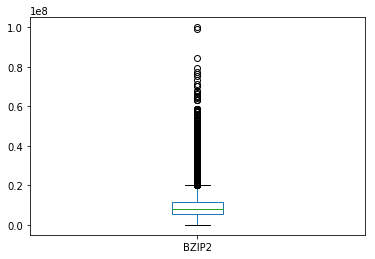

```python
import os
import pandas as pd
import numpy as np
import matplotlib.pyplot as plt

TUXML_CSV_FILENAME= "/mnt/temp_dd/igrida-fs1/macher/config_bdd60K.csv" # "./config_bdd.csv" # 

# sanity check CSV
with open(TUXML_CSV_FILENAME, "r") as file:
    k = file.readline()
    t = k.split(",")
    s = set(t)
    assert(len(t) == len(s)) # unique number of options/features/column names

# parsing for real with pandas 
rawtuxdata = pd.read_csv(open(TUXML_CSV_FILENAME, "r"))

basic_head = ["cid", "time", "date"] # "compile"
size_methods = ["vmlinux", "GZIP-bzImage", "GZIP-vmlinux", "GZIP", "BZIP2-bzImage", 
              "BZIP2-vmlinux", "BZIP2", "LZMA-bzImage", "LZMA-vmlinux", "LZMA", "XZ-bzImage", "XZ-vmlinux", "XZ", 
              "LZO-bzImage", "LZO-vmlinux", "LZO", "LZ4-bzImage", "LZ4-vmlinux", "LZ4"]


### basic stats about options and remove of unique values 
## could be improved 

tri_state_values = ['y', 'n', 'm']

ftuniques = []
freq_ymn_features = []
non_tristate_options = []

for col in rawtuxdata:
    ft = rawtuxdata[col]    
    # eg always "y"
    if len(ft.unique()) == 1:
        ftuniques.append(col)
    # only tri-state values (y, n, m) (possible TODO: handle numerical/string options)    
    elif all(x in tri_state_values for x in ft.unique()):     #len(ft.unique()) == 3: 
        freq = ft.value_counts(normalize=True)
        freqy = 0
        freqn = 0
        freqm = 0
        if ('y' in freq.index):
            freqy = freq['y']
        if ('n' in freq.index):
            freqn = freq['n']
        if ('m' in freq.index):
            freqm = freq['m']
        freq_ymn_features.append((col, freqy, freqm, freqn))
    else:
        if not (col in size_methods): 
            non_tristate_options.append(col)
        

### TODO: we want to keep all quantitative values!
# non_tristate_options.remove('LZO') # ('vmlinux')

# we want to keep measurements (that are not tristate ;)) 
# non_tristate_options = list(set(non_tristate_options) - set(size_methods))

#### print options with unique values
# options with only one value eg always "y"
#i = 0
#for ft in ftuniques:
#    print(ft + " (" + str(i) + ")")
#    i = i + 1

print("Original size (#configs/#options) of the dataset " + str(rawtuxdata.shape))
print ("Number of options with only one value (eg always y): " + str(pd.DataFrame(ftuniques).shape))

# maybe we can drop options with only one unique value (no interest for machine learning)
# TODO: maybe we can rely on more traditional feature reduction techniques
# TODO: need to think about *when* to apply the removal 
rawtuxdata.drop(columns=ftuniques,inplace=True) 
## non_tristate_options include basic stuff like date, time, cid but also string/numerical options
print ("Non tri-state value options (eg string or integer or hybrid values): " 
       + str(pd.DataFrame(non_tristate_options).shape) + " ") 
#      + str(pd.DataFrame(non_tristate_options)))


print ("Predictor variables: " + str(rawtuxdata.drop(columns=non_tristate_options).columns.size))
# frequency of y, m, and n values 
#plt.figure()
#pd.DataFrame(freq_ymn_features, columns=["feature", "freqy", "freqm", "freqn"]).plot(kind='hist', alpha=0.8) #plot()
#plt.show()


    


```

    /usr/lib/python3/dist-packages/IPython/core/interactiveshell.py:2718: DtypeWarning: Columns (1150,6015,6026,6717,7350,7676,7726,8507,9949,10442) have mixed types. Specify dtype option on import or set low_memory=False.
      interactivity=interactivity, compiler=compiler, result=result)


    Original size (#configs/#options) of the dataset (53910, 12798)
    Number of options with only one value (eg always y): (2900, 1)
    Non tri-state value options (eg string or integer or hybrid values): (173, 1) 
    Predictor variables: 9725


```python
'X86_64' in ftuniques, 'DEBUG_INFO' in ftuniques, 'GCOV_PROFILE_ALL' in ftuniques, 'KASAN' in ftuniques, 'UBSAN_SANITIZE_ALL' in ftuniques, 'RELOCATABLE' in ftuniques, 'XFS_DEBUG' in ftuniques, 'AIC7XXX_BUILD_FIRMWARE' in ftuniques, 'AIC79XX_BUILD_FIRMWARE' in ftuniques, 'WANXL_BUILD_FIRMWARE' in ftuniques
```


    (False, False, False, False, False, False, False, False, False, False)


```python
if 'RELOCATABLE' in rawtuxdata.columns:
    print(rawtuxdata.query("RELOCATABLE == 'y'")[['cid', 'RELOCATABLE']], rawtuxdata.query("RELOCATABLE == 'y'").shape)
```

             cid RELOCATABLE
    0      40000           y
    1      40001           y
    5      40005           y
    7      40007           y
    9      40009           y
    10     40010           y
    11     40011           y
    12     40012           y
    13     40013           y
    14     40014           y
    15     40015           y
    16     40016           y
    17     40017           y
    20     40020           y
    21     40021           y
    23     40023           y
    27     40027           y
    28     40028           y
    29     40029           y
    30     40030           y
    31     40031           y
    32     40032           y
    33     40033           y
    34     40034           y
    38     40038           y
    41     40041           y
    43     40043           y
    44     40044           y
    46     40046           y
    47     40047           y
    ...      ...         ...
    53717  94197           y
    53721  94201           y
    53722  94202           y
    53727  94207           y
    53729  94209           y
    53737  94217           y
    53752  94232           y
    53758  94238           y
    53764  94244           y
    53774  94254           y
    53779  94259           y
    53783  94263           y
    53793  94273           y
    53799  94279           y
    53800  94280           y
    53803  94283           y
    53812  94292           y
    53814  94294           y
    53817  94297           y
    53824  94304           y
    53828  94308           y
    53836  94316           y
    53837  94317           y
    53864  94344           y
    53869  94349           y
    53873  94353           y
    53879  94359           y
    53882  94362           y
    53886  94366           y
    53890  94370           y
    
    [23652 rows x 2 columns] (23652, 9898)


```python
print("Data exploration")
```

    Data exploration


```python
# BUGS EXPLORATION
def bug_exploration():
    rawtuxdata.query("AIC7XXX_BUILD_FIRMWARE == 'y'")[['cid', 'vmlinux']]
    rawtuxdata.query("AIC79XX_BUILD_FIRMWARE == 'y'")[['cid', 'vmlinux']]
    rawtuxdata.query("WANXL_BUILD_FIRMWARE == 'y'")[['cid', 'vmlinux']]
    rawtuxdata.query("GENERIC_ALLOCATOR == 'n' & DRM_VBOXVIDEO == 'y'")[['cid', 'vmlinux']]
    rawtuxdata.query("GENERIC_ALLOCATOR == 'y' & DRM_VBOXVIDEO == 'y'")[['cid', 'vmlinux']]
    rawtuxdata.query("GENERIC_ALLOCATOR == 'n' & DRM_VBOXVIDEO == 'm'")[['cid', 'vmlinux']]
    return rawtuxdata.query("DRM_VBOXVIDEO == 'y'")[['cid', 'vmlinux']]

#bug_exploration()


```


```python
#rawtuxdata[rawtuxdata['X86_64'] == 'n']
#rawtuxdata.query("X86_64 == 'n'")
```


```python
#rawtuxdata[(rawtuxdata['DEBUG_INFO'] == 'n') & (rawtuxdata['GCOV_PROFILE_ALL'] == 'n') & (rawtuxdata['KASAN'] == 'n') & (rawtuxdata['MODULES'] == 'y')]
# rawtuxdata.query("(DEBUG_INFO == 'n') & (GCOV_PROFILE_ALL == 'n') & (KASAN == 'n') & (MODULES == 'y')")
#rawtuxdata.query("(DEBUG_INFO == 'n') & (GCOV_PROFILE_ALL == 'n') & (KASAN == 'n')").shape, rawtuxdata.shape

```


```python
#rawtuxdata[rawtuxdata['vmlinux'] == 1168072][['cid', 'CC_OPTIMIZE_FOR_SIZE', 'DEBUG_INFO_DWARF4', 'KASAN', 'UBSAN_ALIGNMENT', 'X86_NEED_RELOCS', 'RANDOMIZE_BASE', 'GCOV_PROFILE_ALL', 'UBSAN_SANITIZE_ALL', 'DEBUG_INFO', 'MODULES', 'DEBUG_INFO_REDUCED', 'DEBUG_INFO_SPLIT']]
tiny_data = rawtuxdata.query("vmlinux == 1168072") #tiny config for X86_32
#if (len(tiny_data) > 0):
#    print(tiny_data[['cid', 'CC_OPTIMIZE_FOR_SIZE', 'DEBUG_INFO_DWARF4', 'KASAN', 'UBSAN_ALIGNMENT', 'X86_NEED_RELOCS', 'RANDOMIZE_BASE', 'GCOV_PROFILE_ALL', 'UBSAN_SANITIZE_ALL', 'DEBUG_INFO', 'MODULES', 'DEBUG_INFO_REDUCED', 'DEBUG_INFO_SPLIT']])
```


```python
#rawtuxdata[rawtuxdata['vmlinux'] == -1]
rawtuxdata.query("vmlinux == -1")
```


<div>
<style scoped>
    .dataframe tbody tr th:only-of-type {
        vertical-align: middle;
    }

    .dataframe tbody tr th {
        vertical-align: top;
    }

    .dataframe thead th {
        text-align: right;
    }
</style>
<table border="1" class="dataframe">
  <thead>
    <tr style="text-align: right;">
      <th></th>
      <th>cid</th>
      <th>date</th>
      <th>time</th>
      <th>vmlinux</th>
      <th>GZIP-bzImage</th>
      <th>GZIP-vmlinux</th>
      <th>GZIP</th>
      <th>BZIP2-bzImage</th>
      <th>BZIP2-vmlinux</th>
      <th>BZIP2</th>
      <th>...</th>
      <th>SND_SOC_INTEL_SKL_NAU88L25_SSM4567_MACH</th>
      <th>APDS9960</th>
      <th>ARCH_SUPPORTS_INT128</th>
      <th>SLABINFO</th>
      <th>MICROCODE_AMD</th>
      <th>ISDN_DRV_HISAX</th>
      <th>CHARGER_BQ24190</th>
      <th>SND_SOC_NAU8825</th>
      <th>BH1750</th>
      <th>NETWORK_FILESYSTEMS</th>
    </tr>
  </thead>
  <tbody>
    <tr>
      <th>25</th>
      <td>40025</td>
      <td>2018-06-14 00:39:15</td>
      <td>610.609</td>
      <td>-1</td>
      <td>-1</td>
      <td>-1</td>
      <td>-1</td>
      <td>-1</td>
      <td>-1</td>
      <td>-1</td>
      <td>...</td>
      <td>n</td>
      <td>m</td>
      <td>y</td>
      <td>n</td>
      <td>n</td>
      <td>n</td>
      <td>m</td>
      <td>n</td>
      <td>n</td>
      <td>n</td>
    </tr>
    <tr>
      <th>41</th>
      <td>40041</td>
      <td>2018-06-14 00:40:59</td>
      <td>1300.550</td>
      <td>-1</td>
      <td>-1</td>
      <td>-1</td>
      <td>-1</td>
      <td>-1</td>
      <td>-1</td>
      <td>-1</td>
      <td>...</td>
      <td>n</td>
      <td>m</td>
      <td>y</td>
      <td>n</td>
      <td>n</td>
      <td>n</td>
      <td>n</td>
      <td>n</td>
      <td>m</td>
      <td>y</td>
    </tr>
    <tr>
      <th>104</th>
      <td>40104</td>
      <td>2018-06-14 00:48:01</td>
      <td>304.353</td>
      <td>-1</td>
      <td>-1</td>
      <td>-1</td>
      <td>-1</td>
      <td>-1</td>
      <td>-1</td>
      <td>-1</td>
      <td>...</td>
      <td>n</td>
      <td>m</td>
      <td>y</td>
      <td>n</td>
      <td>y</td>
      <td>n</td>
      <td>n</td>
      <td>n</td>
      <td>m</td>
      <td>n</td>
    </tr>
    <tr>
      <th>113</th>
      <td>40113</td>
      <td>2018-06-14 00:49:13</td>
      <td>218.127</td>
      <td>-1</td>
      <td>-1</td>
      <td>-1</td>
      <td>-1</td>
      <td>-1</td>
      <td>-1</td>
      <td>-1</td>
      <td>...</td>
      <td>n</td>
      <td>n</td>
      <td>y</td>
      <td>n</td>
      <td>n</td>
      <td>n</td>
      <td>y</td>
      <td>n</td>
      <td>m</td>
      <td>n</td>
    </tr>
    <tr>
      <th>147</th>
      <td>40147</td>
      <td>2018-06-14 00:52:35</td>
      <td>293.928</td>
      <td>-1</td>
      <td>-1</td>
      <td>-1</td>
      <td>-1</td>
      <td>-1</td>
      <td>-1</td>
      <td>-1</td>
      <td>...</td>
      <td>n</td>
      <td>y</td>
      <td>y</td>
      <td>n</td>
      <td>n</td>
      <td>n</td>
      <td>n</td>
      <td>n</td>
      <td>y</td>
      <td>y</td>
    </tr>
    <tr>
      <th>158</th>
      <td>40158</td>
      <td>2018-06-14 00:54:41</td>
      <td>271.530</td>
      <td>-1</td>
      <td>-1</td>
      <td>-1</td>
      <td>-1</td>
      <td>-1</td>
      <td>-1</td>
      <td>-1</td>
      <td>...</td>
      <td>n</td>
      <td>m</td>
      <td>y</td>
      <td>y</td>
      <td>n</td>
      <td>n</td>
      <td>n</td>
      <td>n</td>
      <td>m</td>
      <td>y</td>
    </tr>
    <tr>
      <th>197</th>
      <td>40197</td>
      <td>2018-06-14 00:58:34</td>
      <td>663.868</td>
      <td>-1</td>
      <td>-1</td>
      <td>-1</td>
      <td>-1</td>
      <td>-1</td>
      <td>-1</td>
      <td>-1</td>
      <td>...</td>
      <td>n</td>
      <td>n</td>
      <td>y</td>
      <td>n</td>
      <td>n</td>
      <td>n</td>
      <td>n</td>
      <td>n</td>
      <td>y</td>
      <td>n</td>
    </tr>
    <tr>
      <th>225</th>
      <td>40225</td>
      <td>2018-06-14 01:01:14</td>
      <td>534.840</td>
      <td>-1</td>
      <td>-1</td>
      <td>-1</td>
      <td>-1</td>
      <td>-1</td>
      <td>-1</td>
      <td>-1</td>
      <td>...</td>
      <td>n</td>
      <td>m</td>
      <td>y</td>
      <td>y</td>
      <td>n</td>
      <td>n</td>
      <td>y</td>
      <td>n</td>
      <td>n</td>
      <td>n</td>
    </tr>
    <tr>
      <th>253</th>
      <td>40253</td>
      <td>2018-06-14 01:04:36</td>
      <td>476.935</td>
      <td>-1</td>
      <td>-1</td>
      <td>-1</td>
      <td>-1</td>
      <td>-1</td>
      <td>-1</td>
      <td>-1</td>
      <td>...</td>
      <td>n</td>
      <td>y</td>
      <td>y</td>
      <td>y</td>
      <td>n</td>
      <td>n</td>
      <td>n</td>
      <td>n</td>
      <td>y</td>
      <td>n</td>
    </tr>
    <tr>
      <th>264</th>
      <td>40264</td>
      <td>2018-06-14 01:06:04</td>
      <td>307.815</td>
      <td>-1</td>
      <td>-1</td>
      <td>-1</td>
      <td>-1</td>
      <td>-1</td>
      <td>-1</td>
      <td>-1</td>
      <td>...</td>
      <td>y</td>
      <td>y</td>
      <td>y</td>
      <td>n</td>
      <td>n</td>
      <td>y</td>
      <td>y</td>
      <td>y</td>
      <td>y</td>
      <td>n</td>
    </tr>
    <tr>
      <th>276</th>
      <td>40276</td>
      <td>2018-06-14 01:07:34</td>
      <td>570.996</td>
      <td>-1</td>
      <td>-1</td>
      <td>-1</td>
      <td>-1</td>
      <td>-1</td>
      <td>-1</td>
      <td>-1</td>
      <td>...</td>
      <td>n</td>
      <td>n</td>
      <td>y</td>
      <td>y</td>
      <td>n</td>
      <td>n</td>
      <td>n</td>
      <td>n</td>
      <td>n</td>
      <td>n</td>
    </tr>
    <tr>
      <th>301</th>
      <td>40301</td>
      <td>2018-06-14 01:09:32</td>
      <td>686.132</td>
      <td>-1</td>
      <td>-1</td>
      <td>-1</td>
      <td>-1</td>
      <td>-1</td>
      <td>-1</td>
      <td>-1</td>
      <td>...</td>
      <td>n</td>
      <td>y</td>
      <td>y</td>
      <td>y</td>
      <td>n</td>
      <td>n</td>
      <td>n</td>
      <td>n</td>
      <td>y</td>
      <td>n</td>
    </tr>
    <tr>
      <th>304</th>
      <td>40304</td>
      <td>2018-06-14 01:09:55</td>
      <td>239.635</td>
      <td>-1</td>
      <td>-1</td>
      <td>-1</td>
      <td>-1</td>
      <td>-1</td>
      <td>-1</td>
      <td>-1</td>
      <td>...</td>
      <td>n</td>
      <td>n</td>
      <td>y</td>
      <td>y</td>
      <td>y</td>
      <td>n</td>
      <td>y</td>
      <td>n</td>
      <td>n</td>
      <td>n</td>
    </tr>
    <tr>
      <th>305</th>
      <td>40305</td>
      <td>2018-06-14 01:09:57</td>
      <td>571.411</td>
      <td>-1</td>
      <td>-1</td>
      <td>-1</td>
      <td>-1</td>
      <td>-1</td>
      <td>-1</td>
      <td>-1</td>
      <td>...</td>
      <td>n</td>
      <td>n</td>
      <td>y</td>
      <td>y</td>
      <td>n</td>
      <td>n</td>
      <td>y</td>
      <td>n</td>
      <td>n</td>
      <td>n</td>
    </tr>
    <tr>
      <th>332</th>
      <td>40332</td>
      <td>2018-06-14 01:12:50</td>
      <td>850.376</td>
      <td>-1</td>
      <td>-1</td>
      <td>-1</td>
      <td>-1</td>
      <td>-1</td>
      <td>-1</td>
      <td>-1</td>
      <td>...</td>
      <td>n</td>
      <td>n</td>
      <td>y</td>
      <td>y</td>
      <td>n</td>
      <td>n</td>
      <td>n</td>
      <td>n</td>
      <td>n</td>
      <td>n</td>
    </tr>
    <tr>
      <th>336</th>
      <td>40336</td>
      <td>2018-06-14 01:13:22</td>
      <td>359.827</td>
      <td>-1</td>
      <td>-1</td>
      <td>-1</td>
      <td>-1</td>
      <td>-1</td>
      <td>-1</td>
      <td>-1</td>
      <td>...</td>
      <td>n</td>
      <td>n</td>
      <td>y</td>
      <td>y</td>
      <td>n</td>
      <td>n</td>
      <td>y</td>
      <td>n</td>
      <td>n</td>
      <td>n</td>
    </tr>
    <tr>
      <th>417</th>
      <td>40417</td>
      <td>2018-06-14 01:22:39</td>
      <td>449.690</td>
      <td>-1</td>
      <td>-1</td>
      <td>-1</td>
      <td>-1</td>
      <td>-1</td>
      <td>-1</td>
      <td>-1</td>
      <td>...</td>
      <td>n</td>
      <td>y</td>
      <td>y</td>
      <td>n</td>
      <td>n</td>
      <td>n</td>
      <td>n</td>
      <td>n</td>
      <td>n</td>
      <td>n</td>
    </tr>
    <tr>
      <th>440</th>
      <td>40440</td>
      <td>2018-06-14 01:24:56</td>
      <td>306.797</td>
      <td>-1</td>
      <td>-1</td>
      <td>-1</td>
      <td>-1</td>
      <td>-1</td>
      <td>-1</td>
      <td>-1</td>
      <td>...</td>
      <td>n</td>
      <td>y</td>
      <td>y</td>
      <td>n</td>
      <td>n</td>
      <td>n</td>
      <td>n</td>
      <td>n</td>
      <td>y</td>
      <td>n</td>
    </tr>
    <tr>
      <th>458</th>
      <td>40458</td>
      <td>2018-06-14 01:26:47</td>
      <td>752.461</td>
      <td>-1</td>
      <td>-1</td>
      <td>-1</td>
      <td>-1</td>
      <td>-1</td>
      <td>-1</td>
      <td>-1</td>
      <td>...</td>
      <td>n</td>
      <td>n</td>
      <td>y</td>
      <td>n</td>
      <td>n</td>
      <td>n</td>
      <td>y</td>
      <td>n</td>
      <td>y</td>
      <td>n</td>
    </tr>
    <tr>
      <th>472</th>
      <td>40472</td>
      <td>2018-06-14 01:28:42</td>
      <td>555.920</td>
      <td>-1</td>
      <td>-1</td>
      <td>-1</td>
      <td>-1</td>
      <td>-1</td>
      <td>-1</td>
      <td>-1</td>
      <td>...</td>
      <td>n</td>
      <td>n</td>
      <td>y</td>
      <td>y</td>
      <td>n</td>
      <td>n</td>
      <td>y</td>
      <td>n</td>
      <td>n</td>
      <td>n</td>
    </tr>
    <tr>
      <th>477</th>
      <td>40477</td>
      <td>2018-06-14 01:29:38</td>
      <td>468.600</td>
      <td>-1</td>
      <td>-1</td>
      <td>-1</td>
      <td>-1</td>
      <td>-1</td>
      <td>-1</td>
      <td>-1</td>
      <td>...</td>
      <td>n</td>
      <td>n</td>
      <td>y</td>
      <td>y</td>
      <td>n</td>
      <td>n</td>
      <td>n</td>
      <td>n</td>
      <td>m</td>
      <td>y</td>
    </tr>
    <tr>
      <th>489</th>
      <td>40489</td>
      <td>2018-06-14 01:31:24</td>
      <td>360.098</td>
      <td>-1</td>
      <td>-1</td>
      <td>-1</td>
      <td>-1</td>
      <td>-1</td>
      <td>-1</td>
      <td>-1</td>
      <td>...</td>
      <td>n</td>
      <td>y</td>
      <td>y</td>
      <td>n</td>
      <td>y</td>
      <td>n</td>
      <td>y</td>
      <td>n</td>
      <td>y</td>
      <td>n</td>
    </tr>
    <tr>
      <th>491</th>
      <td>40491</td>
      <td>2018-06-14 01:31:34</td>
      <td>349.757</td>
      <td>-1</td>
      <td>-1</td>
      <td>-1</td>
      <td>-1</td>
      <td>-1</td>
      <td>-1</td>
      <td>-1</td>
      <td>...</td>
      <td>n</td>
      <td>y</td>
      <td>y</td>
      <td>y</td>
      <td>n</td>
      <td>n</td>
      <td>y</td>
      <td>y</td>
      <td>y</td>
      <td>n</td>
    </tr>
    <tr>
      <th>508</th>
      <td>40508</td>
      <td>2018-06-14 01:33:06</td>
      <td>387.426</td>
      <td>-1</td>
      <td>-1</td>
      <td>-1</td>
      <td>-1</td>
      <td>-1</td>
      <td>-1</td>
      <td>-1</td>
      <td>...</td>
      <td>n</td>
      <td>m</td>
      <td>y</td>
      <td>n</td>
      <td>y</td>
      <td>n</td>
      <td>n</td>
      <td>n</td>
      <td>n</td>
      <td>y</td>
    </tr>
    <tr>
      <th>516</th>
      <td>40516</td>
      <td>2018-06-14 01:34:03</td>
      <td>526.998</td>
      <td>-1</td>
      <td>-1</td>
      <td>-1</td>
      <td>-1</td>
      <td>-1</td>
      <td>-1</td>
      <td>-1</td>
      <td>...</td>
      <td>n</td>
      <td>n</td>
      <td>y</td>
      <td>n</td>
      <td>n</td>
      <td>n</td>
      <td>m</td>
      <td>n</td>
      <td>n</td>
      <td>n</td>
    </tr>
    <tr>
      <th>525</th>
      <td>40525</td>
      <td>2018-06-14 01:34:53</td>
      <td>1026.140</td>
      <td>-1</td>
      <td>-1</td>
      <td>-1</td>
      <td>-1</td>
      <td>-1</td>
      <td>-1</td>
      <td>-1</td>
      <td>...</td>
      <td>n</td>
      <td>n</td>
      <td>y</td>
      <td>n</td>
      <td>n</td>
      <td>n</td>
      <td>n</td>
      <td>n</td>
      <td>n</td>
      <td>y</td>
    </tr>
    <tr>
      <th>538</th>
      <td>40538</td>
      <td>2018-06-14 01:36:42</td>
      <td>329.267</td>
      <td>-1</td>
      <td>-1</td>
      <td>-1</td>
      <td>-1</td>
      <td>-1</td>
      <td>-1</td>
      <td>-1</td>
      <td>...</td>
      <td>n</td>
      <td>n</td>
      <td>y</td>
      <td>y</td>
      <td>n</td>
      <td>y</td>
      <td>y</td>
      <td>n</td>
      <td>n</td>
      <td>n</td>
    </tr>
    <tr>
      <th>563</th>
      <td>40563</td>
      <td>2018-06-14 01:38:58</td>
      <td>476.485</td>
      <td>-1</td>
      <td>-1</td>
      <td>-1</td>
      <td>-1</td>
      <td>-1</td>
      <td>-1</td>
      <td>-1</td>
      <td>...</td>
      <td>n</td>
      <td>m</td>
      <td>y</td>
      <td>n</td>
      <td>y</td>
      <td>n</td>
      <td>n</td>
      <td>n</td>
      <td>m</td>
      <td>y</td>
    </tr>
    <tr>
      <th>576</th>
      <td>40576</td>
      <td>2018-06-14 01:40:23</td>
      <td>1020.910</td>
      <td>-1</td>
      <td>-1</td>
      <td>-1</td>
      <td>-1</td>
      <td>-1</td>
      <td>-1</td>
      <td>-1</td>
      <td>...</td>
      <td>n</td>
      <td>y</td>
      <td>y</td>
      <td>y</td>
      <td>n</td>
      <td>n</td>
      <td>m</td>
      <td>n</td>
      <td>m</td>
      <td>y</td>
    </tr>
    <tr>
      <th>589</th>
      <td>40589</td>
      <td>2018-06-14 01:42:05</td>
      <td>831.822</td>
      <td>-1</td>
      <td>-1</td>
      <td>-1</td>
      <td>-1</td>
      <td>-1</td>
      <td>-1</td>
      <td>-1</td>
      <td>...</td>
      <td>n</td>
      <td>y</td>
      <td>y</td>
      <td>y</td>
      <td>n</td>
      <td>m</td>
      <td>y</td>
      <td>n</td>
      <td>n</td>
      <td>y</td>
    </tr>
    <tr>
      <th>...</th>
      <td>...</td>
      <td>...</td>
      <td>...</td>
      <td>...</td>
      <td>...</td>
      <td>...</td>
      <td>...</td>
      <td>...</td>
      <td>...</td>
      <td>...</td>
      <td>...</td>
      <td>...</td>
      <td>...</td>
      <td>...</td>
      <td>...</td>
      <td>...</td>
      <td>...</td>
      <td>...</td>
      <td>...</td>
      <td>...</td>
      <td>...</td>
    </tr>
    <tr>
      <th>47086</th>
      <td>87566</td>
      <td>2018-07-28 19:52:05</td>
      <td>3040.100</td>
      <td>-1</td>
      <td>-1</td>
      <td>-1</td>
      <td>-1</td>
      <td>-1</td>
      <td>-1</td>
      <td>-1</td>
      <td>...</td>
      <td>y</td>
      <td>y</td>
      <td>y</td>
      <td>y</td>
      <td>y</td>
      <td>n</td>
      <td>y</td>
      <td>y</td>
      <td>y</td>
      <td>n</td>
    </tr>
    <tr>
      <th>47170</th>
      <td>87650</td>
      <td>2018-07-29 03:08:54</td>
      <td>2842.170</td>
      <td>-1</td>
      <td>-1</td>
      <td>-1</td>
      <td>-1</td>
      <td>-1</td>
      <td>-1</td>
      <td>-1</td>
      <td>...</td>
      <td>n</td>
      <td>n</td>
      <td>y</td>
      <td>y</td>
      <td>y</td>
      <td>n</td>
      <td>y</td>
      <td>n</td>
      <td>n</td>
      <td>n</td>
    </tr>
    <tr>
      <th>47660</th>
      <td>88140</td>
      <td>2018-07-30 11:19:22</td>
      <td>474.292</td>
      <td>-1</td>
      <td>-1</td>
      <td>-1</td>
      <td>-1</td>
      <td>-1</td>
      <td>-1</td>
      <td>-1</td>
      <td>...</td>
      <td>n</td>
      <td>n</td>
      <td>y</td>
      <td>y</td>
      <td>n</td>
      <td>n</td>
      <td>y</td>
      <td>n</td>
      <td>n</td>
      <td>n</td>
    </tr>
    <tr>
      <th>47672</th>
      <td>88152</td>
      <td>2018-07-30 11:22:40</td>
      <td>639.324</td>
      <td>-1</td>
      <td>-1</td>
      <td>-1</td>
      <td>-1</td>
      <td>-1</td>
      <td>-1</td>
      <td>-1</td>
      <td>...</td>
      <td>n</td>
      <td>y</td>
      <td>y</td>
      <td>y</td>
      <td>y</td>
      <td>n</td>
      <td>y</td>
      <td>n</td>
      <td>y</td>
      <td>n</td>
    </tr>
    <tr>
      <th>47772</th>
      <td>88252</td>
      <td>2018-07-30 11:47:14</td>
      <td>373.653</td>
      <td>-1</td>
      <td>-1</td>
      <td>-1</td>
      <td>-1</td>
      <td>-1</td>
      <td>-1</td>
      <td>-1</td>
      <td>...</td>
      <td>y</td>
      <td>n</td>
      <td>y</td>
      <td>y</td>
      <td>n</td>
      <td>n</td>
      <td>y</td>
      <td>y</td>
      <td>n</td>
      <td>n</td>
    </tr>
    <tr>
      <th>48268</th>
      <td>88748</td>
      <td>2018-07-30 13:55:54</td>
      <td>713.699</td>
      <td>-1</td>
      <td>-1</td>
      <td>-1</td>
      <td>-1</td>
      <td>-1</td>
      <td>-1</td>
      <td>-1</td>
      <td>...</td>
      <td>n</td>
      <td>y</td>
      <td>y</td>
      <td>y</td>
      <td>n</td>
      <td>n</td>
      <td>y</td>
      <td>n</td>
      <td>y</td>
      <td>n</td>
    </tr>
    <tr>
      <th>48337</th>
      <td>88817</td>
      <td>2018-07-30 14:14:02</td>
      <td>520.940</td>
      <td>-1</td>
      <td>-1</td>
      <td>-1</td>
      <td>-1</td>
      <td>-1</td>
      <td>-1</td>
      <td>-1</td>
      <td>...</td>
      <td>n</td>
      <td>n</td>
      <td>y</td>
      <td>y</td>
      <td>n</td>
      <td>y</td>
      <td>y</td>
      <td>n</td>
      <td>n</td>
      <td>n</td>
    </tr>
    <tr>
      <th>48429</th>
      <td>88909</td>
      <td>2018-07-30 14:39:02</td>
      <td>458.704</td>
      <td>-1</td>
      <td>-1</td>
      <td>-1</td>
      <td>-1</td>
      <td>-1</td>
      <td>-1</td>
      <td>-1</td>
      <td>...</td>
      <td>n</td>
      <td>n</td>
      <td>y</td>
      <td>y</td>
      <td>n</td>
      <td>y</td>
      <td>y</td>
      <td>n</td>
      <td>n</td>
      <td>n</td>
    </tr>
    <tr>
      <th>49097</th>
      <td>89577</td>
      <td>2018-07-30 18:42:28</td>
      <td>792.406</td>
      <td>-1</td>
      <td>-1</td>
      <td>-1</td>
      <td>-1</td>
      <td>-1</td>
      <td>-1</td>
      <td>-1</td>
      <td>...</td>
      <td>n</td>
      <td>y</td>
      <td>y</td>
      <td>n</td>
      <td>y</td>
      <td>n</td>
      <td>y</td>
      <td>n</td>
      <td>y</td>
      <td>n</td>
    </tr>
    <tr>
      <th>49138</th>
      <td>89618</td>
      <td>2018-07-30 18:57:54</td>
      <td>328.483</td>
      <td>-1</td>
      <td>-1</td>
      <td>-1</td>
      <td>-1</td>
      <td>-1</td>
      <td>-1</td>
      <td>-1</td>
      <td>...</td>
      <td>n</td>
      <td>y</td>
      <td>y</td>
      <td>n</td>
      <td>y</td>
      <td>n</td>
      <td>n</td>
      <td>n</td>
      <td>m</td>
      <td>n</td>
    </tr>
    <tr>
      <th>49221</th>
      <td>89701</td>
      <td>2018-07-30 19:34:46</td>
      <td>811.173</td>
      <td>-1</td>
      <td>-1</td>
      <td>-1</td>
      <td>-1</td>
      <td>-1</td>
      <td>-1</td>
      <td>-1</td>
      <td>...</td>
      <td>n</td>
      <td>y</td>
      <td>y</td>
      <td>y</td>
      <td>n</td>
      <td>n</td>
      <td>n</td>
      <td>n</td>
      <td>y</td>
      <td>n</td>
    </tr>
    <tr>
      <th>49277</th>
      <td>89757</td>
      <td>2018-07-30 19:58:09</td>
      <td>2790.040</td>
      <td>-1</td>
      <td>-1</td>
      <td>-1</td>
      <td>-1</td>
      <td>-1</td>
      <td>-1</td>
      <td>-1</td>
      <td>...</td>
      <td>n</td>
      <td>y</td>
      <td>y</td>
      <td>n</td>
      <td>n</td>
      <td>n</td>
      <td>y</td>
      <td>n</td>
      <td>n</td>
      <td>n</td>
    </tr>
    <tr>
      <th>49374</th>
      <td>89854</td>
      <td>2018-07-30 20:46:31</td>
      <td>701.857</td>
      <td>-1</td>
      <td>-1</td>
      <td>-1</td>
      <td>-1</td>
      <td>-1</td>
      <td>-1</td>
      <td>-1</td>
      <td>...</td>
      <td>y</td>
      <td>y</td>
      <td>y</td>
      <td>n</td>
      <td>n</td>
      <td>y</td>
      <td>n</td>
      <td>y</td>
      <td>y</td>
      <td>y</td>
    </tr>
    <tr>
      <th>50026</th>
      <td>90506</td>
      <td>2018-07-31 13:28:32</td>
      <td>397.998</td>
      <td>-1</td>
      <td>-1</td>
      <td>-1</td>
      <td>-1</td>
      <td>-1</td>
      <td>-1</td>
      <td>-1</td>
      <td>...</td>
      <td>n</td>
      <td>n</td>
      <td>y</td>
      <td>n</td>
      <td>n</td>
      <td>n</td>
      <td>n</td>
      <td>n</td>
      <td>n</td>
      <td>n</td>
    </tr>
    <tr>
      <th>50230</th>
      <td>90710</td>
      <td>2018-07-31 14:55:26</td>
      <td>762.980</td>
      <td>-1</td>
      <td>-1</td>
      <td>-1</td>
      <td>-1</td>
      <td>-1</td>
      <td>-1</td>
      <td>-1</td>
      <td>...</td>
      <td>n</td>
      <td>y</td>
      <td>y</td>
      <td>n</td>
      <td>n</td>
      <td>n</td>
      <td>y</td>
      <td>n</td>
      <td>y</td>
      <td>n</td>
    </tr>
    <tr>
      <th>50495</th>
      <td>90975</td>
      <td>2018-07-31 16:34:17</td>
      <td>557.827</td>
      <td>-1</td>
      <td>-1</td>
      <td>-1</td>
      <td>-1</td>
      <td>-1</td>
      <td>-1</td>
      <td>-1</td>
      <td>...</td>
      <td>n</td>
      <td>n</td>
      <td>y</td>
      <td>n</td>
      <td>n</td>
      <td>n</td>
      <td>y</td>
      <td>n</td>
      <td>n</td>
      <td>n</td>
    </tr>
    <tr>
      <th>50574</th>
      <td>91054</td>
      <td>2018-07-31 17:00:55</td>
      <td>563.142</td>
      <td>-1</td>
      <td>-1</td>
      <td>-1</td>
      <td>-1</td>
      <td>-1</td>
      <td>-1</td>
      <td>-1</td>
      <td>...</td>
      <td>n</td>
      <td>n</td>
      <td>y</td>
      <td>y</td>
      <td>y</td>
      <td>n</td>
      <td>n</td>
      <td>n</td>
      <td>y</td>
      <td>n</td>
    </tr>
    <tr>
      <th>50709</th>
      <td>91189</td>
      <td>2018-07-31 17:36:52</td>
      <td>614.056</td>
      <td>-1</td>
      <td>-1</td>
      <td>-1</td>
      <td>-1</td>
      <td>-1</td>
      <td>-1</td>
      <td>-1</td>
      <td>...</td>
      <td>n</td>
      <td>n</td>
      <td>y</td>
      <td>y</td>
      <td>n</td>
      <td>n</td>
      <td>n</td>
      <td>n</td>
      <td>n</td>
      <td>n</td>
    </tr>
    <tr>
      <th>50811</th>
      <td>91291</td>
      <td>2018-07-31 18:05:21</td>
      <td>2063.690</td>
      <td>-1</td>
      <td>-1</td>
      <td>-1</td>
      <td>-1</td>
      <td>-1</td>
      <td>-1</td>
      <td>-1</td>
      <td>...</td>
      <td>n</td>
      <td>n</td>
      <td>y</td>
      <td>n</td>
      <td>n</td>
      <td>n</td>
      <td>m</td>
      <td>n</td>
      <td>n</td>
      <td>y</td>
    </tr>
    <tr>
      <th>51153</th>
      <td>91633</td>
      <td>2018-07-31 19:33:00</td>
      <td>647.727</td>
      <td>-1</td>
      <td>-1</td>
      <td>-1</td>
      <td>-1</td>
      <td>-1</td>
      <td>-1</td>
      <td>-1</td>
      <td>...</td>
      <td>y</td>
      <td>y</td>
      <td>y</td>
      <td>n</td>
      <td>n</td>
      <td>n</td>
      <td>n</td>
      <td>y</td>
      <td>y</td>
      <td>n</td>
    </tr>
    <tr>
      <th>51262</th>
      <td>91742</td>
      <td>2018-07-31 19:58:26</td>
      <td>581.922</td>
      <td>-1</td>
      <td>-1</td>
      <td>-1</td>
      <td>-1</td>
      <td>-1</td>
      <td>-1</td>
      <td>-1</td>
      <td>...</td>
      <td>n</td>
      <td>n</td>
      <td>y</td>
      <td>y</td>
      <td>n</td>
      <td>n</td>
      <td>n</td>
      <td>n</td>
      <td>y</td>
      <td>n</td>
    </tr>
    <tr>
      <th>51382</th>
      <td>91862</td>
      <td>2018-07-31 20:29:41</td>
      <td>1787.870</td>
      <td>-1</td>
      <td>-1</td>
      <td>-1</td>
      <td>-1</td>
      <td>-1</td>
      <td>-1</td>
      <td>-1</td>
      <td>...</td>
      <td>n</td>
      <td>n</td>
      <td>y</td>
      <td>y</td>
      <td>y</td>
      <td>n</td>
      <td>n</td>
      <td>n</td>
      <td>n</td>
      <td>n</td>
    </tr>
    <tr>
      <th>51592</th>
      <td>92072</td>
      <td>2018-07-31 21:22:43</td>
      <td>673.648</td>
      <td>-1</td>
      <td>-1</td>
      <td>-1</td>
      <td>-1</td>
      <td>-1</td>
      <td>-1</td>
      <td>-1</td>
      <td>...</td>
      <td>n</td>
      <td>n</td>
      <td>y</td>
      <td>y</td>
      <td>n</td>
      <td>n</td>
      <td>n</td>
      <td>n</td>
      <td>n</td>
      <td>n</td>
    </tr>
    <tr>
      <th>51640</th>
      <td>92120</td>
      <td>2018-07-31 21:37:08</td>
      <td>701.833</td>
      <td>-1</td>
      <td>-1</td>
      <td>-1</td>
      <td>-1</td>
      <td>-1</td>
      <td>-1</td>
      <td>-1</td>
      <td>...</td>
      <td>n</td>
      <td>n</td>
      <td>y</td>
      <td>y</td>
      <td>n</td>
      <td>n</td>
      <td>y</td>
      <td>n</td>
      <td>n</td>
      <td>n</td>
    </tr>
    <tr>
      <th>52358</th>
      <td>92838</td>
      <td>2018-08-01 11:04:10</td>
      <td>837.337</td>
      <td>-1</td>
      <td>-1</td>
      <td>-1</td>
      <td>-1</td>
      <td>-1</td>
      <td>-1</td>
      <td>-1</td>
      <td>...</td>
      <td>n</td>
      <td>y</td>
      <td>y</td>
      <td>y</td>
      <td>n</td>
      <td>n</td>
      <td>y</td>
      <td>n</td>
      <td>y</td>
      <td>n</td>
    </tr>
    <tr>
      <th>52791</th>
      <td>93271</td>
      <td>2018-08-01 13:23:31</td>
      <td>953.664</td>
      <td>-1</td>
      <td>-1</td>
      <td>-1</td>
      <td>-1</td>
      <td>-1</td>
      <td>-1</td>
      <td>-1</td>
      <td>...</td>
      <td>n</td>
      <td>y</td>
      <td>y</td>
      <td>y</td>
      <td>y</td>
      <td>n</td>
      <td>n</td>
      <td>n</td>
      <td>n</td>
      <td>n</td>
    </tr>
    <tr>
      <th>52936</th>
      <td>93416</td>
      <td>2018-08-01 14:03:30</td>
      <td>480.606</td>
      <td>-1</td>
      <td>-1</td>
      <td>-1</td>
      <td>-1</td>
      <td>-1</td>
      <td>-1</td>
      <td>-1</td>
      <td>...</td>
      <td>n</td>
      <td>y</td>
      <td>y</td>
      <td>n</td>
      <td>n</td>
      <td>n</td>
      <td>n</td>
      <td>n</td>
      <td>n</td>
      <td>n</td>
    </tr>
    <tr>
      <th>53194</th>
      <td>93674</td>
      <td>2018-08-01 15:29:55</td>
      <td>888.518</td>
      <td>-1</td>
      <td>-1</td>
      <td>-1</td>
      <td>-1</td>
      <td>-1</td>
      <td>-1</td>
      <td>-1</td>
      <td>...</td>
      <td>n</td>
      <td>n</td>
      <td>y</td>
      <td>y</td>
      <td>y</td>
      <td>m</td>
      <td>y</td>
      <td>n</td>
      <td>m</td>
      <td>y</td>
    </tr>
    <tr>
      <th>53244</th>
      <td>93724</td>
      <td>2018-08-01 15:45:32</td>
      <td>1541.690</td>
      <td>-1</td>
      <td>-1</td>
      <td>-1</td>
      <td>-1</td>
      <td>-1</td>
      <td>-1</td>
      <td>-1</td>
      <td>...</td>
      <td>n</td>
      <td>n</td>
      <td>y</td>
      <td>n</td>
      <td>n</td>
      <td>n</td>
      <td>y</td>
      <td>n</td>
      <td>n</td>
      <td>n</td>
    </tr>
    <tr>
      <th>53489</th>
      <td>93969</td>
      <td>2018-08-01 16:50:16</td>
      <td>282.367</td>
      <td>-1</td>
      <td>-1</td>
      <td>-1</td>
      <td>-1</td>
      <td>-1</td>
      <td>-1</td>
      <td>-1</td>
      <td>...</td>
      <td>n</td>
      <td>y</td>
      <td>y</td>
      <td>n</td>
      <td>n</td>
      <td>n</td>
      <td>y</td>
      <td>n</td>
      <td>n</td>
      <td>n</td>
    </tr>
  </tbody>
</table>
<p>2935 rows × 9898 columns</p>
</div>


```python
#rawtuxdata[rawtuxdata['vmlinux'] == 1168072]['MODULES']
rawtuxdata.query("vmlinux == 1168072")['MODULES'] #tiny config for X86_32
```


    16272    n
    16273    n
    16274    n
    30287    n
    30291    n
    30300    n
    30301    n
    46237    n
    Name: MODULES, dtype: object


```python
# playing a bit with the data 
rawtuxdata.dtypes
# 'DEBUG_INFOO' in list(pd.DataFrame(non_tristate_options)[0]) # 
# tuxdata['DEBUG_INFO'].unique()
#tuxdata['OUTPUT_FORMAT'].dtypes
#tuxdata['DEFAULT_HOSTNAME'].unique()

#rawtuxdata[:5]
rawtuxdata[:20]['vmlinux']
#tuxdata[:5]['CONFIG_DEBUG_INFO']
#tuxdata['ARCH_HAS_SG_CHAIN'].unique()
#tuxdata['ARCH_HAS_SG_CHAIN'].astype('category')
```


    0      64609912
    1      99376784
    2      50206112
    3      50684064
    4      21991648
    5     145021888
    6      15892120
    7      59728112
    8      54816520
    9      21209240
    10     76329552
    11     18178920
    12     26611096
    13     31767656
    14     29977088
    15     37789808
    16     92816320
    17    224313360
    18     64802928
    19     38711576
    Name: vmlinux, dtype: int64


```python
rawtuxdata.shape, rawtuxdata.query("vmlinux != -1").shape
```


    ((53910, 9898), (50975, 9898))


```python
print("some configurations may have X86_32 (coz we have tested/tried some options and there are in the database)")
# we only keep X86_64 configurations
#rawtuxdata = rawtuxdata[rawtuxdata['X86_64'] == 'y'] ### TODO: I've impression it's not the most effective way (wrt memory) to filter 
if 'X86_64' in rawtuxdata.columns:
    print(rawtuxdata['X86_64'].describe())
    rawtuxdata.query("X86_64 == 'y'", inplace=True)
rawtuxdata.info(memory_usage='deep')
```

    some configurations may have X86_32 (coz we have tested/tried some options and there are in the database)
    count     53910
    unique        2
    top           y
    freq      53876
    Name: X86_64, dtype: object
    <class 'pandas.core.frame.DataFrame'>
    Int64Index: 53876 entries, 0 to 53909
    Columns: 9898 entries, cid to NETWORK_FILESYSTEMS
    dtypes: float64(1), int64(153), object(9744)
    memory usage: 32.3 GB


```python
from sklearn.preprocessing import *
from sklearn.metrics import mean_squared_error, r2_score, mean_absolute_error
from sklearn.model_selection import train_test_split
from sklearn.ensemble import ExtraTreesRegressor, RandomForestRegressor, GradientBoostingClassifier
from sklearn.feature_selection import SelectFromModel
from sklearn.linear_model import LassoCV
from sklearn.pipeline import Pipeline
from sklearn import linear_model
from sklearn import svm
from sklearn.metrics import accuracy_score, f1_score, precision_score, recall_score
from sklearn import tree
import graphviz 


LEARN_COMPILATION_SUCCESS = False # costly in time and space 
compilation_status_column_name = 'compile_success'

def encode_data_compilation(rawtuxdata):
    lae = LabelEncoder()
    # we save quantitative values we want (here vmlinux, TODO: generalize)
    # the key idea is that the labelling encoder should not be applied to this kind of values (only to predictor variables!)
    # vml = rawtuxdata['LZO'] # rawtuxdata['vmlinux'] 
    o_sizes = rawtuxdata[size_methods]

    # we remove non tri state options, but TODO there are perhaps some interesting options (numerical or string) here
    #tuxdata = rawtuxdata.drop(columns=non_tristate_options).drop(columns=['vmlinux']).apply(le.fit_transform)
    tuxdata_for_compilation = rawtuxdata.drop(columns=non_tristate_options).drop(columns=size_methods).apply(lae.fit_transform)

    #tuxdata['vmlinux'] = vml 
    tuxdata_for_compilation[size_methods] = o_sizes
    # we can ue vmlinux since it has been restored thanks to previous line
    tuxdata_for_compilation[compilation_status_column_name] = tuxdata_for_compilation['vmlinux'] != -1
    return tuxdata_for_compilation

def learn_compilation_success(tuxdata_for_compilation):
    TESTING_SIZE=0.3 
    X_train, X_test, y_train, y_test = train_test_split(tuxdata_for_compilation.drop(columns=size_methods).drop(columns=compilation_status_column_name), tuxdata_for_compilation[compilation_status_column_name], test_size=TESTING_SIZE, random_state=0)  
    clf = tree.DecisionTreeClassifier() #GradientBoostingClassifier(n_estimators=100) #RandomForestRegressor(n_estimators=100) #   #GradientBoostingRegressor(n_estimators=100)  
    clf.fit(X_train, y_train)
    y_pred = clf.predict(X_test)
    importances = clf.feature_importances_
    indices = np.argsort(importances)[::-1]    

    TOP_FT_IMPORTANCE=20
    print("Feature ranking: " + "top (" + str(TOP_FT_IMPORTANCE) + ")")
    for f in range(TOP_FT_IMPORTANCE): # len(indices)
        print("%d. feature %s %d (%f)" % (f + 1, tuxdata_for_compilation.columns[indices[f]], indices[f], importances[indices[f]]))
   
    
    dot_data = tree.export_graphviz(clf, out_file=None, 
                         feature_names=tuxdata_for_compilation.drop(columns=size_methods).drop(columns=compilation_status_column_name).columns,  
                         filled=True, rounded=True,
                         special_characters=True)  
    graph = graphviz.Source(dot_data)  
    graph.render("TUXML compilation sucess")
    
    acc = accuracy_score (y_test, y_pred)
    prec = precision_score (y_test, y_pred)
    reca = recall_score (y_test, y_pred)
    f1 = f1_score (y_test, y_pred)
    print("Accuracy score: %.2f" % (acc))
    print("Precision score: %.2f" % (prec))
    print("Recall score: %.2f" % (reca))
    print("F1 score: %.2f" % (f1))

if (LEARN_COMPILATION_SUCCESS):
    tuxdata_for_compilation = encode_data_compilation(rawtuxdata)
    tuxdata_for_compilation [compilation_status_column_name].describe()
    learn_compilation_success(tuxdata_for_compilation)
    del tuxdata_for_compilation
```


```python
#rawtuxdata.query("vmlinux == -1")[['cid', 'AIC7XXX_BUILD_FIRMWARE', 'AIC79XX_BUILD_FIRMWARE', 'IPVTAP', 'WANXL_BUILD_FIRMWARE', 'TCIC']]

```


```python
# aka MAPE
def mean_relative_error(y_true, y_pred): 
    return np.mean(np.abs((y_true - y_pred) / y_true)) * 100

```


```python
# remove entries with same configurations
print(str(len(rawtuxdata)) + " before the removal of some entries (those with same configurations)")
# tuxdata.drop_duplicates(subset=tuxdata.columns.difference(['vmlinux']), inplace=True)
rawtuxdata.drop_duplicates(subset=rawtuxdata.columns.difference(size_methods).difference(basic_head), inplace=True)
print(str(len(rawtuxdata)) + " after the removal of some entries (those with same configurations)")

#n_failures = len(tuxdata[~np.isnan(tuxdata['vmlinux'])])
#n_failures = len(rawtuxdata.query("vmlinux != -1")) #len(tuxdata[np.isnan(tuxdata['vmlinux'])])
#print(str(n_failures) + " non-failures out of " + str(len(rawtuxdata)))

#tuxdata = tuxdata[~np.isnan(tuxdata['vmlinux'])]
#rawtuxdata = rawtuxdata[rawtuxdata['vmlinux'] != -1] #tuxdata[~np.isnan(tuxdata['vmlinux'])]
rawtuxdata.query("(vmlinux != -1) & (vmlinux != 0)", inplace=True)
print(str(len(rawtuxdata)) + " after the removal of configurations that do NOT compile")

```

    53876 before the removal of some entries (those with same configurations)
    53821 after the removal of some entries (those with same configurations)
    50908 after the removal of configurations that do NOT compile


```python
rawtuxdata.query("vmlinux == 1168072") # tinyconfig with X86_32
```


<div>
<style scoped>
    .dataframe tbody tr th:only-of-type {
        vertical-align: middle;
    }

    .dataframe tbody tr th {
        vertical-align: top;
    }

    .dataframe thead th {
        text-align: right;
    }
</style>
<table border="1" class="dataframe">
  <thead>
    <tr style="text-align: right;">
      <th></th>
      <th>cid</th>
      <th>date</th>
      <th>time</th>
      <th>vmlinux</th>
      <th>GZIP-bzImage</th>
      <th>GZIP-vmlinux</th>
      <th>GZIP</th>
      <th>BZIP2-bzImage</th>
      <th>BZIP2-vmlinux</th>
      <th>BZIP2</th>
      <th>...</th>
      <th>SND_SOC_INTEL_SKL_NAU88L25_SSM4567_MACH</th>
      <th>APDS9960</th>
      <th>ARCH_SUPPORTS_INT128</th>
      <th>SLABINFO</th>
      <th>MICROCODE_AMD</th>
      <th>ISDN_DRV_HISAX</th>
      <th>CHARGER_BQ24190</th>
      <th>SND_SOC_NAU8825</th>
      <th>BH1750</th>
      <th>NETWORK_FILESYSTEMS</th>
    </tr>
  </thead>
  <tbody>
  </tbody>
</table>
<p>0 rows × 9898 columns</p>
</div>


```python
rawtuxdata.query("vmlinux == 7317008") # tiny config for X86_64
```


<div>
<style scoped>
    .dataframe tbody tr th:only-of-type {
        vertical-align: middle;
    }

    .dataframe tbody tr th {
        vertical-align: top;
    }

    .dataframe thead th {
        text-align: right;
    }
</style>
<table border="1" class="dataframe">
  <thead>
    <tr style="text-align: right;">
      <th></th>
      <th>cid</th>
      <th>date</th>
      <th>time</th>
      <th>vmlinux</th>
      <th>GZIP-bzImage</th>
      <th>GZIP-vmlinux</th>
      <th>GZIP</th>
      <th>BZIP2-bzImage</th>
      <th>BZIP2-vmlinux</th>
      <th>BZIP2</th>
      <th>...</th>
      <th>SND_SOC_INTEL_SKL_NAU88L25_SSM4567_MACH</th>
      <th>APDS9960</th>
      <th>ARCH_SUPPORTS_INT128</th>
      <th>SLABINFO</th>
      <th>MICROCODE_AMD</th>
      <th>ISDN_DRV_HISAX</th>
      <th>CHARGER_BQ24190</th>
      <th>SND_SOC_NAU8825</th>
      <th>BH1750</th>
      <th>NETWORK_FILESYSTEMS</th>
    </tr>
  </thead>
  <tbody>
    <tr>
      <th>33982</th>
      <td>74458</td>
      <td>2018-07-05 16:07:21</td>
      <td>28.7108</td>
      <td>7317008</td>
      <td>646608</td>
      <td>2733176</td>
      <td>501222</td>
      <td>4722128</td>
      <td>6808144</td>
      <td>458568</td>
      <td>...</td>
      <td>n</td>
      <td>n</td>
      <td>y</td>
      <td>n</td>
      <td>n</td>
      <td>n</td>
      <td>n</td>
      <td>n</td>
      <td>n</td>
      <td>n</td>
    </tr>
  </tbody>
</table>
<p>1 rows × 9898 columns</p>
</div>


```python


```


```python
plt.figure()
pd.DataFrame(rawtuxdata['vmlinux']).plot.box()
plt.show(block=False)

plt.figure()
pd.DataFrame(rawtuxdata['LZO']).plot.box()
plt.show(block=False)

plt.figure()
pd.DataFrame(rawtuxdata['BZIP2']).plot.box()
plt.show(block=False)


rawtuxdata['vmlinux'].describe()

```


    <Figure size 432x288 with 0 Axes>


    <Figure size 432x288 with 0 Axes>


    <Figure size 432x288 with 0 Axes>





    count    5.090800e+04
    mean     5.951671e+07
    std      8.292308e+07
    min      7.317008e+06
    25%      2.533070e+07
    50%      3.669975e+07
    75%      5.910926e+07
    max      1.780630e+09
    Name: vmlinux, dtype: float64


```python
rawtuxdata['vmlinux'].sort_values()[:100]
```


    33982     7317008
    41789    10572520
    14992    10786744
    9653     10790352
    35244    10856456
    41192    10857304
    47556    10865408
    3174     10870272
    50318    10889536
    51557    10892608
    6006     10908568
    42479    10918504
    38995    10955056
    51787    10962488
    43140    10981392
    39577    10992912
    18425    10994728
    28532    11035016
    47797    11035128
    20769    11044640
    18448    11064288
    24865    11098984
    27750    11100872
    48773    11105984
    50298    11116560
    42483    11117600
    38307    11120888
    27266    11123472
    45127    11129920
    52693    11133784
               ...   
    49055    11398144
    28960    11398632
    36820    11414584
    2778     11419536
    8661     11420632
    20683    11426320
    15394    11440248
    15919    11447096
    49219    11463608
    41635    11466488
    46371    11469576
    52373    11481176
    52457    11481752
    38902    11488184
    1097     11495296
    7542     11495976
    53712    11497832
    10150    11498032
    41039    11498440
    36628    11502176
    43290    11504128
    30599    11514448
    44479    11525112
    30196    11532960
    49910    11534824
    23046    11538200
    31957    11556216
    46670    11556632
    20594    11559992
    38913    11564176
    Name: vmlinux, Length: 100, dtype: int64


```python
import scipy.stats
import seaborn as sns


def color_negative_positive(val, pcolor="green", ncolor="red"):
    """
    Takes a scalar and returns a string with
    the css property `'color: red'` for negative
    strings, black otherwise.
    """
    color = pcolor if val > 0 else ncolor 
    if val == 0:
        color = 'black' 
    return 'color: %s' % color

compress_methods = ["GZIP", "BZIP2", "LZMA", "XZ", "LZO", "LZ4"]
def compareCompress(size_measure_of_interest): #"" # "-vmlinux" #"-bzImage" # prefix
    rCompressDiff = pd.DataFrame(index=list(map(lambda c: c + "o", compress_methods)) , columns=compress_methods) 
    for compress_method in compress_methods:
        for compress_method2 in compress_methods:
            rCompressDiff.loc[compress_method + "o"][compress_method2] = (np.mean(rawtuxdata[compress_method + size_measure_of_interest] / rawtuxdata[compress_method2 + size_measure_of_interest]) * 100) - 100
    return rCompressDiff

#cmy = sns.light_palette("red", as_cmap=True)
compareCompress("").style.set_caption('Difference (average in percentage) per compression methods').applymap(color_negative_positive)
```


<style  type="text/css" >
    #T_43a1e9e6_96dd_11e8_b184_525400123456row0_col0 {
            color:  black;
        }    #T_43a1e9e6_96dd_11e8_b184_525400123456row0_col1 {
            color:  green;
        }    #T_43a1e9e6_96dd_11e8_b184_525400123456row0_col2 {
            color:  green;
        }    #T_43a1e9e6_96dd_11e8_b184_525400123456row0_col3 {
            color:  green;
        }    #T_43a1e9e6_96dd_11e8_b184_525400123456row0_col4 {
            color:  red;
        }    #T_43a1e9e6_96dd_11e8_b184_525400123456row0_col5 {
            color:  red;
        }    #T_43a1e9e6_96dd_11e8_b184_525400123456row1_col0 {
            color:  red;
        }    #T_43a1e9e6_96dd_11e8_b184_525400123456row1_col1 {
            color:  black;
        }    #T_43a1e9e6_96dd_11e8_b184_525400123456row1_col2 {
            color:  green;
        }    #T_43a1e9e6_96dd_11e8_b184_525400123456row1_col3 {
            color:  green;
        }    #T_43a1e9e6_96dd_11e8_b184_525400123456row1_col4 {
            color:  red;
        }    #T_43a1e9e6_96dd_11e8_b184_525400123456row1_col5 {
            color:  red;
        }    #T_43a1e9e6_96dd_11e8_b184_525400123456row2_col0 {
            color:  red;
        }    #T_43a1e9e6_96dd_11e8_b184_525400123456row2_col1 {
            color:  red;
        }    #T_43a1e9e6_96dd_11e8_b184_525400123456row2_col2 {
            color:  black;
        }    #T_43a1e9e6_96dd_11e8_b184_525400123456row2_col3 {
            color:  green;
        }    #T_43a1e9e6_96dd_11e8_b184_525400123456row2_col4 {
            color:  red;
        }    #T_43a1e9e6_96dd_11e8_b184_525400123456row2_col5 {
            color:  red;
        }    #T_43a1e9e6_96dd_11e8_b184_525400123456row3_col0 {
            color:  red;
        }    #T_43a1e9e6_96dd_11e8_b184_525400123456row3_col1 {
            color:  red;
        }    #T_43a1e9e6_96dd_11e8_b184_525400123456row3_col2 {
            color:  red;
        }    #T_43a1e9e6_96dd_11e8_b184_525400123456row3_col3 {
            color:  black;
        }    #T_43a1e9e6_96dd_11e8_b184_525400123456row3_col4 {
            color:  red;
        }    #T_43a1e9e6_96dd_11e8_b184_525400123456row3_col5 {
            color:  red;
        }    #T_43a1e9e6_96dd_11e8_b184_525400123456row4_col0 {
            color:  red;
        }    #T_43a1e9e6_96dd_11e8_b184_525400123456row4_col1 {
            color:  red;
        }    #T_43a1e9e6_96dd_11e8_b184_525400123456row4_col2 {
            color:  red;
        }    #T_43a1e9e6_96dd_11e8_b184_525400123456row4_col3 {
            color:  green;
        }    #T_43a1e9e6_96dd_11e8_b184_525400123456row4_col4 {
            color:  black;
        }    #T_43a1e9e6_96dd_11e8_b184_525400123456row4_col5 {
            color:  red;
        }    #T_43a1e9e6_96dd_11e8_b184_525400123456row5_col0 {
            color:  red;
        }    #T_43a1e9e6_96dd_11e8_b184_525400123456row5_col1 {
            color:  red;
        }    #T_43a1e9e6_96dd_11e8_b184_525400123456row5_col2 {
            color:  red;
        }    #T_43a1e9e6_96dd_11e8_b184_525400123456row5_col3 {
            color:  green;
        }    #T_43a1e9e6_96dd_11e8_b184_525400123456row5_col4 {
            color:  green;
        }    #T_43a1e9e6_96dd_11e8_b184_525400123456row5_col5 {
            color:  black;
        }</style>  
<table id="T_43a1e9e6_96dd_11e8_b184_525400123456" ><caption>Difference (average in percentage) per compression methods</caption> 
<thead>    <tr> 
        <th class="blank level0" ></th> 
        <th class="col_heading level0 col0" >GZIP</th> 
        <th class="col_heading level0 col1" >BZIP2</th> 
        <th class="col_heading level0 col2" >LZMA</th> 
        <th class="col_heading level0 col3" >XZ</th> 
        <th class="col_heading level0 col4" >LZO</th> 
        <th class="col_heading level0 col5" >LZ4</th> 
    </tr></thead> 
<tbody>    <tr> 
        <th id="T_43a1e9e6_96dd_11e8_b184_525400123456level0_row0" class="row_heading level0 row0" >GZIPo</th> 
        <td id="T_43a1e9e6_96dd_11e8_b184_525400123456row0_col0" class="data row0 col0" >0</td> 
        <td id="T_43a1e9e6_96dd_11e8_b184_525400123456row0_col1" class="data row0 col1" >2.95928</td> 
        <td id="T_43a1e9e6_96dd_11e8_b184_525400123456row0_col2" class="data row0 col2" >24.4634</td> 
        <td id="T_43a1e9e6_96dd_11e8_b184_525400123456row0_col3" class="data row0 col3" >38.2247</td> 
        <td id="T_43a1e9e6_96dd_11e8_b184_525400123456row0_col4" class="data row0 col4" >-10.0202</td> 
        <td id="T_43a1e9e6_96dd_11e8_b184_525400123456row0_col5" class="data row0 col5" >-21596.5</td> 
    </tr>    <tr> 
        <th id="T_43a1e9e6_96dd_11e8_b184_525400123456level0_row1" class="row_heading level0 row1" >BZIP2o</th> 
        <td id="T_43a1e9e6_96dd_11e8_b184_525400123456row1_col0" class="data row1 col0" >-2.80728</td> 
        <td id="T_43a1e9e6_96dd_11e8_b184_525400123456row1_col1" class="data row1 col1" >0</td> 
        <td id="T_43a1e9e6_96dd_11e8_b184_525400123456row1_col2" class="data row1 col2" >20.9728</td> 
        <td id="T_43a1e9e6_96dd_11e8_b184_525400123456row1_col3" class="data row1 col3" >34.3205</td> 
        <td id="T_43a1e9e6_96dd_11e8_b184_525400123456row1_col4" class="data row1 col4" >-12.582</td> 
        <td id="T_43a1e9e6_96dd_11e8_b184_525400123456row1_col5" class="data row1 col5" >-20767.7</td> 
    </tr>    <tr> 
        <th id="T_43a1e9e6_96dd_11e8_b184_525400123456level0_row2" class="row_heading level0 row2" >LZMAo</th> 
        <td id="T_43a1e9e6_96dd_11e8_b184_525400123456row2_col0" class="data row2 col0" >-19.5916</td> 
        <td id="T_43a1e9e6_96dd_11e8_b184_525400123456row2_col1" class="data row2 col1" >-17.2119</td> 
        <td id="T_43a1e9e6_96dd_11e8_b184_525400123456row2_col2" class="data row2 col2" >0</td> 
        <td id="T_43a1e9e6_96dd_11e8_b184_525400123456row2_col3" class="data row2 col3" >11.0617</td> 
        <td id="T_43a1e9e6_96dd_11e8_b184_525400123456row2_col4" class="data row2 col4" >-27.6178</td> 
        <td id="T_43a1e9e6_96dd_11e8_b184_525400123456row2_col5" class="data row2 col5" >-16985.9</td> 
    </tr>    <tr> 
        <th id="T_43a1e9e6_96dd_11e8_b184_525400123456level0_row3" class="row_heading level0 row3" >XZo</th> 
        <td id="T_43a1e9e6_96dd_11e8_b184_525400123456row3_col0" class="data row3 col0" >-16472</td> 
        <td id="T_43a1e9e6_96dd_11e8_b184_525400123456row3_col1" class="data row3 col1" >-16469.9</td> 
        <td id="T_43a1e9e6_96dd_11e8_b184_525400123456row3_col2" class="data row3 col2" >-16454.3</td> 
        <td id="T_43a1e9e6_96dd_11e8_b184_525400123456row3_col3" class="data row3 col3" >0</td> 
        <td id="T_43a1e9e6_96dd_11e8_b184_525400123456row3_col4" class="data row3 col4" >-34.5915</td> 
        <td id="T_43a1e9e6_96dd_11e8_b184_525400123456row3_col5" class="data row3 col5" >-15747.1</td> 
    </tr>    <tr> 
        <th id="T_43a1e9e6_96dd_11e8_b184_525400123456level0_row4" class="row_heading level0 row4" >LZOo</th> 
        <td id="T_43a1e9e6_96dd_11e8_b184_525400123456row4_col0" class="data row4 col0" >-31401.9</td> 
        <td id="T_43a1e9e6_96dd_11e8_b184_525400123456row4_col1" class="data row4 col1" >-31398.7</td> 
        <td id="T_43a1e9e6_96dd_11e8_b184_525400123456row4_col2" class="data row4 col2" >-31374.6</td> 
        <td id="T_43a1e9e6_96dd_11e8_b184_525400123456row4_col3" class="data row4 col3" >53.7674</td> 
        <td id="T_43a1e9e6_96dd_11e8_b184_525400123456row4_col4" class="data row4 col4" >0</td> 
        <td id="T_43a1e9e6_96dd_11e8_b184_525400123456row4_col5" class="data row4 col5" >-23993.4</td> 
    </tr>    <tr> 
        <th id="T_43a1e9e6_96dd_11e8_b184_525400123456level0_row5" class="row_heading level0 row5" >LZ4o</th> 
        <td id="T_43a1e9e6_96dd_11e8_b184_525400123456row5_col0" class="data row5 col0" >-34283.2</td> 
        <td id="T_43a1e9e6_96dd_11e8_b184_525400123456row5_col1" class="data row5 col1" >-34279.7</td> 
        <td id="T_43a1e9e6_96dd_11e8_b184_525400123456row5_col2" class="data row5 col2" >-34253.9</td> 
        <td id="T_43a1e9e6_96dd_11e8_b184_525400123456row5_col3" class="data row5 col3" >64.9045</td> 
        <td id="T_43a1e9e6_96dd_11e8_b184_525400123456row5_col4" class="data row5 col4" >7.18129</td> 
        <td id="T_43a1e9e6_96dd_11e8_b184_525400123456row5_col5" class="data row5 col5" >0</td> 
    </tr></tbody> 
</table> 


```python
compareCompress("-bzImage").style.set_caption('Difference (average in percentage) per compression methods, bzImage').applymap(color_negative_positive)

```


<style  type="text/css" >
    #T_43a1e9e7_96dd_11e8_b184_525400123456row0_col0 {
            color:  black;
        }    #T_43a1e9e7_96dd_11e8_b184_525400123456row0_col1 {
            color:  red;
        }    #T_43a1e9e7_96dd_11e8_b184_525400123456row0_col2 {
            color:  green;
        }    #T_43a1e9e7_96dd_11e8_b184_525400123456row0_col3 {
            color:  green;
        }    #T_43a1e9e7_96dd_11e8_b184_525400123456row0_col4 {
            color:  red;
        }    #T_43a1e9e7_96dd_11e8_b184_525400123456row0_col5 {
            color:  red;
        }    #T_43a1e9e7_96dd_11e8_b184_525400123456row1_col0 {
            color:  green;
        }    #T_43a1e9e7_96dd_11e8_b184_525400123456row1_col1 {
            color:  black;
        }    #T_43a1e9e7_96dd_11e8_b184_525400123456row1_col2 {
            color:  green;
        }    #T_43a1e9e7_96dd_11e8_b184_525400123456row1_col3 {
            color:  green;
        }    #T_43a1e9e7_96dd_11e8_b184_525400123456row1_col4 {
            color:  green;
        }    #T_43a1e9e7_96dd_11e8_b184_525400123456row1_col5 {
            color:  green;
        }    #T_43a1e9e7_96dd_11e8_b184_525400123456row2_col0 {
            color:  red;
        }    #T_43a1e9e7_96dd_11e8_b184_525400123456row2_col1 {
            color:  red;
        }    #T_43a1e9e7_96dd_11e8_b184_525400123456row2_col2 {
            color:  black;
        }    #T_43a1e9e7_96dd_11e8_b184_525400123456row2_col3 {
            color:  green;
        }    #T_43a1e9e7_96dd_11e8_b184_525400123456row2_col4 {
            color:  red;
        }    #T_43a1e9e7_96dd_11e8_b184_525400123456row2_col5 {
            color:  red;
        }    #T_43a1e9e7_96dd_11e8_b184_525400123456row3_col0 {
            color:  red;
        }    #T_43a1e9e7_96dd_11e8_b184_525400123456row3_col1 {
            color:  red;
        }    #T_43a1e9e7_96dd_11e8_b184_525400123456row3_col2 {
            color:  red;
        }    #T_43a1e9e7_96dd_11e8_b184_525400123456row3_col3 {
            color:  black;
        }    #T_43a1e9e7_96dd_11e8_b184_525400123456row3_col4 {
            color:  red;
        }    #T_43a1e9e7_96dd_11e8_b184_525400123456row3_col5 {
            color:  red;
        }    #T_43a1e9e7_96dd_11e8_b184_525400123456row4_col0 {
            color:  green;
        }    #T_43a1e9e7_96dd_11e8_b184_525400123456row4_col1 {
            color:  red;
        }    #T_43a1e9e7_96dd_11e8_b184_525400123456row4_col2 {
            color:  green;
        }    #T_43a1e9e7_96dd_11e8_b184_525400123456row4_col3 {
            color:  green;
        }    #T_43a1e9e7_96dd_11e8_b184_525400123456row4_col4 {
            color:  black;
        }    #T_43a1e9e7_96dd_11e8_b184_525400123456row4_col5 {
            color:  red;
        }    #T_43a1e9e7_96dd_11e8_b184_525400123456row5_col0 {
            color:  green;
        }    #T_43a1e9e7_96dd_11e8_b184_525400123456row5_col1 {
            color:  red;
        }    #T_43a1e9e7_96dd_11e8_b184_525400123456row5_col2 {
            color:  green;
        }    #T_43a1e9e7_96dd_11e8_b184_525400123456row5_col3 {
            color:  green;
        }    #T_43a1e9e7_96dd_11e8_b184_525400123456row5_col4 {
            color:  green;
        }    #T_43a1e9e7_96dd_11e8_b184_525400123456row5_col5 {
            color:  black;
        }</style>  
<table id="T_43a1e9e7_96dd_11e8_b184_525400123456" ><caption>Difference (average in percentage) per compression methods, bzImage</caption> 
<thead>    <tr> 
        <th class="blank level0" ></th> 
        <th class="col_heading level0 col0" >GZIP</th> 
        <th class="col_heading level0 col1" >BZIP2</th> 
        <th class="col_heading level0 col2" >LZMA</th> 
        <th class="col_heading level0 col3" >XZ</th> 
        <th class="col_heading level0 col4" >LZO</th> 
        <th class="col_heading level0 col5" >LZ4</th> 
    </tr></thead> 
<tbody>    <tr> 
        <th id="T_43a1e9e7_96dd_11e8_b184_525400123456level0_row0" class="row_heading level0 row0" >GZIPo</th> 
        <td id="T_43a1e9e7_96dd_11e8_b184_525400123456row0_col0" class="data row0 col0" >0</td> 
        <td id="T_43a1e9e7_96dd_11e8_b184_525400123456row0_col1" class="data row0 col1" >-32.2473</td> 
        <td id="T_43a1e9e7_96dd_11e8_b184_525400123456row0_col2" class="data row0 col2" >24.0531</td> 
        <td id="T_43a1e9e7_96dd_11e8_b184_525400123456row0_col3" class="data row0 col3" >37.1896</td> 
        <td id="T_43a1e9e7_96dd_11e8_b184_525400123456row0_col4" class="data row0 col4" >-9.68667</td> 
        <td id="T_43a1e9e7_96dd_11e8_b184_525400123456row0_col5" class="data row0 col5" >-15.7225</td> 
    </tr>    <tr> 
        <th id="T_43a1e9e7_96dd_11e8_b184_525400123456level0_row1" class="row_heading level0 row1" >BZIP2o</th> 
        <td id="T_43a1e9e7_96dd_11e8_b184_525400123456row1_col0" class="data row1 col0" >52.0025</td> 
        <td id="T_43a1e9e7_96dd_11e8_b184_525400123456row1_col1" class="data row1 col1" >0</td> 
        <td id="T_43a1e9e7_96dd_11e8_b184_525400123456row1_col2" class="data row1 col2" >88.0169</td> 
        <td id="T_43a1e9e7_96dd_11e8_b184_525400123456row1_col3" class="data row1 col3" >107.487</td> 
        <td id="T_43a1e9e7_96dd_11e8_b184_525400123456row1_col4" class="data row1 col4" >37.3768</td> 
        <td id="T_43a1e9e7_96dd_11e8_b184_525400123456row1_col5" class="data row1 col5" >28.2427</td> 
    </tr>    <tr> 
        <th id="T_43a1e9e7_96dd_11e8_b184_525400123456level0_row2" class="row_heading level0 row2" >LZMAo</th> 
        <td id="T_43a1e9e7_96dd_11e8_b184_525400123456row2_col0" class="data row2 col0" >-19.3246</td> 
        <td id="T_43a1e9e7_96dd_11e8_b184_525400123456row2_col1" class="data row2 col1" >-45.4972</td> 
        <td id="T_43a1e9e7_96dd_11e8_b184_525400123456row2_col2" class="data row2 col2" >0</td> 
        <td id="T_43a1e9e7_96dd_11e8_b184_525400123456row2_col3" class="data row2 col3" >10.5908</td> 
        <td id="T_43a1e9e7_96dd_11e8_b184_525400123456row2_col4" class="data row2 col4" >-27.107</td> 
        <td id="T_43a1e9e7_96dd_11e8_b184_525400123456row2_col5" class="data row2 col5" >-31.9646</td> 
    </tr>    <tr> 
        <th id="T_43a1e9e7_96dd_11e8_b184_525400123456level0_row3" class="row_heading level0 row3" >XZo</th> 
        <td id="T_43a1e9e7_96dd_11e8_b184_525400123456row3_col0" class="data row3 col0" >-26.7877</td> 
        <td id="T_43a1e9e7_96dd_11e8_b184_525400123456row3_col1" class="data row3 col1" >-50.6265</td> 
        <td id="T_43a1e9e7_96dd_11e8_b184_525400123456row3_col2" class="data row3 col2" >-9.25183</td> 
        <td id="T_43a1e9e7_96dd_11e8_b184_525400123456row3_col3" class="data row3 col3" >0</td> 
        <td id="T_43a1e9e7_96dd_11e8_b184_525400123456row3_col4" class="data row3 col4" >-33.8565</td> 
        <td id="T_43a1e9e7_96dd_11e8_b184_525400123456row3_col5" class="data row3 col5" >-38.2629</td> 
    </tr>    <tr> 
        <th id="T_43a1e9e7_96dd_11e8_b184_525400123456level0_row4" class="row_heading level0 row4" >LZOo</th> 
        <td id="T_43a1e9e7_96dd_11e8_b184_525400123456row4_col0" class="data row4 col0" >10.7922</td> 
        <td id="T_43a1e9e7_96dd_11e8_b184_525400123456row4_col1" class="data row4 col1" >-24.8779</td> 
        <td id="T_43a1e9e7_96dd_11e8_b184_525400123456row4_col2" class="data row4 col2" >37.5106</td> 
        <td id="T_43a1e9e7_96dd_11e8_b184_525400123456row4_col3" class="data row4 col3" >52.0561</td> 
        <td id="T_43a1e9e7_96dd_11e8_b184_525400123456row4_col4" class="data row4 col4" >0</td> 
        <td id="T_43a1e9e7_96dd_11e8_b184_525400123456row4_col5" class="data row4 col5" >-6.70738</td> 
    </tr>    <tr> 
        <th id="T_43a1e9e7_96dd_11e8_b184_525400123456level0_row5" class="row_heading level0 row5" >LZ4o</th> 
        <td id="T_43a1e9e7_96dd_11e8_b184_525400123456row5_col0" class="data row5 col0" >18.8086</td> 
        <td id="T_43a1e9e7_96dd_11e8_b184_525400123456row5_col1" class="data row5 col1" >-19.4076</td> 
        <td id="T_43a1e9e7_96dd_11e8_b184_525400123456row5_col2" class="data row5 col2" >47.4979</td> 
        <td id="T_43a1e9e7_96dd_11e8_b184_525400123456row5_col3" class="data row5 col3" >63.1021</td> 
        <td id="T_43a1e9e7_96dd_11e8_b184_525400123456row5_col4" class="data row5 col4" >7.20516</td> 
        <td id="T_43a1e9e7_96dd_11e8_b184_525400123456row5_col5" class="data row5 col5" >0</td> 
    </tr></tbody> 
</table> 


```python
compareCompress("-vmlinux").style.set_caption('Difference (average in percentage) per compression methods, vmlinux').applymap(color_negative_positive)

```


<style  type="text/css" >
    #T_43a1e9e8_96dd_11e8_b184_525400123456row0_col0 {
            color:  black;
        }    #T_43a1e9e8_96dd_11e8_b184_525400123456row0_col1 {
            color:  red;
        }    #T_43a1e9e8_96dd_11e8_b184_525400123456row0_col2 {
            color:  green;
        }    #T_43a1e9e8_96dd_11e8_b184_525400123456row0_col3 {
            color:  green;
        }    #T_43a1e9e8_96dd_11e8_b184_525400123456row0_col4 {
            color:  red;
        }    #T_43a1e9e8_96dd_11e8_b184_525400123456row0_col5 {
            color:  red;
        }    #T_43a1e9e8_96dd_11e8_b184_525400123456row1_col0 {
            color:  green;
        }    #T_43a1e9e8_96dd_11e8_b184_525400123456row1_col1 {
            color:  black;
        }    #T_43a1e9e8_96dd_11e8_b184_525400123456row1_col2 {
            color:  green;
        }    #T_43a1e9e8_96dd_11e8_b184_525400123456row1_col3 {
            color:  green;
        }    #T_43a1e9e8_96dd_11e8_b184_525400123456row1_col4 {
            color:  green;
        }    #T_43a1e9e8_96dd_11e8_b184_525400123456row1_col5 {
            color:  green;
        }    #T_43a1e9e8_96dd_11e8_b184_525400123456row2_col0 {
            color:  red;
        }    #T_43a1e9e8_96dd_11e8_b184_525400123456row2_col1 {
            color:  red;
        }    #T_43a1e9e8_96dd_11e8_b184_525400123456row2_col2 {
            color:  black;
        }    #T_43a1e9e8_96dd_11e8_b184_525400123456row2_col3 {
            color:  green;
        }    #T_43a1e9e8_96dd_11e8_b184_525400123456row2_col4 {
            color:  red;
        }    #T_43a1e9e8_96dd_11e8_b184_525400123456row2_col5 {
            color:  red;
        }    #T_43a1e9e8_96dd_11e8_b184_525400123456row3_col0 {
            color:  red;
        }    #T_43a1e9e8_96dd_11e8_b184_525400123456row3_col1 {
            color:  red;
        }    #T_43a1e9e8_96dd_11e8_b184_525400123456row3_col2 {
            color:  red;
        }    #T_43a1e9e8_96dd_11e8_b184_525400123456row3_col3 {
            color:  black;
        }    #T_43a1e9e8_96dd_11e8_b184_525400123456row3_col4 {
            color:  red;
        }    #T_43a1e9e8_96dd_11e8_b184_525400123456row3_col5 {
            color:  red;
        }    #T_43a1e9e8_96dd_11e8_b184_525400123456row4_col0 {
            color:  green;
        }    #T_43a1e9e8_96dd_11e8_b184_525400123456row4_col1 {
            color:  red;
        }    #T_43a1e9e8_96dd_11e8_b184_525400123456row4_col2 {
            color:  green;
        }    #T_43a1e9e8_96dd_11e8_b184_525400123456row4_col3 {
            color:  green;
        }    #T_43a1e9e8_96dd_11e8_b184_525400123456row4_col4 {
            color:  black;
        }    #T_43a1e9e8_96dd_11e8_b184_525400123456row4_col5 {
            color:  red;
        }    #T_43a1e9e8_96dd_11e8_b184_525400123456row5_col0 {
            color:  green;
        }    #T_43a1e9e8_96dd_11e8_b184_525400123456row5_col1 {
            color:  red;
        }    #T_43a1e9e8_96dd_11e8_b184_525400123456row5_col2 {
            color:  green;
        }    #T_43a1e9e8_96dd_11e8_b184_525400123456row5_col3 {
            color:  green;
        }    #T_43a1e9e8_96dd_11e8_b184_525400123456row5_col4 {
            color:  green;
        }    #T_43a1e9e8_96dd_11e8_b184_525400123456row5_col5 {
            color:  black;
        }</style>  
<table id="T_43a1e9e8_96dd_11e8_b184_525400123456" ><caption>Difference (average in percentage) per compression methods, vmlinux</caption> 
<thead>    <tr> 
        <th class="blank level0" ></th> 
        <th class="col_heading level0 col0" >GZIP</th> 
        <th class="col_heading level0 col1" >BZIP2</th> 
        <th class="col_heading level0 col2" >LZMA</th> 
        <th class="col_heading level0 col3" >XZ</th> 
        <th class="col_heading level0 col4" >LZO</th> 
        <th class="col_heading level0 col5" >LZ4</th> 
    </tr></thead> 
<tbody>    <tr> 
        <th id="T_43a1e9e8_96dd_11e8_b184_525400123456level0_row0" class="row_heading level0 row0" >GZIPo</th> 
        <td id="T_43a1e9e8_96dd_11e8_b184_525400123456row0_col0" class="data row0 col0" >0</td> 
        <td id="T_43a1e9e8_96dd_11e8_b184_525400123456row0_col1" class="data row0 col1" >-27.0566</td> 
        <td id="T_43a1e9e8_96dd_11e8_b184_525400123456row0_col2" class="data row0 col2" >18.3622</td> 
        <td id="T_43a1e9e8_96dd_11e8_b184_525400123456row0_col3" class="data row0 col3" >27.679</td> 
        <td id="T_43a1e9e8_96dd_11e8_b184_525400123456row0_col4" class="data row0 col4" >-7.85463</td> 
        <td id="T_43a1e9e8_96dd_11e8_b184_525400123456row0_col5" class="data row0 col5" >-12.9035</td> 
    </tr>    <tr> 
        <th id="T_43a1e9e8_96dd_11e8_b184_525400123456level0_row1" class="row_heading level0 row1" >BZIP2o</th> 
        <td id="T_43a1e9e8_96dd_11e8_b184_525400123456row1_col0" class="data row1 col0" >38.956</td> 
        <td id="T_43a1e9e8_96dd_11e8_b184_525400123456row1_col1" class="data row1 col1" >0</td> 
        <td id="T_43a1e9e8_96dd_11e8_b184_525400123456row1_col2" class="data row1 col2" >63.8816</td> 
        <td id="T_43a1e9e8_96dd_11e8_b184_525400123456row1_col3" class="data row1 col3" >76.4653</td> 
        <td id="T_43a1e9e8_96dd_11e8_b184_525400123456row1_col4" class="data row1 col4" >28.2032</td> 
        <td id="T_43a1e9e8_96dd_11e8_b184_525400123456row1_col5" class="data row1 col5" >21.2723</td> 
    </tr>    <tr> 
        <th id="T_43a1e9e8_96dd_11e8_b184_525400123456level0_row2" class="row_heading level0 row2" >LZMAo</th> 
        <td id="T_43a1e9e8_96dd_11e8_b184_525400123456row2_col0" class="data row2 col0" >-15.4001</td> 
        <td id="T_43a1e9e8_96dd_11e8_b184_525400123456row2_col1" class="data row2 col1" >-38.5103</td> 
        <td id="T_43a1e9e8_96dd_11e8_b184_525400123456row2_col2" class="data row2 col2" >0</td> 
        <td id="T_43a1e9e8_96dd_11e8_b184_525400123456row2_col3" class="data row2 col3" >7.83575</td> 
        <td id="T_43a1e9e8_96dd_11e8_b184_525400123456row2_col4" class="data row2 col4" >-21.9953</td> 
        <td id="T_43a1e9e8_96dd_11e8_b184_525400123456row2_col5" class="data row2 col5" >-26.2438</td> 
    </tr>    <tr> 
        <th id="T_43a1e9e8_96dd_11e8_b184_525400123456level0_row3" class="row_heading level0 row3" >XZo</th> 
        <td id="T_43a1e9e8_96dd_11e8_b184_525400123456row3_col0" class="data row3 col0" >-21.3511</td> 
        <td id="T_43a1e9e8_96dd_11e8_b184_525400123456row3_col1" class="data row3 col1" >-42.9332</td> 
        <td id="T_43a1e9e8_96dd_11e8_b184_525400123456row3_col2" class="data row3 col2" >-7.06623</td> 
        <td id="T_43a1e9e8_96dd_11e8_b184_525400123456row3_col3" class="data row3 col3" >0</td> 
        <td id="T_43a1e9e8_96dd_11e8_b184_525400123456row3_col4" class="data row3 col4" >-27.4755</td> 
        <td id="T_43a1e9e8_96dd_11e8_b184_525400123456row3_col5" class="data row3 col5" >-31.4183</td> 
    </tr>    <tr> 
        <th id="T_43a1e9e8_96dd_11e8_b184_525400123456level0_row4" class="row_heading level0 row4" >LZOo</th> 
        <td id="T_43a1e9e8_96dd_11e8_b184_525400123456row4_col0" class="data row4 col0" >8.5874</td> 
        <td id="T_43a1e9e8_96dd_11e8_b184_525400123456row4_col1" class="data row4 col1" >-20.6908</td> 
        <td id="T_43a1e9e8_96dd_11e8_b184_525400123456row4_col2" class="data row4 col2" >28.6183</td> 
        <td id="T_43a1e9e8_96dd_11e8_b184_525400123456row4_col3" class="data row4 col3" >38.754</td> 
        <td id="T_43a1e9e8_96dd_11e8_b184_525400123456row4_col4" class="data row4 col4" >0</td> 
        <td id="T_43a1e9e8_96dd_11e8_b184_525400123456row4_col5" class="data row4 col5" >-5.50588</td> 
    </tr>    <tr> 
        <th id="T_43a1e9e8_96dd_11e8_b184_525400123456level0_row5" class="row_heading level0 row5" >LZ4o</th> 
        <td id="T_43a1e9e8_96dd_11e8_b184_525400123456row5_col0" class="data row5 col0" >14.9691</td> 
        <td id="T_43a1e9e8_96dd_11e8_b184_525400123456row5_col1" class="data row5 col1" >-15.962</td> 
        <td id="T_43a1e9e8_96dd_11e8_b184_525400123456row5_col2" class="data row5 col2" >36.2331</td> 
        <td id="T_43a1e9e8_96dd_11e8_b184_525400123456row5_col3" class="data row5 col3" >46.9831</td> 
        <td id="T_43a1e9e8_96dd_11e8_b184_525400123456row5_col4" class="data row5 col4" >5.84438</td> 
        <td id="T_43a1e9e8_96dd_11e8_b184_525400123456row5_col5" class="data row5 col5" >0</td> 
    </tr></tbody> 
</table> 


```python
cm = sns.light_palette("green", as_cmap=True)
pd.DataFrame.corr(rawtuxdata[size_methods]).style.set_caption('Correlations between size measures').background_gradient(cmap=cm)

```


<style  type="text/css" >
    #T_43a1e9e9_96dd_11e8_b184_525400123456row0_col0 {
            background-color:  #008000;
        }    #T_43a1e9e9_96dd_11e8_b184_525400123456row0_col1 {
            background-color:  #e5ffe5;
        }    #T_43a1e9e9_96dd_11e8_b184_525400123456row0_col2 {
            background-color:  #e5ffe5;
        }    #T_43a1e9e9_96dd_11e8_b184_525400123456row0_col3 {
            background-color:  #e5ffe5;
        }    #T_43a1e9e9_96dd_11e8_b184_525400123456row0_col4 {
            background-color:  #e5ffe5;
        }    #T_43a1e9e9_96dd_11e8_b184_525400123456row0_col5 {
            background-color:  #e5ffe5;
        }    #T_43a1e9e9_96dd_11e8_b184_525400123456row0_col6 {
            background-color:  #e5ffe5;
        }    #T_43a1e9e9_96dd_11e8_b184_525400123456row0_col7 {
            background-color:  #e5ffe5;
        }    #T_43a1e9e9_96dd_11e8_b184_525400123456row0_col8 {
            background-color:  #e5ffe5;
        }    #T_43a1e9e9_96dd_11e8_b184_525400123456row0_col9 {
            background-color:  #e5ffe5;
        }    #T_43a1e9e9_96dd_11e8_b184_525400123456row0_col10 {
            background-color:  #e5ffe5;
        }    #T_43a1e9e9_96dd_11e8_b184_525400123456row0_col11 {
            background-color:  #e5ffe5;
        }    #T_43a1e9e9_96dd_11e8_b184_525400123456row0_col12 {
            background-color:  #e5ffe5;
        }    #T_43a1e9e9_96dd_11e8_b184_525400123456row0_col13 {
            background-color:  #e5ffe5;
        }    #T_43a1e9e9_96dd_11e8_b184_525400123456row0_col14 {
            background-color:  #e5ffe5;
        }    #T_43a1e9e9_96dd_11e8_b184_525400123456row0_col15 {
            background-color:  #e5ffe5;
        }    #T_43a1e9e9_96dd_11e8_b184_525400123456row0_col16 {
            background-color:  #e5ffe5;
        }    #T_43a1e9e9_96dd_11e8_b184_525400123456row0_col17 {
            background-color:  #e5ffe5;
        }    #T_43a1e9e9_96dd_11e8_b184_525400123456row0_col18 {
            background-color:  #e5ffe5;
        }    #T_43a1e9e9_96dd_11e8_b184_525400123456row1_col0 {
            background-color:  #dffcdf;
        }    #T_43a1e9e9_96dd_11e8_b184_525400123456row1_col1 {
            background-color:  #008000;
        }    #T_43a1e9e9_96dd_11e8_b184_525400123456row1_col2 {
            background-color:  #008000;
        }    #T_43a1e9e9_96dd_11e8_b184_525400123456row1_col3 {
            background-color:  #008000;
        }    #T_43a1e9e9_96dd_11e8_b184_525400123456row1_col4 {
            background-color:  #018001;
        }    #T_43a1e9e9_96dd_11e8_b184_525400123456row1_col5 {
            background-color:  #018001;
        }    #T_43a1e9e9_96dd_11e8_b184_525400123456row1_col6 {
            background-color:  #018001;
        }    #T_43a1e9e9_96dd_11e8_b184_525400123456row1_col7 {
            background-color:  #018001;
        }    #T_43a1e9e9_96dd_11e8_b184_525400123456row1_col8 {
            background-color:  #018001;
        }    #T_43a1e9e9_96dd_11e8_b184_525400123456row1_col9 {
            background-color:  #018001;
        }    #T_43a1e9e9_96dd_11e8_b184_525400123456row1_col10 {
            background-color:  #038103;
        }    #T_43a1e9e9_96dd_11e8_b184_525400123456row1_col11 {
            background-color:  #038103;
        }    #T_43a1e9e9_96dd_11e8_b184_525400123456row1_col12 {
            background-color:  #038103;
        }    #T_43a1e9e9_96dd_11e8_b184_525400123456row1_col13 {
            background-color:  #018001;
        }    #T_43a1e9e9_96dd_11e8_b184_525400123456row1_col14 {
            background-color:  #018001;
        }    #T_43a1e9e9_96dd_11e8_b184_525400123456row1_col15 {
            background-color:  #018001;
        }    #T_43a1e9e9_96dd_11e8_b184_525400123456row1_col16 {
            background-color:  #038103;
        }    #T_43a1e9e9_96dd_11e8_b184_525400123456row1_col17 {
            background-color:  #038103;
        }    #T_43a1e9e9_96dd_11e8_b184_525400123456row1_col18 {
            background-color:  #038103;
        }    #T_43a1e9e9_96dd_11e8_b184_525400123456row2_col0 {
            background-color:  #dffcdf;
        }    #T_43a1e9e9_96dd_11e8_b184_525400123456row2_col1 {
            background-color:  #008000;
        }    #T_43a1e9e9_96dd_11e8_b184_525400123456row2_col2 {
            background-color:  #008000;
        }    #T_43a1e9e9_96dd_11e8_b184_525400123456row2_col3 {
            background-color:  #008000;
        }    #T_43a1e9e9_96dd_11e8_b184_525400123456row2_col4 {
            background-color:  #018001;
        }    #T_43a1e9e9_96dd_11e8_b184_525400123456row2_col5 {
            background-color:  #018001;
        }    #T_43a1e9e9_96dd_11e8_b184_525400123456row2_col6 {
            background-color:  #018001;
        }    #T_43a1e9e9_96dd_11e8_b184_525400123456row2_col7 {
            background-color:  #018001;
        }    #T_43a1e9e9_96dd_11e8_b184_525400123456row2_col8 {
            background-color:  #018001;
        }    #T_43a1e9e9_96dd_11e8_b184_525400123456row2_col9 {
            background-color:  #018001;
        }    #T_43a1e9e9_96dd_11e8_b184_525400123456row2_col10 {
            background-color:  #038103;
        }    #T_43a1e9e9_96dd_11e8_b184_525400123456row2_col11 {
            background-color:  #038103;
        }    #T_43a1e9e9_96dd_11e8_b184_525400123456row2_col12 {
            background-color:  #038103;
        }    #T_43a1e9e9_96dd_11e8_b184_525400123456row2_col13 {
            background-color:  #018001;
        }    #T_43a1e9e9_96dd_11e8_b184_525400123456row2_col14 {
            background-color:  #018001;
        }    #T_43a1e9e9_96dd_11e8_b184_525400123456row2_col15 {
            background-color:  #018001;
        }    #T_43a1e9e9_96dd_11e8_b184_525400123456row2_col16 {
            background-color:  #038103;
        }    #T_43a1e9e9_96dd_11e8_b184_525400123456row2_col17 {
            background-color:  #038103;
        }    #T_43a1e9e9_96dd_11e8_b184_525400123456row2_col18 {
            background-color:  #038103;
        }    #T_43a1e9e9_96dd_11e8_b184_525400123456row3_col0 {
            background-color:  #dffcdf;
        }    #T_43a1e9e9_96dd_11e8_b184_525400123456row3_col1 {
            background-color:  #008000;
        }    #T_43a1e9e9_96dd_11e8_b184_525400123456row3_col2 {
            background-color:  #008000;
        }    #T_43a1e9e9_96dd_11e8_b184_525400123456row3_col3 {
            background-color:  #008000;
        }    #T_43a1e9e9_96dd_11e8_b184_525400123456row3_col4 {
            background-color:  #018001;
        }    #T_43a1e9e9_96dd_11e8_b184_525400123456row3_col5 {
            background-color:  #018001;
        }    #T_43a1e9e9_96dd_11e8_b184_525400123456row3_col6 {
            background-color:  #018001;
        }    #T_43a1e9e9_96dd_11e8_b184_525400123456row3_col7 {
            background-color:  #018001;
        }    #T_43a1e9e9_96dd_11e8_b184_525400123456row3_col8 {
            background-color:  #018001;
        }    #T_43a1e9e9_96dd_11e8_b184_525400123456row3_col9 {
            background-color:  #018001;
        }    #T_43a1e9e9_96dd_11e8_b184_525400123456row3_col10 {
            background-color:  #038103;
        }    #T_43a1e9e9_96dd_11e8_b184_525400123456row3_col11 {
            background-color:  #038103;
        }    #T_43a1e9e9_96dd_11e8_b184_525400123456row3_col12 {
            background-color:  #038103;
        }    #T_43a1e9e9_96dd_11e8_b184_525400123456row3_col13 {
            background-color:  #018001;
        }    #T_43a1e9e9_96dd_11e8_b184_525400123456row3_col14 {
            background-color:  #018001;
        }    #T_43a1e9e9_96dd_11e8_b184_525400123456row3_col15 {
            background-color:  #018001;
        }    #T_43a1e9e9_96dd_11e8_b184_525400123456row3_col16 {
            background-color:  #038103;
        }    #T_43a1e9e9_96dd_11e8_b184_525400123456row3_col17 {
            background-color:  #038103;
        }    #T_43a1e9e9_96dd_11e8_b184_525400123456row3_col18 {
            background-color:  #038103;
        }    #T_43a1e9e9_96dd_11e8_b184_525400123456row4_col0 {
            background-color:  #d9f8d9;
        }    #T_43a1e9e9_96dd_11e8_b184_525400123456row4_col1 {
            background-color:  #018001;
        }    #T_43a1e9e9_96dd_11e8_b184_525400123456row4_col2 {
            background-color:  #018001;
        }    #T_43a1e9e9_96dd_11e8_b184_525400123456row4_col3 {
            background-color:  #018001;
        }    #T_43a1e9e9_96dd_11e8_b184_525400123456row4_col4 {
            background-color:  #008000;
        }    #T_43a1e9e9_96dd_11e8_b184_525400123456row4_col5 {
            background-color:  #008000;
        }    #T_43a1e9e9_96dd_11e8_b184_525400123456row4_col6 {
            background-color:  #008000;
        }    #T_43a1e9e9_96dd_11e8_b184_525400123456row4_col7 {
            background-color:  #028102;
        }    #T_43a1e9e9_96dd_11e8_b184_525400123456row4_col8 {
            background-color:  #028102;
        }    #T_43a1e9e9_96dd_11e8_b184_525400123456row4_col9 {
            background-color:  #038103;
        }    #T_43a1e9e9_96dd_11e8_b184_525400123456row4_col10 {
            background-color:  #048204;
        }    #T_43a1e9e9_96dd_11e8_b184_525400123456row4_col11 {
            background-color:  #048204;
        }    #T_43a1e9e9_96dd_11e8_b184_525400123456row4_col12 {
            background-color:  #048204;
        }    #T_43a1e9e9_96dd_11e8_b184_525400123456row4_col13 {
            background-color:  #008000;
        }    #T_43a1e9e9_96dd_11e8_b184_525400123456row4_col14 {
            background-color:  #008000;
        }    #T_43a1e9e9_96dd_11e8_b184_525400123456row4_col15 {
            background-color:  #008000;
        }    #T_43a1e9e9_96dd_11e8_b184_525400123456row4_col16 {
            background-color:  #018001;
        }    #T_43a1e9e9_96dd_11e8_b184_525400123456row4_col17 {
            background-color:  #018001;
        }    #T_43a1e9e9_96dd_11e8_b184_525400123456row4_col18 {
            background-color:  #018001;
        }    #T_43a1e9e9_96dd_11e8_b184_525400123456row5_col0 {
            background-color:  #d9f8d9;
        }    #T_43a1e9e9_96dd_11e8_b184_525400123456row5_col1 {
            background-color:  #018001;
        }    #T_43a1e9e9_96dd_11e8_b184_525400123456row5_col2 {
            background-color:  #018001;
        }    #T_43a1e9e9_96dd_11e8_b184_525400123456row5_col3 {
            background-color:  #018001;
        }    #T_43a1e9e9_96dd_11e8_b184_525400123456row5_col4 {
            background-color:  #008000;
        }    #T_43a1e9e9_96dd_11e8_b184_525400123456row5_col5 {
            background-color:  #008000;
        }    #T_43a1e9e9_96dd_11e8_b184_525400123456row5_col6 {
            background-color:  #008000;
        }    #T_43a1e9e9_96dd_11e8_b184_525400123456row5_col7 {
            background-color:  #038103;
        }    #T_43a1e9e9_96dd_11e8_b184_525400123456row5_col8 {
            background-color:  #038103;
        }    #T_43a1e9e9_96dd_11e8_b184_525400123456row5_col9 {
            background-color:  #038103;
        }    #T_43a1e9e9_96dd_11e8_b184_525400123456row5_col10 {
            background-color:  #048204;
        }    #T_43a1e9e9_96dd_11e8_b184_525400123456row5_col11 {
            background-color:  #048204;
        }    #T_43a1e9e9_96dd_11e8_b184_525400123456row5_col12 {
            background-color:  #048204;
        }    #T_43a1e9e9_96dd_11e8_b184_525400123456row5_col13 {
            background-color:  #018001;
        }    #T_43a1e9e9_96dd_11e8_b184_525400123456row5_col14 {
            background-color:  #018001;
        }    #T_43a1e9e9_96dd_11e8_b184_525400123456row5_col15 {
            background-color:  #018001;
        }    #T_43a1e9e9_96dd_11e8_b184_525400123456row5_col16 {
            background-color:  #018001;
        }    #T_43a1e9e9_96dd_11e8_b184_525400123456row5_col17 {
            background-color:  #018001;
        }    #T_43a1e9e9_96dd_11e8_b184_525400123456row5_col18 {
            background-color:  #018001;
        }    #T_43a1e9e9_96dd_11e8_b184_525400123456row6_col0 {
            background-color:  #d9f8d9;
        }    #T_43a1e9e9_96dd_11e8_b184_525400123456row6_col1 {
            background-color:  #018001;
        }    #T_43a1e9e9_96dd_11e8_b184_525400123456row6_col2 {
            background-color:  #018001;
        }    #T_43a1e9e9_96dd_11e8_b184_525400123456row6_col3 {
            background-color:  #018001;
        }    #T_43a1e9e9_96dd_11e8_b184_525400123456row6_col4 {
            background-color:  #008000;
        }    #T_43a1e9e9_96dd_11e8_b184_525400123456row6_col5 {
            background-color:  #008000;
        }    #T_43a1e9e9_96dd_11e8_b184_525400123456row6_col6 {
            background-color:  #008000;
        }    #T_43a1e9e9_96dd_11e8_b184_525400123456row6_col7 {
            background-color:  #028102;
        }    #T_43a1e9e9_96dd_11e8_b184_525400123456row6_col8 {
            background-color:  #028102;
        }    #T_43a1e9e9_96dd_11e8_b184_525400123456row6_col9 {
            background-color:  #028102;
        }    #T_43a1e9e9_96dd_11e8_b184_525400123456row6_col10 {
            background-color:  #048204;
        }    #T_43a1e9e9_96dd_11e8_b184_525400123456row6_col11 {
            background-color:  #048204;
        }    #T_43a1e9e9_96dd_11e8_b184_525400123456row6_col12 {
            background-color:  #048204;
        }    #T_43a1e9e9_96dd_11e8_b184_525400123456row6_col13 {
            background-color:  #008000;
        }    #T_43a1e9e9_96dd_11e8_b184_525400123456row6_col14 {
            background-color:  #008000;
        }    #T_43a1e9e9_96dd_11e8_b184_525400123456row6_col15 {
            background-color:  #008000;
        }    #T_43a1e9e9_96dd_11e8_b184_525400123456row6_col16 {
            background-color:  #018001;
        }    #T_43a1e9e9_96dd_11e8_b184_525400123456row6_col17 {
            background-color:  #018001;
        }    #T_43a1e9e9_96dd_11e8_b184_525400123456row6_col18 {
            background-color:  #018001;
        }    #T_43a1e9e9_96dd_11e8_b184_525400123456row7_col0 {
            background-color:  #e5ffe5;
        }    #T_43a1e9e9_96dd_11e8_b184_525400123456row7_col1 {
            background-color:  #018001;
        }    #T_43a1e9e9_96dd_11e8_b184_525400123456row7_col2 {
            background-color:  #018001;
        }    #T_43a1e9e9_96dd_11e8_b184_525400123456row7_col3 {
            background-color:  #018001;
        }    #T_43a1e9e9_96dd_11e8_b184_525400123456row7_col4 {
            background-color:  #038103;
        }    #T_43a1e9e9_96dd_11e8_b184_525400123456row7_col5 {
            background-color:  #038103;
        }    #T_43a1e9e9_96dd_11e8_b184_525400123456row7_col6 {
            background-color:  #038103;
        }    #T_43a1e9e9_96dd_11e8_b184_525400123456row7_col7 {
            background-color:  #008000;
        }    #T_43a1e9e9_96dd_11e8_b184_525400123456row7_col8 {
            background-color:  #008000;
        }    #T_43a1e9e9_96dd_11e8_b184_525400123456row7_col9 {
            background-color:  #008000;
        }    #T_43a1e9e9_96dd_11e8_b184_525400123456row7_col10 {
            background-color:  #038103;
        }    #T_43a1e9e9_96dd_11e8_b184_525400123456row7_col11 {
            background-color:  #038103;
        }    #T_43a1e9e9_96dd_11e8_b184_525400123456row7_col12 {
            background-color:  #038103;
        }    #T_43a1e9e9_96dd_11e8_b184_525400123456row7_col13 {
            background-color:  #048204;
        }    #T_43a1e9e9_96dd_11e8_b184_525400123456row7_col14 {
            background-color:  #048204;
        }    #T_43a1e9e9_96dd_11e8_b184_525400123456row7_col15 {
            background-color:  #048204;
        }    #T_43a1e9e9_96dd_11e8_b184_525400123456row7_col16 {
            background-color:  #068306;
        }    #T_43a1e9e9_96dd_11e8_b184_525400123456row7_col17 {
            background-color:  #068306;
        }    #T_43a1e9e9_96dd_11e8_b184_525400123456row7_col18 {
            background-color:  #068306;
        }    #T_43a1e9e9_96dd_11e8_b184_525400123456row8_col0 {
            background-color:  #e5ffe5;
        }    #T_43a1e9e9_96dd_11e8_b184_525400123456row8_col1 {
            background-color:  #018001;
        }    #T_43a1e9e9_96dd_11e8_b184_525400123456row8_col2 {
            background-color:  #018001;
        }    #T_43a1e9e9_96dd_11e8_b184_525400123456row8_col3 {
            background-color:  #018001;
        }    #T_43a1e9e9_96dd_11e8_b184_525400123456row8_col4 {
            background-color:  #038103;
        }    #T_43a1e9e9_96dd_11e8_b184_525400123456row8_col5 {
            background-color:  #038103;
        }    #T_43a1e9e9_96dd_11e8_b184_525400123456row8_col6 {
            background-color:  #038103;
        }    #T_43a1e9e9_96dd_11e8_b184_525400123456row8_col7 {
            background-color:  #008000;
        }    #T_43a1e9e9_96dd_11e8_b184_525400123456row8_col8 {
            background-color:  #008000;
        }    #T_43a1e9e9_96dd_11e8_b184_525400123456row8_col9 {
            background-color:  #008000;
        }    #T_43a1e9e9_96dd_11e8_b184_525400123456row8_col10 {
            background-color:  #038103;
        }    #T_43a1e9e9_96dd_11e8_b184_525400123456row8_col11 {
            background-color:  #038103;
        }    #T_43a1e9e9_96dd_11e8_b184_525400123456row8_col12 {
            background-color:  #038103;
        }    #T_43a1e9e9_96dd_11e8_b184_525400123456row8_col13 {
            background-color:  #048204;
        }    #T_43a1e9e9_96dd_11e8_b184_525400123456row8_col14 {
            background-color:  #048204;
        }    #T_43a1e9e9_96dd_11e8_b184_525400123456row8_col15 {
            background-color:  #048204;
        }    #T_43a1e9e9_96dd_11e8_b184_525400123456row8_col16 {
            background-color:  #068306;
        }    #T_43a1e9e9_96dd_11e8_b184_525400123456row8_col17 {
            background-color:  #068306;
        }    #T_43a1e9e9_96dd_11e8_b184_525400123456row8_col18 {
            background-color:  #068306;
        }    #T_43a1e9e9_96dd_11e8_b184_525400123456row9_col0 {
            background-color:  #e5ffe5;
        }    #T_43a1e9e9_96dd_11e8_b184_525400123456row9_col1 {
            background-color:  #018001;
        }    #T_43a1e9e9_96dd_11e8_b184_525400123456row9_col2 {
            background-color:  #018001;
        }    #T_43a1e9e9_96dd_11e8_b184_525400123456row9_col3 {
            background-color:  #018001;
        }    #T_43a1e9e9_96dd_11e8_b184_525400123456row9_col4 {
            background-color:  #038103;
        }    #T_43a1e9e9_96dd_11e8_b184_525400123456row9_col5 {
            background-color:  #038103;
        }    #T_43a1e9e9_96dd_11e8_b184_525400123456row9_col6 {
            background-color:  #038103;
        }    #T_43a1e9e9_96dd_11e8_b184_525400123456row9_col7 {
            background-color:  #008000;
        }    #T_43a1e9e9_96dd_11e8_b184_525400123456row9_col8 {
            background-color:  #008000;
        }    #T_43a1e9e9_96dd_11e8_b184_525400123456row9_col9 {
            background-color:  #008000;
        }    #T_43a1e9e9_96dd_11e8_b184_525400123456row9_col10 {
            background-color:  #038103;
        }    #T_43a1e9e9_96dd_11e8_b184_525400123456row9_col11 {
            background-color:  #038103;
        }    #T_43a1e9e9_96dd_11e8_b184_525400123456row9_col12 {
            background-color:  #038103;
        }    #T_43a1e9e9_96dd_11e8_b184_525400123456row9_col13 {
            background-color:  #048204;
        }    #T_43a1e9e9_96dd_11e8_b184_525400123456row9_col14 {
            background-color:  #048204;
        }    #T_43a1e9e9_96dd_11e8_b184_525400123456row9_col15 {
            background-color:  #048204;
        }    #T_43a1e9e9_96dd_11e8_b184_525400123456row9_col16 {
            background-color:  #068306;
        }    #T_43a1e9e9_96dd_11e8_b184_525400123456row9_col17 {
            background-color:  #068306;
        }    #T_43a1e9e9_96dd_11e8_b184_525400123456row9_col18 {
            background-color:  #068306;
        }    #T_43a1e9e9_96dd_11e8_b184_525400123456row10_col0 {
            background-color:  #e3fee3;
        }    #T_43a1e9e9_96dd_11e8_b184_525400123456row10_col1 {
            background-color:  #038103;
        }    #T_43a1e9e9_96dd_11e8_b184_525400123456row10_col2 {
            background-color:  #038103;
        }    #T_43a1e9e9_96dd_11e8_b184_525400123456row10_col3 {
            background-color:  #038103;
        }    #T_43a1e9e9_96dd_11e8_b184_525400123456row10_col4 {
            background-color:  #048204;
        }    #T_43a1e9e9_96dd_11e8_b184_525400123456row10_col5 {
            background-color:  #058205;
        }    #T_43a1e9e9_96dd_11e8_b184_525400123456row10_col6 {
            background-color:  #048204;
        }    #T_43a1e9e9_96dd_11e8_b184_525400123456row10_col7 {
            background-color:  #038103;
        }    #T_43a1e9e9_96dd_11e8_b184_525400123456row10_col8 {
            background-color:  #038103;
        }    #T_43a1e9e9_96dd_11e8_b184_525400123456row10_col9 {
            background-color:  #038103;
        }    #T_43a1e9e9_96dd_11e8_b184_525400123456row10_col10 {
            background-color:  #008000;
        }    #T_43a1e9e9_96dd_11e8_b184_525400123456row10_col11 {
            background-color:  #008000;
        }    #T_43a1e9e9_96dd_11e8_b184_525400123456row10_col12 {
            background-color:  #008000;
        }    #T_43a1e9e9_96dd_11e8_b184_525400123456row10_col13 {
            background-color:  #058305;
        }    #T_43a1e9e9_96dd_11e8_b184_525400123456row10_col14 {
            background-color:  #058305;
        }    #T_43a1e9e9_96dd_11e8_b184_525400123456row10_col15 {
            background-color:  #058305;
        }    #T_43a1e9e9_96dd_11e8_b184_525400123456row10_col16 {
            background-color:  #078407;
        }    #T_43a1e9e9_96dd_11e8_b184_525400123456row10_col17 {
            background-color:  #078407;
        }    #T_43a1e9e9_96dd_11e8_b184_525400123456row10_col18 {
            background-color:  #078407;
        }    #T_43a1e9e9_96dd_11e8_b184_525400123456row11_col0 {
            background-color:  #e3fee3;
        }    #T_43a1e9e9_96dd_11e8_b184_525400123456row11_col1 {
            background-color:  #038103;
        }    #T_43a1e9e9_96dd_11e8_b184_525400123456row11_col2 {
            background-color:  #038103;
        }    #T_43a1e9e9_96dd_11e8_b184_525400123456row11_col3 {
            background-color:  #038103;
        }    #T_43a1e9e9_96dd_11e8_b184_525400123456row11_col4 {
            background-color:  #048204;
        }    #T_43a1e9e9_96dd_11e8_b184_525400123456row11_col5 {
            background-color:  #058205;
        }    #T_43a1e9e9_96dd_11e8_b184_525400123456row11_col6 {
            background-color:  #048204;
        }    #T_43a1e9e9_96dd_11e8_b184_525400123456row11_col7 {
            background-color:  #038103;
        }    #T_43a1e9e9_96dd_11e8_b184_525400123456row11_col8 {
            background-color:  #038103;
        }    #T_43a1e9e9_96dd_11e8_b184_525400123456row11_col9 {
            background-color:  #038103;
        }    #T_43a1e9e9_96dd_11e8_b184_525400123456row11_col10 {
            background-color:  #008000;
        }    #T_43a1e9e9_96dd_11e8_b184_525400123456row11_col11 {
            background-color:  #008000;
        }    #T_43a1e9e9_96dd_11e8_b184_525400123456row11_col12 {
            background-color:  #008000;
        }    #T_43a1e9e9_96dd_11e8_b184_525400123456row11_col13 {
            background-color:  #058305;
        }    #T_43a1e9e9_96dd_11e8_b184_525400123456row11_col14 {
            background-color:  #058305;
        }    #T_43a1e9e9_96dd_11e8_b184_525400123456row11_col15 {
            background-color:  #058305;
        }    #T_43a1e9e9_96dd_11e8_b184_525400123456row11_col16 {
            background-color:  #078407;
        }    #T_43a1e9e9_96dd_11e8_b184_525400123456row11_col17 {
            background-color:  #078407;
        }    #T_43a1e9e9_96dd_11e8_b184_525400123456row11_col18 {
            background-color:  #078407;
        }    #T_43a1e9e9_96dd_11e8_b184_525400123456row12_col0 {
            background-color:  #e4fee4;
        }    #T_43a1e9e9_96dd_11e8_b184_525400123456row12_col1 {
            background-color:  #038103;
        }    #T_43a1e9e9_96dd_11e8_b184_525400123456row12_col2 {
            background-color:  #038103;
        }    #T_43a1e9e9_96dd_11e8_b184_525400123456row12_col3 {
            background-color:  #038103;
        }    #T_43a1e9e9_96dd_11e8_b184_525400123456row12_col4 {
            background-color:  #048204;
        }    #T_43a1e9e9_96dd_11e8_b184_525400123456row12_col5 {
            background-color:  #058205;
        }    #T_43a1e9e9_96dd_11e8_b184_525400123456row12_col6 {
            background-color:  #048204;
        }    #T_43a1e9e9_96dd_11e8_b184_525400123456row12_col7 {
            background-color:  #038103;
        }    #T_43a1e9e9_96dd_11e8_b184_525400123456row12_col8 {
            background-color:  #038103;
        }    #T_43a1e9e9_96dd_11e8_b184_525400123456row12_col9 {
            background-color:  #038103;
        }    #T_43a1e9e9_96dd_11e8_b184_525400123456row12_col10 {
            background-color:  #008000;
        }    #T_43a1e9e9_96dd_11e8_b184_525400123456row12_col11 {
            background-color:  #008000;
        }    #T_43a1e9e9_96dd_11e8_b184_525400123456row12_col12 {
            background-color:  #008000;
        }    #T_43a1e9e9_96dd_11e8_b184_525400123456row12_col13 {
            background-color:  #058305;
        }    #T_43a1e9e9_96dd_11e8_b184_525400123456row12_col14 {
            background-color:  #058305;
        }    #T_43a1e9e9_96dd_11e8_b184_525400123456row12_col15 {
            background-color:  #058305;
        }    #T_43a1e9e9_96dd_11e8_b184_525400123456row12_col16 {
            background-color:  #078407;
        }    #T_43a1e9e9_96dd_11e8_b184_525400123456row12_col17 {
            background-color:  #078407;
        }    #T_43a1e9e9_96dd_11e8_b184_525400123456row12_col18 {
            background-color:  #078407;
        }    #T_43a1e9e9_96dd_11e8_b184_525400123456row13_col0 {
            background-color:  #d8f8d8;
        }    #T_43a1e9e9_96dd_11e8_b184_525400123456row13_col1 {
            background-color:  #018001;
        }    #T_43a1e9e9_96dd_11e8_b184_525400123456row13_col2 {
            background-color:  #018001;
        }    #T_43a1e9e9_96dd_11e8_b184_525400123456row13_col3 {
            background-color:  #018001;
        }    #T_43a1e9e9_96dd_11e8_b184_525400123456row13_col4 {
            background-color:  #008000;
        }    #T_43a1e9e9_96dd_11e8_b184_525400123456row13_col5 {
            background-color:  #018001;
        }    #T_43a1e9e9_96dd_11e8_b184_525400123456row13_col6 {
            background-color:  #008000;
        }    #T_43a1e9e9_96dd_11e8_b184_525400123456row13_col7 {
            background-color:  #048204;
        }    #T_43a1e9e9_96dd_11e8_b184_525400123456row13_col8 {
            background-color:  #048204;
        }    #T_43a1e9e9_96dd_11e8_b184_525400123456row13_col9 {
            background-color:  #048204;
        }    #T_43a1e9e9_96dd_11e8_b184_525400123456row13_col10 {
            background-color:  #058205;
        }    #T_43a1e9e9_96dd_11e8_b184_525400123456row13_col11 {
            background-color:  #058205;
        }    #T_43a1e9e9_96dd_11e8_b184_525400123456row13_col12 {
            background-color:  #058305;
        }    #T_43a1e9e9_96dd_11e8_b184_525400123456row13_col13 {
            background-color:  #008000;
        }    #T_43a1e9e9_96dd_11e8_b184_525400123456row13_col14 {
            background-color:  #008000;
        }    #T_43a1e9e9_96dd_11e8_b184_525400123456row13_col15 {
            background-color:  #008000;
        }    #T_43a1e9e9_96dd_11e8_b184_525400123456row13_col16 {
            background-color:  #008000;
        }    #T_43a1e9e9_96dd_11e8_b184_525400123456row13_col17 {
            background-color:  #008000;
        }    #T_43a1e9e9_96dd_11e8_b184_525400123456row13_col18 {
            background-color:  #008000;
        }    #T_43a1e9e9_96dd_11e8_b184_525400123456row14_col0 {
            background-color:  #d7f7d7;
        }    #T_43a1e9e9_96dd_11e8_b184_525400123456row14_col1 {
            background-color:  #018001;
        }    #T_43a1e9e9_96dd_11e8_b184_525400123456row14_col2 {
            background-color:  #018001;
        }    #T_43a1e9e9_96dd_11e8_b184_525400123456row14_col3 {
            background-color:  #018001;
        }    #T_43a1e9e9_96dd_11e8_b184_525400123456row14_col4 {
            background-color:  #008000;
        }    #T_43a1e9e9_96dd_11e8_b184_525400123456row14_col5 {
            background-color:  #018001;
        }    #T_43a1e9e9_96dd_11e8_b184_525400123456row14_col6 {
            background-color:  #008000;
        }    #T_43a1e9e9_96dd_11e8_b184_525400123456row14_col7 {
            background-color:  #048204;
        }    #T_43a1e9e9_96dd_11e8_b184_525400123456row14_col8 {
            background-color:  #048204;
        }    #T_43a1e9e9_96dd_11e8_b184_525400123456row14_col9 {
            background-color:  #048204;
        }    #T_43a1e9e9_96dd_11e8_b184_525400123456row14_col10 {
            background-color:  #058205;
        }    #T_43a1e9e9_96dd_11e8_b184_525400123456row14_col11 {
            background-color:  #058205;
        }    #T_43a1e9e9_96dd_11e8_b184_525400123456row14_col12 {
            background-color:  #058305;
        }    #T_43a1e9e9_96dd_11e8_b184_525400123456row14_col13 {
            background-color:  #008000;
        }    #T_43a1e9e9_96dd_11e8_b184_525400123456row14_col14 {
            background-color:  #008000;
        }    #T_43a1e9e9_96dd_11e8_b184_525400123456row14_col15 {
            background-color:  #008000;
        }    #T_43a1e9e9_96dd_11e8_b184_525400123456row14_col16 {
            background-color:  #008000;
        }    #T_43a1e9e9_96dd_11e8_b184_525400123456row14_col17 {
            background-color:  #008000;
        }    #T_43a1e9e9_96dd_11e8_b184_525400123456row14_col18 {
            background-color:  #008000;
        }    #T_43a1e9e9_96dd_11e8_b184_525400123456row15_col0 {
            background-color:  #d8f8d8;
        }    #T_43a1e9e9_96dd_11e8_b184_525400123456row15_col1 {
            background-color:  #018001;
        }    #T_43a1e9e9_96dd_11e8_b184_525400123456row15_col2 {
            background-color:  #018001;
        }    #T_43a1e9e9_96dd_11e8_b184_525400123456row15_col3 {
            background-color:  #018001;
        }    #T_43a1e9e9_96dd_11e8_b184_525400123456row15_col4 {
            background-color:  #008000;
        }    #T_43a1e9e9_96dd_11e8_b184_525400123456row15_col5 {
            background-color:  #018001;
        }    #T_43a1e9e9_96dd_11e8_b184_525400123456row15_col6 {
            background-color:  #008000;
        }    #T_43a1e9e9_96dd_11e8_b184_525400123456row15_col7 {
            background-color:  #048204;
        }    #T_43a1e9e9_96dd_11e8_b184_525400123456row15_col8 {
            background-color:  #048204;
        }    #T_43a1e9e9_96dd_11e8_b184_525400123456row15_col9 {
            background-color:  #048204;
        }    #T_43a1e9e9_96dd_11e8_b184_525400123456row15_col10 {
            background-color:  #058205;
        }    #T_43a1e9e9_96dd_11e8_b184_525400123456row15_col11 {
            background-color:  #058205;
        }    #T_43a1e9e9_96dd_11e8_b184_525400123456row15_col12 {
            background-color:  #058205;
        }    #T_43a1e9e9_96dd_11e8_b184_525400123456row15_col13 {
            background-color:  #008000;
        }    #T_43a1e9e9_96dd_11e8_b184_525400123456row15_col14 {
            background-color:  #008000;
        }    #T_43a1e9e9_96dd_11e8_b184_525400123456row15_col15 {
            background-color:  #008000;
        }    #T_43a1e9e9_96dd_11e8_b184_525400123456row15_col16 {
            background-color:  #008000;
        }    #T_43a1e9e9_96dd_11e8_b184_525400123456row15_col17 {
            background-color:  #008000;
        }    #T_43a1e9e9_96dd_11e8_b184_525400123456row15_col18 {
            background-color:  #008000;
        }    #T_43a1e9e9_96dd_11e8_b184_525400123456row16_col0 {
            background-color:  #d4f6d4;
        }    #T_43a1e9e9_96dd_11e8_b184_525400123456row16_col1 {
            background-color:  #038103;
        }    #T_43a1e9e9_96dd_11e8_b184_525400123456row16_col2 {
            background-color:  #038103;
        }    #T_43a1e9e9_96dd_11e8_b184_525400123456row16_col3 {
            background-color:  #038103;
        }    #T_43a1e9e9_96dd_11e8_b184_525400123456row16_col4 {
            background-color:  #018001;
        }    #T_43a1e9e9_96dd_11e8_b184_525400123456row16_col5 {
            background-color:  #018001;
        }    #T_43a1e9e9_96dd_11e8_b184_525400123456row16_col6 {
            background-color:  #018001;
        }    #T_43a1e9e9_96dd_11e8_b184_525400123456row16_col7 {
            background-color:  #058305;
        }    #T_43a1e9e9_96dd_11e8_b184_525400123456row16_col8 {
            background-color:  #058305;
        }    #T_43a1e9e9_96dd_11e8_b184_525400123456row16_col9 {
            background-color:  #058305;
        }    #T_43a1e9e9_96dd_11e8_b184_525400123456row16_col10 {
            background-color:  #068306;
        }    #T_43a1e9e9_96dd_11e8_b184_525400123456row16_col11 {
            background-color:  #068306;
        }    #T_43a1e9e9_96dd_11e8_b184_525400123456row16_col12 {
            background-color:  #078407;
        }    #T_43a1e9e9_96dd_11e8_b184_525400123456row16_col13 {
            background-color:  #008000;
        }    #T_43a1e9e9_96dd_11e8_b184_525400123456row16_col14 {
            background-color:  #008000;
        }    #T_43a1e9e9_96dd_11e8_b184_525400123456row16_col15 {
            background-color:  #008000;
        }    #T_43a1e9e9_96dd_11e8_b184_525400123456row16_col16 {
            background-color:  #008000;
        }    #T_43a1e9e9_96dd_11e8_b184_525400123456row16_col17 {
            background-color:  #008000;
        }    #T_43a1e9e9_96dd_11e8_b184_525400123456row16_col18 {
            background-color:  #008000;
        }    #T_43a1e9e9_96dd_11e8_b184_525400123456row17_col0 {
            background-color:  #d4f6d4;
        }    #T_43a1e9e9_96dd_11e8_b184_525400123456row17_col1 {
            background-color:  #038103;
        }    #T_43a1e9e9_96dd_11e8_b184_525400123456row17_col2 {
            background-color:  #028102;
        }    #T_43a1e9e9_96dd_11e8_b184_525400123456row17_col3 {
            background-color:  #038103;
        }    #T_43a1e9e9_96dd_11e8_b184_525400123456row17_col4 {
            background-color:  #018001;
        }    #T_43a1e9e9_96dd_11e8_b184_525400123456row17_col5 {
            background-color:  #018001;
        }    #T_43a1e9e9_96dd_11e8_b184_525400123456row17_col6 {
            background-color:  #018001;
        }    #T_43a1e9e9_96dd_11e8_b184_525400123456row17_col7 {
            background-color:  #058305;
        }    #T_43a1e9e9_96dd_11e8_b184_525400123456row17_col8 {
            background-color:  #058305;
        }    #T_43a1e9e9_96dd_11e8_b184_525400123456row17_col9 {
            background-color:  #058305;
        }    #T_43a1e9e9_96dd_11e8_b184_525400123456row17_col10 {
            background-color:  #068306;
        }    #T_43a1e9e9_96dd_11e8_b184_525400123456row17_col11 {
            background-color:  #068306;
        }    #T_43a1e9e9_96dd_11e8_b184_525400123456row17_col12 {
            background-color:  #078407;
        }    #T_43a1e9e9_96dd_11e8_b184_525400123456row17_col13 {
            background-color:  #008000;
        }    #T_43a1e9e9_96dd_11e8_b184_525400123456row17_col14 {
            background-color:  #008000;
        }    #T_43a1e9e9_96dd_11e8_b184_525400123456row17_col15 {
            background-color:  #008000;
        }    #T_43a1e9e9_96dd_11e8_b184_525400123456row17_col16 {
            background-color:  #008000;
        }    #T_43a1e9e9_96dd_11e8_b184_525400123456row17_col17 {
            background-color:  #008000;
        }    #T_43a1e9e9_96dd_11e8_b184_525400123456row17_col18 {
            background-color:  #008000;
        }    #T_43a1e9e9_96dd_11e8_b184_525400123456row18_col0 {
            background-color:  #d4f6d4;
        }    #T_43a1e9e9_96dd_11e8_b184_525400123456row18_col1 {
            background-color:  #028102;
        }    #T_43a1e9e9_96dd_11e8_b184_525400123456row18_col2 {
            background-color:  #028102;
        }    #T_43a1e9e9_96dd_11e8_b184_525400123456row18_col3 {
            background-color:  #038103;
        }    #T_43a1e9e9_96dd_11e8_b184_525400123456row18_col4 {
            background-color:  #018001;
        }    #T_43a1e9e9_96dd_11e8_b184_525400123456row18_col5 {
            background-color:  #018001;
        }    #T_43a1e9e9_96dd_11e8_b184_525400123456row18_col6 {
            background-color:  #018001;
        }    #T_43a1e9e9_96dd_11e8_b184_525400123456row18_col7 {
            background-color:  #058305;
        }    #T_43a1e9e9_96dd_11e8_b184_525400123456row18_col8 {
            background-color:  #058305;
        }    #T_43a1e9e9_96dd_11e8_b184_525400123456row18_col9 {
            background-color:  #058305;
        }    #T_43a1e9e9_96dd_11e8_b184_525400123456row18_col10 {
            background-color:  #068306;
        }    #T_43a1e9e9_96dd_11e8_b184_525400123456row18_col11 {
            background-color:  #068306;
        }    #T_43a1e9e9_96dd_11e8_b184_525400123456row18_col12 {
            background-color:  #078407;
        }    #T_43a1e9e9_96dd_11e8_b184_525400123456row18_col13 {
            background-color:  #008000;
        }    #T_43a1e9e9_96dd_11e8_b184_525400123456row18_col14 {
            background-color:  #008000;
        }    #T_43a1e9e9_96dd_11e8_b184_525400123456row18_col15 {
            background-color:  #008000;
        }    #T_43a1e9e9_96dd_11e8_b184_525400123456row18_col16 {
            background-color:  #008000;
        }    #T_43a1e9e9_96dd_11e8_b184_525400123456row18_col17 {
            background-color:  #008000;
        }    #T_43a1e9e9_96dd_11e8_b184_525400123456row18_col18 {
            background-color:  #008000;
        }</style>  
<table id="T_43a1e9e9_96dd_11e8_b184_525400123456" ><caption>Correlations between size measures</caption> 
<thead>    <tr> 
        <th class="blank level0" ></th> 
        <th class="col_heading level0 col0" >vmlinux</th> 
        <th class="col_heading level0 col1" >GZIP-bzImage</th> 
        <th class="col_heading level0 col2" >GZIP-vmlinux</th> 
        <th class="col_heading level0 col3" >GZIP</th> 
        <th class="col_heading level0 col4" >BZIP2-bzImage</th> 
        <th class="col_heading level0 col5" >BZIP2-vmlinux</th> 
        <th class="col_heading level0 col6" >BZIP2</th> 
        <th class="col_heading level0 col7" >LZMA-bzImage</th> 
        <th class="col_heading level0 col8" >LZMA-vmlinux</th> 
        <th class="col_heading level0 col9" >LZMA</th> 
        <th class="col_heading level0 col10" >XZ-bzImage</th> 
        <th class="col_heading level0 col11" >XZ-vmlinux</th> 
        <th class="col_heading level0 col12" >XZ</th> 
        <th class="col_heading level0 col13" >LZO-bzImage</th> 
        <th class="col_heading level0 col14" >LZO-vmlinux</th> 
        <th class="col_heading level0 col15" >LZO</th> 
        <th class="col_heading level0 col16" >LZ4-bzImage</th> 
        <th class="col_heading level0 col17" >LZ4-vmlinux</th> 
        <th class="col_heading level0 col18" >LZ4</th> 
    </tr></thead> 
<tbody>    <tr> 
        <th id="T_43a1e9e9_96dd_11e8_b184_525400123456level0_row0" class="row_heading level0 row0" >vmlinux</th> 
        <td id="T_43a1e9e9_96dd_11e8_b184_525400123456row0_col0" class="data row0 col0" >1</td> 
        <td id="T_43a1e9e9_96dd_11e8_b184_525400123456row0_col1" class="data row0 col1" >0.502302</td> 
        <td id="T_43a1e9e9_96dd_11e8_b184_525400123456row0_col2" class="data row0 col2" >0.502328</td> 
        <td id="T_43a1e9e9_96dd_11e8_b184_525400123456row0_col3" class="data row0 col3" >0.500853</td> 
        <td id="T_43a1e9e9_96dd_11e8_b184_525400123456row0_col4" class="data row0 col4" >0.516226</td> 
        <td id="T_43a1e9e9_96dd_11e8_b184_525400123456row0_col5" class="data row0 col5" >0.516128</td> 
        <td id="T_43a1e9e9_96dd_11e8_b184_525400123456row0_col6" class="data row0 col6" >0.514954</td> 
        <td id="T_43a1e9e9_96dd_11e8_b184_525400123456row0_col7" class="data row0 col7" >0.488742</td> 
        <td id="T_43a1e9e9_96dd_11e8_b184_525400123456row0_col8" class="data row0 col8" >0.488778</td> 
        <td id="T_43a1e9e9_96dd_11e8_b184_525400123456row0_col9" class="data row0 col9" >0.486779</td> 
        <td id="T_43a1e9e9_96dd_11e8_b184_525400123456row0_col10" class="data row0 col10" >0.493102</td> 
        <td id="T_43a1e9e9_96dd_11e8_b184_525400123456row0_col11" class="data row0 col11" >0.493141</td> 
        <td id="T_43a1e9e9_96dd_11e8_b184_525400123456row0_col12" class="data row0 col12" >0.491771</td> 
        <td id="T_43a1e9e9_96dd_11e8_b184_525400123456row0_col13" class="data row0 col13" >0.518695</td> 
        <td id="T_43a1e9e9_96dd_11e8_b184_525400123456row0_col14" class="data row0 col14" >0.518918</td> 
        <td id="T_43a1e9e9_96dd_11e8_b184_525400123456row0_col15" class="data row0 col15" >0.518195</td> 
        <td id="T_43a1e9e9_96dd_11e8_b184_525400123456row0_col16" class="data row0 col16" >0.525289</td> 
        <td id="T_43a1e9e9_96dd_11e8_b184_525400123456row0_col17" class="data row0 col17" >0.525527</td> 
        <td id="T_43a1e9e9_96dd_11e8_b184_525400123456row0_col18" class="data row0 col18" >0.524892</td> 
    </tr>    <tr> 
        <th id="T_43a1e9e9_96dd_11e8_b184_525400123456level0_row1" class="row_heading level0 row1" >GZIP-bzImage</th> 
        <td id="T_43a1e9e9_96dd_11e8_b184_525400123456row1_col0" class="data row1 col0" >0.502302</td> 
        <td id="T_43a1e9e9_96dd_11e8_b184_525400123456row1_col1" class="data row1 col1" >1</td> 
        <td id="T_43a1e9e9_96dd_11e8_b184_525400123456row1_col2" class="data row1 col2" >1</td> 
        <td id="T_43a1e9e9_96dd_11e8_b184_525400123456row1_col3" class="data row1 col3" >0.999901</td> 
        <td id="T_43a1e9e9_96dd_11e8_b184_525400123456row1_col4" class="data row1 col4" >0.997318</td> 
        <td id="T_43a1e9e9_96dd_11e8_b184_525400123456row1_col5" class="data row1 col5" >0.996843</td> 
        <td id="T_43a1e9e9_96dd_11e8_b184_525400123456row1_col6" class="data row1 col6" >0.997402</td> 
        <td id="T_43a1e9e9_96dd_11e8_b184_525400123456row1_col7" class="data row1 col7" >0.997672</td> 
        <td id="T_43a1e9e9_96dd_11e8_b184_525400123456row1_col8" class="data row1 col8" >0.997674</td> 
        <td id="T_43a1e9e9_96dd_11e8_b184_525400123456row1_col9" class="data row1 col9" >0.997511</td> 
        <td id="T_43a1e9e9_96dd_11e8_b184_525400123456row1_col10" class="data row1 col10" >0.993541</td> 
        <td id="T_43a1e9e9_96dd_11e8_b184_525400123456row1_col11" class="data row1 col11" >0.993542</td> 
        <td id="T_43a1e9e9_96dd_11e8_b184_525400123456row1_col12" class="data row1 col12" >0.993461</td> 
        <td id="T_43a1e9e9_96dd_11e8_b184_525400123456row1_col13" class="data row1 col13" >0.997179</td> 
        <td id="T_43a1e9e9_96dd_11e8_b184_525400123456row1_col14" class="data row1 col14" >0.9972</td> 
        <td id="T_43a1e9e9_96dd_11e8_b184_525400123456row1_col15" class="data row1 col15" >0.997328</td> 
        <td id="T_43a1e9e9_96dd_11e8_b184_525400123456row1_col16" class="data row1 col16" >0.994144</td> 
        <td id="T_43a1e9e9_96dd_11e8_b184_525400123456row1_col17" class="data row1 col17" >0.994167</td> 
        <td id="T_43a1e9e9_96dd_11e8_b184_525400123456row1_col18" class="data row1 col18" >0.994305</td> 
    </tr>    <tr> 
        <th id="T_43a1e9e9_96dd_11e8_b184_525400123456level0_row2" class="row_heading level0 row2" >GZIP-vmlinux</th> 
        <td id="T_43a1e9e9_96dd_11e8_b184_525400123456row2_col0" class="data row2 col0" >0.502328</td> 
        <td id="T_43a1e9e9_96dd_11e8_b184_525400123456row2_col1" class="data row2 col1" >1</td> 
        <td id="T_43a1e9e9_96dd_11e8_b184_525400123456row2_col2" class="data row2 col2" >1</td> 
        <td id="T_43a1e9e9_96dd_11e8_b184_525400123456row2_col3" class="data row2 col3" >0.9999</td> 
        <td id="T_43a1e9e9_96dd_11e8_b184_525400123456row2_col4" class="data row2 col4" >0.997323</td> 
        <td id="T_43a1e9e9_96dd_11e8_b184_525400123456row2_col5" class="data row2 col5" >0.996848</td> 
        <td id="T_43a1e9e9_96dd_11e8_b184_525400123456row2_col6" class="data row2 col6" >0.997407</td> 
        <td id="T_43a1e9e9_96dd_11e8_b184_525400123456row2_col7" class="data row2 col7" >0.997671</td> 
        <td id="T_43a1e9e9_96dd_11e8_b184_525400123456row2_col8" class="data row2 col8" >0.997673</td> 
        <td id="T_43a1e9e9_96dd_11e8_b184_525400123456row2_col9" class="data row2 col9" >0.997509</td> 
        <td id="T_43a1e9e9_96dd_11e8_b184_525400123456row2_col10" class="data row2 col10" >0.99354</td> 
        <td id="T_43a1e9e9_96dd_11e8_b184_525400123456row2_col11" class="data row2 col11" >0.993541</td> 
        <td id="T_43a1e9e9_96dd_11e8_b184_525400123456row2_col12" class="data row2 col12" >0.993459</td> 
        <td id="T_43a1e9e9_96dd_11e8_b184_525400123456row2_col13" class="data row2 col13" >0.997183</td> 
        <td id="T_43a1e9e9_96dd_11e8_b184_525400123456row2_col14" class="data row2 col14" >0.997205</td> 
        <td id="T_43a1e9e9_96dd_11e8_b184_525400123456row2_col15" class="data row2 col15" >0.997332</td> 
        <td id="T_43a1e9e9_96dd_11e8_b184_525400123456row2_col16" class="data row2 col16" >0.99415</td> 
        <td id="T_43a1e9e9_96dd_11e8_b184_525400123456row2_col17" class="data row2 col17" >0.994173</td> 
        <td id="T_43a1e9e9_96dd_11e8_b184_525400123456row2_col18" class="data row2 col18" >0.994311</td> 
    </tr>    <tr> 
        <th id="T_43a1e9e9_96dd_11e8_b184_525400123456level0_row3" class="row_heading level0 row3" >GZIP</th> 
        <td id="T_43a1e9e9_96dd_11e8_b184_525400123456row3_col0" class="data row3 col0" >0.500853</td> 
        <td id="T_43a1e9e9_96dd_11e8_b184_525400123456row3_col1" class="data row3 col1" >0.999901</td> 
        <td id="T_43a1e9e9_96dd_11e8_b184_525400123456row3_col2" class="data row3 col2" >0.9999</td> 
        <td id="T_43a1e9e9_96dd_11e8_b184_525400123456row3_col3" class="data row3 col3" >1</td> 
        <td id="T_43a1e9e9_96dd_11e8_b184_525400123456row3_col4" class="data row3 col4" >0.997079</td> 
        <td id="T_43a1e9e9_96dd_11e8_b184_525400123456row3_col5" class="data row3 col5" >0.996603</td> 
        <td id="T_43a1e9e9_96dd_11e8_b184_525400123456row3_col6" class="data row3 col6" >0.997325</td> 
        <td id="T_43a1e9e9_96dd_11e8_b184_525400123456row3_col7" class="data row3 col7" >0.99756</td> 
        <td id="T_43a1e9e9_96dd_11e8_b184_525400123456row3_col8" class="data row3 col8" >0.99756</td> 
        <td id="T_43a1e9e9_96dd_11e8_b184_525400123456row3_col9" class="data row3 col9" >0.997662</td> 
        <td id="T_43a1e9e9_96dd_11e8_b184_525400123456row3_col10" class="data row3 col10" >0.993533</td> 
        <td id="T_43a1e9e9_96dd_11e8_b184_525400123456row3_col11" class="data row3 col11" >0.993533</td> 
        <td id="T_43a1e9e9_96dd_11e8_b184_525400123456row3_col12" class="data row3 col12" >0.993484</td> 
        <td id="T_43a1e9e9_96dd_11e8_b184_525400123456row3_col13" class="data row3 col13" >0.997024</td> 
        <td id="T_43a1e9e9_96dd_11e8_b184_525400123456row3_col14" class="data row3 col14" >0.996978</td> 
        <td id="T_43a1e9e9_96dd_11e8_b184_525400123456row3_col15" class="data row3 col15" >0.997125</td> 
        <td id="T_43a1e9e9_96dd_11e8_b184_525400123456row3_col16" class="data row3 col16" >0.993926</td> 
        <td id="T_43a1e9e9_96dd_11e8_b184_525400123456row3_col17" class="data row3 col17" >0.993876</td> 
        <td id="T_43a1e9e9_96dd_11e8_b184_525400123456row3_col18" class="data row3 col18" >0.994031</td> 
    </tr>    <tr> 
        <th id="T_43a1e9e9_96dd_11e8_b184_525400123456level0_row4" class="row_heading level0 row4" >BZIP2-bzImage</th> 
        <td id="T_43a1e9e9_96dd_11e8_b184_525400123456row4_col0" class="data row4 col0" >0.516226</td> 
        <td id="T_43a1e9e9_96dd_11e8_b184_525400123456row4_col1" class="data row4 col1" >0.997318</td> 
        <td id="T_43a1e9e9_96dd_11e8_b184_525400123456row4_col2" class="data row4 col2" >0.997323</td> 
        <td id="T_43a1e9e9_96dd_11e8_b184_525400123456row4_col3" class="data row4 col3" >0.997079</td> 
        <td id="T_43a1e9e9_96dd_11e8_b184_525400123456row4_col4" class="data row4 col4" >1</td> 
        <td id="T_43a1e9e9_96dd_11e8_b184_525400123456row4_col5" class="data row4 col5" >0.999529</td> 
        <td id="T_43a1e9e9_96dd_11e8_b184_525400123456row4_col6" class="data row4 col6" >0.999934</td> 
        <td id="T_43a1e9e9_96dd_11e8_b184_525400123456row4_col7" class="data row4 col7" >0.99411</td> 
        <td id="T_43a1e9e9_96dd_11e8_b184_525400123456row4_col8" class="data row4 col8" >0.994118</td> 
        <td id="T_43a1e9e9_96dd_11e8_b184_525400123456row4_col9" class="data row4 col9" >0.99376</td> 
        <td id="T_43a1e9e9_96dd_11e8_b184_525400123456row4_col10" class="data row4 col10" >0.990946</td> 
        <td id="T_43a1e9e9_96dd_11e8_b184_525400123456row4_col11" class="data row4 col11" >0.990955</td> 
        <td id="T_43a1e9e9_96dd_11e8_b184_525400123456row4_col12" class="data row4 col12" >0.990612</td> 
        <td id="T_43a1e9e9_96dd_11e8_b184_525400123456row4_col13" class="data row4 col13" >0.998408</td> 
        <td id="T_43a1e9e9_96dd_11e8_b184_525400123456row4_col14" class="data row4 col14" >0.99842</td> 
        <td id="T_43a1e9e9_96dd_11e8_b184_525400123456row4_col15" class="data row4 col15" >0.998392</td> 
        <td id="T_43a1e9e9_96dd_11e8_b184_525400123456row4_col16" class="data row4 col16" >0.997279</td> 
        <td id="T_43a1e9e9_96dd_11e8_b184_525400123456row4_col17" class="data row4 col17" >0.997291</td> 
        <td id="T_43a1e9e9_96dd_11e8_b184_525400123456row4_col18" class="data row4 col18" >0.997288</td> 
    </tr>    <tr> 
        <th id="T_43a1e9e9_96dd_11e8_b184_525400123456level0_row5" class="row_heading level0 row5" >BZIP2-vmlinux</th> 
        <td id="T_43a1e9e9_96dd_11e8_b184_525400123456row5_col0" class="data row5 col0" >0.516128</td> 
        <td id="T_43a1e9e9_96dd_11e8_b184_525400123456row5_col1" class="data row5 col1" >0.996843</td> 
        <td id="T_43a1e9e9_96dd_11e8_b184_525400123456row5_col2" class="data row5 col2" >0.996848</td> 
        <td id="T_43a1e9e9_96dd_11e8_b184_525400123456row5_col3" class="data row5 col3" >0.996603</td> 
        <td id="T_43a1e9e9_96dd_11e8_b184_525400123456row5_col4" class="data row5 col4" >0.999529</td> 
        <td id="T_43a1e9e9_96dd_11e8_b184_525400123456row5_col5" class="data row5 col5" >1</td> 
        <td id="T_43a1e9e9_96dd_11e8_b184_525400123456row5_col6" class="data row5 col6" >0.999462</td> 
        <td id="T_43a1e9e9_96dd_11e8_b184_525400123456row5_col7" class="data row5 col7" >0.993633</td> 
        <td id="T_43a1e9e9_96dd_11e8_b184_525400123456row5_col8" class="data row5 col8" >0.993642</td> 
        <td id="T_43a1e9e9_96dd_11e8_b184_525400123456row5_col9" class="data row5 col9" >0.993281</td> 
        <td id="T_43a1e9e9_96dd_11e8_b184_525400123456row5_col10" class="data row5 col10" >0.990458</td> 
        <td id="T_43a1e9e9_96dd_11e8_b184_525400123456row5_col11" class="data row5 col11" >0.990467</td> 
        <td id="T_43a1e9e9_96dd_11e8_b184_525400123456row5_col12" class="data row5 col12" >0.990122</td> 
        <td id="T_43a1e9e9_96dd_11e8_b184_525400123456row5_col13" class="data row5 col13" >0.997945</td> 
        <td id="T_43a1e9e9_96dd_11e8_b184_525400123456row5_col14" class="data row5 col14" >0.997956</td> 
        <td id="T_43a1e9e9_96dd_11e8_b184_525400123456row5_col15" class="data row5 col15" >0.997928</td> 
        <td id="T_43a1e9e9_96dd_11e8_b184_525400123456row5_col16" class="data row5 col16" >0.996821</td> 
        <td id="T_43a1e9e9_96dd_11e8_b184_525400123456row5_col17" class="data row5 col17" >0.996833</td> 
        <td id="T_43a1e9e9_96dd_11e8_b184_525400123456row5_col18" class="data row5 col18" >0.996829</td> 
    </tr>    <tr> 
        <th id="T_43a1e9e9_96dd_11e8_b184_525400123456level0_row6" class="row_heading level0 row6" >BZIP2</th> 
        <td id="T_43a1e9e9_96dd_11e8_b184_525400123456row6_col0" class="data row6 col0" >0.514954</td> 
        <td id="T_43a1e9e9_96dd_11e8_b184_525400123456row6_col1" class="data row6 col1" >0.997402</td> 
        <td id="T_43a1e9e9_96dd_11e8_b184_525400123456row6_col2" class="data row6 col2" >0.997407</td> 
        <td id="T_43a1e9e9_96dd_11e8_b184_525400123456row6_col3" class="data row6 col3" >0.997325</td> 
        <td id="T_43a1e9e9_96dd_11e8_b184_525400123456row6_col4" class="data row6 col4" >0.999934</td> 
        <td id="T_43a1e9e9_96dd_11e8_b184_525400123456row6_col5" class="data row6 col5" >0.999462</td> 
        <td id="T_43a1e9e9_96dd_11e8_b184_525400123456row6_col6" class="data row6 col6" >1</td> 
        <td id="T_43a1e9e9_96dd_11e8_b184_525400123456row6_col7" class="data row6 col7" >0.994192</td> 
        <td id="T_43a1e9e9_96dd_11e8_b184_525400123456row6_col8" class="data row6 col8" >0.994199</td> 
        <td id="T_43a1e9e9_96dd_11e8_b184_525400123456row6_col9" class="data row6 col9" >0.994057</td> 
        <td id="T_43a1e9e9_96dd_11e8_b184_525400123456row6_col10" class="data row6 col10" >0.991109</td> 
        <td id="T_43a1e9e9_96dd_11e8_b184_525400123456row6_col11" class="data row6 col11" >0.991117</td> 
        <td id="T_43a1e9e9_96dd_11e8_b184_525400123456row6_col12" class="data row6 col12" >0.990806</td> 
        <td id="T_43a1e9e9_96dd_11e8_b184_525400123456row6_col13" class="data row6 col13" >0.998413</td> 
        <td id="T_43a1e9e9_96dd_11e8_b184_525400123456row6_col14" class="data row6 col14" >0.998371</td> 
        <td id="T_43a1e9e9_96dd_11e8_b184_525400123456row6_col15" class="data row6 col15" >0.998362</td> 
        <td id="T_43a1e9e9_96dd_11e8_b184_525400123456row6_col16" class="data row6 col16" >0.997218</td> 
        <td id="T_43a1e9e9_96dd_11e8_b184_525400123456row6_col17" class="data row6 col17" >0.997172</td> 
        <td id="T_43a1e9e9_96dd_11e8_b184_525400123456row6_col18" class="data row6 col18" >0.997187</td> 
    </tr>    <tr> 
        <th id="T_43a1e9e9_96dd_11e8_b184_525400123456level0_row7" class="row_heading level0 row7" >LZMA-bzImage</th> 
        <td id="T_43a1e9e9_96dd_11e8_b184_525400123456row7_col0" class="data row7 col0" >0.488742</td> 
        <td id="T_43a1e9e9_96dd_11e8_b184_525400123456row7_col1" class="data row7 col1" >0.997672</td> 
        <td id="T_43a1e9e9_96dd_11e8_b184_525400123456row7_col2" class="data row7 col2" >0.997671</td> 
        <td id="T_43a1e9e9_96dd_11e8_b184_525400123456row7_col3" class="data row7 col3" >0.99756</td> 
        <td id="T_43a1e9e9_96dd_11e8_b184_525400123456row7_col4" class="data row7 col4" >0.99411</td> 
        <td id="T_43a1e9e9_96dd_11e8_b184_525400123456row7_col5" class="data row7 col5" >0.993633</td> 
        <td id="T_43a1e9e9_96dd_11e8_b184_525400123456row7_col6" class="data row7 col6" >0.994192</td> 
        <td id="T_43a1e9e9_96dd_11e8_b184_525400123456row7_col7" class="data row7 col7" >1</td> 
        <td id="T_43a1e9e9_96dd_11e8_b184_525400123456row7_col8" class="data row7 col8" >1</td> 
        <td id="T_43a1e9e9_96dd_11e8_b184_525400123456row7_col9" class="data row7 col9" >0.999823</td> 
        <td id="T_43a1e9e9_96dd_11e8_b184_525400123456row7_col10" class="data row7 col10" >0.993746</td> 
        <td id="T_43a1e9e9_96dd_11e8_b184_525400123456row7_col11" class="data row7 col11" >0.993746</td> 
        <td id="T_43a1e9e9_96dd_11e8_b184_525400123456row7_col12" class="data row7 col12" >0.993725</td> 
        <td id="T_43a1e9e9_96dd_11e8_b184_525400123456row7_col13" class="data row7 col13" >0.991144</td> 
        <td id="T_43a1e9e9_96dd_11e8_b184_525400123456row7_col14" class="data row7 col14" >0.991185</td> 
        <td id="T_43a1e9e9_96dd_11e8_b184_525400123456row7_col15" class="data row7 col15" >0.991346</td> 
        <td id="T_43a1e9e9_96dd_11e8_b184_525400123456row7_col16" class="data row7 col16" >0.986434</td> 
        <td id="T_43a1e9e9_96dd_11e8_b184_525400123456row7_col17" class="data row7 col17" >0.986479</td> 
        <td id="T_43a1e9e9_96dd_11e8_b184_525400123456row7_col18" class="data row7 col18" >0.986645</td> 
    </tr>    <tr> 
        <th id="T_43a1e9e9_96dd_11e8_b184_525400123456level0_row8" class="row_heading level0 row8" >LZMA-vmlinux</th> 
        <td id="T_43a1e9e9_96dd_11e8_b184_525400123456row8_col0" class="data row8 col0" >0.488778</td> 
        <td id="T_43a1e9e9_96dd_11e8_b184_525400123456row8_col1" class="data row8 col1" >0.997674</td> 
        <td id="T_43a1e9e9_96dd_11e8_b184_525400123456row8_col2" class="data row8 col2" >0.997673</td> 
        <td id="T_43a1e9e9_96dd_11e8_b184_525400123456row8_col3" class="data row8 col3" >0.99756</td> 
        <td id="T_43a1e9e9_96dd_11e8_b184_525400123456row8_col4" class="data row8 col4" >0.994118</td> 
        <td id="T_43a1e9e9_96dd_11e8_b184_525400123456row8_col5" class="data row8 col5" >0.993642</td> 
        <td id="T_43a1e9e9_96dd_11e8_b184_525400123456row8_col6" class="data row8 col6" >0.994199</td> 
        <td id="T_43a1e9e9_96dd_11e8_b184_525400123456row8_col7" class="data row8 col7" >1</td> 
        <td id="T_43a1e9e9_96dd_11e8_b184_525400123456row8_col8" class="data row8 col8" >1</td> 
        <td id="T_43a1e9e9_96dd_11e8_b184_525400123456row8_col9" class="data row8 col9" >0.999822</td> 
        <td id="T_43a1e9e9_96dd_11e8_b184_525400123456row8_col10" class="data row8 col10" >0.993746</td> 
        <td id="T_43a1e9e9_96dd_11e8_b184_525400123456row8_col11" class="data row8 col11" >0.993746</td> 
        <td id="T_43a1e9e9_96dd_11e8_b184_525400123456row8_col12" class="data row8 col12" >0.993725</td> 
        <td id="T_43a1e9e9_96dd_11e8_b184_525400123456row8_col13" class="data row8 col13" >0.991152</td> 
        <td id="T_43a1e9e9_96dd_11e8_b184_525400123456row8_col14" class="data row8 col14" >0.991193</td> 
        <td id="T_43a1e9e9_96dd_11e8_b184_525400123456row8_col15" class="data row8 col15" >0.991353</td> 
        <td id="T_43a1e9e9_96dd_11e8_b184_525400123456row8_col16" class="data row8 col16" >0.986445</td> 
        <td id="T_43a1e9e9_96dd_11e8_b184_525400123456row8_col17" class="data row8 col17" >0.986489</td> 
        <td id="T_43a1e9e9_96dd_11e8_b184_525400123456row8_col18" class="data row8 col18" >0.986655</td> 
    </tr>    <tr> 
        <th id="T_43a1e9e9_96dd_11e8_b184_525400123456level0_row9" class="row_heading level0 row9" >LZMA</th> 
        <td id="T_43a1e9e9_96dd_11e8_b184_525400123456row9_col0" class="data row9 col0" >0.486779</td> 
        <td id="T_43a1e9e9_96dd_11e8_b184_525400123456row9_col1" class="data row9 col1" >0.997511</td> 
        <td id="T_43a1e9e9_96dd_11e8_b184_525400123456row9_col2" class="data row9 col2" >0.997509</td> 
        <td id="T_43a1e9e9_96dd_11e8_b184_525400123456row9_col3" class="data row9 col3" >0.997662</td> 
        <td id="T_43a1e9e9_96dd_11e8_b184_525400123456row9_col4" class="data row9 col4" >0.99376</td> 
        <td id="T_43a1e9e9_96dd_11e8_b184_525400123456row9_col5" class="data row9 col5" >0.993281</td> 
        <td id="T_43a1e9e9_96dd_11e8_b184_525400123456row9_col6" class="data row9 col6" >0.994057</td> 
        <td id="T_43a1e9e9_96dd_11e8_b184_525400123456row9_col7" class="data row9 col7" >0.999823</td> 
        <td id="T_43a1e9e9_96dd_11e8_b184_525400123456row9_col8" class="data row9 col8" >0.999822</td> 
        <td id="T_43a1e9e9_96dd_11e8_b184_525400123456row9_col9" class="data row9 col9" >1</td> 
        <td id="T_43a1e9e9_96dd_11e8_b184_525400123456row9_col10" class="data row9 col10" >0.993708</td> 
        <td id="T_43a1e9e9_96dd_11e8_b184_525400123456row9_col11" class="data row9 col11" >0.993706</td> 
        <td id="T_43a1e9e9_96dd_11e8_b184_525400123456row9_col12" class="data row9 col12" >0.993728</td> 
        <td id="T_43a1e9e9_96dd_11e8_b184_525400123456row9_col13" class="data row9 col13" >0.990905</td> 
        <td id="T_43a1e9e9_96dd_11e8_b184_525400123456row9_col14" class="data row9 col14" >0.990855</td> 
        <td id="T_43a1e9e9_96dd_11e8_b184_525400123456row9_col15" class="data row9 col15" >0.991042</td> 
        <td id="T_43a1e9e9_96dd_11e8_b184_525400123456row9_col16" class="data row9 col16" >0.98611</td> 
        <td id="T_43a1e9e9_96dd_11e8_b184_525400123456row9_col17" class="data row9 col17" >0.986056</td> 
        <td id="T_43a1e9e9_96dd_11e8_b184_525400123456row9_col18" class="data row9 col18" >0.986246</td> 
    </tr>    <tr> 
        <th id="T_43a1e9e9_96dd_11e8_b184_525400123456level0_row10" class="row_heading level0 row10" >XZ-bzImage</th> 
        <td id="T_43a1e9e9_96dd_11e8_b184_525400123456row10_col0" class="data row10 col0" >0.493102</td> 
        <td id="T_43a1e9e9_96dd_11e8_b184_525400123456row10_col1" class="data row10 col1" >0.993541</td> 
        <td id="T_43a1e9e9_96dd_11e8_b184_525400123456row10_col2" class="data row10 col2" >0.99354</td> 
        <td id="T_43a1e9e9_96dd_11e8_b184_525400123456row10_col3" class="data row10 col3" >0.993533</td> 
        <td id="T_43a1e9e9_96dd_11e8_b184_525400123456row10_col4" class="data row10 col4" >0.990946</td> 
        <td id="T_43a1e9e9_96dd_11e8_b184_525400123456row10_col5" class="data row10 col5" >0.990458</td> 
        <td id="T_43a1e9e9_96dd_11e8_b184_525400123456row10_col6" class="data row10 col6" >0.991109</td> 
        <td id="T_43a1e9e9_96dd_11e8_b184_525400123456row10_col7" class="data row10 col7" >0.993746</td> 
        <td id="T_43a1e9e9_96dd_11e8_b184_525400123456row10_col8" class="data row10 col8" >0.993746</td> 
        <td id="T_43a1e9e9_96dd_11e8_b184_525400123456row10_col9" class="data row10 col9" >0.993708</td> 
        <td id="T_43a1e9e9_96dd_11e8_b184_525400123456row10_col10" class="data row10 col10" >1</td> 
        <td id="T_43a1e9e9_96dd_11e8_b184_525400123456row10_col11" class="data row10 col11" >1</td> 
        <td id="T_43a1e9e9_96dd_11e8_b184_525400123456row10_col12" class="data row10 col12" >0.999979</td> 
        <td id="T_43a1e9e9_96dd_11e8_b184_525400123456row10_col13" class="data row10 col13" >0.988294</td> 
        <td id="T_43a1e9e9_96dd_11e8_b184_525400123456row10_col14" class="data row10 col14" >0.988293</td> 
        <td id="T_43a1e9e9_96dd_11e8_b184_525400123456row10_col15" class="data row10 col15" >0.988449</td> 
        <td id="T_43a1e9e9_96dd_11e8_b184_525400123456row10_col16" class="data row10 col16" >0.984181</td> 
        <td id="T_43a1e9e9_96dd_11e8_b184_525400123456row10_col17" class="data row10 col17" >0.98418</td> 
        <td id="T_43a1e9e9_96dd_11e8_b184_525400123456row10_col18" class="data row10 col18" >0.98434</td> 
    </tr>    <tr> 
        <th id="T_43a1e9e9_96dd_11e8_b184_525400123456level0_row11" class="row_heading level0 row11" >XZ-vmlinux</th> 
        <td id="T_43a1e9e9_96dd_11e8_b184_525400123456row11_col0" class="data row11 col0" >0.493141</td> 
        <td id="T_43a1e9e9_96dd_11e8_b184_525400123456row11_col1" class="data row11 col1" >0.993542</td> 
        <td id="T_43a1e9e9_96dd_11e8_b184_525400123456row11_col2" class="data row11 col2" >0.993541</td> 
        <td id="T_43a1e9e9_96dd_11e8_b184_525400123456row11_col3" class="data row11 col3" >0.993533</td> 
        <td id="T_43a1e9e9_96dd_11e8_b184_525400123456row11_col4" class="data row11 col4" >0.990955</td> 
        <td id="T_43a1e9e9_96dd_11e8_b184_525400123456row11_col5" class="data row11 col5" >0.990467</td> 
        <td id="T_43a1e9e9_96dd_11e8_b184_525400123456row11_col6" class="data row11 col6" >0.991117</td> 
        <td id="T_43a1e9e9_96dd_11e8_b184_525400123456row11_col7" class="data row11 col7" >0.993746</td> 
        <td id="T_43a1e9e9_96dd_11e8_b184_525400123456row11_col8" class="data row11 col8" >0.993746</td> 
        <td id="T_43a1e9e9_96dd_11e8_b184_525400123456row11_col9" class="data row11 col9" >0.993706</td> 
        <td id="T_43a1e9e9_96dd_11e8_b184_525400123456row11_col10" class="data row11 col10" >1</td> 
        <td id="T_43a1e9e9_96dd_11e8_b184_525400123456row11_col11" class="data row11 col11" >1</td> 
        <td id="T_43a1e9e9_96dd_11e8_b184_525400123456row11_col12" class="data row11 col12" >0.999977</td> 
        <td id="T_43a1e9e9_96dd_11e8_b184_525400123456row11_col13" class="data row11 col13" >0.988302</td> 
        <td id="T_43a1e9e9_96dd_11e8_b184_525400123456row11_col14" class="data row11 col14" >0.988301</td> 
        <td id="T_43a1e9e9_96dd_11e8_b184_525400123456row11_col15" class="data row11 col15" >0.988456</td> 
        <td id="T_43a1e9e9_96dd_11e8_b184_525400123456row11_col16" class="data row11 col16" >0.984192</td> 
        <td id="T_43a1e9e9_96dd_11e8_b184_525400123456row11_col17" class="data row11 col17" >0.984191</td> 
        <td id="T_43a1e9e9_96dd_11e8_b184_525400123456row11_col18" class="data row11 col18" >0.984351</td> 
    </tr>    <tr> 
        <th id="T_43a1e9e9_96dd_11e8_b184_525400123456level0_row12" class="row_heading level0 row12" >XZ</th> 
        <td id="T_43a1e9e9_96dd_11e8_b184_525400123456row12_col0" class="data row12 col0" >0.491771</td> 
        <td id="T_43a1e9e9_96dd_11e8_b184_525400123456row12_col1" class="data row12 col1" >0.993461</td> 
        <td id="T_43a1e9e9_96dd_11e8_b184_525400123456row12_col2" class="data row12 col2" >0.993459</td> 
        <td id="T_43a1e9e9_96dd_11e8_b184_525400123456row12_col3" class="data row12 col3" >0.993484</td> 
        <td id="T_43a1e9e9_96dd_11e8_b184_525400123456row12_col4" class="data row12 col4" >0.990612</td> 
        <td id="T_43a1e9e9_96dd_11e8_b184_525400123456row12_col5" class="data row12 col5" >0.990122</td> 
        <td id="T_43a1e9e9_96dd_11e8_b184_525400123456row12_col6" class="data row12 col6" >0.990806</td> 
        <td id="T_43a1e9e9_96dd_11e8_b184_525400123456row12_col7" class="data row12 col7" >0.993725</td> 
        <td id="T_43a1e9e9_96dd_11e8_b184_525400123456row12_col8" class="data row12 col8" >0.993725</td> 
        <td id="T_43a1e9e9_96dd_11e8_b184_525400123456row12_col9" class="data row12 col9" >0.993728</td> 
        <td id="T_43a1e9e9_96dd_11e8_b184_525400123456row12_col10" class="data row12 col10" >0.999979</td> 
        <td id="T_43a1e9e9_96dd_11e8_b184_525400123456row12_col11" class="data row12 col11" >0.999977</td> 
        <td id="T_43a1e9e9_96dd_11e8_b184_525400123456row12_col12" class="data row12 col12" >1</td> 
        <td id="T_43a1e9e9_96dd_11e8_b184_525400123456row12_col13" class="data row12 col13" >0.987989</td> 
        <td id="T_43a1e9e9_96dd_11e8_b184_525400123456row12_col14" class="data row12 col14" >0.987987</td> 
        <td id="T_43a1e9e9_96dd_11e8_b184_525400123456row12_col15" class="data row12 col15" >0.988169</td> 
        <td id="T_43a1e9e9_96dd_11e8_b184_525400123456row12_col16" class="data row12 col16" >0.983778</td> 
        <td id="T_43a1e9e9_96dd_11e8_b184_525400123456row12_col17" class="data row12 col17" >0.983776</td> 
        <td id="T_43a1e9e9_96dd_11e8_b184_525400123456row12_col18" class="data row12 col18" >0.98396</td> 
    </tr>    <tr> 
        <th id="T_43a1e9e9_96dd_11e8_b184_525400123456level0_row13" class="row_heading level0 row13" >LZO-bzImage</th> 
        <td id="T_43a1e9e9_96dd_11e8_b184_525400123456row13_col0" class="data row13 col0" >0.518695</td> 
        <td id="T_43a1e9e9_96dd_11e8_b184_525400123456row13_col1" class="data row13 col1" >0.997179</td> 
        <td id="T_43a1e9e9_96dd_11e8_b184_525400123456row13_col2" class="data row13 col2" >0.997183</td> 
        <td id="T_43a1e9e9_96dd_11e8_b184_525400123456row13_col3" class="data row13 col3" >0.997024</td> 
        <td id="T_43a1e9e9_96dd_11e8_b184_525400123456row13_col4" class="data row13 col4" >0.998408</td> 
        <td id="T_43a1e9e9_96dd_11e8_b184_525400123456row13_col5" class="data row13 col5" >0.997945</td> 
        <td id="T_43a1e9e9_96dd_11e8_b184_525400123456row13_col6" class="data row13 col6" >0.998413</td> 
        <td id="T_43a1e9e9_96dd_11e8_b184_525400123456row13_col7" class="data row13 col7" >0.991144</td> 
        <td id="T_43a1e9e9_96dd_11e8_b184_525400123456row13_col8" class="data row13 col8" >0.991152</td> 
        <td id="T_43a1e9e9_96dd_11e8_b184_525400123456row13_col9" class="data row13 col9" >0.990905</td> 
        <td id="T_43a1e9e9_96dd_11e8_b184_525400123456row13_col10" class="data row13 col10" >0.988294</td> 
        <td id="T_43a1e9e9_96dd_11e8_b184_525400123456row13_col11" class="data row13 col11" >0.988302</td> 
        <td id="T_43a1e9e9_96dd_11e8_b184_525400123456row13_col12" class="data row13 col12" >0.987989</td> 
        <td id="T_43a1e9e9_96dd_11e8_b184_525400123456row13_col13" class="data row13 col13" >1</td> 
        <td id="T_43a1e9e9_96dd_11e8_b184_525400123456row13_col14" class="data row13 col14" >0.999987</td> 
        <td id="T_43a1e9e9_96dd_11e8_b184_525400123456row13_col15" class="data row13 col15" >0.99998</td> 
        <td id="T_43a1e9e9_96dd_11e8_b184_525400123456row13_col16" class="data row13 col16" >0.999393</td> 
        <td id="T_43a1e9e9_96dd_11e8_b184_525400123456row13_col17" class="data row13 col17" >0.999378</td> 
        <td id="T_43a1e9e9_96dd_11e8_b184_525400123456row13_col18" class="data row13 col18" >0.999394</td> 
    </tr>    <tr> 
        <th id="T_43a1e9e9_96dd_11e8_b184_525400123456level0_row14" class="row_heading level0 row14" >LZO-vmlinux</th> 
        <td id="T_43a1e9e9_96dd_11e8_b184_525400123456row14_col0" class="data row14 col0" >0.518918</td> 
        <td id="T_43a1e9e9_96dd_11e8_b184_525400123456row14_col1" class="data row14 col1" >0.9972</td> 
        <td id="T_43a1e9e9_96dd_11e8_b184_525400123456row14_col2" class="data row14 col2" >0.997205</td> 
        <td id="T_43a1e9e9_96dd_11e8_b184_525400123456row14_col3" class="data row14 col3" >0.996978</td> 
        <td id="T_43a1e9e9_96dd_11e8_b184_525400123456row14_col4" class="data row14 col4" >0.99842</td> 
        <td id="T_43a1e9e9_96dd_11e8_b184_525400123456row14_col5" class="data row14 col5" >0.997956</td> 
        <td id="T_43a1e9e9_96dd_11e8_b184_525400123456row14_col6" class="data row14 col6" >0.998371</td> 
        <td id="T_43a1e9e9_96dd_11e8_b184_525400123456row14_col7" class="data row14 col7" >0.991185</td> 
        <td id="T_43a1e9e9_96dd_11e8_b184_525400123456row14_col8" class="data row14 col8" >0.991193</td> 
        <td id="T_43a1e9e9_96dd_11e8_b184_525400123456row14_col9" class="data row14 col9" >0.990855</td> 
        <td id="T_43a1e9e9_96dd_11e8_b184_525400123456row14_col10" class="data row14 col10" >0.988293</td> 
        <td id="T_43a1e9e9_96dd_11e8_b184_525400123456row14_col11" class="data row14 col11" >0.988301</td> 
        <td id="T_43a1e9e9_96dd_11e8_b184_525400123456row14_col12" class="data row14 col12" >0.987987</td> 
        <td id="T_43a1e9e9_96dd_11e8_b184_525400123456row14_col13" class="data row14 col13" >0.999987</td> 
        <td id="T_43a1e9e9_96dd_11e8_b184_525400123456row14_col14" class="data row14 col14" >1</td> 
        <td id="T_43a1e9e9_96dd_11e8_b184_525400123456row14_col15" class="data row14 col15" >0.999992</td> 
        <td id="T_43a1e9e9_96dd_11e8_b184_525400123456row14_col16" class="data row14 col16" >0.99938</td> 
        <td id="T_43a1e9e9_96dd_11e8_b184_525400123456row14_col17" class="data row14 col17" >0.999393</td> 
        <td id="T_43a1e9e9_96dd_11e8_b184_525400123456row14_col18" class="data row14 col18" >0.999408</td> 
    </tr>    <tr> 
        <th id="T_43a1e9e9_96dd_11e8_b184_525400123456level0_row15" class="row_heading level0 row15" >LZO</th> 
        <td id="T_43a1e9e9_96dd_11e8_b184_525400123456row15_col0" class="data row15 col0" >0.518195</td> 
        <td id="T_43a1e9e9_96dd_11e8_b184_525400123456row15_col1" class="data row15 col1" >0.997328</td> 
        <td id="T_43a1e9e9_96dd_11e8_b184_525400123456row15_col2" class="data row15 col2" >0.997332</td> 
        <td id="T_43a1e9e9_96dd_11e8_b184_525400123456row15_col3" class="data row15 col3" >0.997125</td> 
        <td id="T_43a1e9e9_96dd_11e8_b184_525400123456row15_col4" class="data row15 col4" >0.998392</td> 
        <td id="T_43a1e9e9_96dd_11e8_b184_525400123456row15_col5" class="data row15 col5" >0.997928</td> 
        <td id="T_43a1e9e9_96dd_11e8_b184_525400123456row15_col6" class="data row15 col6" >0.998362</td> 
        <td id="T_43a1e9e9_96dd_11e8_b184_525400123456row15_col7" class="data row15 col7" >0.991346</td> 
        <td id="T_43a1e9e9_96dd_11e8_b184_525400123456row15_col8" class="data row15 col8" >0.991353</td> 
        <td id="T_43a1e9e9_96dd_11e8_b184_525400123456row15_col9" class="data row15 col9" >0.991042</td> 
        <td id="T_43a1e9e9_96dd_11e8_b184_525400123456row15_col10" class="data row15 col10" >0.988449</td> 
        <td id="T_43a1e9e9_96dd_11e8_b184_525400123456row15_col11" class="data row15 col11" >0.988456</td> 
        <td id="T_43a1e9e9_96dd_11e8_b184_525400123456row15_col12" class="data row15 col12" >0.988169</td> 
        <td id="T_43a1e9e9_96dd_11e8_b184_525400123456row15_col13" class="data row15 col13" >0.99998</td> 
        <td id="T_43a1e9e9_96dd_11e8_b184_525400123456row15_col14" class="data row15 col14" >0.999992</td> 
        <td id="T_43a1e9e9_96dd_11e8_b184_525400123456row15_col15" class="data row15 col15" >1</td> 
        <td id="T_43a1e9e9_96dd_11e8_b184_525400123456row15_col16" class="data row15 col16" >0.999314</td> 
        <td id="T_43a1e9e9_96dd_11e8_b184_525400123456row15_col17" class="data row15 col17" >0.999326</td> 
        <td id="T_43a1e9e9_96dd_11e8_b184_525400123456row15_col18" class="data row15 col18" >0.999356</td> 
    </tr>    <tr> 
        <th id="T_43a1e9e9_96dd_11e8_b184_525400123456level0_row16" class="row_heading level0 row16" >LZ4-bzImage</th> 
        <td id="T_43a1e9e9_96dd_11e8_b184_525400123456row16_col0" class="data row16 col0" >0.525289</td> 
        <td id="T_43a1e9e9_96dd_11e8_b184_525400123456row16_col1" class="data row16 col1" >0.994144</td> 
        <td id="T_43a1e9e9_96dd_11e8_b184_525400123456row16_col2" class="data row16 col2" >0.99415</td> 
        <td id="T_43a1e9e9_96dd_11e8_b184_525400123456row16_col3" class="data row16 col3" >0.993926</td> 
        <td id="T_43a1e9e9_96dd_11e8_b184_525400123456row16_col4" class="data row16 col4" >0.997279</td> 
        <td id="T_43a1e9e9_96dd_11e8_b184_525400123456row16_col5" class="data row16 col5" >0.996821</td> 
        <td id="T_43a1e9e9_96dd_11e8_b184_525400123456row16_col6" class="data row16 col6" >0.997218</td> 
        <td id="T_43a1e9e9_96dd_11e8_b184_525400123456row16_col7" class="data row16 col7" >0.986434</td> 
        <td id="T_43a1e9e9_96dd_11e8_b184_525400123456row16_col8" class="data row16 col8" >0.986445</td> 
        <td id="T_43a1e9e9_96dd_11e8_b184_525400123456row16_col9" class="data row16 col9" >0.98611</td> 
        <td id="T_43a1e9e9_96dd_11e8_b184_525400123456row16_col10" class="data row16 col10" >0.984181</td> 
        <td id="T_43a1e9e9_96dd_11e8_b184_525400123456row16_col11" class="data row16 col11" >0.984192</td> 
        <td id="T_43a1e9e9_96dd_11e8_b184_525400123456row16_col12" class="data row16 col12" >0.983778</td> 
        <td id="T_43a1e9e9_96dd_11e8_b184_525400123456row16_col13" class="data row16 col13" >0.999393</td> 
        <td id="T_43a1e9e9_96dd_11e8_b184_525400123456row16_col14" class="data row16 col14" >0.99938</td> 
        <td id="T_43a1e9e9_96dd_11e8_b184_525400123456row16_col15" class="data row16 col15" >0.999314</td> 
        <td id="T_43a1e9e9_96dd_11e8_b184_525400123456row16_col16" class="data row16 col16" >1</td> 
        <td id="T_43a1e9e9_96dd_11e8_b184_525400123456row16_col17" class="data row16 col17" >0.999985</td> 
        <td id="T_43a1e9e9_96dd_11e8_b184_525400123456row16_col18" class="data row16 col18" >0.999952</td> 
    </tr>    <tr> 
        <th id="T_43a1e9e9_96dd_11e8_b184_525400123456level0_row17" class="row_heading level0 row17" >LZ4-vmlinux</th> 
        <td id="T_43a1e9e9_96dd_11e8_b184_525400123456row17_col0" class="data row17 col0" >0.525527</td> 
        <td id="T_43a1e9e9_96dd_11e8_b184_525400123456row17_col1" class="data row17 col1" >0.994167</td> 
        <td id="T_43a1e9e9_96dd_11e8_b184_525400123456row17_col2" class="data row17 col2" >0.994173</td> 
        <td id="T_43a1e9e9_96dd_11e8_b184_525400123456row17_col3" class="data row17 col3" >0.993876</td> 
        <td id="T_43a1e9e9_96dd_11e8_b184_525400123456row17_col4" class="data row17 col4" >0.997291</td> 
        <td id="T_43a1e9e9_96dd_11e8_b184_525400123456row17_col5" class="data row17 col5" >0.996833</td> 
        <td id="T_43a1e9e9_96dd_11e8_b184_525400123456row17_col6" class="data row17 col6" >0.997172</td> 
        <td id="T_43a1e9e9_96dd_11e8_b184_525400123456row17_col7" class="data row17 col7" >0.986479</td> 
        <td id="T_43a1e9e9_96dd_11e8_b184_525400123456row17_col8" class="data row17 col8" >0.986489</td> 
        <td id="T_43a1e9e9_96dd_11e8_b184_525400123456row17_col9" class="data row17 col9" >0.986056</td> 
        <td id="T_43a1e9e9_96dd_11e8_b184_525400123456row17_col10" class="data row17 col10" >0.98418</td> 
        <td id="T_43a1e9e9_96dd_11e8_b184_525400123456row17_col11" class="data row17 col11" >0.984191</td> 
        <td id="T_43a1e9e9_96dd_11e8_b184_525400123456row17_col12" class="data row17 col12" >0.983776</td> 
        <td id="T_43a1e9e9_96dd_11e8_b184_525400123456row17_col13" class="data row17 col13" >0.999378</td> 
        <td id="T_43a1e9e9_96dd_11e8_b184_525400123456row17_col14" class="data row17 col14" >0.999393</td> 
        <td id="T_43a1e9e9_96dd_11e8_b184_525400123456row17_col15" class="data row17 col15" >0.999326</td> 
        <td id="T_43a1e9e9_96dd_11e8_b184_525400123456row17_col16" class="data row17 col16" >0.999985</td> 
        <td id="T_43a1e9e9_96dd_11e8_b184_525400123456row17_col17" class="data row17 col17" >1</td> 
        <td id="T_43a1e9e9_96dd_11e8_b184_525400123456row17_col18" class="data row17 col18" >0.999966</td> 
    </tr>    <tr> 
        <th id="T_43a1e9e9_96dd_11e8_b184_525400123456level0_row18" class="row_heading level0 row18" >LZ4</th> 
        <td id="T_43a1e9e9_96dd_11e8_b184_525400123456row18_col0" class="data row18 col0" >0.524892</td> 
        <td id="T_43a1e9e9_96dd_11e8_b184_525400123456row18_col1" class="data row18 col1" >0.994305</td> 
        <td id="T_43a1e9e9_96dd_11e8_b184_525400123456row18_col2" class="data row18 col2" >0.994311</td> 
        <td id="T_43a1e9e9_96dd_11e8_b184_525400123456row18_col3" class="data row18 col3" >0.994031</td> 
        <td id="T_43a1e9e9_96dd_11e8_b184_525400123456row18_col4" class="data row18 col4" >0.997288</td> 
        <td id="T_43a1e9e9_96dd_11e8_b184_525400123456row18_col5" class="data row18 col5" >0.996829</td> 
        <td id="T_43a1e9e9_96dd_11e8_b184_525400123456row18_col6" class="data row18 col6" >0.997187</td> 
        <td id="T_43a1e9e9_96dd_11e8_b184_525400123456row18_col7" class="data row18 col7" >0.986645</td> 
        <td id="T_43a1e9e9_96dd_11e8_b184_525400123456row18_col8" class="data row18 col8" >0.986655</td> 
        <td id="T_43a1e9e9_96dd_11e8_b184_525400123456row18_col9" class="data row18 col9" >0.986246</td> 
        <td id="T_43a1e9e9_96dd_11e8_b184_525400123456row18_col10" class="data row18 col10" >0.98434</td> 
        <td id="T_43a1e9e9_96dd_11e8_b184_525400123456row18_col11" class="data row18 col11" >0.984351</td> 
        <td id="T_43a1e9e9_96dd_11e8_b184_525400123456row18_col12" class="data row18 col12" >0.98396</td> 
        <td id="T_43a1e9e9_96dd_11e8_b184_525400123456row18_col13" class="data row18 col13" >0.999394</td> 
        <td id="T_43a1e9e9_96dd_11e8_b184_525400123456row18_col14" class="data row18 col14" >0.999408</td> 
        <td id="T_43a1e9e9_96dd_11e8_b184_525400123456row18_col15" class="data row18 col15" >0.999356</td> 
        <td id="T_43a1e9e9_96dd_11e8_b184_525400123456row18_col16" class="data row18 col16" >0.999952</td> 
        <td id="T_43a1e9e9_96dd_11e8_b184_525400123456row18_col17" class="data row18 col17" >0.999966</td> 
        <td id="T_43a1e9e9_96dd_11e8_b184_525400123456row18_col18" class="data row18 col18" >1</td> 
    </tr></tbody> 
</table> 


```python
#from category_encoders import *
from sklearn.preprocessing import *

## class to integer encoding (y, n, m)

## note: we also remove non-tristate-options
# "in place" is to avoid memory burden (having two dfs in memory)

# encode labels with value between 0 and n_classes-1.
le = LabelEncoder()
# 2/3. FIT AND TRANSFORM
vml = rawtuxdata[size_methods]

# we remove non tri state options, but TODO there are perhaps some interesting options (numerical or string) here
#tuxdata = rawtuxdata.drop(columns=non_tristate_options).drop(columns=['vmlinux']).apply(le.fit_transform)
rawtuxdata = rawtuxdata.drop(columns=non_tristate_options).drop(columns=size_methods).apply(le.fit_transform)

#tuxdata['vmlinux'] = vml 
rawtuxdata[size_methods] = vml
 
rawtuxdata.shape, rawtuxdata.info(memory_usage='deep')
```

    <class 'pandas.core.frame.DataFrame'>
    Int64Index: 50908 entries, 0 to 53909
    Columns: 9725 entries, X86_LOCAL_APIC to LZ4
    dtypes: int64(9725)
    memory usage: 3.7 GB


    ((50908, 9725), None)


```python
#### takes a while
# One-Hot-Encoding 
#from sklearn.preprocessing import *

#enc = OneHotEncoder()
#o_sizes = rawtuxdata[size_methods]
#oh_tuxdata = enc.fit_transform(rawtuxdata)
#oh_tuxdata.shape, o_sizes.shape
# rawtuxdata.drop(columns=non_tristate_options).drop(columns=size_methods).apply(enc.fit_transform)
#oh_tuxdata[size_methods] = o_sizes
```


```python
# DUMMY (with Pandas)

#o_sizes = tuxdata[size_methods]
#tuxdata_dummy = pd.get_dummies(rawtuxdata.drop(columns=size_methods), columns=rawtuxdata.drop(columns=size_methods).columns)
#tuxdata_dummy[size_methods] = o_sizes
#tuxdata_dummy.shape
```


```python
# Data exploration (again)
#print(rawtuxdata['UBSAN_SANITIZE_ALL'].value_counts(), rawtuxdata['COMPILE_TEST'].value_counts(), rawtuxdata['NOHIGHMEM'].value_counts(), rawtuxdata['OPTIMIZE_INLINING'].value_counts(), rawtuxdata['SLOB'].value_counts(), rawtuxdata['CC_OPTIMIZE_FOR_SIZE'].value_counts(), sep='\n')
```


```python
from enum import Enum
class LearningStrategy(Enum):
    LINEAR = 1
    AUTOML = 2
    ML = 3
```


```python
from sklearn.pipeline import Pipeline

# https://ramhiser.com/post/2018-03-25-feature-selection-with-scikit-learn-pipeline/
class PipelineRFE(Pipeline):

    def fit(self, X, y=None, **fit_params):
        super(PipelineRFE, self).fit(X, y, **fit_params)
        self.feature_importances_ = self.steps[-1][-1].feature_importances_
        return self
```


```python
NO_ENCODED_VALUE = le.transform(['n'])[0] 

def mkNoOption(option_name):
    return "(" + option_name + " == " + str(NO_ENCODED_VALUE) + ")"

def mkNoOptions(l_options):
    r = []
    for option_name in l_options:
        r.append(mkNoOption(option_name))
        
    return ' & '.join(r)

mkNoOptions(['DEBUG_INFO', 'GCOV_PROFILE_ALL', 'KASAN', 'UBSAN_SANITIZE_ALL', 'RELOCATABLE', 'XFS_DEBUG'])
  
```


    '(DEBUG_INFO == 0) & (GCOV_PROFILE_ALL == 0) & (KASAN == 0) & (UBSAN_SANITIZE_ALL == 0) & (RELOCATABLE == 0) & (XFS_DEBUG == 0)'


```python
from sklearn.metrics import mean_squared_error, r2_score, mean_absolute_error
from sklearn.model_selection import train_test_split
from sklearn.ensemble import ExtraTreesRegressor, RandomForestRegressor, GradientBoostingRegressor
from sklearn.feature_selection import SelectFromModel
from sklearn.linear_model import LassoCV, RidgeCV
from sklearn.pipeline import Pipeline
from sklearn import linear_model
from sklearn import svm
from sklearn.decomposition import PCA
from tpot import TPOTRegressor
from sklearn.linear_model import LassoLarsCV
from sklearn.neighbors import KNeighborsRegressor
from sklearn.pipeline import make_pipeline, make_union
from tpot.builtins import StackingEstimator
from sklearn.neural_network import MLPRegressor


def prefilter_data(tuxdata):    
    # return rawtuxdata
    #return rawtuxdata.query(mkNoOption("DEBUG_INFO"))
    #return rawtuxdata.query(mkNoOption("DEBUG_INFO") + " & " + mkNoOption("GCOV_PROFILE_ALL") + " & " + mkNoOption("KASAN") + " & " + mkNoOption("UBSAN_SANITIZE_ALL") + " & " + mkNoOption("RELOCATABLE") + " & " + mkNoOption("XFS_DEBUG"))
    return rawtuxdata.query(mkNoOptions(['DEBUG_INFO', 'GCOV_PROFILE_ALL', 'KASAN', 'UBSAN_SANITIZE_ALL', 'RELOCATABLE', 'XFS_DEBUG']))  
                

def regLearning(tuxdata, kindOfLearning=LearningStrategy.ML):
 
    TESTING_SIZE=0.3 # 0.9 means 10% for training, 90% for testing
    size_of_interest = "LZO" # could be LZO, BZIP, etc. 
    PRINT_FEATURE_IMPORTANCES = True
   
       
    #X_train, X_test, y_train, y_test = train_test_split(tuxdata[(tuxdata['DEBUG_INFO'] == le.transform(['n'])[0])].drop(columns=size_methods), tuxdata[(tuxdata['DEBUG_INFO'] == le.transform(['n'])[0])][size_of_interest], test_size=TESTING_SIZE, random_state=0)  
    print ("Warning: prefiltering on DEBUG_INFO=n GCOV_PROFILE_ALL=n KASAN=n ....")   
    X_train, X_test, y_train, y_test = train_test_split(prefilter_data(tuxdata).drop(columns=size_methods), prefilter_data(tuxdata)[size_of_interest], test_size=TESTING_SIZE, random_state=0)  
  
    # multi output
    #X_train, X_test, y_train, y_test = train_test_split(tuxdata.drop(columns=size_methods), tuxdata[size_methods], test_size=TESTING_SIZE, random_state=0)  

    # train_test_split(tuxdata.drop(columns=['vmlinux']), tuxdata['vmlinux'], test_size=TESTING_SIZE, random_state=0)  

    #clf = RandomForestRegressor(n_estimators=100) 

    if kindOfLearning == LearningStrategy.LINEAR:
        regr =  linear_model.Lasso() # svm.SVC(kernel='linear') # linear_model.Ridge(alpha=.1) #  # linear_model.Lasso() # linear_model.SGDRegressor() #LinearRegression() # SGDRegressor or linear_model.Lasso()
        regr.fit(X_train, y_train)
        y_pred = regr.predict(X_test)

    elif kindOfLearning == LearningStrategy.AUTOML:


        tpot_config = {

            'sklearn.linear_model.ElasticNetCV': {
                'l1_ratio': np.arange(0.0, 1.01, 0.05),
                'tol': [1e-5, 1e-4, 1e-3, 1e-2, 1e-1]
            },

            'sklearn.ensemble.ExtraTreesRegressor': {
                'n_estimators': [100],
                'max_features': np.arange(0.05, 1.01, 0.05),
                'min_samples_split': range(2, 21),
                'min_samples_leaf': range(1, 21),
                'bootstrap': [True, False]
            },

            'sklearn.ensemble.GradientBoostingRegressor': {
                'n_estimators': [100],
                'loss': ["ls", "lad", "huber", "quantile"],
                'learning_rate': [1e-3, 1e-2, 1e-1, 0.5, 1.],
                'max_depth': range(1, 11),
                'min_samples_split': range(2, 21),
                'min_samples_leaf': range(1, 21),
                'subsample': np.arange(0.05, 1.01, 0.05),
                'max_features': np.arange(0.05, 1.01, 0.05),
                'alpha': [0.75, 0.8, 0.85, 0.9, 0.95, 0.99]
            },

            'sklearn.ensemble.AdaBoostRegressor': {
                'n_estimators': [100],
                'learning_rate': [1e-3, 1e-2, 1e-1, 0.5, 1.],
                'loss': ["linear", "square", "exponential"],
                'max_depth': range(1, 11)
            },

            'sklearn.tree.DecisionTreeRegressor': {
                'max_depth': range(1, 11),
                'min_samples_split': range(2, 21),
                'min_samples_leaf': range(1, 21)
            },

            'sklearn.neighbors.KNeighborsRegressor': {
                'n_neighbors': range(1, 101),
                'weights': ["uniform", "distance"],
                'p': [1, 2]
            },

            'sklearn.linear_model.LassoLarsCV': {
                'normalize': [True, False]
            },

            'sklearn.svm.LinearSVR': {
                'loss': ["epsilon_insensitive", "squared_epsilon_insensitive"],
                'dual': [True, False],
                'tol': [1e-5, 1e-4, 1e-3, 1e-2, 1e-1],
                'C': [1e-4, 1e-3, 1e-2, 1e-1, 0.5, 1., 5., 10., 15., 20., 25.],
                'epsilon': [1e-4, 1e-3, 1e-2, 1e-1, 1.]
            },

            'sklearn.ensemble.RandomForestRegressor': {
                'n_estimators': [100],
                'max_features': np.arange(0.05, 1.01, 0.05),
                'min_samples_split': range(2, 21),
                'min_samples_leaf': range(1, 21),
                'bootstrap': [True, False]
            },

            'sklearn.linear_model.RidgeCV': {
            },

            'xgboost.XGBRegressor': {
                'n_estimators': [100],
                'max_depth': range(1, 11),
                'learning_rate': [1e-3, 1e-2, 1e-1, 0.5, 1.],
                'subsample': np.arange(0.05, 1.01, 0.05),
                'min_child_weight': range(1, 21),
                'nthread': [1]
            }     
        }

        tpot = TPOTRegressor(generations=5, population_size=50, verbosity=3, config_dict=tpot_config, scoring='neg_mean_absolute_error')
        tpot.fit(X_train, y_train)
        y_pred = tpot.predict(X_test)
        print(tpot.score(X_test, y_test))
        print(tpot.evaluated_individuals_)
        tpot.export('tpot_boston_pipeline.py')

    else:
        assert (kindOfLearning == LearningStrategy.ML)
        clf = GradientBoostingRegressor(n_estimators=100) #RandomForestRegressor(n_estimators=100) #GradientBoostingRegressor(n_estimators=100) # KNeighborsRegressor() #RandomForestRegressor(n_estimators=100) # linear_model.SGDRegressor(alpha=0.15, max_iter=200)
        # #LassoLarsCV() # MLPRegressor() # GradientBoostingRegressor(n_estimators=100) # ExtraTreesRegressor(n_estimators=100) #RandomForestRegressor(n_estimators=100) # ExtraTreesRegressor(n_estimators=100) #  #   GradientBoostingRegressor(n_estimators=100) # 
        # 
        #estimator = RandomForestRegressor(n_estimators=100) # RidgeCV(alphas=[1000.0]) # LassoCV(tol = 0.001) #   #  # RandomForestRegressor(n_estimators=100) #LassoCV() #RidgeCV(alphas=[2000.0]) # LassoCV()
        #clf = PipelineRFE([ # Pipeline([
        #  ('feature_selection', SelectFromModel(estimator)), # tol = 0.001
        #  ('regression', GradientBoostingRegressor(n_estimators=100))
        #])
        #clf = PipelineRFE([
          #('reduce_dim', PCA()),
        #  ('feature_selection', SelectFromModel(estimator)), # tol = 0.001
        #  ('regression', GradientBoostingRegressor(n_estimators=100))
        #])
        #clf = make_pipeline(
        #    StackingEstimator(estimator=LassoLarsCV(normalize=False)),
        #    StackingEstimator(estimator=RandomForestRegressor(bootstrap=True, max_features=0.6500000000000001, min_samples_leaf=10, min_samples_split=2, n_estimators=100)),
        #    KNeighborsRegressor(n_neighbors=82, p=2, weights="distance")
        #)


        clf.fit(X_train, y_train)
        y_pred = clf.predict(X_test)
        if PRINT_FEATURE_IMPORTANCES:
            importances = clf.feature_importances_
            indices = np.argsort(importances)[::-1]    

            TOP_FT_IMPORTANCE=100
            print("Feature ranking: " + "top (" + str(TOP_FT_IMPORTANCE) + ")")
            for f in range(TOP_FT_IMPORTANCE): # len(indices)
                print("%d. feature %s %d (%f)" % (f + 1, tuxdata.columns[indices[f]], indices[f], importances[indices[f]]))

    # Plot the feature importances of the forest
    #plt.figure()
    #plt.title("Feature importances for size of vmlinux")
    #plt.bar(range(tuxdata.shape[1]), importances[indices], color="r", align="center")
    #plt.xticks(range(tuxdata.shape[1]), indices)
    #plt.xlim([-1, tuxdata.shape[1]])
    #plt.show()
    mae = mean_absolute_error (y_test, y_pred)# , multioutput='raw_values')
    mse = mean_squared_error (y_test, y_pred) #, multioutput='raw_values') 
    r2 = r2_score (y_test, y_pred) #, multioutput='raw_values') 
    mre = mean_relative_error (y_test, y_pred)

    ONE_MEGABYTE = 1048576

    print("Prediction score (MAE): %.2f" % (mae / ONE_MEGABYTE))
    print("Prediction score (MSE): %.2f" % (mse / ONE_MEGABYTE))
    print("Prediction score (R2): %.2f" % (r2))
    print("Prediction score (MRE): %.2f" % (mre))
    return y_pred, y_test
    
pr, re = regLearning(rawtuxdata, LearningStrategy.ML)
#regLearning(tuxdata_dummy)

```

    Warning: prefiltering on DEBUG_INFO=n GCOV_PROFILE_ALL=n KASAN=n ....
    Feature ranking: top (100)
    1. feature KCOV_INSTRUMENT_ALL 6670 (0.066114)
    2. feature MODULES 5459 (0.036607)
    3. feature STRICT_MODULE_RWX 9638 (0.027670)
    4. feature EXPERT 1502 (0.022841)
    5. feature USB 3327 (0.019943)
    6. feature XFS_FS 4276 (0.018526)
    7. feature BLK_MQ_PCI 2547 (0.017900)
    8. feature DYNAMIC_DEBUG 5510 (0.017441)
    9. feature PRINTK 3554 (0.016289)
    10. feature DRM_RADEON 2949 (0.014957)
    11. feature DRM_I915 3766 (0.013349)
    12. feature PRINTK_NMI 6416 (0.013318)
    13. feature DRM_NOUVEAU 2588 (0.011903)
    14. feature RAID6_PQ 1097 (0.011654)
    15. feature MAC80211 7906 (0.011517)
    16. feature SND_HDA_CORE 9472 (0.011183)
    17. feature KALLSYMS_ABSOLUTE_PERCPU 6392 (0.011087)
    18. feature I2C 4831 (0.010799)
    19. feature GPIO_ACPI 2237 (0.010180)
    20. feature SERIAL_MCTRL_GPIO 4211 (0.010164)
    21. feature DRM_AMDGPU 2972 (0.009167)
    22. feature FUNCTION_TRACER 1292 (0.009052)
    23. feature DRM_TTM 2560 (0.008726)
    24. feature PM_GENERIC_DOMAINS_OF 5891 (0.008530)
    25. feature DEBUG_LOCK_ALLOC 7157 (0.008133)
    26. feature CONTEXT_SWITCH_TRACER 8922 (0.007848)
    27. feature SCSI_ISCSI_ATTRS 255 (0.007839)
    28. feature KALLSYMS_ALL 6387 (0.007680)
    29. feature ACPI_VIDEO 6772 (0.007669)
    30. feature MDIO 7514 (0.007414)
    31. feature JBD2 3786 (0.007296)
    32. feature CEPH_LIB 9137 (0.007290)
    33. feature CFG80211 9274 (0.007280)
    34. feature INFINIBAND 1027 (0.007262)
    35. feature BTRFS_FS 4675 (0.007259)
    36. feature SCSI_SAS_ATTRS 9553 (0.007203)
    37. feature USB_GADGET 9279 (0.007046)
    38. feature SND_HWDEP 3636 (0.007005)
    39. feature GENERIC_TRACER 8929 (0.006983)
    40. feature VIDEO_TVEEPROM 8250 (0.006860)
    41. feature IIO_ADIS_LIB_BUFFER 9302 (0.006768)
    42. feature ATH_COMMON 8793 (0.006707)
    43. feature V4L2_FWNODE 4325 (0.006609)
    44. feature SCSI_MPT3SAS 2511 (0.006559)
    45. feature FB_DDC 216 (0.006511)
    46. feature SND_SOC_MAX98090 9197 (0.006494)
    47. feature HDMI 4837 (0.006475)
    48. feature NET_IP_TUNNEL 1409 (0.006219)
    49. feature UBIFS_FS 8033 (0.006125)
    50. feature VIDEOBUF2_VMALLOC 8997 (0.005913)
    51. feature OCFS2_FS 4623 (0.005906)
    52. feature FONT_SUPPORT 994 (0.005518)
    53. feature DYNAMIC_FTRACE_WITH_REGS 8391 (0.005396)
    54. feature STAGING 7275 (0.005367)
    55. feature BT 5093 (0.005277)
    56. feature SCHED_INFO 2712 (0.005219)
    57. feature SCSI_LOWLEVEL 287 (0.005101)
    58. feature MISC_FILESYSTEMS 7880 (0.004920)
    59. feature TRACEPOINTS 7905 (0.004905)
    60. feature TRACING 895 (0.004869)
    61. feature IP_SCTP 9475 (0.004866)
    62. feature DST_CACHE 1419 (0.004785)
    63. feature SUNRPC_GSS 435 (0.004676)
    64. feature I40E 5480 (0.004595)
    65. feature XPS 630 (0.004594)
    66. feature MMU_NOTIFIER 1947 (0.004510)
    67. feature FTRACE_MCOUNT_RECORD 134 (0.004457)
    68. feature SND_AC97_CODEC 4535 (0.004448)
    69. feature ARMADA375_USBCLUSTER_PHY 8287 (0.004270)
    70. feature WIRELESS_EXT 7373 (0.004148)
    71. feature USB_SERIAL 3094 (0.004147)
    72. feature BNX2X 810 (0.004142)
    73. feature IPV6 1429 (0.003994)
    74. feature MII 4023 (0.003975)
    75. feature DRM_MIPI_DSI 2116 (0.003941)
    76. feature SND_SOC_WM8962 6859 (0.003895)
    77. feature VIDEOBUF_GEN 4329 (0.003841)
    78. feature XOR_BLOCKS 4680 (0.003820)
    79. feature MEDIA_TUNER 7890 (0.003756)
    80. feature ACPI_HOTPLUG_CPU 7180 (0.003556)
    81. feature EVENT_TRACING 8830 (0.003525)
    82. feature BINARY_PRINTF 8925 (0.003521)
    83. feature OF_GPIO 5196 (0.003467)
    84. feature USB_EZUSB_FX2 3142 (0.003401)
    85. feature CIFS 1545 (0.003346)
    86. feature ACPI_BUTTON 6258 (0.003344)
    87. feature DRM_KMS_HELPER 2153 (0.003299)
    88. feature SND_SOC_ARIZONA 8175 (0.003203)
    89. feature GENERIC_NET_UTILS 175 (0.003159)
    90. feature OF_PCI 6338 (0.003154)
    91. feature INET 613 (0.003086)
    92. feature MAX5821 7716 (0.003049)
    93. feature NETFILTER_XTABLES 6644 (0.003037)
    94. feature DVB_LNBP21 1067 (0.003032)
    95. feature DVB_RTL2832 2794 (0.003005)
    96. feature MXM_WMI 3018 (0.002991)
    97. feature FIXED_PHY 1065 (0.002965)
    98. feature DMA_VIRT_OPS 7648 (0.002954)
    99. feature MDIO_CAVIUM 5201 (0.002819)
    100. feature SCSI 2424 (0.002819)
    Prediction score (MAE): 0.52
    Prediction score (MSE): 516603.09
    Prediction score (R2): 0.96
    Prediction score (MRE): 6.72


```python
#re[56589]

```


```python
#from sklearn.ensemble import ExtraTreesClassifier
#from sklearn.feature_selection import SelectFromModel

#model = SelectFromModel(clf, prefit=True)
#tuxdata_reduced = model.transform(tuxdata.drop(columns=size_methods))
#tuxdata_reduced.shape, tuxdata.shape

```


```python
from sklearn.linear_model import LassoCV, RidgeCV
from sklearn.svm import LinearSVR
from sklearn.model_selection import StratifiedKFold
from sklearn.feature_selection import RFECV, RFE


#alphas=[0.1, 1.0, 10.0, 100.0, 500.0, 750.0, 1000.0, 2000.0, 2500.0, 3000.0, 5000.0, 10000.0]
#selector = RidgeCV(alphas=[0.1, 1.0, 10.0, 100.0, 500.0, 750.0, 1000.0, 2000.0, 2500.0, 3000.0, 5000.0, 10000.0]) # LassoCV(tol = 0.001) # RidgeCV(alphas=[2000.0])  # 
#lass = selector #SelectFromModel(selector) #  RFECV(estimator=selector, step=1, scoring='neg_mean_squared_error') # 
#lass = RFE(estimator=selector, step=1)
#lass.fit(X_train, y_train)
#tuxdata_reduced_lass = lass.transform(tuxdata.drop(columns=size_methods))
#tuxdata_reduced_lass.shape, tuxdata.shape  
#lass.alpha_ 


```


```python
#from sklearn.decomposition import PCA

#pca = PCA(n_components=100)
#pca.fit(X_train, y_train)

#tuxdata_reduced_pca = pca.transform(tuxdata.drop(columns=size_methods))
#tuxdata_reduced_pca.shape, tuxdata.shape  

#pca.components_.shape

#plt.matshow(pca.components_, cmap='viridis')
#plt.yticks([0, 1], ["First component", "Second component"])
#plt.colorbar()
#plt.xticks(range(len(X_train.columns)),
#           X_train.columns, rotation=60, ha='left')
#plt.xlabel("Feature")
#plt.ylabel("Principal components")
```


```python
ft_vals = ['y', 'n'] 
tri_state_values = ['y', 'n', 'm']
all(x in tri_state_values for x in ft_vals)
```


    True


```python
#for tux1 in tuxdata:
#    ft1 = tuxdata[tux1]
#    for tux2 in tuxdata:
#        if (tux1 != tux2):
#            if (ft1.all() == tuxdata[tux2].all()):
#                print ("feature " + str(tux1) + " always have the same values than " + str(tux2))
            
    
```


```python
#provisoire = pd.read_csv(open('provisoire.csv', "r"))
```


```python
#provisoire[['cid','CC_OPTIMIZE_FOR_SIZE']]
```


```python
#rawtuxdata.columns[6015] #Columns (1150,6015,6026,7676,7726)
```


```python
#size_methods = ["vmlinux", "GZIP-bzImage", "GZIP-vmlinux", "GZIP", "BZIP2-bzImage", 
#              "BZIP2-vmlinux", "BZIP2", "LZMA-bzImage", "LZMA-vmlinux", "LZMA", "XZ-bzImage", "XZ-vmlinux", "XZ", 
#              "LZO-bzImage", "LZO-vmlinux", "LZO", "LZ4-bzImage", "LZ4-vmlinux", "LZ4"]
#size_methods_without_soi
```


```python
#import h2o
#from h2o.automl import H2OAutoML
#h2o.init()
#df = h2o.import_file(TUXML_CSV_FILENAME)
```


```python
#df.describe()
```


```python
#splits = df.split_frame(ratios = [0.8], seed = 1)
#train = splits[0]
#test = splits[1]
```


```python
#y = size_of_interest
#aml = H2OAutoML(max_runtime_secs = 36000, seed = 1, project_name = "tuxlearning")
#aml.train(y = y, training_frame = train, leaderboard_frame = test)
```


```python
#aml.leaderboard.head()
```


```python
#pred = aml.predict(test)
#pred.head()
```


```python
#perf = aml.leader.model_performance(test)
#perf
```


```python
#h2o.shutdown()
```


```python
#import category_encoders as ce

#colmatters = list(tuxdata.columns)
#for s in size_methods:
#    colmatters.remove(s)
    
# colmatters.remove(size_methods)
#encoder = ce.OneHotEncoder(cols=colmatters) #cols=tuxdata.drop(columns=size_methods).columns

#o_sizes = tuxdata[size_methods]
#encoder.fit(tuxdata.drop(columns=size_methods))
#tuxdata_dummy2 = encoder.transform(tuxdata.drop(columns=size_methods))
#tuxdata_dummy2[size_methods] = o_sizes
```


```python
#rawtuxdata[rawtuxdata['vmlinux'] == 1168072]#['MODULES']
```


```python
#tuxdata_dummy2.shape, tuxdata.shape
```


```python
#rawtuxdata[(rawtuxdata['MODULES'] == 'y')]['vmlinux'].describe(), rawtuxdata[(rawtuxdata['MODULES'] == 'n')]['vmlinux'].describe()
#rawtuxdata[(rawtuxdata['UBSAN_SANITIZE_ALL'] == 'y')]
# [['cid', 'CC_OPTIMIZE_FOR_SIZE', 'DEBUG_INFO_DWARF4', 'KASAN', 'UBSAN_ALIGNMENT', 'X86_NEED_RELOCS', 'RANDOMIZE_BASE', 'GCOV_PROFILE_ALL', 'UBSAN_SANITIZE_ALL', 'DEBUG_INFO', 'MODULES', 'DEBUG_INFO_REDUCED', 'DEBUG_INFO_SPLIT']]
```


```python
rawtuxdata.info(memory_usage='deep')
```

    <class 'pandas.core.frame.DataFrame'>
    Int64Index: 50908 entries, 0 to 53909
    Columns: 9725 entries, X86_LOCAL_APIC to LZ4
    dtypes: int64(9725)
    memory usage: 3.7 GB

